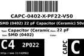

Contents
========

* [C42P022 > SMD (0402) 22 pF Capacitor (Ceramic) 50v](#c42p022--smd-0402-22-pf-capacitor-ceramic-50v)
	* [Datasheets](#datasheets)
	* [Labels](#labels)
	* [EDA](#eda)
	* [Images](#images)
	* [Tags](#tags)
  
![][im]
# C42P022 > SMD (0402) 22 pF Capacitor (Ceramic) 50v

- ID: CAPC-0402-X-PF22-V50
- Hex ID: C42P022
- Name: SMD (0402) 22 pF Capacitor (Ceramic) 50v
- Description: SMD (0402) 22 pF Capacitor (Ceramic) 50v
- Long Link: [http://oom.lt/CAPC-0402-X-PF22-V50](http://oom.lt/CAPC-0402-X-PF22-V50)
- Short Link: [http://oom.lt/C42P022](http://oom.lt/C42P022)

## Datasheets

- Datasheet: [datasheet.pdf](datasheet.pdf)

## Labels
  
  

|label-front|label-inventory|label-spec|
| :---: | :---: | :---: |
||||

## EDA
  

### Instances
  
Used 28 times.  
Prevalance: (28\10986) 0.2549%  

|OOMP Instances|
| :---: |
|[PROJ-ADAF-4888-STAN-01  Adafruit ItsyBitsy RP2040 PCB  Used 2 times. C19, C20](https://github.com/oomlout/oomlout_OOMP_projects/tree/main/PROJ-ADAF-4888-STAN-01/)|
|[PROJ-ADAF-4900-STAN-01  Adafruit QT Py RP2040 PCB  Used 2 times. C19, C20](https://github.com/oomlout/oomlout_OOMP_projects/tree/main/PROJ-ADAF-4900-STAN-01/)|
|[PROJ-ADAF-5302-STAN-01  Adafruit KB2040 PCB  Used 2 times. C19, C20](https://github.com/oomlout/oomlout_OOMP_projects/tree/main/PROJ-ADAF-5302-STAN-01/)|
|[PROJ-ARDU-DUE-STAN-01  Arduino DUE  Used 7 times. C21, C22, C23, C24, C25, C39, C40](https://github.com/oomlout/oomlout_OOMP_projects/tree/main/PROJ-ARDU-DUE-STAN-01/)|
|[PROJ-ARDU-MICRO-STAN-01  Arduino Micro  Used 2 times. C12, C13](https://github.com/oomlout/oomlout_OOMP_projects/tree/main/PROJ-ARDU-MICRO-STAN-01/)|
|[PROJ-SPAR-10160-STAN-01  DeadOn RTC  Used 1 times. C1](https://github.com/oomlout/oomlout_OOMP_projects/tree/main/PROJ-SPAR-10160-STAN-01/)|
|[PROJ-SPAR-10406-STAN-01  RFID Evaluation Shield  Used 2 times. C2, C7](https://github.com/oomlout/oomlout_OOMP_projects/tree/main/PROJ-SPAR-10406-STAN-01/)|
|[PROJ-SPAR-10587-STAN-01  Music Instrument Shield  Used 2 times. C3, C8](https://github.com/oomlout/oomlout_OOMP_projects/tree/main/PROJ-SPAR-10587-STAN-01/)|
|[PROJ-SPAR-11013-STAN-01  LilyPad MP3 Player  Used 2 times. C11, C12](https://github.com/oomlout/oomlout_OOMP_projects/tree/main/PROJ-SPAR-11013-STAN-01/)|
|[PROJ-SPAR-11058-STAN-01  Venus GPS SMA Connector  Used 1 times. C4](https://github.com/oomlout/oomlout_OOMP_projects/tree/main/PROJ-SPAR-11058-STAN-01/)|
|[PROJ-SPAR-11083-STAN-01  FM Tuner Basic Breakout-Si4703  Used 2 times. C3, C4](https://github.com/oomlout/oomlout_OOMP_projects/tree/main/PROJ-SPAR-11083-STAN-01/)|
|[PROJ-SPAR-11129-STAN-01  Si4707 Breakout  Used 2 times. C5, C6](https://github.com/oomlout/oomlout_OOMP_projects/tree/main/PROJ-SPAR-11129-STAN-01/)|
|[PROJ-SPAR-11197-STAN-01  ATmega128RFA1 Dev  Used 1 times. C11](https://github.com/oomlout/oomlout_OOMP_projects/tree/main/PROJ-SPAR-11197-STAN-01/)|

## Images
  
  

|image|label-front|label-inventory|label-spec|
| :---: | :---: | :---: | :---: |
|||||

## Tags

- oompID: CAPC-0402-X-PF22-V50
- name: SMD (0402) 22 pF Capacitor (Ceramic) 50v
- hexID: C42P022
- oompType: CAPC
- oompSize: 0402
- oompColor: X
- oompDesc: PF22
- oompIndex: V50
- oompVersion: 999
- ooWidth: 0.5mm
- ooHeight: 0.5mm
- ooLength: 1mm
- oompBbls: template;XXXX-0402-X-XXXX-XX-bbls
- oompDiag: template;XXXX-0402-X-XXXX-XX-diag
- oompIden: template;XXXX-0402-X-XXXX-XX-iden
- oompSchem: template;CAPC-XXXX-X-XXXX-XX-schem
- oompSimp: template;XXXX-0402-X-XXXX-XX-simp
- ooDesignator: C1
- oompInstances: {'PROJECT': 'PROJ-ADAF-4888-STAN-01', 'ID': 'C19'}
- oompInstances: {'PROJECT': 'PROJ-ADAF-4888-STAN-01', 'ID': 'C20'}
- oompInstances: {'PROJECT': 'PROJ-ADAF-4900-STAN-01', 'ID': 'C19'}
- oompInstances: {'PROJECT': 'PROJ-ADAF-4900-STAN-01', 'ID': 'C20'}
- oompInstances: {'PROJECT': 'PROJ-ADAF-5302-STAN-01', 'ID': 'C19'}
- oompInstances: {'PROJECT': 'PROJ-ADAF-5302-STAN-01', 'ID': 'C20'}
- oompInstances: {'PROJECT': 'PROJ-ARDU-DUE-STAN-01', 'ID': 'C21'}
- oompInstances: {'PROJECT': 'PROJ-ARDU-DUE-STAN-01', 'ID': 'C22'}
- oompInstances: {'PROJECT': 'PROJ-ARDU-DUE-STAN-01', 'ID': 'C23'}
- oompInstances: {'PROJECT': 'PROJ-ARDU-DUE-STAN-01', 'ID': 'C24'}
- oompInstances: {'PROJECT': 'PROJ-ARDU-DUE-STAN-01', 'ID': 'C25'}
- oompInstances: {'PROJECT': 'PROJ-ARDU-DUE-STAN-01', 'ID': 'C39'}
- oompInstances: {'PROJECT': 'PROJ-ARDU-DUE-STAN-01', 'ID': 'C40'}
- oompInstances: {'PROJECT': 'PROJ-ARDU-MICRO-STAN-01', 'ID': 'C12'}
- oompInstances: {'PROJECT': 'PROJ-ARDU-MICRO-STAN-01', 'ID': 'C13'}
- oompInstances: {'PROJECT': 'PROJ-SPAR-10160-STAN-01', 'ID': 'C1'}
- oompInstances: {'PROJECT': 'PROJ-SPAR-10406-STAN-01', 'ID': 'C2'}
- oompInstances: {'PROJECT': 'PROJ-SPAR-10406-STAN-01', 'ID': 'C7'}
- oompInstances: {'PROJECT': 'PROJ-SPAR-10587-STAN-01', 'ID': 'C3'}
- oompInstances: {'PROJECT': 'PROJ-SPAR-10587-STAN-01', 'ID': 'C8'}
- oompInstances: {'PROJECT': 'PROJ-SPAR-11013-STAN-01', 'ID': 'C11'}
- oompInstances: {'PROJECT': 'PROJ-SPAR-11013-STAN-01', 'ID': 'C12'}
- oompInstances: {'PROJECT': 'PROJ-SPAR-11058-STAN-01', 'ID': 'C4'}
- oompInstances: {'PROJECT': 'PROJ-SPAR-11083-STAN-01', 'ID': 'C3'}
- oompInstances: {'PROJECT': 'PROJ-SPAR-11083-STAN-01', 'ID': 'C4'}
- oompInstances: {'PROJECT': 'PROJ-SPAR-11129-STAN-01', 'ID': 'C5'}
- oompInstances: {'PROJECT': 'PROJ-SPAR-11129-STAN-01', 'ID': 'C6'}
- oompInstances: {'PROJECT': 'PROJ-SPAR-11197-STAN-01', 'ID': 'C11'}

[im]: image_450.jpg
