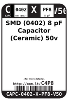
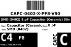
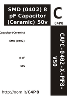

Contents
========

* [C4P8 > SMD (0402) 8 pF Capacitor (Ceramic) 50v](#c4p8--smd-0402-8-pf-capacitor-ceramic-50v)
	* [Labels](#labels)
	* [EDA](#eda)
	* [Images](#images)
	* [Tags](#tags)

# C4P8 > SMD (0402) 8 pF Capacitor (Ceramic) 50v

- ID: CAPC-0402-X-PF8-V50
- Hex ID: C4P8
- Name: SMD (0402) 8 pF Capacitor (Ceramic) 50v
- Description: SMD (0402) 8 pF Capacitor (Ceramic) 50v
- Long Link: [http://oom.lt/CAPC-0402-X-PF8-V50](http://oom.lt/CAPC-0402-X-PF8-V50)
- Short Link: [http://oom.lt/C4P8](http://oom.lt/C4P8)

## Labels
  
  

|label-front|label-inventory|label-spec|
| :---: | :---: | :---: |
||||

## EDA

### Footprints
  

|[  FOOTPRINT-kicad-kicad-footprints-Capacitor_SMD-C_0402_1005Metric](https://github.com/oomlout/oomlout_OOMP_eda/tree/main/FOOTPRINT/kicad/kicad-footprints/Capacitor_SMD/C_0402_1005Metric/)|[  FOOTPRINT-kicad-kicad-footprints-Capacitor_SMD-C_0402_1005Metric_Pad0.74x0.62mm_HandSolder](https://github.com/oomlout/oomlout_OOMP_eda/tree/main/FOOTPRINT/kicad/kicad-footprints/Capacitor_SMD/C_0402_1005Metric_Pad0.74x0.62mm_HandSolder/)|||
| :---: | :---: | :---: | :---: |

### Symbols
  

|[  ----](https://github.com/oomlout/oomlout_OOMP_parts/tree/main/----/)||||
| :---: | :---: | :---: | :---: |

## Images
  
  

|label-front|label-inventory|label-spec|
| :---: | :---: | :---: |
||||

## Tags

- oompType: CAPC
- oompSize: 0402
- oompColor: X
- oompDesc: PF8
- oompIndex: V50
- oplPartNumber: {'code': 'C-JLCC', 'name': 'JLC Parts Library', 'partID': 'C14441', 'desc': '50V 68pF C0G ??5% 0402  Multilayer Ceramic Capacitors MLCC - SMD/SMT ROHS'}
- distributorPartNumber: {'code': 'C-LCSC', 'name': 'LCSC', 'partID': 'C14441'}
- manufacturerPartNumber: {'code': 'C-XXXX', 'name': 'Samsung Electro-Mechanics', 'partID': 'CL05C680JB5NNNC'}
- hexID: C4P8
- oompID: CAPC-0402-X-PF8-V50
- symbolKicad: SYMBOL-kicad-kicad-symbols-Switch-C
- footprintKicad: FOOTPRINT-kicad-kicad-footprints-Capacitor_SMD-C_0402_1005Metric
- footprintKicad: FOOTPRINT-kicad-kicad-footprints-Capacitor_SMD-C_0402_1005Metric_Pad0.74x0.62mm_HandSolder
