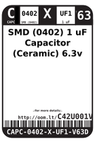
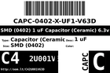
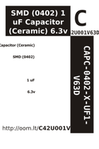

Contents
========

* [C42U001V63D > SMD (0402) 1 uF Capacitor (Ceramic) 6.3v](#c42u001v63d--smd-0402-1-uf-capacitor-ceramic-63v)
	* [Datasheets](#datasheets)
	* [Labels](#labels)
	* [EDA](#eda)
	* [Images](#images)
	* [Tags](#tags)
  
![][im]
# C42U001V63D > SMD (0402) 1 uF Capacitor (Ceramic) 6.3v

- ID: CAPC-0402-X-UF1-V63D
- Hex ID: C42U001V63D
- Name: SMD (0402) 1 uF Capacitor (Ceramic) 6.3v
- Description: SMD (0402) 1 uF Capacitor (Ceramic) 6.3v
- Long Link: [http://oom.lt/CAPC-0402-X-UF1-V63D](http://oom.lt/CAPC-0402-X-UF1-V63D)
- Short Link: [http://oom.lt/C42U001V63D](http://oom.lt/C42U001V63D)

## Datasheets

- Datasheet: [datasheet.pdf](datasheet.pdf)

## Labels
  
  

|label-front|label-inventory|label-spec|
| :---: | :---: | :---: |
||||

## EDA
  

### Instances
  
Used 52 times.  
Prevalance: (52\10986) 0.4733%  

|OOMP Instances|
| :---: |
|[PROJ-ADAF-4600-STAN-01  Adafruit QT Py PCB  Used 2 times. C2, C3](https://github.com/oomlout/oomlout_OOMP_projects/tree/main/PROJ-ADAF-4600-STAN-01/)|
|[PROJ-ADAF-5325-STAN-01  Adafruit QT Py ESP32 S2 PCB  Used 7 times. C2, C3, C5, C13, C15, C19, C20](https://github.com/oomlout/oomlout_OOMP_projects/tree/main/PROJ-ADAF-5325-STAN-01/)|
|[PROJ-ADAF-5395-STAN-01  Adafruit QT Py ESP32 Pico PCB  Used 3 times. C2, C3, C12](https://github.com/oomlout/oomlout_OOMP_projects/tree/main/PROJ-ADAF-5395-STAN-01/)|
|[PROJ-ADAF-5405-STAN-01  Adafruit QT Py ESP32 C3 PCB  Used 4 times. C2, C3, C11, C15](https://github.com/oomlout/oomlout_OOMP_projects/tree/main/PROJ-ADAF-5405-STAN-01/)|
|[PROJ-ADAF-5426-STAN-01  Adafruit QT Py ESP32 S3 PCB  Used 7 times. C2, C3, C5, C13, C15, C19, C20](https://github.com/oomlout/oomlout_OOMP_projects/tree/main/PROJ-ADAF-5426-STAN-01/)|
|[PROJ-ARDU-DUE-STAN-01  Arduino DUE  Used 1 times. C38](https://github.com/oomlout/oomlout_OOMP_projects/tree/main/PROJ-ARDU-DUE-STAN-01/)|
|[PROJ-ARDU-MICRO-STAN-01  Arduino Micro  Used 3 times. C4, C5, C7](https://github.com/oomlout/oomlout_OOMP_projects/tree/main/PROJ-ARDU-MICRO-STAN-01/)|
|[PROJ-SPAR-10617-STAN-01  Lipo Fuel Gauge  Used 1 times. C1](https://github.com/oomlout/oomlout_OOMP_projects/tree/main/PROJ-SPAR-10617-STAN-01/)|
|[PROJ-SPAR-10995-STAN-01  GPS Evaluation Board GP-2106  Used 1 times. C1](https://github.com/oomlout/oomlout_OOMP_projects/tree/main/PROJ-SPAR-10995-STAN-01/)|
|[PROJ-SPAR-11013-STAN-01  LilyPad MP3 Player  Used 6 times. C3, C13, C26, C27, C28, C29](https://github.com/oomlout/oomlout_OOMP_projects/tree/main/PROJ-SPAR-11013-STAN-01/)|
|[PROJ-SPAR-11058-STAN-01  Venus GPS SMA Connector  Used 1 times. C3](https://github.com/oomlout/oomlout_OOMP_projects/tree/main/PROJ-SPAR-11058-STAN-01/)|
|[PROJ-SPAR-11073-STAN-01  GP-2106 Breakout  Used 1 times. C1](https://github.com/oomlout/oomlout_OOMP_projects/tree/main/PROJ-SPAR-11073-STAN-01/)|
|[PROJ-SPAR-11083-STAN-01  FM Tuner Basic Breakout-Si4703  Used 2 times. C6, C7](https://github.com/oomlout/oomlout_OOMP_projects/tree/main/PROJ-SPAR-11083-STAN-01/)|
|[PROJ-SPAR-11084-STAN-01  MPL3115A2 Breakout  Used 1 times. C4](https://github.com/oomlout/oomlout_OOMP_projects/tree/main/PROJ-SPAR-11084-STAN-01/)|
|[PROJ-SPAR-11088-STAN-01  Run-SPOT-Run  Used 4 times. C3, C5, C8, C13](https://github.com/oomlout/oomlout_OOMP_projects/tree/main/PROJ-SPAR-11088-STAN-01/)|
|[PROJ-SPAR-11197-STAN-01  ATmega128RFA1 Dev  Used 5 times. C1, C2, C3, C4, C12](https://github.com/oomlout/oomlout_OOMP_projects/tree/main/PROJ-SPAR-11197-STAN-01/)|
|[PROJ-SPAR-11645-STAN-01  OpenSegment  Used 1 times. C10](https://github.com/oomlout/oomlout_OOMP_projects/tree/main/PROJ-SPAR-11645-STAN-01/)|
|[PROJ-SPAR-11703-STAN-01  UDB5  Used 2 times. C1, C3](https://github.com/oomlout/oomlout_OOMP_projects/tree/main/PROJ-SPAR-11703-STAN-01/)|

## Images
  
  

|image|label-front|label-inventory|label-spec|
| :---: | :---: | :---: | :---: |
|||||

## Tags

- oompID: CAPC-0402-X-UF1-V63D
- name: SMD (0402) 1 uF Capacitor (Ceramic) 6.3v
- hexID: C42U001V63D
- oompType: CAPC
- oompSize: 0402
- oompColor: X
- oompDesc: UF1
- oompIndex: V63D
- oompVersion: 999
- ooWidth: 0.5mm
- ooHeight: 0.5mm
- ooLength: 1mm
- oompBbls: template;XXXX-0402-X-XXXX-XX-bbls
- oompDiag: template;XXXX-0402-X-XXXX-XX-diag
- oompIden: template;XXXX-0402-X-XXXX-XX-iden
- oompSchem: template;CAPC-XXXX-X-XXXX-XX-schem
- oompSimp: template;XXXX-0402-X-XXXX-XX-simp
- ooDesignator: C1
- oompInstances: {'PROJECT': 'PROJ-ADAF-4600-STAN-01', 'ID': 'C2'}
- oompInstances: {'PROJECT': 'PROJ-ADAF-4600-STAN-01', 'ID': 'C3'}
- oompInstances: {'PROJECT': 'PROJ-ADAF-5325-STAN-01', 'ID': 'C2'}
- oompInstances: {'PROJECT': 'PROJ-ADAF-5325-STAN-01', 'ID': 'C3'}
- oompInstances: {'PROJECT': 'PROJ-ADAF-5325-STAN-01', 'ID': 'C5'}
- oompInstances: {'PROJECT': 'PROJ-ADAF-5325-STAN-01', 'ID': 'C13'}
- oompInstances: {'PROJECT': 'PROJ-ADAF-5325-STAN-01', 'ID': 'C15'}
- oompInstances: {'PROJECT': 'PROJ-ADAF-5325-STAN-01', 'ID': 'C19'}
- oompInstances: {'PROJECT': 'PROJ-ADAF-5325-STAN-01', 'ID': 'C20'}
- oompInstances: {'PROJECT': 'PROJ-ADAF-5395-STAN-01', 'ID': 'C2'}
- oompInstances: {'PROJECT': 'PROJ-ADAF-5395-STAN-01', 'ID': 'C3'}
- oompInstances: {'PROJECT': 'PROJ-ADAF-5395-STAN-01', 'ID': 'C12'}
- oompInstances: {'PROJECT': 'PROJ-ADAF-5405-STAN-01', 'ID': 'C2'}
- oompInstances: {'PROJECT': 'PROJ-ADAF-5405-STAN-01', 'ID': 'C3'}
- oompInstances: {'PROJECT': 'PROJ-ADAF-5405-STAN-01', 'ID': 'C11'}
- oompInstances: {'PROJECT': 'PROJ-ADAF-5405-STAN-01', 'ID': 'C15'}
- oompInstances: {'PROJECT': 'PROJ-ADAF-5426-STAN-01', 'ID': 'C2'}
- oompInstances: {'PROJECT': 'PROJ-ADAF-5426-STAN-01', 'ID': 'C3'}
- oompInstances: {'PROJECT': 'PROJ-ADAF-5426-STAN-01', 'ID': 'C5'}
- oompInstances: {'PROJECT': 'PROJ-ADAF-5426-STAN-01', 'ID': 'C13'}
- oompInstances: {'PROJECT': 'PROJ-ADAF-5426-STAN-01', 'ID': 'C15'}
- oompInstances: {'PROJECT': 'PROJ-ADAF-5426-STAN-01', 'ID': 'C19'}
- oompInstances: {'PROJECT': 'PROJ-ADAF-5426-STAN-01', 'ID': 'C20'}
- oompInstances: {'PROJECT': 'PROJ-ARDU-DUE-STAN-01', 'ID': 'C38'}
- oompInstances: {'PROJECT': 'PROJ-ARDU-MICRO-STAN-01', 'ID': 'C4'}
- oompInstances: {'PROJECT': 'PROJ-ARDU-MICRO-STAN-01', 'ID': 'C5'}
- oompInstances: {'PROJECT': 'PROJ-ARDU-MICRO-STAN-01', 'ID': 'C7'}
- oompInstances: {'PROJECT': 'PROJ-SPAR-10617-STAN-01', 'ID': 'C1'}
- oompInstances: {'PROJECT': 'PROJ-SPAR-10995-STAN-01', 'ID': 'C1'}
- oompInstances: {'PROJECT': 'PROJ-SPAR-11013-STAN-01', 'ID': 'C3'}
- oompInstances: {'PROJECT': 'PROJ-SPAR-11013-STAN-01', 'ID': 'C13'}
- oompInstances: {'PROJECT': 'PROJ-SPAR-11013-STAN-01', 'ID': 'C26'}
- oompInstances: {'PROJECT': 'PROJ-SPAR-11013-STAN-01', 'ID': 'C27'}
- oompInstances: {'PROJECT': 'PROJ-SPAR-11013-STAN-01', 'ID': 'C28'}
- oompInstances: {'PROJECT': 'PROJ-SPAR-11013-STAN-01', 'ID': 'C29'}
- oompInstances: {'PROJECT': 'PROJ-SPAR-11058-STAN-01', 'ID': 'C3'}
- oompInstances: {'PROJECT': 'PROJ-SPAR-11073-STAN-01', 'ID': 'C1'}
- oompInstances: {'PROJECT': 'PROJ-SPAR-11083-STAN-01', 'ID': 'C6'}
- oompInstances: {'PROJECT': 'PROJ-SPAR-11083-STAN-01', 'ID': 'C7'}
- oompInstances: {'PROJECT': 'PROJ-SPAR-11084-STAN-01', 'ID': 'C4'}
- oompInstances: {'PROJECT': 'PROJ-SPAR-11088-STAN-01', 'ID': 'C3'}
- oompInstances: {'PROJECT': 'PROJ-SPAR-11088-STAN-01', 'ID': 'C5'}
- oompInstances: {'PROJECT': 'PROJ-SPAR-11088-STAN-01', 'ID': 'C8'}
- oompInstances: {'PROJECT': 'PROJ-SPAR-11088-STAN-01', 'ID': 'C13'}
- oompInstances: {'PROJECT': 'PROJ-SPAR-11197-STAN-01', 'ID': 'C1'}
- oompInstances: {'PROJECT': 'PROJ-SPAR-11197-STAN-01', 'ID': 'C2'}
- oompInstances: {'PROJECT': 'PROJ-SPAR-11197-STAN-01', 'ID': 'C3'}
- oompInstances: {'PROJECT': 'PROJ-SPAR-11197-STAN-01', 'ID': 'C4'}
- oompInstances: {'PROJECT': 'PROJ-SPAR-11197-STAN-01', 'ID': 'C12'}
- oompInstances: {'PROJECT': 'PROJ-SPAR-11645-STAN-01', 'ID': 'C10'}
- oompInstances: {'PROJECT': 'PROJ-SPAR-11703-STAN-01', 'ID': 'C1'}
- oompInstances: {'PROJECT': 'PROJ-SPAR-11703-STAN-01', 'ID': 'C3'}

[im]: image_450.jpg
