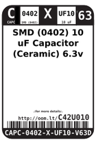
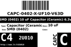
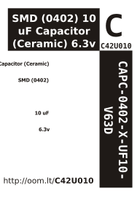

Contents
========

* [C4U1063D > SMD (0402) 10 uF Capacitor (Ceramic) 6.3v](#c4u1063d--smd-0402-10-uf-capacitor-ceramic-63v)
	* [Datasheets](#datasheets)
	* [Labels](#labels)
	* [EDA](#eda)
	* [Images](#images)
	* [Tags](#tags)
  
![][im]
# C4U1063D > SMD (0402) 10 uF Capacitor (Ceramic) 6.3v

- ID: CAPC-0402-X-UF10-V63D
- Hex ID: C4U1063D
- Name: SMD (0402) 10 uF Capacitor (Ceramic) 6.3v
- Description: SMD (0402) 10 uF Capacitor (Ceramic) 6.3v
- Long Link: [http://oom.lt/CAPC-0402-X-UF10-V63D](http://oom.lt/CAPC-0402-X-UF10-V63D)
- Short Link: [http://oom.lt/C4U1063D](http://oom.lt/C4U1063D)

## Datasheets

- Datasheet: [datasheet.pdf](datasheet.pdf)

## Labels
  
  

|label-front|label-inventory|label-spec|
| :---: | :---: | :---: |
||||

## EDA

## Images
  
  

|image|label-front|label-inventory|label-spec|
| :---: | :---: | :---: | :---: |
|||||

## Tags

- oompType: CAPC
- oompSize: 0402
- oompColor: X
- oompDesc: UF10
- oompIndex: V63D
- oplPartNumber: {'code': 'C-JLCC', 'name': 'JLC Parts Library', 'partID': 'C15525', 'desc': '6.3V 10uF X5R ??20% 0402  Multilayer Ceramic Capacitors MLCC - SMD/SMT ROHS'}
- distributorPartNumber: {'code': 'C-LCSC', 'name': 'LCSC', 'partID': 'C15525'}
- manufacturerPartNumber: {'code': 'C-XXXX', 'name': 'Samsung Electro-Mechanics', 'partID': 'CL05A106MQ5NUNC'}
- hexID: C4U1063D
- oompID: CAPC-0402-X-UF10-V63D
- oompInstances: {'PROJECT': 'PROJ-SPAR-11801-STAN-01', 'ID': 'C3'}

[im]: image_450.jpg
