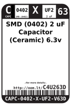
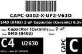
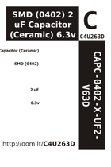

Contents
========

* [C4U263D > SMD (0402) 2 uF Capacitor (Ceramic) 6.3v](#c4u263d--smd-0402-2-uf-capacitor-ceramic-63v)
	* [Datasheets](#datasheets)
	* [Labels](#labels)
	* [EDA](#eda)
	* [Images](#images)
	* [Tags](#tags)

# C4U263D > SMD (0402) 2 uF Capacitor (Ceramic) 6.3v

- ID: CAPC-0402-X-UF2-V63D
- Hex ID: C4U263D
- Name: SMD (0402) 2 uF Capacitor (Ceramic) 6.3v
- Description: SMD (0402) 2 uF Capacitor (Ceramic) 6.3v
- Long Link: [http://oom.lt/CAPC-0402-X-UF2-V63D](http://oom.lt/CAPC-0402-X-UF2-V63D)
- Short Link: [http://oom.lt/C4U263D](http://oom.lt/C4U263D)

## Datasheets

- Datasheet: [datasheet.pdf](datasheet.pdf)

## Labels
  
  

|label-front|label-inventory|label-spec|
| :---: | :---: | :---: |
||||

## EDA

### Footprints
  

|[  FOOTPRINT-kicad-kicad-footprints-Capacitor_SMD-C_0402_1005Metric](https://github.com/oomlout/oomlout_OOMP_eda/tree/main/FOOTPRINT/kicad/kicad-footprints/Capacitor_SMD/C_0402_1005Metric/)|[  FOOTPRINT-kicad-kicad-footprints-Capacitor_SMD-C_0402_1005Metric_Pad0.74x0.62mm_HandSolder](https://github.com/oomlout/oomlout_OOMP_eda/tree/main/FOOTPRINT/kicad/kicad-footprints/Capacitor_SMD/C_0402_1005Metric_Pad0.74x0.62mm_HandSolder/)|||
| :---: | :---: | :---: | :---: |

### Symbols
  

|[  SYMBOL-kicad-kicad-symbols-Device-C](https://github.com/oomlout/oomlout_OOMP_eda/tree/main/SYMBOL/kicad/kicad-symbols/Device/C/)||||
| :---: | :---: | :---: | :---: |

## Images
  
  

|label-front|label-inventory|label-spec|
| :---: | :---: | :---: |
||||

## Tags

- oompType: CAPC
- oompSize: 0402
- oompColor: X
- oompDesc: UF2
- oompIndex: V63D
- oplPartNumber: {'code': 'C-JLCC', 'name': 'JLC Parts Library', 'partID': 'C12530', 'desc': '6.3V 2.2uF X5R ??20% 0402  Multilayer Ceramic Capacitors MLCC - SMD/SMT ROHS'}
- distributorPartNumber: {'code': 'C-LCSC', 'name': 'LCSC', 'partID': 'C12530'}
- manufacturerPartNumber: {'code': 'C-XXXX', 'name': 'Samsung Electro-Mechanics', 'partID': 'CL05A225MQ5NSNC'}
- hexID: C4U263D
- oompID: CAPC-0402-X-UF2-V63D
- footprintKicad: FOOTPRINT-kicad-kicad-footprints-Capacitor_SMD-C_0402_1005Metric
- footprintKicad: FOOTPRINT-kicad-kicad-footprints-Capacitor_SMD-C_0402_1005Metric_Pad0.74x0.62mm_HandSolder
- symbolKicad: SYMBOL-kicad-kicad-symbols-Device-C
