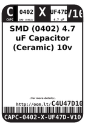
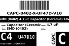
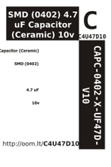

Contents
========

* [C4U47D10 > SMD (0402) 4.7 uF Capacitor (Ceramic) 10v](#c4u47d10--smd-0402-47-uf-capacitor-ceramic-10v)
	* [Labels](#labels)
	* [EDA](#eda)
	* [Images](#images)
	* [Tags](#tags)

# C4U47D10 > SMD (0402) 4.7 uF Capacitor (Ceramic) 10v

- ID: CAPC-0402-X-UF47D-V10
- Hex ID: C4U47D10
- Name: SMD (0402) 4.7 uF Capacitor (Ceramic) 10v
- Description: SMD (0402) 4.7 uF Capacitor (Ceramic) 10v
- Long Link: [http://oom.lt/CAPC-0402-X-UF47D-V10](http://oom.lt/CAPC-0402-X-UF47D-V10)
- Short Link: [http://oom.lt/C4U47D10](http://oom.lt/C4U47D10)

## Labels
  
  

|label-front|label-inventory|label-spec|
| :---: | :---: | :---: |
||||

## EDA

### Footprints
  

|[  FOOTPRINT-kicad-kicad-footprints-Capacitor_SMD-C_0402_1005Metric](https://github.com/oomlout/oomlout_OOMP_eda/tree/main/FOOTPRINT/kicad/kicad-footprints/Capacitor_SMD/C_0402_1005Metric/)|[  FOOTPRINT-kicad-kicad-footprints-Capacitor_SMD-C_0402_1005Metric_Pad0.74x0.62mm_HandSolder](https://github.com/oomlout/oomlout_OOMP_eda/tree/main/FOOTPRINT/kicad/kicad-footprints/Capacitor_SMD/C_0402_1005Metric_Pad0.74x0.62mm_HandSolder/)|||
| :---: | :---: | :---: | :---: |

### Symbols
  

|[  ----](https://github.com/oomlout/oomlout_OOMP_parts/tree/main/----/)||||
| :---: | :---: | :---: | :---: |

## Images
  
  

|label-front|label-inventory|label-spec|
| :---: | :---: | :---: |
||||

## Tags

- oompType: CAPC
- oompSize: 0402
- oompColor: X
- oompDesc: UF47D
- oompIndex: V10
- oplPartNumber: {'code': 'C-JLCC', 'name': 'JLC Parts Library', 'partID': 'C23733', 'desc': '10V 4.7uF X5R ??20% 0402  Multilayer Ceramic Capacitors MLCC - SMD/SMT ROHS'}
- distributorPartNumber: {'code': 'C-LCSC', 'name': 'LCSC', 'partID': 'C23733'}
- manufacturerPartNumber: {'code': 'C-XXXX', 'name': 'Samsung Electro-Mechanics', 'partID': 'CL05A475MP5NRNC'}
- hexID: C4U47D10
- oompID: CAPC-0402-X-UF47D-V10
- symbolKicad: SYMBOL-kicad-kicad-symbols-Switch-C
- footprintKicad: FOOTPRINT-kicad-kicad-footprints-Capacitor_SMD-C_0402_1005Metric
- footprintKicad: FOOTPRINT-kicad-kicad-footprints-Capacitor_SMD-C_0402_1005Metric_Pad0.74x0.62mm_HandSolder
