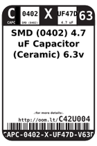
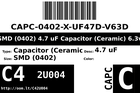
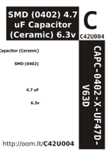

Contents
========

* [C42U004 > SMD (0402) 4.7 uF Capacitor (Ceramic) 6.3v](#c42u004--smd-0402-47-uf-capacitor-ceramic-63v)
	* [Datasheets](#datasheets)
	* [Labels](#labels)
	* [EDA](#eda)
	* [Images](#images)
	* [Tags](#tags)
  
![][im]
# C42U004 > SMD (0402) 4.7 uF Capacitor (Ceramic) 6.3v

- ID: CAPC-0402-X-UF47D-V63D
- Hex ID: C42U004
- Name: SMD (0402) 4.7 uF Capacitor (Ceramic) 6.3v
- Description: SMD (0402) 4.7 uF Capacitor (Ceramic) 6.3v
- Long Link: [http://oom.lt/CAPC-0402-X-UF47D-V63D](http://oom.lt/CAPC-0402-X-UF47D-V63D)
- Short Link: [http://oom.lt/C42U004](http://oom.lt/C42U004)

## Datasheets

- Datasheet: [datasheet.pdf](datasheet.pdf)

## Labels
  
  

|label-front|label-inventory|label-spec|
| :---: | :---: | :---: |
||||

## EDA

### Instances
  
  
Used 19 times.  
Prevalance: (19\10986) 0.1729%  

|OOMP Instances|
| :---: |
|[PROJ-SPAR-10116-STAN-01  Arduino Fio  Used 2 times. C9, C10](https://github.com/oomlout/oomlout_OOMP_projects/tree/main/PROJ-SPAR-10116-STAN-01/)|
|[PROJ-SPAR-10274-STAN-01  LilyPad Arduino Simple  Used 2 times. C9, C10](https://github.com/oomlout/oomlout_OOMP_projects/tree/main/PROJ-SPAR-10274-STAN-01/)|
|[PROJ-SPAR-10401-STAN-01  Lipo Charger Basic-miniUSB  Used 2 times. C3, C4](https://github.com/oomlout/oomlout_OOMP_projects/tree/main/PROJ-SPAR-10401-STAN-01/)|
|[PROJ-SPAR-10530-STAN-01  Triple Axis Magnetometer-HMC5883L  Used 1 times. C3](https://github.com/oomlout/oomlout_OOMP_projects/tree/main/PROJ-SPAR-10530-STAN-01/)|
|[PROJ-SPAR-10701-STAN-01  Color Light Sensor Evaluation Board  Used 2 times. C1, C3](https://github.com/oomlout/oomlout_OOMP_projects/tree/main/PROJ-SPAR-10701-STAN-01/)|
|[PROJ-SPAR-10888-STAN-01  LSM303 Breakout  Used 1 times. C4](https://github.com/oomlout/oomlout_OOMP_projects/tree/main/PROJ-SPAR-10888-STAN-01/)|
|[PROJ-SPAR-10941-STAN-01  LilyPad Arduino SimpleSnap  Used 2 times. C9, C10](https://github.com/oomlout/oomlout_OOMP_projects/tree/main/PROJ-SPAR-10941-STAN-01/)|
|[PROJ-SPAR-11013-STAN-01  LilyPad MP3 Player  Used 2 times. C9, C10](https://github.com/oomlout/oomlout_OOMP_projects/tree/main/PROJ-SPAR-11013-STAN-01/)|
|[PROJ-SPAR-11201-STAN-01  ProtoSnap-LilyPad Dev Simple  Used 2 times. C9, C10](https://github.com/oomlout/oomlout_OOMP_projects/tree/main/PROJ-SPAR-11201-STAN-01/)|
|[PROJ-SPAR-11262-STAN-01  ProtoSnap-LilyPad Development Board  Used 2 times. C9, C10](https://github.com/oomlout/oomlout_OOMP_projects/tree/main/PROJ-SPAR-11262-STAN-01/)|
|[PROJ-SPAR-13926-STAN-01  MMA8452 Accelerometer  Used 1 times. C3](https://github.com/oomlout/oomlout_OOMP_projects/tree/main/PROJ-SPAR-13926-STAN-01/)|

### Symbols

## Images
  
  

|image|label-front|label-inventory|label-spec|
| :---: | :---: | :---: | :---: |
|||||

## Tags

- oompID: CAPC-0402-X-UF47D-V63D
- name: SMD (0402) 4.7 uF Capacitor (Ceramic) 6.3v
- hexID: C42U004
- oompSort: CAPC0402UF47D
- oompType: CAPC
- oompSize: 0402
- oompColor: X
- oompDesc: UF47D
- oompIndex: V63D
- oompVersion: 98
- oompBbls: template;XXXX-0402-X-XXXX-XX-bbls
- oompDiag: template;XXXX-0402-X-XXXX-XX-diag
- oompIden: template;XXXX-0402-X-XXXX-XX-iden
- oompSchem: template;CAPC-XXXX-X-XXXX-XX-schem
- oompSimp: template;XXXX-0402-X-XXXX-XX-simp
- ooDesignator: C1
- oompInstances: {'PROJECT': 'PROJ-SPAR-10116-STAN-01', 'ID': 'C9'}
- oompInstances: {'PROJECT': 'PROJ-SPAR-10116-STAN-01', 'ID': 'C10'}
- oompInstances: {'PROJECT': 'PROJ-SPAR-10274-STAN-01', 'ID': 'C9'}
- oompInstances: {'PROJECT': 'PROJ-SPAR-10274-STAN-01', 'ID': 'C10'}
- oompInstances: {'PROJECT': 'PROJ-SPAR-10401-STAN-01', 'ID': 'C3'}
- oompInstances: {'PROJECT': 'PROJ-SPAR-10401-STAN-01', 'ID': 'C4'}
- oompInstances: {'PROJECT': 'PROJ-SPAR-10530-STAN-01', 'ID': 'C3'}
- oompInstances: {'PROJECT': 'PROJ-SPAR-10701-STAN-01', 'ID': 'C1'}
- oompInstances: {'PROJECT': 'PROJ-SPAR-10701-STAN-01', 'ID': 'C3'}
- oompInstances: {'PROJECT': 'PROJ-SPAR-10888-STAN-01', 'ID': 'C4'}
- oompInstances: {'PROJECT': 'PROJ-SPAR-10941-STAN-01', 'ID': 'C9'}
- oompInstances: {'PROJECT': 'PROJ-SPAR-10941-STAN-01', 'ID': 'C10'}
- oompInstances: {'PROJECT': 'PROJ-SPAR-11013-STAN-01', 'ID': 'C9'}
- oompInstances: {'PROJECT': 'PROJ-SPAR-11013-STAN-01', 'ID': 'C10'}
- oompInstances: {'PROJECT': 'PROJ-SPAR-11201-STAN-01', 'ID': 'C9'}
- oompInstances: {'PROJECT': 'PROJ-SPAR-11201-STAN-01', 'ID': 'C10'}
- oompInstances: {'PROJECT': 'PROJ-SPAR-11262-STAN-01', 'ID': 'C9'}
- oompInstances: {'PROJECT': 'PROJ-SPAR-11262-STAN-01', 'ID': 'C10'}
- oompInstances: {'PROJECT': 'PROJ-SPAR-13926-STAN-01', 'ID': 'C3'}

[im]: image_450.jpg
