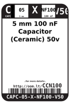
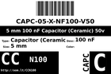
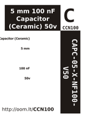

Contents
========

* [CCN100 > 5 mm 100 nF Capacitor (Ceramic) 50v](#ccn100--5-mm-100-nf-capacitor-ceramic-50v)
	* [Datasheets](#datasheets)
	* [Labels](#labels)
	* [EDA](#eda)
	* [Images](#images)
	* [Tags](#tags)

# CCN100 > 5 mm 100 nF Capacitor (Ceramic) 50v

- ID: CAPC-05-X-NF100-V50
- Hex ID: CCN100
- Name: 5 mm 100 nF Capacitor (Ceramic) 50v
- Description: 5 mm 100 nF Capacitor (Ceramic) 50v
- Long Link: [http://oom.lt/CAPC-05-X-NF100-V50](http://oom.lt/CAPC-05-X-NF100-V50)
- Short Link: [http://oom.lt/CCN100](http://oom.lt/CCN100)

## Datasheets

- Datasheet: [datasheet.pdf](datasheet.pdf)

## Labels
  
  

|label-front|label-inventory|label-spec|
| :---: | :---: | :---: |
||||

## EDA

### Symbols
  

|[  ----](https://github.com/oomlout/oomlout_OOMP_parts/tree/main/----/)||||
| :---: | :---: | :---: | :---: |

## Images
  
  

|label-front|label-inventory|label-spec|
| :---: | :---: | :---: |
||||

## Tags

- oompID: CAPC-05-X-NF100-V50
- name: 5 mm 100 nF Capacitor (Ceramic) 50v
- hexID: CCN100
- oompSort: CAPC05NF100
- oompType: CAPC
- oompSize: 05
- oompColor: X
- oompDesc: NF100
- oompIndex: V50
- oompVersion: 98
- oompSchem: template;CAPC-XXXX-X-XXXX-XX-schem
- ooDesignator: C1
- symbolKicad: SYMBOL-kicad-kicad-symbols-Switch-C
