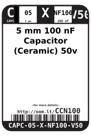
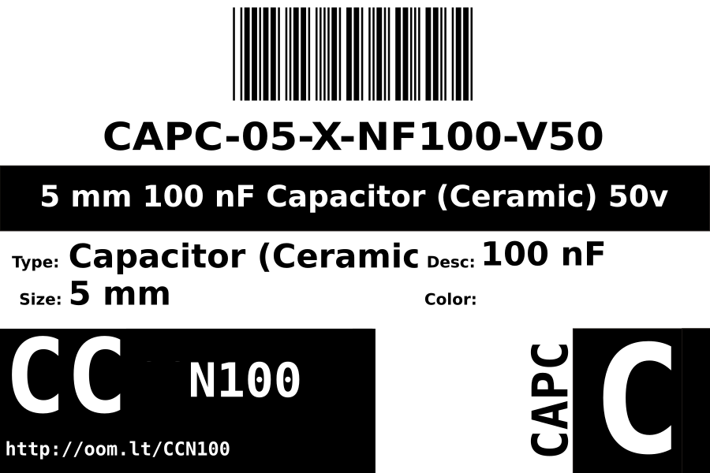
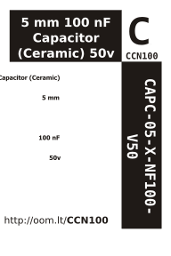

Contents
========

* [CAPC-05-X-NF100-V50>5 mm 100 nF Capacitor (Ceramic) 50v](#capc-05-x-nf100-v505-mm-100-nf-capacitor-ceramic-50v)
	* [Datasheets](#datasheets)
	* [Labels](#labels)
	* [EDA](#eda)
		* [Symbols](#symbols)
	* [Tags](#tags)

# CAPC-05-X-NF100-V50>5 mm 100 nF Capacitor (Ceramic) 50v

- ID: CAPC-05-X-NF100-V50
- Name: CAPC-05-X-NF100-V50

## Datasheets

- Datasheet: [datasheet.pdf](datasheet.pdf)

## Labels
  
  

|Front|Inventory|Specifications|
| :---: | :---: | :---: |
||||

## EDA

### Symbols

## Tags

- hexID: CCN100
- oompSort: CAPC05NF100
- oompType: CAPC
- oompSize: 05
- oompColor: X
- oompDesc: NF100
- oompIndex: V50
- oompVersion: 98
- oompSchem: template;CAPC-XXXX-X-XXXX-XX-schem
- ooDesignator: C1
