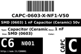

Contents
========

* [C6N001 > SMD (0603) 1 nF Capacitor (Ceramic) 50v](#c6n001--smd-0603-1-nf-capacitor-ceramic-50v)
	* [Datasheets](#datasheets)
	* [Labels](#labels)
	* [EDA](#eda)
	* [Images](#images)
	* [Tags](#tags)
  
![][im]
# C6N001 > SMD (0603) 1 nF Capacitor (Ceramic) 50v

- ID: CAPC-0603-X-NF1-V50
- Hex ID: C6N001
- Name: SMD (0603) 1 nF Capacitor (Ceramic) 50v
- Description: SMD (0603) 1 nF Capacitor (Ceramic) 50v
- Long Link: [http://oom.lt/CAPC-0603-X-NF1-V50](http://oom.lt/CAPC-0603-X-NF1-V50)
- Short Link: [http://oom.lt/C6N001](http://oom.lt/C6N001)

## Datasheets

- Datasheet: [datasheet.pdf](datasheet.pdf)

## Labels
  
  

|label-front|label-inventory|label-spec|
| :---: | :---: | :---: |
||||

## EDA
  

### Instances
  
Used 14 times.  
Prevalance: (14\10986) 0.1274%  

|OOMP Instances|
| :---: |
|[PROJ-ADAF-1697-STAN-01  Adafruit Bluefruit LE nRF8001 PCB  Used 1 times. C8](https://github.com/oomlout/oomlout_OOMP_projects/tree/main/PROJ-ADAF-1697-STAN-01/)|
|[PROJ-SPAR-12650-STAN-01  AD8232 Heart Rate Monitor  Used 1 times. C2](https://github.com/oomlout/oomlout_OOMP_projects/tree/main/PROJ-SPAR-12650-STAN-01/)|
|[PROJ-SPAR-12705-STAN-01  ML8511 Breakout  Used 1 times. C1](https://github.com/oomlout/oomlout_OOMP_projects/tree/main/PROJ-SPAR-12705-STAN-01/)|
|[PROJ-SPAR-12938-STAN-01  Si4703 FM Tuner Evaluation Board  Used 1 times. C5](https://github.com/oomlout/oomlout_OOMP_projects/tree/main/PROJ-SPAR-12938-STAN-01/)|
|[PROJ-SPAR-13116-STAN-01  Spectrum Shield  Used 2 times. C1, C3](https://github.com/oomlout/oomlout_OOMP_projects/tree/main/PROJ-SPAR-13116-STAN-01/)|
|[PROJ-SPAR-13155-STAN-01  SparkFun Stepoko  Used 6 times. C12, C13, C21, C22, C33, C34](https://github.com/oomlout/oomlout_OOMP_projects/tree/main/PROJ-SPAR-13155-STAN-01/)|
|[PROJ-SPAR-13679-STAN-01  Current Sensor Breakout-ACS723  Used 1 times. C2](https://github.com/oomlout/oomlout_OOMP_projects/tree/main/PROJ-SPAR-13679-STAN-01/)|
|[PROJ-SPAR-14544-STAN-01  Current Sensor Breakout-ACS723-Low Current  Used 1 times. C5](https://github.com/oomlout/oomlout_OOMP_projects/tree/main/PROJ-SPAR-14544-STAN-01/)|

## Images
  
  

|image|image_RE|label-front|label-inventory|label-spec|
| :---: | :---: | :---: | :---: | :---: |
||||||

## Tags

- oompID: CAPC-0603-X-NF1-V50
- name: SMD (0603) 1 nF Capacitor (Ceramic) 50v
- hexID: C6N001
- oompType: CAPC
- oompSize: 0603
- oompColor: X
- oompDesc: NF1
- oompIndex: V50
- oompVersion: 999
- ooWidth: 0.8mm
- ooHeight: 0.8mm
- ooLength: 1.6mm
- oompBbls: template;XXXX-0603-X-XXXX-XX-bbls
- oompDiag: template;XXXX-0603-X-XXXX-XX-diag
- oompIden: template;XXXX-0603-X-XXXX-XX-iden
- oompSchem: template;CAPC-XXXX-X-XXXX-XX-schem
- oompSimp: template;XXXX-0603-X-XXXX-XX-simp
- ooDesignator: C1
- oompInstances: {'PROJECT': 'PROJ-ADAF-1697-STAN-01', 'ID': 'C8'}
- oompInstances: {'PROJECT': 'PROJ-SPAR-12650-STAN-01', 'ID': 'C2'}
- oompInstances: {'PROJECT': 'PROJ-SPAR-12705-STAN-01', 'ID': 'C1'}
- oompInstances: {'PROJECT': 'PROJ-SPAR-12938-STAN-01', 'ID': 'C5'}
- oompInstances: {'PROJECT': 'PROJ-SPAR-13116-STAN-01', 'ID': 'C1'}
- oompInstances: {'PROJECT': 'PROJ-SPAR-13116-STAN-01', 'ID': 'C3'}
- oompInstances: {'PROJECT': 'PROJ-SPAR-13155-STAN-01', 'ID': 'C12'}
- oompInstances: {'PROJECT': 'PROJ-SPAR-13155-STAN-01', 'ID': 'C13'}
- oompInstances: {'PROJECT': 'PROJ-SPAR-13155-STAN-01', 'ID': 'C21'}
- oompInstances: {'PROJECT': 'PROJ-SPAR-13155-STAN-01', 'ID': 'C22'}
- oompInstances: {'PROJECT': 'PROJ-SPAR-13155-STAN-01', 'ID': 'C33'}
- oompInstances: {'PROJECT': 'PROJ-SPAR-13155-STAN-01', 'ID': 'C34'}
- oompInstances: {'PROJECT': 'PROJ-SPAR-13679-STAN-01', 'ID': 'C2'}
- oompInstances: {'PROJECT': 'PROJ-SPAR-14544-STAN-01', 'ID': 'C5'}

[im]: image_450.jpg
