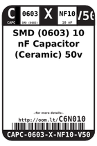
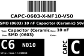
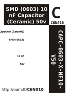
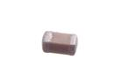

Contents
========

* [C6N010 > SMD (0603) 10 nF Capacitor (Ceramic) 50v](#c6n010--smd-0603-10-nf-capacitor-ceramic-50v)
	* [Datasheets](#datasheets)
	* [Labels](#labels)
	* [EDA](#eda)
	* [Images](#images)
	* [Tags](#tags)
  
![][im]
# C6N010 > SMD (0603) 10 nF Capacitor (Ceramic) 50v

- ID: CAPC-0603-X-NF10-V50
- Hex ID: C6N010
- Name: SMD (0603) 10 nF Capacitor (Ceramic) 50v
- Description: SMD (0603) 10 nF Capacitor (Ceramic) 50v
- Long Link: [http://oom.lt/CAPC-0603-X-NF10-V50](http://oom.lt/CAPC-0603-X-NF10-V50)
- Short Link: [http://oom.lt/C6N010](http://oom.lt/C6N010)

## Datasheets

- Datasheet: [datasheet.pdf](datasheet.pdf)

## Labels
  
  

|label-front|label-inventory|label-spec|
| :---: | :---: | :---: |
||||

## EDA
  

### Instances
  
Used 48 times.  
Prevalance: (48\10986) 0.4369%  

|Project|Occur- rences|Identifiers|
| :---: | :---: | :---: |
|[PROJ-ADAF-3201-STAN-01 Adafruit Ethernet FeatherWing PCB](https://github.com/oomlout/oomlout_OOMP_projects/tree/main/PROJ-ADAF-3201-STAN-01/)|[2](https://github.com/oomlout/oomlout_OOMP_projects/tree/main/PROJ-ADAF-3201-STAN-01/)|[C5, C6](https://github.com/oomlout/oomlout_OOMP_projects/tree/main/PROJ-ADAF-3201-STAN-01/)|
|[PROJ-ADAF-3357-STAN-01 Adafruit Music Maker FeatherWing PCB](https://github.com/oomlout/oomlout_OOMP_projects/tree/main/PROJ-ADAF-3357-STAN-01/)|[2](https://github.com/oomlout/oomlout_OOMP_projects/tree/main/PROJ-ADAF-3357-STAN-01/)|[C21, C22](https://github.com/oomlout/oomlout_OOMP_projects/tree/main/PROJ-ADAF-3357-STAN-01/)|
|[PROJ-ADAF-5100-STAN-01 Adafruit MacroPad RP2040 PCB](https://github.com/oomlout/oomlout_OOMP_projects/tree/main/PROJ-ADAF-5100-STAN-01/)|[1](https://github.com/oomlout/oomlout_OOMP_projects/tree/main/PROJ-ADAF-5100-STAN-01/)|[C30](https://github.com/oomlout/oomlout_OOMP_projects/tree/main/PROJ-ADAF-5100-STAN-01/)|
|[PROJ-SPAR-10121-STAN-01 IMU Digital Combo Board](https://github.com/oomlout/oomlout_OOMP_projects/tree/main/PROJ-SPAR-10121-STAN-01/)|[1](https://github.com/oomlout/oomlout_OOMP_projects/tree/main/PROJ-SPAR-10121-STAN-01/)|[C3](https://github.com/oomlout/oomlout_OOMP_projects/tree/main/PROJ-SPAR-10121-STAN-01/)|
|[PROJ-SPAR-10252-STAN-01 IMU Fusion Board](https://github.com/oomlout/oomlout_OOMP_projects/tree/main/PROJ-SPAR-10252-STAN-01/)|[1](https://github.com/oomlout/oomlout_OOMP_projects/tree/main/PROJ-SPAR-10252-STAN-01/)|[C4](https://github.com/oomlout/oomlout_OOMP_projects/tree/main/PROJ-SPAR-10252-STAN-01/)|
|[PROJ-SPAR-11028-STAN-01 MPU-6050 Breakout](https://github.com/oomlout/oomlout_OOMP_projects/tree/main/PROJ-SPAR-11028-STAN-01/)|[1](https://github.com/oomlout/oomlout_OOMP_projects/tree/main/PROJ-SPAR-11028-STAN-01/)|[C4](https://github.com/oomlout/oomlout_OOMP_projects/tree/main/PROJ-SPAR-11028-STAN-01/)|
|[PROJ-SPAR-11420-STAN-01 MiniGen](https://github.com/oomlout/oomlout_OOMP_projects/tree/main/PROJ-SPAR-11420-STAN-01/)|[1](https://github.com/oomlout/oomlout_OOMP_projects/tree/main/PROJ-SPAR-11420-STAN-01/)|[C14](https://github.com/oomlout/oomlout_OOMP_projects/tree/main/PROJ-SPAR-11420-STAN-01/)|
|[PROJ-SPAR-11977-STAN-01 ITG-3200 Breakout](https://github.com/oomlout/oomlout_OOMP_projects/tree/main/PROJ-SPAR-11977-STAN-01/)|[1](https://github.com/oomlout/oomlout_OOMP_projects/tree/main/PROJ-SPAR-11977-STAN-01/)|[C4](https://github.com/oomlout/oomlout_OOMP_projects/tree/main/PROJ-SPAR-11977-STAN-01/)|
|[PROJ-SPAR-12041-STAN-01 AT42QT1010 Capacitive Touch Breakout](https://github.com/oomlout/oomlout_OOMP_projects/tree/main/PROJ-SPAR-12041-STAN-01/)|[2](https://github.com/oomlout/oomlout_OOMP_projects/tree/main/PROJ-SPAR-12041-STAN-01/)|[C2, C3](https://github.com/oomlout/oomlout_OOMP_projects/tree/main/PROJ-SPAR-12041-STAN-01/)|
|[PROJ-SPAR-12650-STAN-01 AD8232 Heart Rate Monitor](https://github.com/oomlout/oomlout_OOMP_projects/tree/main/PROJ-SPAR-12650-STAN-01/)|[1](https://github.com/oomlout/oomlout_OOMP_projects/tree/main/PROJ-SPAR-12650-STAN-01/)|[C3](https://github.com/oomlout/oomlout_OOMP_projects/tree/main/PROJ-SPAR-12650-STAN-01/)|
|[PROJ-SPAR-12660-STAN-01 MP3 Player Shield](https://github.com/oomlout/oomlout_OOMP_projects/tree/main/PROJ-SPAR-12660-STAN-01/)|[2](https://github.com/oomlout/oomlout_OOMP_projects/tree/main/PROJ-SPAR-12660-STAN-01/)|[C10, C11](https://github.com/oomlout/oomlout_OOMP_projects/tree/main/PROJ-SPAR-12660-STAN-01/)|
|[PROJ-SPAR-12786-STAN-01 ADXL337 Breakout](https://github.com/oomlout/oomlout_OOMP_projects/tree/main/PROJ-SPAR-12786-STAN-01/)|[3](https://github.com/oomlout/oomlout_OOMP_projects/tree/main/PROJ-SPAR-12786-STAN-01/)|[C1, C2, C3](https://github.com/oomlout/oomlout_OOMP_projects/tree/main/PROJ-SPAR-12786-STAN-01/)|
|[PROJ-SPAR-12803-STAN-01 ADXL377 Breakout](https://github.com/oomlout/oomlout_OOMP_projects/tree/main/PROJ-SPAR-12803-STAN-01/)|[3](https://github.com/oomlout/oomlout_OOMP_projects/tree/main/PROJ-SPAR-12803-STAN-01/)|[C1, C2, C3](https://github.com/oomlout/oomlout_OOMP_projects/tree/main/PROJ-SPAR-12803-STAN-01/)|
|[PROJ-SPAR-13019-STAN-01 BLE Mate2](https://github.com/oomlout/oomlout_OOMP_projects/tree/main/PROJ-SPAR-13019-STAN-01/)|[1](https://github.com/oomlout/oomlout_OOMP_projects/tree/main/PROJ-SPAR-13019-STAN-01/)|[C1](https://github.com/oomlout/oomlout_OOMP_projects/tree/main/PROJ-SPAR-13019-STAN-01/)|
|[PROJ-SPAR-13155-STAN-01 SparkFun Stepoko](https://github.com/oomlout/oomlout_OOMP_projects/tree/main/PROJ-SPAR-13155-STAN-01/)|[1](https://github.com/oomlout/oomlout_OOMP_projects/tree/main/PROJ-SPAR-13155-STAN-01/)|[C9](https://github.com/oomlout/oomlout_OOMP_projects/tree/main/PROJ-SPAR-13155-STAN-01/)|
|[PROJ-SPAR-13158-STAN-01 LiPower-Shield](https://github.com/oomlout/oomlout_OOMP_projects/tree/main/PROJ-SPAR-13158-STAN-01/)|[1](https://github.com/oomlout/oomlout_OOMP_projects/tree/main/PROJ-SPAR-13158-STAN-01/)|[C1](https://github.com/oomlout/oomlout_OOMP_projects/tree/main/PROJ-SPAR-13158-STAN-01/)|
|[PROJ-SPAR-13162-STAN-01 ZX Gesture Sensor SMD](https://github.com/oomlout/oomlout_OOMP_projects/tree/main/PROJ-SPAR-13162-STAN-01/)|[2](https://github.com/oomlout/oomlout_OOMP_projects/tree/main/PROJ-SPAR-13162-STAN-01/)|[C4, C6](https://github.com/oomlout/oomlout_OOMP_projects/tree/main/PROJ-SPAR-13162-STAN-01/)|
|[PROJ-SPAR-13266-STAN-01 MAX31855K Thermocouple Breakout](https://github.com/oomlout/oomlout_OOMP_projects/tree/main/PROJ-SPAR-13266-STAN-01/)|[1](https://github.com/oomlout/oomlout_OOMP_projects/tree/main/PROJ-SPAR-13266-STAN-01/)|[C2](https://github.com/oomlout/oomlout_OOMP_projects/tree/main/PROJ-SPAR-13266-STAN-01/)|
|[PROJ-SPAR-13284-STAN-01 LSM9DS1 Breakout](https://github.com/oomlout/oomlout_OOMP_projects/tree/main/PROJ-SPAR-13284-STAN-01/)|[1](https://github.com/oomlout/oomlout_OOMP_projects/tree/main/PROJ-SPAR-13284-STAN-01/)|[C5](https://github.com/oomlout/oomlout_OOMP_projects/tree/main/PROJ-SPAR-13284-STAN-01/)|
|[PROJ-SPAR-13629-STAN-01 Photon IMU Shield](https://github.com/oomlout/oomlout_OOMP_projects/tree/main/PROJ-SPAR-13629-STAN-01/)|[1](https://github.com/oomlout/oomlout_OOMP_projects/tree/main/PROJ-SPAR-13629-STAN-01/)|[C5](https://github.com/oomlout/oomlout_OOMP_projects/tree/main/PROJ-SPAR-13629-STAN-01/)|
|[PROJ-SPAR-13632-STAN-01 SparkFun Simblee Breakout Board](https://github.com/oomlout/oomlout_OOMP_projects/tree/main/PROJ-SPAR-13632-STAN-01/)|[1](https://github.com/oomlout/oomlout_OOMP_projects/tree/main/PROJ-SPAR-13632-STAN-01/)|[C4](https://github.com/oomlout/oomlout_OOMP_projects/tree/main/PROJ-SPAR-13632-STAN-01/)|
|[PROJ-SPAR-13633-STAN-01 SparkFun LilyPad Simblee](https://github.com/oomlout/oomlout_OOMP_projects/tree/main/PROJ-SPAR-13633-STAN-01/)|[1](https://github.com/oomlout/oomlout_OOMP_projects/tree/main/PROJ-SPAR-13633-STAN-01/)|[C4](https://github.com/oomlout/oomlout_OOMP_projects/tree/main/PROJ-SPAR-13633-STAN-01/)|
|[PROJ-SPAR-13720-STAN-01 MP3 Trigger](https://github.com/oomlout/oomlout_OOMP_projects/tree/main/PROJ-SPAR-13720-STAN-01/)|[2](https://github.com/oomlout/oomlout_OOMP_projects/tree/main/PROJ-SPAR-13720-STAN-01/)|[C12, C14](https://github.com/oomlout/oomlout_OOMP_projects/tree/main/PROJ-SPAR-13720-STAN-01/)|
|[PROJ-SPAR-13752-STAN-01 L6470-AutoDriver](https://github.com/oomlout/oomlout_OOMP_projects/tree/main/PROJ-SPAR-13752-STAN-01/)|[2](https://github.com/oomlout/oomlout_OOMP_projects/tree/main/PROJ-SPAR-13752-STAN-01/)|[C6, C7](https://github.com/oomlout/oomlout_OOMP_projects/tree/main/PROJ-SPAR-13752-STAN-01/)|
|[PROJ-SPAR-13810-STAN-01 tsunami](https://github.com/oomlout/oomlout_OOMP_projects/tree/main/PROJ-SPAR-13810-STAN-01/)|[1](https://github.com/oomlout/oomlout_OOMP_projects/tree/main/PROJ-SPAR-13810-STAN-01/)|[C1](https://github.com/oomlout/oomlout_OOMP_projects/tree/main/PROJ-SPAR-13810-STAN-01/)|
|[PROJ-SPAR-13944-STAN-01 9DOF Sensor Stick](https://github.com/oomlout/oomlout_OOMP_projects/tree/main/PROJ-SPAR-13944-STAN-01/)|[1](https://github.com/oomlout/oomlout_OOMP_projects/tree/main/PROJ-SPAR-13944-STAN-01/)|[C4](https://github.com/oomlout/oomlout_OOMP_projects/tree/main/PROJ-SPAR-13944-STAN-01/)|
|[PROJ-SPAR-13968-STAN-01 OpenPIR](https://github.com/oomlout/oomlout_OOMP_projects/tree/main/PROJ-SPAR-13968-STAN-01/)|[2](https://github.com/oomlout/oomlout_OOMP_projects/tree/main/PROJ-SPAR-13968-STAN-01/)|[C2, C4](https://github.com/oomlout/oomlout_OOMP_projects/tree/main/PROJ-SPAR-13968-STAN-01/)|
|[PROJ-SPAR-14006-STAN-01 Lil Soundie Audio Player](https://github.com/oomlout/oomlout_OOMP_projects/tree/main/PROJ-SPAR-14006-STAN-01/)|[2](https://github.com/oomlout/oomlout_OOMP_projects/tree/main/PROJ-SPAR-14006-STAN-01/)|[C15, C16](https://github.com/oomlout/oomlout_OOMP_projects/tree/main/PROJ-SPAR-14006-STAN-01/)|
|[PROJ-SPAR-14050-STAN-01 Serial Basic Breakout-CH340G](https://github.com/oomlout/oomlout_OOMP_projects/tree/main/PROJ-SPAR-14050-STAN-01/)|[1](https://github.com/oomlout/oomlout_OOMP_projects/tree/main/PROJ-SPAR-14050-STAN-01/)|[C6](https://github.com/oomlout/oomlout_OOMP_projects/tree/main/PROJ-SPAR-14050-STAN-01/)|
|[PROJ-SPAR-14051-STAN-01 Wireless Joystick](https://github.com/oomlout/oomlout_OOMP_projects/tree/main/PROJ-SPAR-14051-STAN-01/)|[1](https://github.com/oomlout/oomlout_OOMP_projects/tree/main/PROJ-SPAR-14051-STAN-01/)|[C5](https://github.com/oomlout/oomlout_OOMP_projects/tree/main/PROJ-SPAR-14051-STAN-01/)|
|[PROJ-SPAR-14430-STAN-01 ESP32 Motion Shield](https://github.com/oomlout/oomlout_OOMP_projects/tree/main/PROJ-SPAR-14430-STAN-01/)|[1](https://github.com/oomlout/oomlout_OOMP_projects/tree/main/PROJ-SPAR-14430-STAN-01/)|[C7](https://github.com/oomlout/oomlout_OOMP_projects/tree/main/PROJ-SPAR-14430-STAN-01/)|
|[PROJ-SPAR-14554-STAN-01 Papa Soundie Audio Player](https://github.com/oomlout/oomlout_OOMP_projects/tree/main/PROJ-SPAR-14554-STAN-01/)|[2](https://github.com/oomlout/oomlout_OOMP_projects/tree/main/PROJ-SPAR-14554-STAN-01/)|[C11, C12](https://github.com/oomlout/oomlout_OOMP_projects/tree/main/PROJ-SPAR-14554-STAN-01/)|
|[PROJ-SPAR-14669-STAN-01 BlackBoard](https://github.com/oomlout/oomlout_OOMP_projects/tree/main/PROJ-SPAR-14669-STAN-01/)|[1](https://github.com/oomlout/oomlout_OOMP_projects/tree/main/PROJ-SPAR-14669-STAN-01/)|[C17](https://github.com/oomlout/oomlout_OOMP_projects/tree/main/PROJ-SPAR-14669-STAN-01/)|
|[PROJ-SPAR-14997-STAN-01 LTE Cat M1 Shield](https://github.com/oomlout/oomlout_OOMP_projects/tree/main/PROJ-SPAR-14997-STAN-01/)|[1](https://github.com/oomlout/oomlout_OOMP_projects/tree/main/PROJ-SPAR-14997-STAN-01/)|[C9](https://github.com/oomlout/oomlout_OOMP_projects/tree/main/PROJ-SPAR-14997-STAN-01/)|

## Images
  
  

|image|image_RE|label-front|label-inventory|label-spec|
| :---: | :---: | :---: | :---: | :---: |
||||||

## Tags

- oompID: CAPC-0603-X-NF10-V50
- name: SMD (0603) 10 nF Capacitor (Ceramic) 50v
- hexID: C6N010
- oompType: CAPC
- oompSize: 0603
- oompColor: X
- oompDesc: NF10
- oompIndex: V50
- oompVersion: 999
- ooWidth: 0.8mm
- ooHeight: 0.8mm
- ooLength: 1.6mm
- oompBbls: template;XXXX-0603-X-XXXX-XX-bbls
- oompDiag: template;XXXX-0603-X-XXXX-XX-diag
- oompIden: template;XXXX-0603-X-XXXX-XX-iden
- oompSchem: template;CAPC-XXXX-X-XXXX-XX-schem
- oompSimp: template;XXXX-0603-X-XXXX-XX-simp
- ooDesignator: C1
- oompInstances: {'PROJECT': 'PROJ-ADAF-3201-STAN-01', 'ID': 'C5'}
- oompInstances: {'PROJECT': 'PROJ-ADAF-3201-STAN-01', 'ID': 'C6'}
- oompInstances: {'PROJECT': 'PROJ-ADAF-3357-STAN-01', 'ID': 'C21'}
- oompInstances: {'PROJECT': 'PROJ-ADAF-3357-STAN-01', 'ID': 'C22'}
- oompInstances: {'PROJECT': 'PROJ-ADAF-5100-STAN-01', 'ID': 'C30'}
- oompInstances: {'PROJECT': 'PROJ-SPAR-10121-STAN-01', 'ID': 'C3'}
- oompInstances: {'PROJECT': 'PROJ-SPAR-10252-STAN-01', 'ID': 'C4'}
- oompInstances: {'PROJECT': 'PROJ-SPAR-11028-STAN-01', 'ID': 'C4'}
- oompInstances: {'PROJECT': 'PROJ-SPAR-11420-STAN-01', 'ID': 'C14'}
- oompInstances: {'PROJECT': 'PROJ-SPAR-11977-STAN-01', 'ID': 'C4'}
- oompInstances: {'PROJECT': 'PROJ-SPAR-12041-STAN-01', 'ID': 'C2'}
- oompInstances: {'PROJECT': 'PROJ-SPAR-12041-STAN-01', 'ID': 'C3'}
- oompInstances: {'PROJECT': 'PROJ-SPAR-12650-STAN-01', 'ID': 'C3'}
- oompInstances: {'PROJECT': 'PROJ-SPAR-12660-STAN-01', 'ID': 'C10'}
- oompInstances: {'PROJECT': 'PROJ-SPAR-12660-STAN-01', 'ID': 'C11'}
- oompInstances: {'PROJECT': 'PROJ-SPAR-12786-STAN-01', 'ID': 'C1'}
- oompInstances: {'PROJECT': 'PROJ-SPAR-12786-STAN-01', 'ID': 'C2'}
- oompInstances: {'PROJECT': 'PROJ-SPAR-12786-STAN-01', 'ID': 'C3'}
- oompInstances: {'PROJECT': 'PROJ-SPAR-12803-STAN-01', 'ID': 'C1'}
- oompInstances: {'PROJECT': 'PROJ-SPAR-12803-STAN-01', 'ID': 'C2'}
- oompInstances: {'PROJECT': 'PROJ-SPAR-12803-STAN-01', 'ID': 'C3'}
- oompInstances: {'PROJECT': 'PROJ-SPAR-13019-STAN-01', 'ID': 'C1'}
- oompInstances: {'PROJECT': 'PROJ-SPAR-13155-STAN-01', 'ID': 'C9'}
- oompInstances: {'PROJECT': 'PROJ-SPAR-13158-STAN-01', 'ID': 'C1'}
- oompInstances: {'PROJECT': 'PROJ-SPAR-13162-STAN-01', 'ID': 'C4'}
- oompInstances: {'PROJECT': 'PROJ-SPAR-13162-STAN-01', 'ID': 'C6'}
- oompInstances: {'PROJECT': 'PROJ-SPAR-13266-STAN-01', 'ID': 'C2'}
- oompInstances: {'PROJECT': 'PROJ-SPAR-13284-STAN-01', 'ID': 'C5'}
- oompInstances: {'PROJECT': 'PROJ-SPAR-13629-STAN-01', 'ID': 'C5'}
- oompInstances: {'PROJECT': 'PROJ-SPAR-13632-STAN-01', 'ID': 'C4'}
- oompInstances: {'PROJECT': 'PROJ-SPAR-13633-STAN-01', 'ID': 'C4'}
- oompInstances: {'PROJECT': 'PROJ-SPAR-13720-STAN-01', 'ID': 'C12'}
- oompInstances: {'PROJECT': 'PROJ-SPAR-13720-STAN-01', 'ID': 'C14'}
- oompInstances: {'PROJECT': 'PROJ-SPAR-13752-STAN-01', 'ID': 'C6'}
- oompInstances: {'PROJECT': 'PROJ-SPAR-13752-STAN-01', 'ID': 'C7'}
- oompInstances: {'PROJECT': 'PROJ-SPAR-13810-STAN-01', 'ID': 'C1'}
- oompInstances: {'PROJECT': 'PROJ-SPAR-13944-STAN-01', 'ID': 'C4'}
- oompInstances: {'PROJECT': 'PROJ-SPAR-13968-STAN-01', 'ID': 'C2'}
- oompInstances: {'PROJECT': 'PROJ-SPAR-13968-STAN-01', 'ID': 'C4'}
- oompInstances: {'PROJECT': 'PROJ-SPAR-14006-STAN-01', 'ID': 'C15'}
- oompInstances: {'PROJECT': 'PROJ-SPAR-14006-STAN-01', 'ID': 'C16'}
- oompInstances: {'PROJECT': 'PROJ-SPAR-14050-STAN-01', 'ID': 'C6'}
- oompInstances: {'PROJECT': 'PROJ-SPAR-14051-STAN-01', 'ID': 'C5'}
- oompInstances: {'PROJECT': 'PROJ-SPAR-14430-STAN-01', 'ID': 'C7'}
- oompInstances: {'PROJECT': 'PROJ-SPAR-14554-STAN-01', 'ID': 'C11'}
- oompInstances: {'PROJECT': 'PROJ-SPAR-14554-STAN-01', 'ID': 'C12'}
- oompInstances: {'PROJECT': 'PROJ-SPAR-14669-STAN-01', 'ID': 'C17'}
- oompInstances: {'PROJECT': 'PROJ-SPAR-14997-STAN-01', 'ID': 'C9'}

[im]: image_450.jpg
