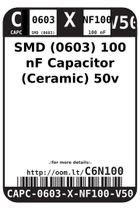
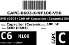
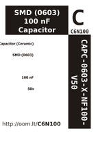

Contents
========

* [C6N100 > SMD (0603) 100 nF Capacitor (Ceramic) 50v](#c6n100--smd-0603-100-nf-capacitor-ceramic-50v)
	* [Datasheets](#datasheets)
	* [Labels](#labels)
	* [EDA](#eda)
	* [Images](#images)
	* [Tags](#tags)
  
![][im]
# C6N100 > SMD (0603) 100 nF Capacitor (Ceramic) 50v

- ID: CAPC-0603-X-NF100-V50
- Hex ID: C6N100
- Name: SMD (0603) 100 nF Capacitor (Ceramic) 50v
- Description: SMD (0603) 100 nF Capacitor (Ceramic) 50v
- Long Link: [http://oom.lt/CAPC-0603-X-NF100-V50](http://oom.lt/CAPC-0603-X-NF100-V50)
- Short Link: [http://oom.lt/C6N100](http://oom.lt/C6N100)

## Datasheets

- Datasheet: [datasheet.pdf](datasheet.pdf)

## Labels
  
  

|label-front|label-inventory|label-spec|
| :---: | :---: | :---: |
||||

## EDA

### Instances
  
  
Used 109 times.  
Prevalance: (109\9905) 1.1005%  

|OOMP Instances|
| :---: |
|[PROJ-ADAF-1463-STAN-01  Adafruit NeoPixel Ring  Used 10 times. C2, C4, C5, C6, C7, C9, C10, C11, C13, C14](https://github.com/oomlout/oomlout_OOMP_projects/tree/main/PROJ-ADAF-1463-STAN-01/)|
|[PROJ-ADAF-3382-STAN-01  Adafruit Metro M4 Express PCB  Used 8 times. C4, C6, C8, C10, C11, C14, C15, C16](https://github.com/oomlout/oomlout_OOMP_projects/tree/main/PROJ-ADAF-3382-STAN-01/)|
|[PROJ-ADAF-4000-STAN-01  Adafruit Metro M4 Express AirLift PCB  Used 8 times. C4, C6, C8, C10, C11, C14, C15, C16](https://github.com/oomlout/oomlout_OOMP_projects/tree/main/PROJ-ADAF-4000-STAN-01/)|
|[PROJ-ADAF-4064-STAN-01  Adafruit Grand Central PCB  Used 16 times. C4, C6, C8, C10, C11, C14, C15, C16, C18, C19, C20, C21, C22, C23, C24, C25](https://github.com/oomlout/oomlout_OOMP_projects/tree/main/PROJ-ADAF-4064-STAN-01/)|
|[PROJ-ADAF-4333-STAN-01  Adafruit Circuit Playground Bluefruit PCB  Used 4 times. C7, C16, C20, C21](https://github.com/oomlout/oomlout_OOMP_projects/tree/main/PROJ-ADAF-4333-STAN-01/)|
|[PROJ-ADAF-4745-STAN-01  Adafruit MatrixPortal M4 PCB  Used 7 times. C6, C8, C10, C11, C14, C15, C16](https://github.com/oomlout/oomlout_OOMP_projects/tree/main/PROJ-ADAF-4745-STAN-01/)|
|[PROJ-ARDU-DUE-STAN-01  Arduino DUE  Used 2 times. C41, C50](https://github.com/oomlout/oomlout_OOMP_projects/tree/main/PROJ-ARDU-DUE-STAN-01/)|
|[PROJ-ARDU-MEGA-2560-01  Arduino 2560 Mega  Used 11 times. C2, C3, C4, C5, C6, C7, C8, C9, C11, C12, C16](https://github.com/oomlout/oomlout_OOMP_projects/tree/main/PROJ-ARDU-MEGA-2560-01/)|
|[PROJ-ARDU-UNO-REV3-SM  Arduino Rev3 Uno (SMD)  Used 1 times. C10](https://github.com/oomlout/oomlout_OOMP_projects/tree/main/PROJ-ARDU-UNO-REV3-SM/)|
|[PROJ-SPAR-10025-STAN-01  EiBotBoard  Used 14 times. C1, C2, C3, C4, C5, C6, C7, C8, C11, C12, C15, C18, C19, C21](https://github.com/oomlout/oomlout_OOMP_projects/tree/main/PROJ-SPAR-10025-STAN-01/)|
|[PROJ-SPAR-10101-STAN-01  Window Comparator  Used 1 times. C1](https://github.com/oomlout/oomlout_OOMP_projects/tree/main/PROJ-SPAR-10101-STAN-01/)|
|[PROJ-SPAR-11189-STAN-01  MAX3232 Breakout  Used 5 times. C1, C2, C3, C4, C5](https://github.com/oomlout/oomlout_OOMP_projects/tree/main/PROJ-SPAR-11189-STAN-01/)|
|[PROJ-SPAR-11190-STAN-01  LilyPad Arduino USB  Used 3 times. C2, C3, C4](https://github.com/oomlout/oomlout_OOMP_projects/tree/main/PROJ-SPAR-11190-STAN-01/)|
|[PROJ-SPAR-11446-STAN-01  ADXL362 Breakout  Used 1 times. C1](https://github.com/oomlout/oomlout_OOMP_projects/tree/main/PROJ-SPAR-11446-STAN-01/)|
|[PROJ-SPAR-11447-STAN-01  Wake on shake  Used 2 times. C1, C4](https://github.com/oomlout/oomlout_OOMP_projects/tree/main/PROJ-SPAR-11447-STAN-01/)|
|[PROJ-SPAR-12039-STAN-01  SparkFun T5403 Barometric Breakout  Used 1 times. C1](https://github.com/oomlout/oomlout_OOMP_projects/tree/main/PROJ-SPAR-12039-STAN-01/)|
|[PROJ-SPAR-12773-STAN-01  CryptoCape  Used 3 times. C2, C5, C11](https://github.com/oomlout/oomlout_OOMP_projects/tree/main/PROJ-SPAR-12773-STAN-01/)|
|[PROJ-SPAR-12779-STAN-01  Easy Driver  Used 1 times. C1](https://github.com/oomlout/oomlout_OOMP_projects/tree/main/PROJ-SPAR-12779-STAN-01/)|
|[PROJ-SPAR-12859-STAN-01  Big Easy Driver  Used 6 times. C1, C6, C7, C8, C9, C11](https://github.com/oomlout/oomlout_OOMP_projects/tree/main/PROJ-SPAR-12859-STAN-01/)|
|[PROJ-SPAR-13183-STAN-01  CryptoShield  Used 3 times. C4, C10, C11](https://github.com/oomlout/oomlout_OOMP_projects/tree/main/PROJ-SPAR-13183-STAN-01/)|
|[PROJ-SPAR-14606-STAN-01  Flexible Grayscale OLED  Used 1 times. C4](https://github.com/oomlout/oomlout_OOMP_projects/tree/main/PROJ-SPAR-14606-STAN-01/)|
|[PROJ-SPAR-14997-STAN-01  LTE Cat M1 Shield  Used 1 times. C19](https://github.com/oomlout/oomlout_OOMP_projects/tree/main/PROJ-SPAR-14997-STAN-01/)|

### Symbols

## Images
  
  

|image|image_RE|label-front|label-inventory|label-spec|
| :---: | :---: | :---: | :---: | :---: |
||||||

## Tags

- oompID: CAPC-0603-X-NF100-V50
- name: SMD (0603) 100 nF Capacitor (Ceramic) 50v
- hexID: C6N100
- oompType: CAPC
- oompSize: 0603
- oompColor: X
- oompDesc: NF100
- oompIndex: V50
- oompVersion: 999
- ooWidth: 0.8mm
- ooHeight: 0.8mm
- ooLength: 1.6mm
- oompBbls: template;XXXX-0603-X-XXXX-XX-bbls
- oompDiag: template;XXXX-0603-X-XXXX-XX-diag
- oompIden: template;XXXX-0603-X-XXXX-XX-iden
- oompSchem: template;CAPC-XXXX-X-XXXX-XX-schem
- oompSimp: template;XXXX-0603-X-XXXX-XX-simp
- ooDesignator: C1
- oompInstances: {'PROJECT': 'PROJ-ADAF-1463-STAN-01', 'ID': 'C2'}
- oompInstances: {'PROJECT': 'PROJ-ADAF-1463-STAN-01', 'ID': 'C4'}
- oompInstances: {'PROJECT': 'PROJ-ADAF-1463-STAN-01', 'ID': 'C5'}
- oompInstances: {'PROJECT': 'PROJ-ADAF-1463-STAN-01', 'ID': 'C6'}
- oompInstances: {'PROJECT': 'PROJ-ADAF-1463-STAN-01', 'ID': 'C7'}
- oompInstances: {'PROJECT': 'PROJ-ADAF-1463-STAN-01', 'ID': 'C9'}
- oompInstances: {'PROJECT': 'PROJ-ADAF-1463-STAN-01', 'ID': 'C10'}
- oompInstances: {'PROJECT': 'PROJ-ADAF-1463-STAN-01', 'ID': 'C11'}
- oompInstances: {'PROJECT': 'PROJ-ADAF-1463-STAN-01', 'ID': 'C13'}
- oompInstances: {'PROJECT': 'PROJ-ADAF-1463-STAN-01', 'ID': 'C14'}
- oompInstances: {'PROJECT': 'PROJ-ADAF-3382-STAN-01', 'ID': 'C4'}
- oompInstances: {'PROJECT': 'PROJ-ADAF-3382-STAN-01', 'ID': 'C6'}
- oompInstances: {'PROJECT': 'PROJ-ADAF-3382-STAN-01', 'ID': 'C8'}
- oompInstances: {'PROJECT': 'PROJ-ADAF-3382-STAN-01', 'ID': 'C10'}
- oompInstances: {'PROJECT': 'PROJ-ADAF-3382-STAN-01', 'ID': 'C11'}
- oompInstances: {'PROJECT': 'PROJ-ADAF-3382-STAN-01', 'ID': 'C14'}
- oompInstances: {'PROJECT': 'PROJ-ADAF-3382-STAN-01', 'ID': 'C15'}
- oompInstances: {'PROJECT': 'PROJ-ADAF-3382-STAN-01', 'ID': 'C16'}
- oompInstances: {'PROJECT': 'PROJ-ADAF-4000-STAN-01', 'ID': 'C4'}
- oompInstances: {'PROJECT': 'PROJ-ADAF-4000-STAN-01', 'ID': 'C6'}
- oompInstances: {'PROJECT': 'PROJ-ADAF-4000-STAN-01', 'ID': 'C8'}
- oompInstances: {'PROJECT': 'PROJ-ADAF-4000-STAN-01', 'ID': 'C10'}
- oompInstances: {'PROJECT': 'PROJ-ADAF-4000-STAN-01', 'ID': 'C11'}
- oompInstances: {'PROJECT': 'PROJ-ADAF-4000-STAN-01', 'ID': 'C14'}
- oompInstances: {'PROJECT': 'PROJ-ADAF-4000-STAN-01', 'ID': 'C15'}
- oompInstances: {'PROJECT': 'PROJ-ADAF-4000-STAN-01', 'ID': 'C16'}
- oompInstances: {'PROJECT': 'PROJ-ADAF-4064-STAN-01', 'ID': 'C4'}
- oompInstances: {'PROJECT': 'PROJ-ADAF-4064-STAN-01', 'ID': 'C6'}
- oompInstances: {'PROJECT': 'PROJ-ADAF-4064-STAN-01', 'ID': 'C8'}
- oompInstances: {'PROJECT': 'PROJ-ADAF-4064-STAN-01', 'ID': 'C10'}
- oompInstances: {'PROJECT': 'PROJ-ADAF-4064-STAN-01', 'ID': 'C11'}
- oompInstances: {'PROJECT': 'PROJ-ADAF-4064-STAN-01', 'ID': 'C14'}
- oompInstances: {'PROJECT': 'PROJ-ADAF-4064-STAN-01', 'ID': 'C15'}
- oompInstances: {'PROJECT': 'PROJ-ADAF-4064-STAN-01', 'ID': 'C16'}
- oompInstances: {'PROJECT': 'PROJ-ADAF-4064-STAN-01', 'ID': 'C18'}
- oompInstances: {'PROJECT': 'PROJ-ADAF-4064-STAN-01', 'ID': 'C19'}
- oompInstances: {'PROJECT': 'PROJ-ADAF-4064-STAN-01', 'ID': 'C20'}
- oompInstances: {'PROJECT': 'PROJ-ADAF-4064-STAN-01', 'ID': 'C21'}
- oompInstances: {'PROJECT': 'PROJ-ADAF-4064-STAN-01', 'ID': 'C22'}
- oompInstances: {'PROJECT': 'PROJ-ADAF-4064-STAN-01', 'ID': 'C23'}
- oompInstances: {'PROJECT': 'PROJ-ADAF-4064-STAN-01', 'ID': 'C24'}
- oompInstances: {'PROJECT': 'PROJ-ADAF-4064-STAN-01', 'ID': 'C25'}
- oompInstances: {'PROJECT': 'PROJ-ADAF-4333-STAN-01', 'ID': 'C7'}
- oompInstances: {'PROJECT': 'PROJ-ADAF-4333-STAN-01', 'ID': 'C16'}
- oompInstances: {'PROJECT': 'PROJ-ADAF-4333-STAN-01', 'ID': 'C20'}
- oompInstances: {'PROJECT': 'PROJ-ADAF-4333-STAN-01', 'ID': 'C21'}
- oompInstances: {'PROJECT': 'PROJ-ADAF-4745-STAN-01', 'ID': 'C6'}
- oompInstances: {'PROJECT': 'PROJ-ADAF-4745-STAN-01', 'ID': 'C8'}
- oompInstances: {'PROJECT': 'PROJ-ADAF-4745-STAN-01', 'ID': 'C10'}
- oompInstances: {'PROJECT': 'PROJ-ADAF-4745-STAN-01', 'ID': 'C11'}
- oompInstances: {'PROJECT': 'PROJ-ADAF-4745-STAN-01', 'ID': 'C14'}
- oompInstances: {'PROJECT': 'PROJ-ADAF-4745-STAN-01', 'ID': 'C15'}
- oompInstances: {'PROJECT': 'PROJ-ADAF-4745-STAN-01', 'ID': 'C16'}
- oompInstances: {'PROJECT': 'PROJ-ARDU-DUE-STAN-01', 'ID': 'C41'}
- oompInstances: {'PROJECT': 'PROJ-ARDU-DUE-STAN-01', 'ID': 'C50'}
- oompInstances: {'PROJECT': 'PROJ-ARDU-MEGA-2560-01', 'ID': 'C2'}
- oompInstances: {'PROJECT': 'PROJ-ARDU-MEGA-2560-01', 'ID': 'C3'}
- oompInstances: {'PROJECT': 'PROJ-ARDU-MEGA-2560-01', 'ID': 'C4'}
- oompInstances: {'PROJECT': 'PROJ-ARDU-MEGA-2560-01', 'ID': 'C5'}
- oompInstances: {'PROJECT': 'PROJ-ARDU-MEGA-2560-01', 'ID': 'C6'}
- oompInstances: {'PROJECT': 'PROJ-ARDU-MEGA-2560-01', 'ID': 'C7'}
- oompInstances: {'PROJECT': 'PROJ-ARDU-MEGA-2560-01', 'ID': 'C8'}
- oompInstances: {'PROJECT': 'PROJ-ARDU-MEGA-2560-01', 'ID': 'C9'}
- oompInstances: {'PROJECT': 'PROJ-ARDU-MEGA-2560-01', 'ID': 'C11'}
- oompInstances: {'PROJECT': 'PROJ-ARDU-MEGA-2560-01', 'ID': 'C12'}
- oompInstances: {'PROJECT': 'PROJ-ARDU-MEGA-2560-01', 'ID': 'C16'}
- oompInstances: {'PROJECT': 'PROJ-ARDU-UNO-REV3-SM', 'ID': 'C10'}
- oompInstances: {'PROJECT': 'PROJ-SPAR-10025-STAN-01', 'ID': 'C1'}
- oompInstances: {'PROJECT': 'PROJ-SPAR-10025-STAN-01', 'ID': 'C2'}
- oompInstances: {'PROJECT': 'PROJ-SPAR-10025-STAN-01', 'ID': 'C3'}
- oompInstances: {'PROJECT': 'PROJ-SPAR-10025-STAN-01', 'ID': 'C4'}
- oompInstances: {'PROJECT': 'PROJ-SPAR-10025-STAN-01', 'ID': 'C5'}
- oompInstances: {'PROJECT': 'PROJ-SPAR-10025-STAN-01', 'ID': 'C6'}
- oompInstances: {'PROJECT': 'PROJ-SPAR-10025-STAN-01', 'ID': 'C7'}
- oompInstances: {'PROJECT': 'PROJ-SPAR-10025-STAN-01', 'ID': 'C8'}
- oompInstances: {'PROJECT': 'PROJ-SPAR-10025-STAN-01', 'ID': 'C11'}
- oompInstances: {'PROJECT': 'PROJ-SPAR-10025-STAN-01', 'ID': 'C12'}
- oompInstances: {'PROJECT': 'PROJ-SPAR-10025-STAN-01', 'ID': 'C15'}
- oompInstances: {'PROJECT': 'PROJ-SPAR-10025-STAN-01', 'ID': 'C18'}
- oompInstances: {'PROJECT': 'PROJ-SPAR-10025-STAN-01', 'ID': 'C19'}
- oompInstances: {'PROJECT': 'PROJ-SPAR-10025-STAN-01', 'ID': 'C21'}
- oompInstances: {'PROJECT': 'PROJ-SPAR-10101-STAN-01', 'ID': 'C1'}
- oompInstances: {'PROJECT': 'PROJ-SPAR-11189-STAN-01', 'ID': 'C1'}
- oompInstances: {'PROJECT': 'PROJ-SPAR-11189-STAN-01', 'ID': 'C2'}
- oompInstances: {'PROJECT': 'PROJ-SPAR-11189-STAN-01', 'ID': 'C3'}
- oompInstances: {'PROJECT': 'PROJ-SPAR-11189-STAN-01', 'ID': 'C4'}
- oompInstances: {'PROJECT': 'PROJ-SPAR-11189-STAN-01', 'ID': 'C5'}
- oompInstances: {'PROJECT': 'PROJ-SPAR-11190-STAN-01', 'ID': 'C2'}
- oompInstances: {'PROJECT': 'PROJ-SPAR-11190-STAN-01', 'ID': 'C3'}
- oompInstances: {'PROJECT': 'PROJ-SPAR-11190-STAN-01', 'ID': 'C4'}
- oompInstances: {'PROJECT': 'PROJ-SPAR-11446-STAN-01', 'ID': 'C1'}
- oompInstances: {'PROJECT': 'PROJ-SPAR-11447-STAN-01', 'ID': 'C1'}
- oompInstances: {'PROJECT': 'PROJ-SPAR-11447-STAN-01', 'ID': 'C4'}
- oompInstances: {'PROJECT': 'PROJ-SPAR-12039-STAN-01', 'ID': 'C1'}
- oompInstances: {'PROJECT': 'PROJ-SPAR-12773-STAN-01', 'ID': 'C2'}
- oompInstances: {'PROJECT': 'PROJ-SPAR-12773-STAN-01', 'ID': 'C5'}
- oompInstances: {'PROJECT': 'PROJ-SPAR-12773-STAN-01', 'ID': 'C11'}
- oompInstances: {'PROJECT': 'PROJ-SPAR-12779-STAN-01', 'ID': 'C1'}
- oompInstances: {'PROJECT': 'PROJ-SPAR-12859-STAN-01', 'ID': 'C1'}
- oompInstances: {'PROJECT': 'PROJ-SPAR-12859-STAN-01', 'ID': 'C6'}
- oompInstances: {'PROJECT': 'PROJ-SPAR-12859-STAN-01', 'ID': 'C7'}
- oompInstances: {'PROJECT': 'PROJ-SPAR-12859-STAN-01', 'ID': 'C8'}
- oompInstances: {'PROJECT': 'PROJ-SPAR-12859-STAN-01', 'ID': 'C9'}
- oompInstances: {'PROJECT': 'PROJ-SPAR-12859-STAN-01', 'ID': 'C11'}
- oompInstances: {'PROJECT': 'PROJ-SPAR-13183-STAN-01', 'ID': 'C4'}
- oompInstances: {'PROJECT': 'PROJ-SPAR-13183-STAN-01', 'ID': 'C10'}
- oompInstances: {'PROJECT': 'PROJ-SPAR-13183-STAN-01', 'ID': 'C11'}
- oompInstances: {'PROJECT': 'PROJ-SPAR-14606-STAN-01', 'ID': 'C4'}
- oompInstances: {'PROJECT': 'PROJ-SPAR-14997-STAN-01', 'ID': 'C19'}

[im]: image_450.jpg
