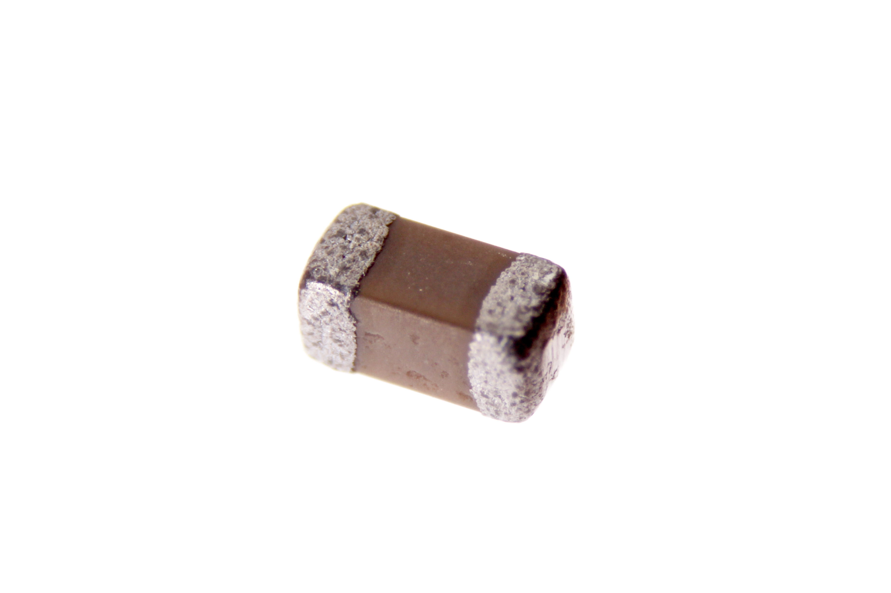
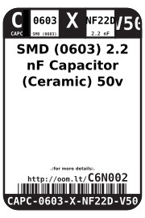
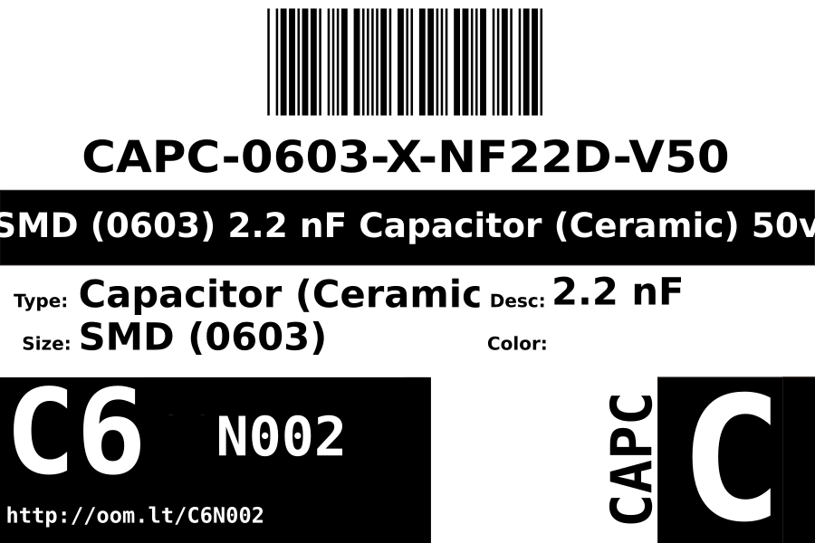
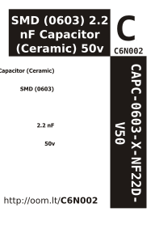

Contents
========

* [CAPC-0603-X-NF22D-V50>SMD (0603) 2.2 nF Capacitor (Ceramic) 50v](#capc-0603-x-nf22d-v50smd-0603-22-nf-capacitor-ceramic-50v)
	* [Images](#images)
	* [Datasheets](#datasheets)
	* [Labels](#labels)
	* [EDA](#eda)
		* [Symbols](#symbols)
	* [Tags](#tags)
  
![][im]
# CAPC-0603-X-NF22D-V50>SMD (0603) 2.2 nF Capacitor (Ceramic) 50v

- ID: CAPC-0603-X-NF22D-V50
- Name: CAPC-0603-X-NF22D-V50

## Images
  
  

|Main|
| :---: |
||

## Datasheets

- Datasheet: [datasheet.pdf](datasheet.pdf)

## Labels
  
  

|Front|Inventory|Specifications|
| :---: | :---: | :---: |
||||

## EDA

### Symbols

## Tags

- oompID: CAPC-0603-X-NF22D-V50
- name: SMD (0603) 2.2 nF Capacitor (Ceramic) 50v
- hexID: C6N002
- oompSort: 
- oompType: CAPC
- oompSize: 0603
- oompColor: X
- oompDesc: NF22D
- oompIndex: V50
- oompVersion: 99
- oompClass: Surface Mount
- oompClassCode: SMDS
- ooWidth: 0.8 mm
- ooLength: 1.6 mm
- ooNumPins: 2
- oompBbls: template;XXXX-0603-X-XXXX-XX-bbls
- oompDiag: template;XXXX-0603-X-XXXX-XX-diag
- oompIden: template;XXXX-0603-X-XXXX-XX-iden
- oompSchem: template;CAPC-XXXX-X-XXXX-XX-schem
- oompSimp: template;XXXX-0603-X-XXXX-XX-simp
- ooDesignator: C1

[im]: image_600.jpg
