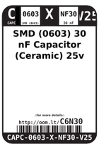
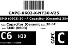
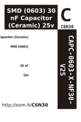

Contents
========

* [C6N30 > SMD (0603) 30 nF Capacitor (Ceramic) 25v](#c6n30--smd-0603-30-nf-capacitor-ceramic-25v)
	* [Datasheets](#datasheets)
	* [Labels](#labels)
	* [EDA](#eda)
	* [Images](#images)
	* [Tags](#tags)

# C6N30 > SMD (0603) 30 nF Capacitor (Ceramic) 25v

- ID: CAPC-0603-X-NF30-V25
- Hex ID: C6N30
- Name: SMD (0603) 30 nF Capacitor (Ceramic) 25v
- Description: SMD (0603) 30 nF Capacitor (Ceramic) 25v
- Long Link: [http://oom.lt/CAPC-0603-X-NF30-V25](http://oom.lt/CAPC-0603-X-NF30-V25)
- Short Link: [http://oom.lt/C6N30](http://oom.lt/C6N30)

## Datasheets

- Datasheet: [datasheet.pdf](datasheet.pdf)

## Labels
  
  

|label-front|label-inventory|label-spec|
| :---: | :---: | :---: |
||||

## EDA

### Footprints
  

|[  FOOTPRINT-kicad-kicad-footprints-Capacitor_SMD-C_0603_1608Metric](https://github.com/oomlout/oomlout_OOMP_eda/tree/main/FOOTPRINT/kicad/kicad-footprints/Capacitor_SMD/C_0603_1608Metric/)|[  FOOTPRINT-kicad-kicad-footprints-Capacitor_SMD-C_0603_1608Metric_Pad1.08x0.95mm_HandSolder](https://github.com/oomlout/oomlout_OOMP_eda/tree/main/FOOTPRINT/kicad/kicad-footprints/Capacitor_SMD/C_0603_1608Metric_Pad1.08x0.95mm_HandSolder/)|||
| :---: | :---: | :---: | :---: |

### Symbols
  

|[  SYMBOL-kicad-kicad-symbols-Device-C](https://github.com/oomlout/oomlout_OOMP_eda/tree/main/SYMBOL/kicad/kicad-symbols/Device/C/)||||
| :---: | :---: | :---: | :---: |

## Images
  
  

|label-front|label-inventory|label-spec|
| :---: | :---: | :---: |
||||

## Tags

- oompType: CAPC
- oompSize: 0603
- oompColor: X
- oompDesc: NF30
- oompIndex: V25
- oplPartNumber: {'code': 'C-JLCC', 'name': 'JLC Parts Library', 'partID': 'C1615', 'desc': '25V 330nF X7R ??10% 0603  Multilayer Ceramic Capacitors MLCC - SMD/SMT ROHS'}
- distributorPartNumber: {'code': 'C-LCSC', 'name': 'LCSC', 'partID': 'C1615'}
- manufacturerPartNumber: {'code': 'C-XXXX', 'name': 'FH (Guangdong Fenghua Advanced Tech)', 'partID': '0603B334K250NT'}
- hexID: C6N30
- oompID: CAPC-0603-X-NF30-V25
- footprintKicad: FOOTPRINT-kicad-kicad-footprints-Capacitor_SMD-C_0603_1608Metric
- footprintKicad: FOOTPRINT-kicad-kicad-footprints-Capacitor_SMD-C_0603_1608Metric_Pad1.08x0.95mm_HandSolder
- symbolKicad: SYMBOL-kicad-kicad-symbols-Device-C
