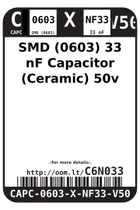
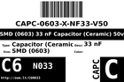
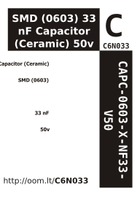

Contents
========

* [C6N033 > SMD (0603) 33 nF Capacitor (Ceramic) 50v](#c6n033--smd-0603-33-nf-capacitor-ceramic-50v)
	* [Datasheets](#datasheets)
	* [Labels](#labels)
	* [EDA](#eda)
	* [Images](#images)
	* [Tags](#tags)
  
![][im]
# C6N033 > SMD (0603) 33 nF Capacitor (Ceramic) 50v

- ID: CAPC-0603-X-NF33-V50
- Hex ID: C6N033
- Name: SMD (0603) 33 nF Capacitor (Ceramic) 50v
- Description: SMD (0603) 33 nF Capacitor (Ceramic) 50v
- Long Link: [http://oom.lt/CAPC-0603-X-NF33-V50](http://oom.lt/CAPC-0603-X-NF33-V50)
- Short Link: [http://oom.lt/C6N033](http://oom.lt/C6N033)

## Datasheets

- Datasheet: [datasheet.pdf](datasheet.pdf)

## Labels
  
  

|label-front|label-inventory|label-spec|
| :---: | :---: | :---: |
||||

## EDA

### Footprints
  

|[  FOOTPRINT-kicad-kicad-footprints-Capacitor_SMD-C_0603_1608Metric](https://github.com/oomlout/oomlout_OOMP_eda/tree/main/FOOTPRINT/kicad/kicad-footprints/Capacitor_SMD/C_0603_1608Metric/)|[  FOOTPRINT-kicad-kicad-footprints-Capacitor_SMD-C_0603_1608Metric_Pad1.08x0.95mm_HandSolder](https://github.com/oomlout/oomlout_OOMP_eda/tree/main/FOOTPRINT/kicad/kicad-footprints/Capacitor_SMD/C_0603_1608Metric_Pad1.08x0.95mm_HandSolder/)|||
| :---: | :---: | :---: | :---: |

### Symbols
  

|[  SYMBOL-kicad-kicad-symbols-Device-C](https://github.com/oomlout/oomlout_OOMP_eda/tree/main/SYMBOL/kicad/kicad-symbols/Device/C/)||||
| :---: | :---: | :---: | :---: |
  

### Instances
  
Used 3 times.  
Prevalance: (3\10986) 0.0273%  

|Project|Occur- rences|Identifiers|
| :---: | :---: | :---: |
|[PROJ-SPAR-14155-STAN-01 ESP32 Power Control Shield](https://github.com/oomlout/oomlout_OOMP_projects/tree/main/PROJ-SPAR-14155-STAN-01/)|[3](https://github.com/oomlout/oomlout_OOMP_projects/tree/main/PROJ-SPAR-14155-STAN-01/)|[C1, C2, C3](https://github.com/oomlout/oomlout_OOMP_projects/tree/main/PROJ-SPAR-14155-STAN-01/)|

## Images
  
  

|image|label-front|label-inventory|label-spec|
| :---: | :---: | :---: | :---: |
|||||

## Tags

- oompID: CAPC-0603-X-NF33-V50
- name: SMD (0603) 33 nF Capacitor (Ceramic) 50v
- hexID: C6N033
- oompType: CAPC
- oompSize: 0603
- oompColor: X
- oompDesc: NF33
- oompIndex: V50
- oompVersion: 999
- ooWidth: 0.8mm
- ooHeight: 0.8mm
- ooLength: 1.6mm
- oompBbls: template;XXXX-0603-X-XXXX-XX-bbls
- oompDiag: template;XXXX-0603-X-XXXX-XX-diag
- oompIden: template;XXXX-0603-X-XXXX-XX-iden
- oompSchem: template;CAPC-XXXX-X-XXXX-XX-schem
- oompSimp: template;XXXX-0603-X-XXXX-XX-simp
- ooDesignator: C1
- oompInstances: {'PROJECT': 'PROJ-SPAR-14155-STAN-01', 'ID': 'C1'}
- oompInstances: {'PROJECT': 'PROJ-SPAR-14155-STAN-01', 'ID': 'C2'}
- oompInstances: {'PROJECT': 'PROJ-SPAR-14155-STAN-01', 'ID': 'C3'}
- footprintKicad: FOOTPRINT-kicad-kicad-footprints-Capacitor_SMD-C_0603_1608Metric
- footprintKicad: FOOTPRINT-kicad-kicad-footprints-Capacitor_SMD-C_0603_1608Metric_Pad1.08x0.95mm_HandSolder
- symbolKicad: SYMBOL-kicad-kicad-symbols-Device-C

[im]: image_450.jpg
