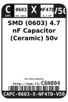
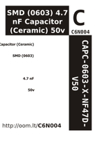

Contents
========

* [C6N47D > SMD (0603) 4.7 nF Capacitor (Ceramic) 50v](#c6n47d--smd-0603-47-nf-capacitor-ceramic-50v)
	* [Datasheets](#datasheets)
	* [Labels](#labels)
	* [EDA](#eda)
	* [Images](#images)
	* [Tags](#tags)
  
![][im]
# C6N47D > SMD (0603) 4.7 nF Capacitor (Ceramic) 50v

- ID: CAPC-0603-X-NF47D-V50
- Hex ID: C6N47D
- Name: SMD (0603) 4.7 nF Capacitor (Ceramic) 50v
- Description: SMD (0603) 4.7 nF Capacitor (Ceramic) 50v
- Long Link: [http://oom.lt/CAPC-0603-X-NF47D-V50](http://oom.lt/CAPC-0603-X-NF47D-V50)
- Short Link: [http://oom.lt/C6N47D](http://oom.lt/C6N47D)

## Datasheets

- Datasheet: [datasheet.pdf](datasheet.pdf)

## Labels
  
  

|label-front|label-inventory|label-spec|
| :---: | :---: | :---: |
||||

## EDA

## Images
  
  

|image|image_RE|label-front|label-inventory|label-spec|
| :---: | :---: | :---: | :---: | :---: |
||||||

## Tags

- oompType: CAPC
- oompSize: 0603
- oompColor: X
- oompDesc: NF47D
- oompIndex: V50
- oplPartNumber: {'code': 'C-JLCC', 'name': 'JLC Parts Library', 'partID': 'C53987', 'desc': '50V 4.7nF X7R ??10% 0603  Multilayer Ceramic Capacitors MLCC - SMD/SMT ROHS'}
- distributorPartNumber: {'code': 'C-LCSC', 'name': 'LCSC', 'partID': 'C53987'}
- manufacturerPartNumber: {'code': 'C-XXXX', 'name': 'FH (Guangdong Fenghua Advanced Tech)', 'partID': '0603B472K500NT'}
- hexID: C6N47D
- oompID: CAPC-0603-X-NF47D-V50

[im]: image_450.jpg
