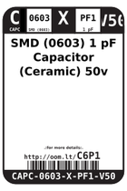
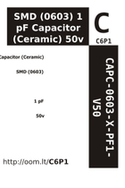

Contents
========

* [C6P1 > ](#c6p1--)
	* [Labels](#labels)
	* [EDA](#eda)
	* [Images](#images)
	* [Tags](#tags)

# C6P1 > 

- ID: CAPC-0603-X-PF1-V50
- Hex ID: C6P1
- Name: 
- Description: 
- Long Link: [http://oom.lt/CAPC-0603-X-PF1-V50](http://oom.lt/CAPC-0603-X-PF1-V50)
- Short Link: [http://oom.lt/C6P1](http://oom.lt/C6P1)

## Labels
  
  

|label-front|label-inventory|label-spec|
| :---: | :---: | :---: |
||||

## EDA

### Footprints
  

|[  FOOTPRINT-kicad-kicad-footprints-Capacitor_SMD-C_0603_1608Metric](https://github.com/oomlout/oomlout_OOMP_eda/tree/main/FOOTPRINT/kicad/kicad-footprints/Capacitor_SMD/C_0603_1608Metric/)|[  FOOTPRINT-kicad-kicad-footprints-Capacitor_SMD-C_0603_1608Metric_Pad1.08x0.95mm_HandSolder](https://github.com/oomlout/oomlout_OOMP_eda/tree/main/FOOTPRINT/kicad/kicad-footprints/Capacitor_SMD/C_0603_1608Metric_Pad1.08x0.95mm_HandSolder/)|||
| :---: | :---: | :---: | :---: |

### Symbols
  

|[  SYMBOL-kicad-kicad-symbols-Device-C](https://github.com/oomlout/oomlout_OOMP_eda/tree/main/SYMBOL/kicad/kicad-symbols/Device/C/)||||
| :---: | :---: | :---: | :---: |

## Images
  
  

|label-front|label-inventory|label-spec|
| :---: | :---: | :---: |
||||

## Tags

- oompType: CAPC
- oompSize: 0603
- oompColor: X
- oompDesc: PF1
- oompIndex: V50
- oplPartNumber: {'code': 'C-JLCC', 'name': 'JLC Parts Library', 'partID': 'C23969', 'desc': '50V 1pF C0G ??0.25pF 0603  Multilayer Ceramic Capacitors MLCC - SMD/SMT ROHS'}
- distributorPartNumber: {'code': 'C-LCSC', 'name': 'LCSC', 'partID': 'C23969'}
- manufacturerPartNumber: {'code': 'C-XXXX', 'name': 'Samsung Electro-Mechanics', 'partID': 'CL10C010CB8NNNC'}
- hexID: C6P1
- oompID: CAPC-0603-X-PF1-V50
- footprintKicad: FOOTPRINT-kicad-kicad-footprints-Capacitor_SMD-C_0603_1608Metric
- footprintKicad: FOOTPRINT-kicad-kicad-footprints-Capacitor_SMD-C_0603_1608Metric_Pad1.08x0.95mm_HandSolder
- symbolKicad: SYMBOL-kicad-kicad-symbols-Device-C
