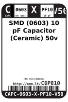
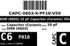
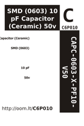

Contents
========

* [C6P10 > SMD (0603) 10 pF Capacitor (Ceramic) 50v](#c6p10--smd-0603-10-pf-capacitor-ceramic-50v)
	* [Datasheets](#datasheets)
	* [Labels](#labels)
	* [EDA](#eda)
	* [Images](#images)
	* [Tags](#tags)
  
![][im]
# C6P10 > SMD (0603) 10 pF Capacitor (Ceramic) 50v

- ID: CAPC-0603-X-PF10-V50
- Hex ID: C6P10
- Name: SMD (0603) 10 pF Capacitor (Ceramic) 50v
- Description: SMD (0603) 10 pF Capacitor (Ceramic) 50v
- Long Link: [http://oom.lt/CAPC-0603-X-PF10-V50](http://oom.lt/CAPC-0603-X-PF10-V50)
- Short Link: [http://oom.lt/C6P10](http://oom.lt/C6P10)

## Datasheets

- Datasheet: [datasheet.pdf](datasheet.pdf)

## Labels
  
  

|label-front|label-inventory|label-spec|
| :---: | :---: | :---: |
||||

## EDA

### Footprints
  

|[  FOOTPRINT-kicad-kicad-footprints-Capacitor_SMD-C_0603_1608Metric](https://github.com/oomlout/oomlout_OOMP_eda/tree/main/FOOTPRINT/kicad/kicad-footprints/Capacitor_SMD/C_0603_1608Metric/)|[  FOOTPRINT-kicad-kicad-footprints-Capacitor_SMD-C_0603_1608Metric_Pad1.08x0.95mm_HandSolder](https://github.com/oomlout/oomlout_OOMP_eda/tree/main/FOOTPRINT/kicad/kicad-footprints/Capacitor_SMD/C_0603_1608Metric_Pad1.08x0.95mm_HandSolder/)|||
| :---: | :---: | :---: | :---: |

### Symbols
  

|[  ----](https://github.com/oomlout/oomlout_OOMP_parts/tree/main/----/)||||
| :---: | :---: | :---: | :---: |
  

### Instances
  
Used 12 times.  
Prevalance: (12\10986) 0.1092%  

|Project|Occur- rences|Identifiers|
| :---: | :---: | :---: |
|[PROJ-SPAR-12071-STAN-01 CC3000 WiFi Shield](https://github.com/oomlout/oomlout_OOMP_projects/tree/main/PROJ-SPAR-12071-STAN-01/)|[1](https://github.com/oomlout/oomlout_OOMP_projects/tree/main/PROJ-SPAR-12071-STAN-01/)|[C6](https://github.com/oomlout/oomlout_OOMP_projects/tree/main/PROJ-SPAR-12071-STAN-01/)|
|[PROJ-SPAR-13287-STAN-01 ESP8266 WiFi Shield](https://github.com/oomlout/oomlout_OOMP_projects/tree/main/PROJ-SPAR-13287-STAN-01/)|[2](https://github.com/oomlout/oomlout_OOMP_projects/tree/main/PROJ-SPAR-13287-STAN-01/)|[C4, C5](https://github.com/oomlout/oomlout_OOMP_projects/tree/main/PROJ-SPAR-13287-STAN-01/)|
|[PROJ-SPAR-13711-STAN-01 ESP8266 Thing Dev 4H](https://github.com/oomlout/oomlout_OOMP_projects/tree/main/PROJ-SPAR-13711-STAN-01/)|[2](https://github.com/oomlout/oomlout_OOMP_projects/tree/main/PROJ-SPAR-13711-STAN-01/)|[C3, C4](https://github.com/oomlout/oomlout_OOMP_projects/tree/main/PROJ-SPAR-13711-STAN-01/)|
|[PROJ-SPAR-13794-STAN-01 Blynk Board ESP8266](https://github.com/oomlout/oomlout_OOMP_projects/tree/main/PROJ-SPAR-13794-STAN-01/)|[2](https://github.com/oomlout/oomlout_OOMP_projects/tree/main/PROJ-SPAR-13794-STAN-01/)|[C3, C4](https://github.com/oomlout/oomlout_OOMP_projects/tree/main/PROJ-SPAR-13794-STAN-01/)|
|[PROJ-SPAR-13810-STAN-01 tsunami](https://github.com/oomlout/oomlout_OOMP_projects/tree/main/PROJ-SPAR-13810-STAN-01/)|[1](https://github.com/oomlout/oomlout_OOMP_projects/tree/main/PROJ-SPAR-13810-STAN-01/)|[C20](https://github.com/oomlout/oomlout_OOMP_projects/tree/main/PROJ-SPAR-13810-STAN-01/)|
|[PROJ-SPAR-13830-STAN-01 USB UART Serial Breakout-CY7C65213](https://github.com/oomlout/oomlout_OOMP_projects/tree/main/PROJ-SPAR-13830-STAN-01/)|[2](https://github.com/oomlout/oomlout_OOMP_projects/tree/main/PROJ-SPAR-13830-STAN-01/)|[C7, C8](https://github.com/oomlout/oomlout_OOMP_projects/tree/main/PROJ-SPAR-13830-STAN-01/)|
|[PROJ-SPAR-14050-STAN-01 Serial Basic Breakout-CH340G](https://github.com/oomlout/oomlout_OOMP_projects/tree/main/PROJ-SPAR-14050-STAN-01/)|[2](https://github.com/oomlout/oomlout_OOMP_projects/tree/main/PROJ-SPAR-14050-STAN-01/)|[C4, C5](https://github.com/oomlout/oomlout_OOMP_projects/tree/main/PROJ-SPAR-14050-STAN-01/)|

## Images
  
  

|image|image_RE|label-front|label-inventory|label-spec|
| :---: | :---: | :---: | :---: | :---: |
||||||

## Tags

- oompType: CAPC
- oompSize: 0603
- oompColor: X
- oompDesc: PF10
- oompIndex: V50
- oplPartNumber: {'code': 'C-JLCC', 'name': 'JLC Parts Library', 'partID': 'C1634', 'desc': '50V 10pF C0G ??5% 0603  Multilayer Ceramic Capacitors MLCC - SMD/SMT ROHS'}
- distributorPartNumber: {'code': 'C-LCSC', 'name': 'LCSC', 'partID': 'C1634'}
- manufacturerPartNumber: {'code': 'C-XXXX', 'name': 'Samsung Electro-Mechanics', 'partID': 'CL10C100JB8NNNC'}
- hexID: C6P10
- oompID: CAPC-0603-X-PF10-V50
- oompInstances: {'PROJECT': 'PROJ-SPAR-12071-STAN-01', 'ID': 'C6'}
- oompInstances: {'PROJECT': 'PROJ-SPAR-13287-STAN-01', 'ID': 'C4'}
- oompInstances: {'PROJECT': 'PROJ-SPAR-13287-STAN-01', 'ID': 'C5'}
- oompInstances: {'PROJECT': 'PROJ-SPAR-13711-STAN-01', 'ID': 'C3'}
- oompInstances: {'PROJECT': 'PROJ-SPAR-13711-STAN-01', 'ID': 'C4'}
- oompInstances: {'PROJECT': 'PROJ-SPAR-13794-STAN-01', 'ID': 'C3'}
- oompInstances: {'PROJECT': 'PROJ-SPAR-13794-STAN-01', 'ID': 'C4'}
- oompInstances: {'PROJECT': 'PROJ-SPAR-13810-STAN-01', 'ID': 'C20'}
- oompInstances: {'PROJECT': 'PROJ-SPAR-13830-STAN-01', 'ID': 'C7'}
- oompInstances: {'PROJECT': 'PROJ-SPAR-13830-STAN-01', 'ID': 'C8'}
- oompInstances: {'PROJECT': 'PROJ-SPAR-14050-STAN-01', 'ID': 'C4'}
- oompInstances: {'PROJECT': 'PROJ-SPAR-14050-STAN-01', 'ID': 'C5'}
- symbolKicad: SYMBOL-kicad-kicad-symbols-Switch-C
- footprintKicad: FOOTPRINT-kicad-kicad-footprints-Capacitor_SMD-C_0603_1608Metric
- footprintKicad: FOOTPRINT-kicad-kicad-footprints-Capacitor_SMD-C_0603_1608Metric_Pad1.08x0.95mm_HandSolder

[im]: image_450.jpg
