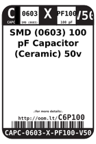
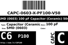
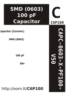

Contents
========

* [C6P100 > SMD (0603) 100 pF Capacitor (Ceramic) 50v](#c6p100--smd-0603-100-pf-capacitor-ceramic-50v)
	* [Datasheets](#datasheets)
	* [Labels](#labels)
	* [EDA](#eda)
	* [Images](#images)
	* [Tags](#tags)
  
![][im]
# C6P100 > SMD (0603) 100 pF Capacitor (Ceramic) 50v

- ID: CAPC-0603-X-PF100-V50
- Hex ID: C6P100
- Name: SMD (0603) 100 pF Capacitor (Ceramic) 50v
- Description: SMD (0603) 100 pF Capacitor (Ceramic) 50v
- Long Link: [http://oom.lt/CAPC-0603-X-PF100-V50](http://oom.lt/CAPC-0603-X-PF100-V50)
- Short Link: [http://oom.lt/C6P100](http://oom.lt/C6P100)

## Datasheets

- Datasheet: [datasheet.pdf](datasheet.pdf)

## Labels
  
  

|label-front|label-inventory|label-spec|
| :---: | :---: | :---: |
||||

## EDA

### Instances
  
  
Used 13 times.  
Prevalance: (13\10986) 0.1183%  

|OOMP Instances|
| :---: |
|[PROJ-ADAF-4757-STAN-01  Adafruit Voice Bonnet PCB  Used 4 times. C28, C29, C30, C31](https://github.com/oomlout/oomlout_OOMP_projects/tree/main/PROJ-ADAF-4757-STAN-01/)|
|[PROJ-SPAR-10661-STAN-01  VoiceBox Shield  Used 2 times. C1, C3](https://github.com/oomlout/oomlout_OOMP_projects/tree/main/PROJ-SPAR-10661-STAN-01/)|
|[PROJ-SPAR-12958-STAN-01  Electric Imp imp002 Breakout  Used 3 times. C3, C5, C7](https://github.com/oomlout/oomlout_OOMP_projects/tree/main/PROJ-SPAR-12958-STAN-01/)|
|[PROJ-SPAR-14002-STAN-01  THAT 1206 Breakout  Used 1 times. C3](https://github.com/oomlout/oomlout_OOMP_projects/tree/main/PROJ-SPAR-14002-STAN-01/)|
|[PROJ-SPAR-14003-STAN-01  THAT 1646 Breakout  Used 2 times. C5, C6](https://github.com/oomlout/oomlout_OOMP_projects/tree/main/PROJ-SPAR-14003-STAN-01/)|
|[PROJ-SPAR-14544-STAN-01  Current Sensor Breakout-ACS723-Low Current  Used 1 times. C1](https://github.com/oomlout/oomlout_OOMP_projects/tree/main/PROJ-SPAR-14544-STAN-01/)|

### Symbols

## Images
  
  

|image|label-front|label-inventory|label-spec|
| :---: | :---: | :---: | :---: |
|||||

## Tags

- oompID: CAPC-0603-X-PF100-V50
- name: SMD (0603) 100 pF Capacitor (Ceramic) 50v
- hexID: C6P100
- oompType: CAPC
- oompSize: 0603
- oompColor: X
- oompDesc: PF100
- oompIndex: V50
- oompVersion: 999
- ooWidth: 0.8mm
- ooHeight: 0.8mm
- ooLength: 1.6mm
- oompBbls: template;XXXX-0603-X-XXXX-XX-bbls
- oompDiag: template;XXXX-0603-X-XXXX-XX-diag
- oompIden: template;XXXX-0603-X-XXXX-XX-iden
- oompSchem: template;CAPC-XXXX-X-XXXX-XX-schem
- oompSimp: template;XXXX-0603-X-XXXX-XX-simp
- ooDesignator: C1
- oompInstances: {'PROJECT': 'PROJ-ADAF-4757-STAN-01', 'ID': 'C28'}
- oompInstances: {'PROJECT': 'PROJ-ADAF-4757-STAN-01', 'ID': 'C29'}
- oompInstances: {'PROJECT': 'PROJ-ADAF-4757-STAN-01', 'ID': 'C30'}
- oompInstances: {'PROJECT': 'PROJ-ADAF-4757-STAN-01', 'ID': 'C31'}
- oompInstances: {'PROJECT': 'PROJ-SPAR-10661-STAN-01', 'ID': 'C1'}
- oompInstances: {'PROJECT': 'PROJ-SPAR-10661-STAN-01', 'ID': 'C3'}
- oompInstances: {'PROJECT': 'PROJ-SPAR-12958-STAN-01', 'ID': 'C3'}
- oompInstances: {'PROJECT': 'PROJ-SPAR-12958-STAN-01', 'ID': 'C5'}
- oompInstances: {'PROJECT': 'PROJ-SPAR-12958-STAN-01', 'ID': 'C7'}
- oompInstances: {'PROJECT': 'PROJ-SPAR-14002-STAN-01', 'ID': 'C3'}
- oompInstances: {'PROJECT': 'PROJ-SPAR-14003-STAN-01', 'ID': 'C5'}
- oompInstances: {'PROJECT': 'PROJ-SPAR-14003-STAN-01', 'ID': 'C6'}
- oompInstances: {'PROJECT': 'PROJ-SPAR-14544-STAN-01', 'ID': 'C1'}

[im]: image_450.jpg
