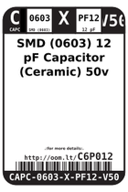
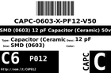
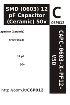

Contents
========

* [C6P12 > SMD (0603) 12 pF Capacitor (Ceramic) 50v](#c6p12--smd-0603-12-pf-capacitor-ceramic-50v)
	* [Datasheets](#datasheets)
	* [Labels](#labels)
	* [EDA](#eda)
	* [Images](#images)
	* [Tags](#tags)
  
![][im]
# C6P12 > SMD (0603) 12 pF Capacitor (Ceramic) 50v

- ID: CAPC-0603-X-PF12-V50
- Hex ID: C6P12
- Name: SMD (0603) 12 pF Capacitor (Ceramic) 50v
- Description: SMD (0603) 12 pF Capacitor (Ceramic) 50v
- Long Link: [http://oom.lt/CAPC-0603-X-PF12-V50](http://oom.lt/CAPC-0603-X-PF12-V50)
- Short Link: [http://oom.lt/C6P12](http://oom.lt/C6P12)

## Datasheets

- Datasheet: [datasheet.pdf](datasheet.pdf)

## Labels
  
  

|label-front|label-inventory|label-spec|
| :---: | :---: | :---: |
||||

## EDA

### Footprints
  

|[  FOOTPRINT-kicad-kicad-footprints-Capacitor_SMD-C_0603_1608Metric](https://github.com/oomlout/oomlout_OOMP_eda/tree/main/FOOTPRINT/kicad/kicad-footprints/Capacitor_SMD/C_0603_1608Metric/)|[  FOOTPRINT-kicad-kicad-footprints-Capacitor_SMD-C_0603_1608Metric_Pad1.08x0.95mm_HandSolder](https://github.com/oomlout/oomlout_OOMP_eda/tree/main/FOOTPRINT/kicad/kicad-footprints/Capacitor_SMD/C_0603_1608Metric_Pad1.08x0.95mm_HandSolder/)|||
| :---: | :---: | :---: | :---: |

### Symbols
  

|[  SYMBOL-kicad-kicad-symbols-Device-C](https://github.com/oomlout/oomlout_OOMP_eda/tree/main/SYMBOL/kicad/kicad-symbols/Device/C/)||||
| :---: | :---: | :---: | :---: |
  

### Instances
  
Used 4 times.  
Prevalance: (4\10986) 0.0364%  

|Project|Occur- rences|Identifiers|
| :---: | :---: | :---: |
|[PROJ-ADAF-5100-STAN-01 Adafruit MacroPad RP2040 PCB](https://github.com/oomlout/oomlout_OOMP_projects/tree/main/PROJ-ADAF-5100-STAN-01/)|[2](https://github.com/oomlout/oomlout_OOMP_projects/tree/main/PROJ-ADAF-5100-STAN-01/)|[C19, C20](https://github.com/oomlout/oomlout_OOMP_projects/tree/main/PROJ-ADAF-5100-STAN-01/)|
|[PROJ-SPAR-13810-STAN-01 tsunami](https://github.com/oomlout/oomlout_OOMP_projects/tree/main/PROJ-SPAR-13810-STAN-01/)|[2](https://github.com/oomlout/oomlout_OOMP_projects/tree/main/PROJ-SPAR-13810-STAN-01/)|[C7, C9](https://github.com/oomlout/oomlout_OOMP_projects/tree/main/PROJ-SPAR-13810-STAN-01/)|

## Images
  
  

|image|label-front|label-inventory|label-spec|
| :---: | :---: | :---: | :---: |
|||||

## Tags

- oompType: CAPC
- oompSize: 0603
- oompColor: X
- oompDesc: PF12
- oompIndex: V50
- oplPartNumber: {'code': 'C-JLCC', 'name': 'JLC Parts Library', 'partID': 'C38523', 'desc': '50V 12pF C0G ??5% 0603  Multilayer Ceramic Capacitors MLCC - SMD/SMT ROHS'}
- distributorPartNumber: {'code': 'C-LCSC', 'name': 'LCSC', 'partID': 'C38523'}
- manufacturerPartNumber: {'code': 'C-XXXX', 'name': 'Samsung Electro-Mechanics', 'partID': 'CL10C120JB8NNNC'}
- hexID: C6P12
- oompID: CAPC-0603-X-PF12-V50
- oompInstances: {'PROJECT': 'PROJ-ADAF-5100-STAN-01', 'ID': 'C19'}
- oompInstances: {'PROJECT': 'PROJ-ADAF-5100-STAN-01', 'ID': 'C20'}
- oompInstances: {'PROJECT': 'PROJ-SPAR-13810-STAN-01', 'ID': 'C7'}
- oompInstances: {'PROJECT': 'PROJ-SPAR-13810-STAN-01', 'ID': 'C9'}
- footprintKicad: FOOTPRINT-kicad-kicad-footprints-Capacitor_SMD-C_0603_1608Metric
- footprintKicad: FOOTPRINT-kicad-kicad-footprints-Capacitor_SMD-C_0603_1608Metric_Pad1.08x0.95mm_HandSolder
- symbolKicad: SYMBOL-kicad-kicad-symbols-Device-C

[im]: image_450.jpg
