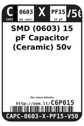
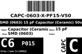
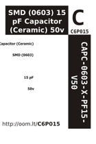

Contents
========

* [C6P015 > SMD (0603) 15 pF Capacitor (Ceramic) 50v](#c6p015--smd-0603-15-pf-capacitor-ceramic-50v)
	* [Datasheets](#datasheets)
	* [Labels](#labels)
	* [EDA](#eda)
	* [Images](#images)
	* [Tags](#tags)
  
![][im]
# C6P015 > SMD (0603) 15 pF Capacitor (Ceramic) 50v

- ID: CAPC-0603-X-PF15-V50
- Hex ID: C6P015
- Name: SMD (0603) 15 pF Capacitor (Ceramic) 50v
- Description: SMD (0603) 15 pF Capacitor (Ceramic) 50v
- Long Link: [http://oom.lt/CAPC-0603-X-PF15-V50](http://oom.lt/CAPC-0603-X-PF15-V50)
- Short Link: [http://oom.lt/C6P015](http://oom.lt/C6P015)

## Datasheets

- Datasheet: [datasheet.pdf](datasheet.pdf)

## Labels
  
  

|label-front|label-inventory|label-spec|
| :---: | :---: | :---: |
||||

## EDA

### Instances
  
  
Used 18 times.  
Prevalance: (18\10986) 0.1638%  

|OOMP Instances|
| :---: |
|[PROJ-SPAR-11924-STAN-01  Purpletooth Jamboree  Used 2 times. C18, C19](https://github.com/oomlout/oomlout_OOMP_projects/tree/main/PROJ-SPAR-11924-STAN-01/)|
|[PROJ-SPAR-13672-STAN-01  SAMD21 Dev Breakout  Used 2 times. C7, C9](https://github.com/oomlout/oomlout_OOMP_projects/tree/main/PROJ-SPAR-13672-STAN-01/)|
|[PROJ-SPAR-14001-STAN-01  9DOF Razor IMU  Used 2 times. C10, C12](https://github.com/oomlout/oomlout_OOMP_projects/tree/main/PROJ-SPAR-14001-STAN-01/)|
|[PROJ-SPAR-14051-STAN-01  Wireless Joystick  Used 2 times. C9, C10](https://github.com/oomlout/oomlout_OOMP_projects/tree/main/PROJ-SPAR-14051-STAN-01/)|
|[PROJ-SPAR-14063-STAN-01  LilyPad LilyMini ProtoSnap  Used 2 times. C1, C2](https://github.com/oomlout/oomlout_OOMP_projects/tree/main/PROJ-SPAR-14063-STAN-01/)|
|[PROJ-SPAR-14779-STAN-01  LumiDrive  Used 2 times. C15, C16](https://github.com/oomlout/oomlout_OOMP_projects/tree/main/PROJ-SPAR-14779-STAN-01/)|
|[PROJ-SPAR-14812-STAN-01  RedBoard Turbo  Used 2 times. C7, C9](https://github.com/oomlout/oomlout_OOMP_projects/tree/main/PROJ-SPAR-14812-STAN-01/)|
|[PROJ-SPAR-14916-STAN-01  SAMD21 Pro RF  Used 2 times. C2, C3](https://github.com/oomlout/oomlout_OOMP_projects/tree/main/PROJ-SPAR-14916-STAN-01/)|
|[PROJ-SPAR-14997-STAN-01  LTE Cat M1 Shield  Used 2 times. C10, C15](https://github.com/oomlout/oomlout_OOMP_projects/tree/main/PROJ-SPAR-14997-STAN-01/)|

### Symbols

## Images
  
  

|image|label-front|label-inventory|label-spec|
| :---: | :---: | :---: | :---: |
|||||

## Tags

- oompID: CAPC-0603-X-PF15-V50
- name: SMD (0603) 15 pF Capacitor (Ceramic) 50v
- hexID: C6P015
- oompSort: 
- oompType: CAPC
- oompSize: 0603
- oompColor: X
- oompDesc: PF15
- oompIndex: V50
- oompVersion: 99
- oompClass: Surface Mount
- oompClassCode: SMDS
- ooWidth: 0.8 mm
- ooLength: 1.6 mm
- ooNumPins: 2
- oompBbls: template;XXXX-0603-X-XXXX-XX-bbls
- oompDiag: template;XXXX-0603-X-XXXX-XX-diag
- oompIden: template;XXXX-0603-X-XXXX-XX-iden
- oompSchem: template;CAPC-XXXX-X-XXXX-XX-schem
- oompSimp: template;XXXX-0603-X-XXXX-XX-simp
- ooDesignator: C1
- oompInstances: {'PROJECT': 'PROJ-SPAR-11924-STAN-01', 'ID': 'C18'}
- oompInstances: {'PROJECT': 'PROJ-SPAR-11924-STAN-01', 'ID': 'C19'}
- oompInstances: {'PROJECT': 'PROJ-SPAR-13672-STAN-01', 'ID': 'C7'}
- oompInstances: {'PROJECT': 'PROJ-SPAR-13672-STAN-01', 'ID': 'C9'}
- oompInstances: {'PROJECT': 'PROJ-SPAR-14001-STAN-01', 'ID': 'C10'}
- oompInstances: {'PROJECT': 'PROJ-SPAR-14001-STAN-01', 'ID': 'C12'}
- oompInstances: {'PROJECT': 'PROJ-SPAR-14051-STAN-01', 'ID': 'C9'}
- oompInstances: {'PROJECT': 'PROJ-SPAR-14051-STAN-01', 'ID': 'C10'}
- oompInstances: {'PROJECT': 'PROJ-SPAR-14063-STAN-01', 'ID': 'C1'}
- oompInstances: {'PROJECT': 'PROJ-SPAR-14063-STAN-01', 'ID': 'C2'}
- oompInstances: {'PROJECT': 'PROJ-SPAR-14779-STAN-01', 'ID': 'C15'}
- oompInstances: {'PROJECT': 'PROJ-SPAR-14779-STAN-01', 'ID': 'C16'}
- oompInstances: {'PROJECT': 'PROJ-SPAR-14812-STAN-01', 'ID': 'C7'}
- oompInstances: {'PROJECT': 'PROJ-SPAR-14812-STAN-01', 'ID': 'C9'}
- oompInstances: {'PROJECT': 'PROJ-SPAR-14916-STAN-01', 'ID': 'C2'}
- oompInstances: {'PROJECT': 'PROJ-SPAR-14916-STAN-01', 'ID': 'C3'}
- oompInstances: {'PROJECT': 'PROJ-SPAR-14997-STAN-01', 'ID': 'C10'}
- oompInstances: {'PROJECT': 'PROJ-SPAR-14997-STAN-01', 'ID': 'C15'}

[im]: image_450.jpg
