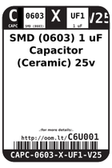
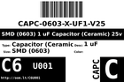
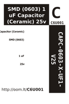
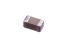

Contents
========

* [C6U001 > SMD (0603) 1 uF Capacitor (Ceramic) 25v](#c6u001--smd-0603-1-uf-capacitor-ceramic-25v)
	* [Datasheets](#datasheets)
	* [Labels](#labels)
	* [EDA](#eda)
	* [Images](#images)
	* [Tags](#tags)
  
![][im]
# C6U001 > SMD (0603) 1 uF Capacitor (Ceramic) 25v

- ID: CAPC-0603-X-UF1-V25
- Hex ID: C6U001
- Name: SMD (0603) 1 uF Capacitor (Ceramic) 25v
- Description: SMD (0603) 1 uF Capacitor (Ceramic) 25v
- Long Link: [http://oom.lt/CAPC-0603-X-UF1-V25](http://oom.lt/CAPC-0603-X-UF1-V25)
- Short Link: [http://oom.lt/C6U001](http://oom.lt/C6U001)

## Datasheets

- Datasheet: [datasheet.pdf](datasheet.pdf)

## Labels
  
  

|label-front|label-inventory|label-spec|
| :---: | :---: | :---: |
||||

## EDA

### Symbols

## Images
  
  

|image|image_RE|label-front|label-inventory|label-spec|
| :---: | :---: | :---: | :---: | :---: |
||||||

## Tags

- oompID: CAPC-0603-X-UF1-V25
- name: SMD (0603) 1 uF Capacitor (Ceramic) 25v
- hexID: C6U001
- oompType: CAPC
- oompSize: 0603
- oompColor: X
- oompDesc: UF1
- oompIndex: V25
- oompVersion: 999
- ooWidth: 0.8mm
- ooHeight: 0.8mm
- ooLength: 1.6mm
- oompBbls: template;XXXX-0603-X-XXXX-XX-bbls
- oompDiag: template;XXXX-0603-X-XXXX-XX-diag
- oompIden: template;XXXX-0603-X-XXXX-XX-iden
- oompSchem: template;CAPC-XXXX-X-XXXX-XX-schem
- oompSimp: template;XXXX-0603-X-XXXX-XX-simp
- ooDesignator: C1

[im]: image_450.jpg
