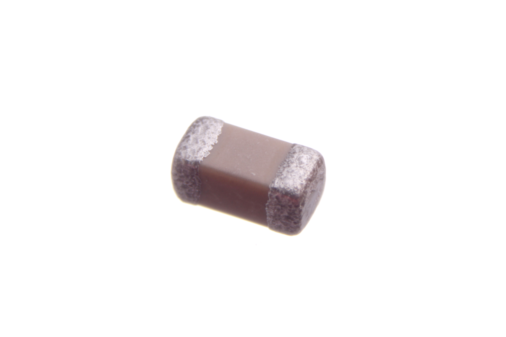
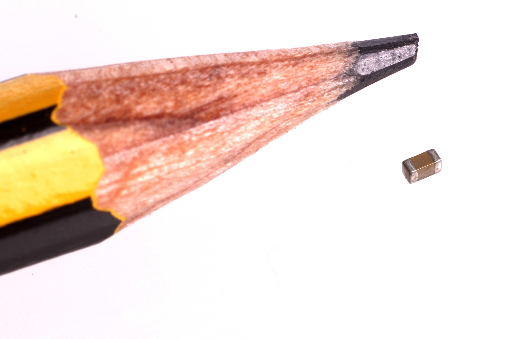

Contents
========

* [CAPC-0603-X-UF10-V10>SMD (0603) 10 uF Capacitor (Ceramic) 10v](#capc-0603-x-uf10-v10smd-0603-10-uf-capacitor-ceramic-10v)
	* [Images](#images)
	* [Datasheets](#datasheets)
	* [EDA](#eda)
		* [Footprints](#footprints)
		* [Symbols](#symbols)
	* [Tags](#tags)

# CAPC-0603-X-UF10-V10>SMD (0603) 10 uF Capacitor (Ceramic) 10v

- ID: CAPC-0603-X-UF10-V10
- Name: CAPC-0603-X-UF10-V10

## Images
  
  

|Main|Reference|
| :---: | :---: |
|||

## Datasheets

- Datasheet: [datasheet.pdf](datasheet.pdf)

## EDA

### Footprints
  

|||||
| :---: | :---: | :---: | :---: |

### Symbols

## Tags

- index: 74
- oompID: CAPC-0603-X-UF10-V10
- name: SMD (0603) 10 uF Capacitor (Ceramic) 10v
- hexID: C6U010
- oompType: CAPC
- oompSize: 0603
- oompColor: X
- oompDesc: UF10
- oompIndex: V10
- oompVersion: 999
- ooWidth: 0.8mm
- ooHeight: 0.8mm
- ooLength: 1.6mm
- oompBbls: template;XXXX-0603-X-XXXX-XX-bbls
- oompDiag: template;XXXX-0603-X-XXXX-XX-diag
- oompIden: template;XXXX-0603-X-XXXX-XX-iden
- oompSchem: template;CAPC-XXXX-X-XXXX-XX-schem
- oompSimp: template;XXXX-0603-X-XXXX-XX-simp
- ooDesignator: C1
