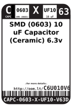
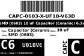
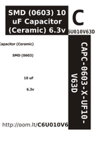
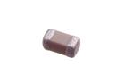

Contents
========

* [C6U010V63D > SMD (0603) 10 uF Capacitor (Ceramic) 6.3v](#c6u010v63d--smd-0603-10-uf-capacitor-ceramic-63v)
	* [Datasheets](#datasheets)
	* [Labels](#labels)
	* [EDA](#eda)
	* [Images](#images)
	* [Tags](#tags)
  
![][im]
# C6U010V63D > SMD (0603) 10 uF Capacitor (Ceramic) 6.3v

- ID: CAPC-0603-X-UF10-V63D
- Hex ID: C6U010V63D
- Name: SMD (0603) 10 uF Capacitor (Ceramic) 6.3v
- Description: SMD (0603) 10 uF Capacitor (Ceramic) 6.3v
- Long Link: [http://oom.lt/CAPC-0603-X-UF10-V63D](http://oom.lt/CAPC-0603-X-UF10-V63D)
- Short Link: [http://oom.lt/C6U010V63D](http://oom.lt/C6U010V63D)

## Datasheets

- Datasheet: [datasheet.pdf](datasheet.pdf)

## Labels
  
  

|label-front|label-inventory|label-spec|
| :---: | :---: | :---: |
||||

## EDA
  

### Instances
  
Used 38 times.  
Prevalance: (38\10986) 0.3459%  

|OOMP Instances|
| :---: |
|[PROJ-SPAR-12000-STAN-01  WAV Trigger  Used 1 times. C27](https://github.com/oomlout/oomlout_OOMP_projects/tree/main/PROJ-SPAR-12000-STAN-01/)|
|[PROJ-SPAR-12761-STAN-01  microSD Shield  Used 1 times. C3](https://github.com/oomlout/oomlout_OOMP_projects/tree/main/PROJ-SPAR-12761-STAN-01/)|
|[PROJ-SPAR-13284-STAN-01  LSM9DS1 Breakout  Used 1 times. C4](https://github.com/oomlout/oomlout_OOMP_projects/tree/main/PROJ-SPAR-13284-STAN-01/)|
|[PROJ-SPAR-13287-STAN-01  ESP8266 WiFi Shield  Used 1 times. C1](https://github.com/oomlout/oomlout_OOMP_projects/tree/main/PROJ-SPAR-13287-STAN-01/)|
|[PROJ-SPAR-13321-STAN-01  Photon RedBoard  Used 4 times. C5, C7, C10, C11](https://github.com/oomlout/oomlout_OOMP_projects/tree/main/PROJ-SPAR-13321-STAN-01/)|
|[PROJ-SPAR-13629-STAN-01  Photon IMU Shield  Used 1 times. C4](https://github.com/oomlout/oomlout_OOMP_projects/tree/main/PROJ-SPAR-13629-STAN-01/)|
|[PROJ-SPAR-13711-STAN-01  ESP8266 Thing Dev 4H  Used 1 times. C1](https://github.com/oomlout/oomlout_OOMP_projects/tree/main/PROJ-SPAR-13711-STAN-01/)|
|[PROJ-SPAR-13712-STAN-01  OpenLog  Used 1 times. C1](https://github.com/oomlout/oomlout_OOMP_projects/tree/main/PROJ-SPAR-13712-STAN-01/)|
|[PROJ-SPAR-13720-STAN-01  MP3 Trigger  Used 2 times. C15, C16](https://github.com/oomlout/oomlout_OOMP_projects/tree/main/PROJ-SPAR-13720-STAN-01/)|
|[PROJ-SPAR-13794-STAN-01  Blynk Board ESP8266  Used 1 times. C1](https://github.com/oomlout/oomlout_OOMP_projects/tree/main/PROJ-SPAR-13794-STAN-01/)|
|[PROJ-SPAR-13810-STAN-01  tsunami  Used 5 times. C2, C5, C6, C11, C27](https://github.com/oomlout/oomlout_OOMP_projects/tree/main/PROJ-SPAR-13810-STAN-01/)|
|[PROJ-SPAR-13944-STAN-01  9DOF Sensor Stick  Used 1 times. C1](https://github.com/oomlout/oomlout_OOMP_projects/tree/main/PROJ-SPAR-13944-STAN-01/)|
|[PROJ-SPAR-13963-STAN-01  LIS3DH Breakout  Used 1 times. C2](https://github.com/oomlout/oomlout_OOMP_projects/tree/main/PROJ-SPAR-13963-STAN-01/)|
|[PROJ-SPAR-14006-STAN-01  Lil Soundie Audio Player  Used 4 times. C3, C13, C14, C17](https://github.com/oomlout/oomlout_OOMP_projects/tree/main/PROJ-SPAR-14006-STAN-01/)|
|[PROJ-SPAR-14051-STAN-01  Wireless Joystick  Used 1 times. C6](https://github.com/oomlout/oomlout_OOMP_projects/tree/main/PROJ-SPAR-14051-STAN-01/)|
|[PROJ-SPAR-14347-STAN-01  Qwiic Spectral Sensor AS726X  Used 1 times. C3](https://github.com/oomlout/oomlout_OOMP_projects/tree/main/PROJ-SPAR-14347-STAN-01/)|
|[PROJ-SPAR-14430-STAN-01  ESP32 Motion Shield  Used 1 times. C8](https://github.com/oomlout/oomlout_OOMP_projects/tree/main/PROJ-SPAR-14430-STAN-01/)|
|[PROJ-SPAR-14531-STAN-01  Pioneer IoT Kit Shield  Used 1 times. C6](https://github.com/oomlout/oomlout_OOMP_projects/tree/main/PROJ-SPAR-14531-STAN-01/)|
|[PROJ-SPAR-14554-STAN-01  Papa Soundie Audio Player  Used 6 times. C3, C4, C5, C9, C10, C13](https://github.com/oomlout/oomlout_OOMP_projects/tree/main/PROJ-SPAR-14554-STAN-01/)|
|[PROJ-SPAR-14607-STAN-01  Qwiic GRIDEye  Used 1 times. C3](https://github.com/oomlout/oomlout_OOMP_projects/tree/main/PROJ-SPAR-14607-STAN-01/)|
|[PROJ-SPAR-14765-STAN-01  Single Supply Logic Level Converter  Used 1 times. C6](https://github.com/oomlout/oomlout_OOMP_projects/tree/main/PROJ-SPAR-14765-STAN-01/)|
|[PROJ-SPAR-15006-STAN-01  ESP32 LoRa 1Ch Gateway  Used 1 times. C5](https://github.com/oomlout/oomlout_OOMP_projects/tree/main/PROJ-SPAR-15006-STAN-01/)|

## Images
  
  

|image|image_RE|label-front|label-inventory|label-spec|
| :---: | :---: | :---: | :---: | :---: |
||||||

## Tags

- oompID: CAPC-0603-X-UF10-V63D
- name: SMD (0603) 10 uF Capacitor (Ceramic) 6.3v
- hexID: C6U010V63D
- oompType: CAPC
- oompSize: 0603
- oompColor: X
- oompDesc: UF10
- oompIndex: V63D
- oompVersion: 999
- ooWidth: 0.8mm
- ooHeight: 0.8mm
- ooLength: 1.6mm
- oompBbls: template;XXXX-0603-X-XXXX-XX-bbls
- oompDiag: template;XXXX-0603-X-XXXX-XX-diag
- oompIden: template;XXXX-0603-X-XXXX-XX-iden
- oompSchem: template;CAPC-XXXX-X-XXXX-XX-schem
- oompSimp: template;XXXX-0603-X-XXXX-XX-simp
- ooDesignator: C1
- oompInstances: {'PROJECT': 'PROJ-SPAR-12000-STAN-01', 'ID': 'C27'}
- oompInstances: {'PROJECT': 'PROJ-SPAR-12761-STAN-01', 'ID': 'C3'}
- oompInstances: {'PROJECT': 'PROJ-SPAR-13284-STAN-01', 'ID': 'C4'}
- oompInstances: {'PROJECT': 'PROJ-SPAR-13287-STAN-01', 'ID': 'C1'}
- oompInstances: {'PROJECT': 'PROJ-SPAR-13321-STAN-01', 'ID': 'C5'}
- oompInstances: {'PROJECT': 'PROJ-SPAR-13321-STAN-01', 'ID': 'C7'}
- oompInstances: {'PROJECT': 'PROJ-SPAR-13321-STAN-01', 'ID': 'C10'}
- oompInstances: {'PROJECT': 'PROJ-SPAR-13321-STAN-01', 'ID': 'C11'}
- oompInstances: {'PROJECT': 'PROJ-SPAR-13629-STAN-01', 'ID': 'C4'}
- oompInstances: {'PROJECT': 'PROJ-SPAR-13711-STAN-01', 'ID': 'C1'}
- oompInstances: {'PROJECT': 'PROJ-SPAR-13712-STAN-01', 'ID': 'C1'}
- oompInstances: {'PROJECT': 'PROJ-SPAR-13720-STAN-01', 'ID': 'C15'}
- oompInstances: {'PROJECT': 'PROJ-SPAR-13720-STAN-01', 'ID': 'C16'}
- oompInstances: {'PROJECT': 'PROJ-SPAR-13794-STAN-01', 'ID': 'C1'}
- oompInstances: {'PROJECT': 'PROJ-SPAR-13810-STAN-01', 'ID': 'C2'}
- oompInstances: {'PROJECT': 'PROJ-SPAR-13810-STAN-01', 'ID': 'C5'}
- oompInstances: {'PROJECT': 'PROJ-SPAR-13810-STAN-01', 'ID': 'C6'}
- oompInstances: {'PROJECT': 'PROJ-SPAR-13810-STAN-01', 'ID': 'C11'}
- oompInstances: {'PROJECT': 'PROJ-SPAR-13810-STAN-01', 'ID': 'C27'}
- oompInstances: {'PROJECT': 'PROJ-SPAR-13944-STAN-01', 'ID': 'C1'}
- oompInstances: {'PROJECT': 'PROJ-SPAR-13963-STAN-01', 'ID': 'C2'}
- oompInstances: {'PROJECT': 'PROJ-SPAR-14006-STAN-01', 'ID': 'C3'}
- oompInstances: {'PROJECT': 'PROJ-SPAR-14006-STAN-01', 'ID': 'C13'}
- oompInstances: {'PROJECT': 'PROJ-SPAR-14006-STAN-01', 'ID': 'C14'}
- oompInstances: {'PROJECT': 'PROJ-SPAR-14006-STAN-01', 'ID': 'C17'}
- oompInstances: {'PROJECT': 'PROJ-SPAR-14051-STAN-01', 'ID': 'C6'}
- oompInstances: {'PROJECT': 'PROJ-SPAR-14347-STAN-01', 'ID': 'C3'}
- oompInstances: {'PROJECT': 'PROJ-SPAR-14430-STAN-01', 'ID': 'C8'}
- oompInstances: {'PROJECT': 'PROJ-SPAR-14531-STAN-01', 'ID': 'C6'}
- oompInstances: {'PROJECT': 'PROJ-SPAR-14554-STAN-01', 'ID': 'C3'}
- oompInstances: {'PROJECT': 'PROJ-SPAR-14554-STAN-01', 'ID': 'C4'}
- oompInstances: {'PROJECT': 'PROJ-SPAR-14554-STAN-01', 'ID': 'C5'}
- oompInstances: {'PROJECT': 'PROJ-SPAR-14554-STAN-01', 'ID': 'C9'}
- oompInstances: {'PROJECT': 'PROJ-SPAR-14554-STAN-01', 'ID': 'C10'}
- oompInstances: {'PROJECT': 'PROJ-SPAR-14554-STAN-01', 'ID': 'C13'}
- oompInstances: {'PROJECT': 'PROJ-SPAR-14607-STAN-01', 'ID': 'C3'}
- oompInstances: {'PROJECT': 'PROJ-SPAR-14765-STAN-01', 'ID': 'C6'}
- oompInstances: {'PROJECT': 'PROJ-SPAR-15006-STAN-01', 'ID': 'C5'}

[im]: image_450.jpg
