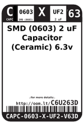
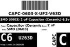
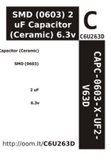

Contents
========

* [C6U263D > SMD (0603) 2 uF Capacitor (Ceramic) 6.3v](#c6u263d--smd-0603-2-uf-capacitor-ceramic-63v)
	* [Labels](#labels)
	* [EDA](#eda)
	* [Images](#images)
	* [Tags](#tags)

# C6U263D > SMD (0603) 2 uF Capacitor (Ceramic) 6.3v

- ID: CAPC-0603-X-UF2-V63D
- Hex ID: C6U263D
- Name: SMD (0603) 2 uF Capacitor (Ceramic) 6.3v
- Description: SMD (0603) 2 uF Capacitor (Ceramic) 6.3v
- Long Link: [http://oom.lt/CAPC-0603-X-UF2-V63D](http://oom.lt/CAPC-0603-X-UF2-V63D)
- Short Link: [http://oom.lt/C6U263D](http://oom.lt/C6U263D)

## Labels
  
  

|label-front|label-inventory|label-spec|
| :---: | :---: | :---: |
||||

## EDA

### Footprints
  

|[  FOOTPRINT-kicad-kicad-footprints-Capacitor_SMD-C_0603_1608Metric](https://github.com/oomlout/oomlout_OOMP_eda/tree/main/FOOTPRINT/kicad/kicad-footprints/Capacitor_SMD/C_0603_1608Metric/)|[  FOOTPRINT-kicad-kicad-footprints-Capacitor_SMD-C_0603_1608Metric_Pad1.08x0.95mm_HandSolder](https://github.com/oomlout/oomlout_OOMP_eda/tree/main/FOOTPRINT/kicad/kicad-footprints/Capacitor_SMD/C_0603_1608Metric_Pad1.08x0.95mm_HandSolder/)|||
| :---: | :---: | :---: | :---: |

### Symbols
  

|[  SYMBOL-kicad-kicad-symbols-Device-C](https://github.com/oomlout/oomlout_OOMP_eda/tree/main/SYMBOL/kicad/kicad-symbols/Device/C/)||||
| :---: | :---: | :---: | :---: |

## Images
  
  

|label-front|label-inventory|label-spec|
| :---: | :---: | :---: |
||||

## Tags

- oompType: CAPC
- oompSize: 0603
- oompColor: X
- oompDesc: UF2
- oompIndex: V63D
- oplPartNumber: {'code': 'C-JLCC', 'name': 'JLC Parts Library', 'partID': 'C59461', 'desc': '6.3V 22uF X5R ??20% 0603  Multilayer Ceramic Capacitors MLCC - SMD/SMT ROHS'}
- distributorPartNumber: {'code': 'C-LCSC', 'name': 'LCSC', 'partID': 'C59461'}
- manufacturerPartNumber: {'code': 'C-XXXX', 'name': 'Samsung Electro-Mechanics', 'partID': 'CL10A226MQ8NRNC'}
- hexID: C6U263D
- oompID: CAPC-0603-X-UF2-V63D
- symbolKicad: SYMBOL-kicad-kicad-symbols-Device-C
- footprintKicad: FOOTPRINT-kicad-kicad-footprints-Capacitor_SMD-C_0603_1608Metric
- footprintKicad: FOOTPRINT-kicad-kicad-footprints-Capacitor_SMD-C_0603_1608Metric_Pad1.08x0.95mm_HandSolder
