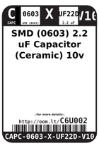
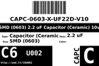
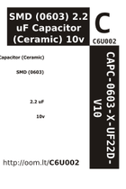

Contents
========

* [C6U002 > SMD (0603) 2.2 uF Capacitor (Ceramic) 10v](#c6u002--smd-0603-22-uf-capacitor-ceramic-10v)
	* [Datasheets](#datasheets)
	* [Labels](#labels)
	* [EDA](#eda)
	* [Images](#images)
	* [Tags](#tags)
  
![][im]
# C6U002 > SMD (0603) 2.2 uF Capacitor (Ceramic) 10v

- ID: CAPC-0603-X-UF22D-V10
- Hex ID: C6U002
- Name: SMD (0603) 2.2 uF Capacitor (Ceramic) 10v
- Description: SMD (0603) 2.2 uF Capacitor (Ceramic) 10v
- Long Link: [http://oom.lt/CAPC-0603-X-UF22D-V10](http://oom.lt/CAPC-0603-X-UF22D-V10)
- Short Link: [http://oom.lt/C6U002](http://oom.lt/C6U002)

## Datasheets

- Datasheet: [datasheet.pdf](datasheet.pdf)

## Labels
  
  

|label-front|label-inventory|label-spec|
| :---: | :---: | :---: |
||||

## EDA

### Footprints
  

|[  FOOTPRINT-kicad-kicad-footprints-Capacitor_SMD-C_0603_1608Metric](https://github.com/oomlout/oomlout_OOMP_eda/tree/main/FOOTPRINT/kicad/kicad-footprints/Capacitor_SMD/C_0603_1608Metric/)|[  FOOTPRINT-kicad-kicad-footprints-Capacitor_SMD-C_0603_1608Metric_Pad1.08x0.95mm_HandSolder](https://github.com/oomlout/oomlout_OOMP_eda/tree/main/FOOTPRINT/kicad/kicad-footprints/Capacitor_SMD/C_0603_1608Metric_Pad1.08x0.95mm_HandSolder/)|||
| :---: | :---: | :---: | :---: |

### Symbols
  

|[  SYMBOL-kicad-kicad-symbols-Device-C](https://github.com/oomlout/oomlout_OOMP_eda/tree/main/SYMBOL/kicad/kicad-symbols/Device/C/)||||
| :---: | :---: | :---: | :---: |
  

### Instances
  
Used 29 times.  
Prevalance: (29\10986) 0.264%  

|Project|Occur- rences|Identifiers|
| :---: | :---: | :---: |
|[PROJ-SPAR-12000-STAN-01 WAV Trigger](https://github.com/oomlout/oomlout_OOMP_projects/tree/main/PROJ-SPAR-12000-STAN-01/)|[4](https://github.com/oomlout/oomlout_OOMP_projects/tree/main/PROJ-SPAR-12000-STAN-01/)|[C14, C20, C24, C25](https://github.com/oomlout/oomlout_OOMP_projects/tree/main/PROJ-SPAR-12000-STAN-01/)|
|[PROJ-SPAR-13019-STAN-01 BLE Mate2](https://github.com/oomlout/oomlout_OOMP_projects/tree/main/PROJ-SPAR-13019-STAN-01/)|[1](https://github.com/oomlout/oomlout_OOMP_projects/tree/main/PROJ-SPAR-13019-STAN-01/)|[C2](https://github.com/oomlout/oomlout_OOMP_projects/tree/main/PROJ-SPAR-13019-STAN-01/)|
|[PROJ-SPAR-13287-STAN-01 ESP8266 WiFi Shield](https://github.com/oomlout/oomlout_OOMP_projects/tree/main/PROJ-SPAR-13287-STAN-01/)|[1](https://github.com/oomlout/oomlout_OOMP_projects/tree/main/PROJ-SPAR-13287-STAN-01/)|[C6](https://github.com/oomlout/oomlout_OOMP_projects/tree/main/PROJ-SPAR-13287-STAN-01/)|
|[PROJ-SPAR-13582-STAN-01 Line Follower Array](https://github.com/oomlout/oomlout_OOMP_projects/tree/main/PROJ-SPAR-13582-STAN-01/)|[2](https://github.com/oomlout/oomlout_OOMP_projects/tree/main/PROJ-SPAR-13582-STAN-01/)|[C4, C7](https://github.com/oomlout/oomlout_OOMP_projects/tree/main/PROJ-SPAR-13582-STAN-01/)|
|[PROJ-SPAR-13614-STAN-01 Qduino Mini SFE](https://github.com/oomlout/oomlout_OOMP_projects/tree/main/PROJ-SPAR-13614-STAN-01/)|[1](https://github.com/oomlout/oomlout_OOMP_projects/tree/main/PROJ-SPAR-13614-STAN-01/)|[C7](https://github.com/oomlout/oomlout_OOMP_projects/tree/main/PROJ-SPAR-13614-STAN-01/)|
|[PROJ-SPAR-13633-STAN-01 SparkFun LilyPad Simblee](https://github.com/oomlout/oomlout_OOMP_projects/tree/main/PROJ-SPAR-13633-STAN-01/)|[1](https://github.com/oomlout/oomlout_OOMP_projects/tree/main/PROJ-SPAR-13633-STAN-01/)|[C2](https://github.com/oomlout/oomlout_OOMP_projects/tree/main/PROJ-SPAR-13633-STAN-01/)|
|[PROJ-SPAR-13664-STAN-01 SAMD21 Mini Breakout](https://github.com/oomlout/oomlout_OOMP_projects/tree/main/PROJ-SPAR-13664-STAN-01/)|[1](https://github.com/oomlout/oomlout_OOMP_projects/tree/main/PROJ-SPAR-13664-STAN-01/)|[C8](https://github.com/oomlout/oomlout_OOMP_projects/tree/main/PROJ-SPAR-13664-STAN-01/)|
|[PROJ-SPAR-13672-STAN-01 SAMD21 Dev Breakout](https://github.com/oomlout/oomlout_OOMP_projects/tree/main/PROJ-SPAR-13672-STAN-01/)|[1](https://github.com/oomlout/oomlout_OOMP_projects/tree/main/PROJ-SPAR-13672-STAN-01/)|[C5](https://github.com/oomlout/oomlout_OOMP_projects/tree/main/PROJ-SPAR-13672-STAN-01/)|
|[PROJ-SPAR-13711-STAN-01 ESP8266 Thing Dev 4H](https://github.com/oomlout/oomlout_OOMP_projects/tree/main/PROJ-SPAR-13711-STAN-01/)|[1](https://github.com/oomlout/oomlout_OOMP_projects/tree/main/PROJ-SPAR-13711-STAN-01/)|[C6](https://github.com/oomlout/oomlout_OOMP_projects/tree/main/PROJ-SPAR-13711-STAN-01/)|
|[PROJ-SPAR-13794-STAN-01 Blynk Board ESP8266](https://github.com/oomlout/oomlout_OOMP_projects/tree/main/PROJ-SPAR-13794-STAN-01/)|[1](https://github.com/oomlout/oomlout_OOMP_projects/tree/main/PROJ-SPAR-13794-STAN-01/)|[C10](https://github.com/oomlout/oomlout_OOMP_projects/tree/main/PROJ-SPAR-13794-STAN-01/)|
|[PROJ-SPAR-13810-STAN-01 tsunami](https://github.com/oomlout/oomlout_OOMP_projects/tree/main/PROJ-SPAR-13810-STAN-01/)|[1](https://github.com/oomlout/oomlout_OOMP_projects/tree/main/PROJ-SPAR-13810-STAN-01/)|[C25](https://github.com/oomlout/oomlout_OOMP_projects/tree/main/PROJ-SPAR-13810-STAN-01/)|
|[PROJ-SPAR-13830-STAN-01 USB UART Serial Breakout-CY7C65213](https://github.com/oomlout/oomlout_OOMP_projects/tree/main/PROJ-SPAR-13830-STAN-01/)|[1](https://github.com/oomlout/oomlout_OOMP_projects/tree/main/PROJ-SPAR-13830-STAN-01/)|[C1](https://github.com/oomlout/oomlout_OOMP_projects/tree/main/PROJ-SPAR-13830-STAN-01/)|
|[PROJ-SPAR-13990-STAN-01 nRF52832 Breakout](https://github.com/oomlout/oomlout_OOMP_projects/tree/main/PROJ-SPAR-13990-STAN-01/)|[1](https://github.com/oomlout/oomlout_OOMP_projects/tree/main/PROJ-SPAR-13990-STAN-01/)|[C2](https://github.com/oomlout/oomlout_OOMP_projects/tree/main/PROJ-SPAR-13990-STAN-01/)|
|[PROJ-SPAR-14001-STAN-01 9DOF Razor IMU](https://github.com/oomlout/oomlout_OOMP_projects/tree/main/PROJ-SPAR-14001-STAN-01/)|[1](https://github.com/oomlout/oomlout_OOMP_projects/tree/main/PROJ-SPAR-14001-STAN-01/)|[C2](https://github.com/oomlout/oomlout_OOMP_projects/tree/main/PROJ-SPAR-14001-STAN-01/)|
|[PROJ-SPAR-14030-STAN-01 Mini GPS Shield](https://github.com/oomlout/oomlout_OOMP_projects/tree/main/PROJ-SPAR-14030-STAN-01/)|[1](https://github.com/oomlout/oomlout_OOMP_projects/tree/main/PROJ-SPAR-14030-STAN-01/)|[C6](https://github.com/oomlout/oomlout_OOMP_projects/tree/main/PROJ-SPAR-14030-STAN-01/)|
|[PROJ-SPAR-14051-STAN-01 Wireless Joystick](https://github.com/oomlout/oomlout_OOMP_projects/tree/main/PROJ-SPAR-14051-STAN-01/)|[1](https://github.com/oomlout/oomlout_OOMP_projects/tree/main/PROJ-SPAR-14051-STAN-01/)|[C2](https://github.com/oomlout/oomlout_OOMP_projects/tree/main/PROJ-SPAR-14051-STAN-01/)|
|[PROJ-SPAR-14130-STAN-01 Roshamglo](https://github.com/oomlout/oomlout_OOMP_projects/tree/main/PROJ-SPAR-14130-STAN-01/)|[1](https://github.com/oomlout/oomlout_OOMP_projects/tree/main/PROJ-SPAR-14130-STAN-01/)|[C6](https://github.com/oomlout/oomlout_OOMP_projects/tree/main/PROJ-SPAR-14130-STAN-01/)|
|[PROJ-SPAR-14554-STAN-01 Papa Soundie Audio Player](https://github.com/oomlout/oomlout_OOMP_projects/tree/main/PROJ-SPAR-14554-STAN-01/)|[1](https://github.com/oomlout/oomlout_OOMP_projects/tree/main/PROJ-SPAR-14554-STAN-01/)|[C14](https://github.com/oomlout/oomlout_OOMP_projects/tree/main/PROJ-SPAR-14554-STAN-01/)|
|[PROJ-SPAR-14606-STAN-01 Flexible Grayscale OLED](https://github.com/oomlout/oomlout_OOMP_projects/tree/main/PROJ-SPAR-14606-STAN-01/)|[1](https://github.com/oomlout/oomlout_OOMP_projects/tree/main/PROJ-SPAR-14606-STAN-01/)|[C9](https://github.com/oomlout/oomlout_OOMP_projects/tree/main/PROJ-SPAR-14606-STAN-01/)|
|[PROJ-SPAR-14607-STAN-01 Qwiic GRIDEye](https://github.com/oomlout/oomlout_OOMP_projects/tree/main/PROJ-SPAR-14607-STAN-01/)|[1](https://github.com/oomlout/oomlout_OOMP_projects/tree/main/PROJ-SPAR-14607-STAN-01/)|[C2](https://github.com/oomlout/oomlout_OOMP_projects/tree/main/PROJ-SPAR-14607-STAN-01/)|
|[PROJ-SPAR-14691-STAN-01 Qwiic Transparent OLED HUD](https://github.com/oomlout/oomlout_OOMP_projects/tree/main/PROJ-SPAR-14691-STAN-01/)|[1](https://github.com/oomlout/oomlout_OOMP_projects/tree/main/PROJ-SPAR-14691-STAN-01/)|[C1](https://github.com/oomlout/oomlout_OOMP_projects/tree/main/PROJ-SPAR-14691-STAN-01/)|
|[PROJ-SPAR-14713-STAN-01 SAMD51 Thing Plus](https://github.com/oomlout/oomlout_OOMP_projects/tree/main/PROJ-SPAR-14713-STAN-01/)|[1](https://github.com/oomlout/oomlout_OOMP_projects/tree/main/PROJ-SPAR-14713-STAN-01/)|[C10](https://github.com/oomlout/oomlout_OOMP_projects/tree/main/PROJ-SPAR-14713-STAN-01/)|
|[PROJ-SPAR-14779-STAN-01 LumiDrive](https://github.com/oomlout/oomlout_OOMP_projects/tree/main/PROJ-SPAR-14779-STAN-01/)|[1](https://github.com/oomlout/oomlout_OOMP_projects/tree/main/PROJ-SPAR-14779-STAN-01/)|[C9](https://github.com/oomlout/oomlout_OOMP_projects/tree/main/PROJ-SPAR-14779-STAN-01/)|
|[PROJ-SPAR-14812-STAN-01 RedBoard Turbo](https://github.com/oomlout/oomlout_OOMP_projects/tree/main/PROJ-SPAR-14812-STAN-01/)|[1](https://github.com/oomlout/oomlout_OOMP_projects/tree/main/PROJ-SPAR-14812-STAN-01/)|[C5](https://github.com/oomlout/oomlout_OOMP_projects/tree/main/PROJ-SPAR-14812-STAN-01/)|
|[PROJ-SPAR-15031-STAN-01 ESP8266 WiFi IR Blaster](https://github.com/oomlout/oomlout_OOMP_projects/tree/main/PROJ-SPAR-15031-STAN-01/)|[1](https://github.com/oomlout/oomlout_OOMP_projects/tree/main/PROJ-SPAR-15031-STAN-01/)|[C4](https://github.com/oomlout/oomlout_OOMP_projects/tree/main/PROJ-SPAR-15031-STAN-01/)|

## Images
  
  

|image|image_RE|label-front|label-inventory|label-spec|
| :---: | :---: | :---: | :---: | :---: |
||||||

## Tags

- oompID: CAPC-0603-X-UF22D-V10
- name: SMD (0603) 2.2 uF Capacitor (Ceramic) 10v
- hexID: C6U002
- oompSort: CAPC0603UF22D
- oompType: CAPC
- oompSize: 0603
- oompColor: X
- oompDesc: UF22D
- oompIndex: V10
- oompVersion: 98
- oompBbls: template;XXXX-0603-X-XXXX-XX-bbls
- oompDiag: template;XXXX-0603-X-XXXX-XX-diag
- oompIden: template;XXXX-0603-X-XXXX-XX-iden
- oompSchem: template;CAPC-XXXX-X-XXXX-XX-schem
- oompSimp: template;XXXX-0603-X-XXXX-XX-simp
- ooDesignator: C1
- oompInstances: {'PROJECT': 'PROJ-SPAR-12000-STAN-01', 'ID': 'C14'}
- oompInstances: {'PROJECT': 'PROJ-SPAR-12000-STAN-01', 'ID': 'C20'}
- oompInstances: {'PROJECT': 'PROJ-SPAR-12000-STAN-01', 'ID': 'C24'}
- oompInstances: {'PROJECT': 'PROJ-SPAR-12000-STAN-01', 'ID': 'C25'}
- oompInstances: {'PROJECT': 'PROJ-SPAR-13019-STAN-01', 'ID': 'C2'}
- oompInstances: {'PROJECT': 'PROJ-SPAR-13287-STAN-01', 'ID': 'C6'}
- oompInstances: {'PROJECT': 'PROJ-SPAR-13582-STAN-01', 'ID': 'C4'}
- oompInstances: {'PROJECT': 'PROJ-SPAR-13582-STAN-01', 'ID': 'C7'}
- oompInstances: {'PROJECT': 'PROJ-SPAR-13614-STAN-01', 'ID': 'C7'}
- oompInstances: {'PROJECT': 'PROJ-SPAR-13633-STAN-01', 'ID': 'C2'}
- oompInstances: {'PROJECT': 'PROJ-SPAR-13664-STAN-01', 'ID': 'C8'}
- oompInstances: {'PROJECT': 'PROJ-SPAR-13672-STAN-01', 'ID': 'C5'}
- oompInstances: {'PROJECT': 'PROJ-SPAR-13711-STAN-01', 'ID': 'C6'}
- oompInstances: {'PROJECT': 'PROJ-SPAR-13794-STAN-01', 'ID': 'C10'}
- oompInstances: {'PROJECT': 'PROJ-SPAR-13810-STAN-01', 'ID': 'C25'}
- oompInstances: {'PROJECT': 'PROJ-SPAR-13830-STAN-01', 'ID': 'C1'}
- oompInstances: {'PROJECT': 'PROJ-SPAR-13990-STAN-01', 'ID': 'C2'}
- oompInstances: {'PROJECT': 'PROJ-SPAR-14001-STAN-01', 'ID': 'C2'}
- oompInstances: {'PROJECT': 'PROJ-SPAR-14030-STAN-01', 'ID': 'C6'}
- oompInstances: {'PROJECT': 'PROJ-SPAR-14051-STAN-01', 'ID': 'C2'}
- oompInstances: {'PROJECT': 'PROJ-SPAR-14130-STAN-01', 'ID': 'C6'}
- oompInstances: {'PROJECT': 'PROJ-SPAR-14554-STAN-01', 'ID': 'C14'}
- oompInstances: {'PROJECT': 'PROJ-SPAR-14606-STAN-01', 'ID': 'C9'}
- oompInstances: {'PROJECT': 'PROJ-SPAR-14607-STAN-01', 'ID': 'C2'}
- oompInstances: {'PROJECT': 'PROJ-SPAR-14691-STAN-01', 'ID': 'C1'}
- oompInstances: {'PROJECT': 'PROJ-SPAR-14713-STAN-01', 'ID': 'C10'}
- oompInstances: {'PROJECT': 'PROJ-SPAR-14779-STAN-01', 'ID': 'C9'}
- oompInstances: {'PROJECT': 'PROJ-SPAR-14812-STAN-01', 'ID': 'C5'}
- oompInstances: {'PROJECT': 'PROJ-SPAR-15031-STAN-01', 'ID': 'C4'}
- symbolKicad: SYMBOL-kicad-kicad-symbols-Device-C
- footprintKicad: FOOTPRINT-kicad-kicad-footprints-Capacitor_SMD-C_0603_1608Metric
- footprintKicad: FOOTPRINT-kicad-kicad-footprints-Capacitor_SMD-C_0603_1608Metric_Pad1.08x0.95mm_HandSolder

[im]: image_450.jpg
