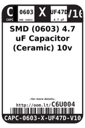
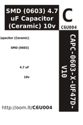
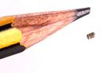

Contents
========

* [C6U004 > SMD (0603) 4.7 uF Capacitor (Ceramic) 10v](#c6u004--smd-0603-47-uf-capacitor-ceramic-10v)
	* [Datasheets](#datasheets)
	* [Labels](#labels)
	* [EDA](#eda)
	* [Images](#images)
	* [Tags](#tags)
  
![][im]
# C6U004 > SMD (0603) 4.7 uF Capacitor (Ceramic) 10v

- ID: CAPC-0603-X-UF47D-V10
- Hex ID: C6U004
- Name: SMD (0603) 4.7 uF Capacitor (Ceramic) 10v
- Description: SMD (0603) 4.7 uF Capacitor (Ceramic) 10v
- Long Link: [http://oom.lt/CAPC-0603-X-UF47D-V10](http://oom.lt/CAPC-0603-X-UF47D-V10)
- Short Link: [http://oom.lt/C6U004](http://oom.lt/C6U004)

## Datasheets

- Datasheet: [datasheet.pdf](datasheet.pdf)

## Labels
  
  

|label-front|label-inventory|label-spec|
| :---: | :---: | :---: |
||||

## EDA
  

### Instances
  
Used 72 times.  
Prevalance: (72\10986) 0.6554%  

|OOMP Instances|
| :---: |
|[PROJ-SPAR-10217-STAN-01  Lipo Charger Basic-microUSB  Used 2 times. C3, C4](https://github.com/oomlout/oomlout_OOMP_projects/tree/main/PROJ-SPAR-10217-STAN-01/)|
|[PROJ-SPAR-10653-STAN-01  Voice Recorder Breakout-ISD1932  Used 1 times. C10](https://github.com/oomlout/oomlout_OOMP_projects/tree/main/PROJ-SPAR-10653-STAN-01/)|
|[PROJ-SPAR-11190-STAN-01  LilyPad Arduino USB  Used 1 times. C6](https://github.com/oomlout/oomlout_OOMP_projects/tree/main/PROJ-SPAR-11190-STAN-01/)|
|[PROJ-SPAR-11520-STAN-01  Fio v3  Used 1 times. C9](https://github.com/oomlout/oomlout_OOMP_projects/tree/main/PROJ-SPAR-11520-STAN-01/)|
|[PROJ-SPAR-11893-STAN-01  LilyPad Simple Power  Used 2 times. C1, C2](https://github.com/oomlout/oomlout_OOMP_projects/tree/main/PROJ-SPAR-11893-STAN-01/)|
|[PROJ-SPAR-11924-STAN-01  Purpletooth Jamboree  Used 1 times. C4](https://github.com/oomlout/oomlout_OOMP_projects/tree/main/PROJ-SPAR-11924-STAN-01/)|
|[PROJ-SPAR-11927-STAN-01  BC127 Breakout Board  Used 1 times. C4](https://github.com/oomlout/oomlout_OOMP_projects/tree/main/PROJ-SPAR-11927-STAN-01/)|
|[PROJ-SPAR-12000-STAN-01  WAV Trigger  Used 1 times. C12](https://github.com/oomlout/oomlout_OOMP_projects/tree/main/PROJ-SPAR-12000-STAN-01/)|
|[PROJ-SPAR-12052-STAN-01  LTC4150 Coulomb Counter BOB  Used 2 times. C1, C2](https://github.com/oomlout/oomlout_OOMP_projects/tree/main/PROJ-SPAR-12052-STAN-01/)|
|[PROJ-SPAR-12589-STAN-01  RedBot Accelerometer  Used 1 times. C2](https://github.com/oomlout/oomlout_OOMP_projects/tree/main/PROJ-SPAR-12589-STAN-01/)|
|[PROJ-SPAR-12636-STAN-01  LSM9DS0 Breakout  Used 1 times. C1](https://github.com/oomlout/oomlout_OOMP_projects/tree/main/PROJ-SPAR-12636-STAN-01/)|
|[PROJ-SPAR-12651-STAN-01  Digital Sandbox  Used 2 times. C2, C5](https://github.com/oomlout/oomlout_OOMP_projects/tree/main/PROJ-SPAR-12651-STAN-01/)|
|[PROJ-SPAR-12711-STAN-01  USB LiPolyCharger SingleCell  Used 2 times. C1, C2](https://github.com/oomlout/oomlout_OOMP_projects/tree/main/PROJ-SPAR-12711-STAN-01/)|
|[PROJ-SPAR-12772-STAN-01  Logomatic  Used 2 times. C5, C17](https://github.com/oomlout/oomlout_OOMP_projects/tree/main/PROJ-SPAR-12772-STAN-01/)|
|[PROJ-SPAR-12784-STAN-01  ToF Range Finder Breakout-VL6180  Used 1 times. C1](https://github.com/oomlout/oomlout_OOMP_projects/tree/main/PROJ-SPAR-12784-STAN-01/)|
|[PROJ-SPAR-13033-STAN-01  Edison 9DOF Block  Used 1 times. C6](https://github.com/oomlout/oomlout_OOMP_projects/tree/main/PROJ-SPAR-13033-STAN-01/)|
|[PROJ-SPAR-13037-STAN-01  Edison Battery Block  Used 2 times. C1, C2](https://github.com/oomlout/oomlout_OOMP_projects/tree/main/PROJ-SPAR-13037-STAN-01/)|
|[PROJ-SPAR-13040-STAN-01  Edison UART Block  Used 1 times. C10](https://github.com/oomlout/oomlout_OOMP_projects/tree/main/PROJ-SPAR-13040-STAN-01/)|
|[PROJ-SPAR-13044-STAN-01  Edison Pi Block  Used 1 times. C10](https://github.com/oomlout/oomlout_OOMP_projects/tree/main/PROJ-SPAR-13044-STAN-01/)|
|[PROJ-SPAR-13158-STAN-01  LiPower-Shield  Used 2 times. C8, C9](https://github.com/oomlout/oomlout_OOMP_projects/tree/main/PROJ-SPAR-13158-STAN-01/)|
|[PROJ-SPAR-13162-STAN-01  ZX Gesture Sensor SMD  Used 1 times. C7](https://github.com/oomlout/oomlout_OOMP_projects/tree/main/PROJ-SPAR-13162-STAN-01/)|
|[PROJ-SPAR-13262-STAN-01  CAN-Bus Shield  Used 1 times. C4](https://github.com/oomlout/oomlout_OOMP_projects/tree/main/PROJ-SPAR-13262-STAN-01/)|
|[PROJ-SPAR-13614-STAN-01  Qduino Mini SFE  Used 2 times. C1, C2](https://github.com/oomlout/oomlout_OOMP_projects/tree/main/PROJ-SPAR-13614-STAN-01/)|
|[PROJ-SPAR-13626-STAN-01  Photon Battery Shield  Used 2 times. C1, C3](https://github.com/oomlout/oomlout_OOMP_projects/tree/main/PROJ-SPAR-13626-STAN-01/)|
|[PROJ-SPAR-13672-STAN-01  SAMD21 Dev Breakout  Used 2 times. C2, C4](https://github.com/oomlout/oomlout_OOMP_projects/tree/main/PROJ-SPAR-13672-STAN-01/)|
|[PROJ-SPAR-13688-STAN-01  MyoWare LED Shield  Used 2 times. C1, C2](https://github.com/oomlout/oomlout_OOMP_projects/tree/main/PROJ-SPAR-13688-STAN-01/)|
|[PROJ-SPAR-13794-STAN-01  Blynk Board ESP8266  Used 3 times. C6, C15, C19](https://github.com/oomlout/oomlout_OOMP_projects/tree/main/PROJ-SPAR-13794-STAN-01/)|
|[PROJ-SPAR-13810-STAN-01  tsunami  Used 1 times. C14](https://github.com/oomlout/oomlout_OOMP_projects/tree/main/PROJ-SPAR-13810-STAN-01/)|
|[PROJ-SPAR-13990-STAN-01  nRF52832 Breakout  Used 1 times. C17](https://github.com/oomlout/oomlout_OOMP_projects/tree/main/PROJ-SPAR-13990-STAN-01/)|
|[PROJ-SPAR-14001-STAN-01  9DOF Razor IMU  Used 2 times. C3, C4](https://github.com/oomlout/oomlout_OOMP_projects/tree/main/PROJ-SPAR-14001-STAN-01/)|
|[PROJ-SPAR-14051-STAN-01  Wireless Joystick  Used 1 times. C3](https://github.com/oomlout/oomlout_OOMP_projects/tree/main/PROJ-SPAR-14051-STAN-01/)|
|[PROJ-SPAR-14346-STAN-01  LilyPad ProtoSnap Plus  Used 3 times. C6, C7, C8](https://github.com/oomlout/oomlout_OOMP_projects/tree/main/PROJ-SPAR-14346-STAN-01/)|
|[PROJ-SPAR-14380-STAN-01  Adjustable Lipo Charger  Used 2 times. C1, C3](https://github.com/oomlout/oomlout_OOMP_projects/tree/main/PROJ-SPAR-14380-STAN-01/)|
|[PROJ-SPAR-14411-STAN-01  LiPo Charger Booster 5V 1A  Used 2 times. C9, C10](https://github.com/oomlout/oomlout_OOMP_projects/tree/main/PROJ-SPAR-14411-STAN-01/)|
|[PROJ-SPAR-14587-STAN-01  Qwiic Accelerometer MMA8452Q  Used 1 times. C5](https://github.com/oomlout/oomlout_OOMP_projects/tree/main/PROJ-SPAR-14587-STAN-01/)|
|[PROJ-SPAR-14631-STAN-01  LilyPad USB Plus Standalone  Used 3 times. C6, C7, C8](https://github.com/oomlout/oomlout_OOMP_projects/tree/main/PROJ-SPAR-14631-STAN-01/)|
|[PROJ-SPAR-14691-STAN-01  Qwiic Transparent OLED HUD  Used 2 times. C2, C8](https://github.com/oomlout/oomlout_OOMP_projects/tree/main/PROJ-SPAR-14691-STAN-01/)|
|[PROJ-SPAR-14713-STAN-01  SAMD51 Thing Plus  Used 3 times. C6, C13, C19](https://github.com/oomlout/oomlout_OOMP_projects/tree/main/PROJ-SPAR-14713-STAN-01/)|
|[PROJ-SPAR-14722-STAN-01  Qwiic Distance VL53L1X  Used 1 times. C1](https://github.com/oomlout/oomlout_OOMP_projects/tree/main/PROJ-SPAR-14722-STAN-01/)|
|[PROJ-SPAR-14779-STAN-01  LumiDrive  Used 2 times. C1, C3](https://github.com/oomlout/oomlout_OOMP_projects/tree/main/PROJ-SPAR-14779-STAN-01/)|
|[PROJ-SPAR-14812-STAN-01  RedBoard Turbo  Used 2 times. C2, C4](https://github.com/oomlout/oomlout_OOMP_projects/tree/main/PROJ-SPAR-14812-STAN-01/)|
|[PROJ-SPAR-14916-STAN-01  SAMD21 Pro RF  Used 1 times. C9](https://github.com/oomlout/oomlout_OOMP_projects/tree/main/PROJ-SPAR-14916-STAN-01/)|
|[PROJ-SPAR-14997-STAN-01  LTE Cat M1 Shield  Used 3 times. C5, C6, C7](https://github.com/oomlout/oomlout_OOMP_projects/tree/main/PROJ-SPAR-14997-STAN-01/)|
|[PROJ-SPAR-15006-STAN-01  ESP32 LoRa 1Ch Gateway  Used 1 times. C6](https://github.com/oomlout/oomlout_OOMP_projects/tree/main/PROJ-SPAR-15006-STAN-01/)|

## Images
  
  

|image|image_RE|label-front|label-inventory|label-spec|
| :---: | :---: | :---: | :---: | :---: |
||||||

## Tags

- oompID: CAPC-0603-X-UF47D-V10
- name: SMD (0603) 4.7 uF Capacitor (Ceramic) 10v
- hexID: C6U004
- oompType: CAPC
- oompSize: 0603
- oompColor: X
- oompDesc: UF47D
- oompIndex: V10
- oompVersion: 999
- ooWidth: 0.8mm
- ooHeight: 0.8mm
- ooLength: 1.6mm
- oompBbls: template;XXXX-0603-X-XXXX-XX-bbls
- oompDiag: template;XXXX-0603-X-XXXX-XX-diag
- oompIden: template;XXXX-0603-X-XXXX-XX-iden
- oompSchem: template;CAPC-XXXX-X-XXXX-XX-schem
- oompSimp: template;XXXX-0603-X-XXXX-XX-simp
- ooDesignator: C1
- oompInstances: {'PROJECT': 'PROJ-SPAR-10217-STAN-01', 'ID': 'C3'}
- oompInstances: {'PROJECT': 'PROJ-SPAR-10217-STAN-01', 'ID': 'C4'}
- oompInstances: {'PROJECT': 'PROJ-SPAR-10653-STAN-01', 'ID': 'C10'}
- oompInstances: {'PROJECT': 'PROJ-SPAR-11190-STAN-01', 'ID': 'C6'}
- oompInstances: {'PROJECT': 'PROJ-SPAR-11520-STAN-01', 'ID': 'C9'}
- oompInstances: {'PROJECT': 'PROJ-SPAR-11893-STAN-01', 'ID': 'C1'}
- oompInstances: {'PROJECT': 'PROJ-SPAR-11893-STAN-01', 'ID': 'C2'}
- oompInstances: {'PROJECT': 'PROJ-SPAR-11924-STAN-01', 'ID': 'C4'}
- oompInstances: {'PROJECT': 'PROJ-SPAR-11927-STAN-01', 'ID': 'C4'}
- oompInstances: {'PROJECT': 'PROJ-SPAR-12000-STAN-01', 'ID': 'C12'}
- oompInstances: {'PROJECT': 'PROJ-SPAR-12052-STAN-01', 'ID': 'C1'}
- oompInstances: {'PROJECT': 'PROJ-SPAR-12052-STAN-01', 'ID': 'C2'}
- oompInstances: {'PROJECT': 'PROJ-SPAR-12589-STAN-01', 'ID': 'C2'}
- oompInstances: {'PROJECT': 'PROJ-SPAR-12636-STAN-01', 'ID': 'C1'}
- oompInstances: {'PROJECT': 'PROJ-SPAR-12651-STAN-01', 'ID': 'C2'}
- oompInstances: {'PROJECT': 'PROJ-SPAR-12651-STAN-01', 'ID': 'C5'}
- oompInstances: {'PROJECT': 'PROJ-SPAR-12711-STAN-01', 'ID': 'C1'}
- oompInstances: {'PROJECT': 'PROJ-SPAR-12711-STAN-01', 'ID': 'C2'}
- oompInstances: {'PROJECT': 'PROJ-SPAR-12772-STAN-01', 'ID': 'C5'}
- oompInstances: {'PROJECT': 'PROJ-SPAR-12772-STAN-01', 'ID': 'C17'}
- oompInstances: {'PROJECT': 'PROJ-SPAR-12784-STAN-01', 'ID': 'C1'}
- oompInstances: {'PROJECT': 'PROJ-SPAR-13033-STAN-01', 'ID': 'C6'}
- oompInstances: {'PROJECT': 'PROJ-SPAR-13037-STAN-01', 'ID': 'C1'}
- oompInstances: {'PROJECT': 'PROJ-SPAR-13037-STAN-01', 'ID': 'C2'}
- oompInstances: {'PROJECT': 'PROJ-SPAR-13040-STAN-01', 'ID': 'C10'}
- oompInstances: {'PROJECT': 'PROJ-SPAR-13044-STAN-01', 'ID': 'C10'}
- oompInstances: {'PROJECT': 'PROJ-SPAR-13158-STAN-01', 'ID': 'C8'}
- oompInstances: {'PROJECT': 'PROJ-SPAR-13158-STAN-01', 'ID': 'C9'}
- oompInstances: {'PROJECT': 'PROJ-SPAR-13162-STAN-01', 'ID': 'C7'}
- oompInstances: {'PROJECT': 'PROJ-SPAR-13262-STAN-01', 'ID': 'C4'}
- oompInstances: {'PROJECT': 'PROJ-SPAR-13614-STAN-01', 'ID': 'C1'}
- oompInstances: {'PROJECT': 'PROJ-SPAR-13614-STAN-01', 'ID': 'C2'}
- oompInstances: {'PROJECT': 'PROJ-SPAR-13626-STAN-01', 'ID': 'C1'}
- oompInstances: {'PROJECT': 'PROJ-SPAR-13626-STAN-01', 'ID': 'C3'}
- oompInstances: {'PROJECT': 'PROJ-SPAR-13672-STAN-01', 'ID': 'C2'}
- oompInstances: {'PROJECT': 'PROJ-SPAR-13672-STAN-01', 'ID': 'C4'}
- oompInstances: {'PROJECT': 'PROJ-SPAR-13688-STAN-01', 'ID': 'C1'}
- oompInstances: {'PROJECT': 'PROJ-SPAR-13688-STAN-01', 'ID': 'C2'}
- oompInstances: {'PROJECT': 'PROJ-SPAR-13794-STAN-01', 'ID': 'C6'}
- oompInstances: {'PROJECT': 'PROJ-SPAR-13794-STAN-01', 'ID': 'C15'}
- oompInstances: {'PROJECT': 'PROJ-SPAR-13794-STAN-01', 'ID': 'C19'}
- oompInstances: {'PROJECT': 'PROJ-SPAR-13810-STAN-01', 'ID': 'C14'}
- oompInstances: {'PROJECT': 'PROJ-SPAR-13990-STAN-01', 'ID': 'C17'}
- oompInstances: {'PROJECT': 'PROJ-SPAR-14001-STAN-01', 'ID': 'C3'}
- oompInstances: {'PROJECT': 'PROJ-SPAR-14001-STAN-01', 'ID': 'C4'}
- oompInstances: {'PROJECT': 'PROJ-SPAR-14051-STAN-01', 'ID': 'C3'}
- oompInstances: {'PROJECT': 'PROJ-SPAR-14346-STAN-01', 'ID': 'C6'}
- oompInstances: {'PROJECT': 'PROJ-SPAR-14346-STAN-01', 'ID': 'C7'}
- oompInstances: {'PROJECT': 'PROJ-SPAR-14346-STAN-01', 'ID': 'C8'}
- oompInstances: {'PROJECT': 'PROJ-SPAR-14380-STAN-01', 'ID': 'C1'}
- oompInstances: {'PROJECT': 'PROJ-SPAR-14380-STAN-01', 'ID': 'C3'}
- oompInstances: {'PROJECT': 'PROJ-SPAR-14411-STAN-01', 'ID': 'C9'}
- oompInstances: {'PROJECT': 'PROJ-SPAR-14411-STAN-01', 'ID': 'C10'}
- oompInstances: {'PROJECT': 'PROJ-SPAR-14587-STAN-01', 'ID': 'C5'}
- oompInstances: {'PROJECT': 'PROJ-SPAR-14631-STAN-01', 'ID': 'C6'}
- oompInstances: {'PROJECT': 'PROJ-SPAR-14631-STAN-01', 'ID': 'C7'}
- oompInstances: {'PROJECT': 'PROJ-SPAR-14631-STAN-01', 'ID': 'C8'}
- oompInstances: {'PROJECT': 'PROJ-SPAR-14691-STAN-01', 'ID': 'C2'}
- oompInstances: {'PROJECT': 'PROJ-SPAR-14691-STAN-01', 'ID': 'C8'}
- oompInstances: {'PROJECT': 'PROJ-SPAR-14713-STAN-01', 'ID': 'C6'}
- oompInstances: {'PROJECT': 'PROJ-SPAR-14713-STAN-01', 'ID': 'C13'}
- oompInstances: {'PROJECT': 'PROJ-SPAR-14713-STAN-01', 'ID': 'C19'}
- oompInstances: {'PROJECT': 'PROJ-SPAR-14722-STAN-01', 'ID': 'C1'}
- oompInstances: {'PROJECT': 'PROJ-SPAR-14779-STAN-01', 'ID': 'C1'}
- oompInstances: {'PROJECT': 'PROJ-SPAR-14779-STAN-01', 'ID': 'C3'}
- oompInstances: {'PROJECT': 'PROJ-SPAR-14812-STAN-01', 'ID': 'C2'}
- oompInstances: {'PROJECT': 'PROJ-SPAR-14812-STAN-01', 'ID': 'C4'}
- oompInstances: {'PROJECT': 'PROJ-SPAR-14916-STAN-01', 'ID': 'C9'}
- oompInstances: {'PROJECT': 'PROJ-SPAR-14997-STAN-01', 'ID': 'C5'}
- oompInstances: {'PROJECT': 'PROJ-SPAR-14997-STAN-01', 'ID': 'C6'}
- oompInstances: {'PROJECT': 'PROJ-SPAR-14997-STAN-01', 'ID': 'C7'}
- oompInstances: {'PROJECT': 'PROJ-SPAR-15006-STAN-01', 'ID': 'C6'}

[im]: image_450.jpg
