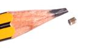
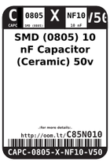
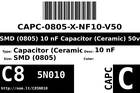
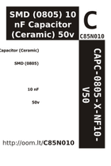

Contents
========

* [C85N010 > SMD (0805) 10 nF Capacitor (Ceramic) 50v](#c85n010--smd-0805-10-nf-capacitor-ceramic-50v)
	* [Images](#images)
	* [Datasheets](#datasheets)
	* [Labels](#labels)
	* [EDA](#eda)
	* [Tags](#tags)
  
![][im]
# C85N010 > SMD (0805) 10 nF Capacitor (Ceramic) 50v

- ID: CAPC-0805-X-NF10-V50
- Hex ID: C85N010
- Name: SMD (0805) 10 nF Capacitor (Ceramic) 50v
- Description: SMD (0805) 10 nF Capacitor (Ceramic) 50v

## Images
  
  

|image|image_RE|label-front|label-inventory|label-spec|
| :---: | :---: | :---: | :---: | :---: |
||||||

## Datasheets

- Datasheet: [datasheet.pdf](datasheet.pdf)

## Labels
  
  

|label-front|label-inventory|label-spec|
| :---: | :---: | :---: |
||||

## EDA

### Symbols

## Tags

- oompID: CAPC-0805-X-NF10-V50
- name: SMD (0805) 10 nF Capacitor (Ceramic) 50v
- hexID: C85N010
- oompType: CAPC
- oompSize: 0805
- oompColor: X
- oompDesc: NF10
- oompIndex: V50
- oompVersion: 999
- ooWidth: 1.25mm
- ooHeight: 0.6mm
- ooLength: 2mm
- oompBbls: template;XXXX-0805-X-XXXX-XX-bbls
- oompDiag: template;XXXX-0805-X-XXXX-XX-diag
- oompIden: template;XXXX-0805-X-XXXX-XX-iden
- oompSchem: template;CAPC-XXXX-X-XXXX-XX-schem
- oompSimp: template;XXXX-0805-X-XXXX-XX-simp
- ooDesignator: C1

[im]: image_450.jpg
