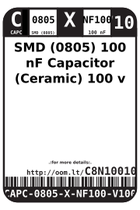
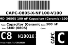
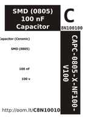

Contents
========

* [C8N100100 > SMD (0805) 100 nF Capacitor (Ceramic) 100 v](#c8n100100--smd-0805-100-nf-capacitor-ceramic-100-v)
	* [Labels](#labels)
	* [EDA](#eda)
	* [Images](#images)
	* [Tags](#tags)

# C8N100100 > SMD (0805) 100 nF Capacitor (Ceramic) 100 v

- ID: CAPC-0805-X-NF100-V100
- Hex ID: C8N100100
- Name: SMD (0805) 100 nF Capacitor (Ceramic) 100 v
- Description: SMD (0805) 100 nF Capacitor (Ceramic) 100 v
- Long Link: [http://oom.lt/CAPC-0805-X-NF100-V100](http://oom.lt/CAPC-0805-X-NF100-V100)
- Short Link: [http://oom.lt/C8N100100](http://oom.lt/C8N100100)

## Labels
  
  

|label-front|label-inventory|label-spec|
| :---: | :---: | :---: |
||||

## EDA

### Footprints
  

|[  FOOTPRINT-eagle-Adafruit-Eagle-Library-adafruit-085CS_1W](https://github.com/oomlout/oomlout_OOMP_eda/tree/main/FOOTPRINT/eagle/Adafruit-Eagle-Library/adafruit/085CS_1W/)|[  FOOTPRINT-eagle-Adafruit-Eagle-Library-adafruit-085CS_1R](https://github.com/oomlout/oomlout_OOMP_eda/tree/main/FOOTPRINT/eagle/Adafruit-Eagle-Library/adafruit/085CS_1R/)|[  FOOTPRINT-eagle-Adafruit-Eagle-Library-adafruit-085CS_1AW](https://github.com/oomlout/oomlout_OOMP_eda/tree/main/FOOTPRINT/eagle/Adafruit-Eagle-Library/adafruit/085CS_1AW/)|[  FOOTPRINT-eagle-Adafruit-Eagle-Library-adafruit-085CS_1AR](https://github.com/oomlout/oomlout_OOMP_eda/tree/main/FOOTPRINT/eagle/Adafruit-Eagle-Library/adafruit/085CS_1AR/)|
| :---: | :---: | :---: | :---: |
|[  FOOTPRINT-eagle-SparkFun-Eagle-Libraries-SparkFun-Capacitors-0805](https://github.com/oomlout/oomlout_OOMP_eda/tree/main/FOOTPRINT/eagle/SparkFun-Eagle-Libraries/SparkFun-Capacitors/0805/)|[  FOOTPRINT-eagle-Pimoroni-Eagle-Library-pimoroni-rc-0805_SENSE](https://github.com/oomlout/oomlout_OOMP_eda/tree/main/FOOTPRINT/eagle/Pimoroni-Eagle-Library/pimoroni-rc/0805_SENSE/)|[  FOOTPRINT-eagle-Pimoroni-Eagle-Library-pimoroni-rc-0805](https://github.com/oomlout/oomlout_OOMP_eda/tree/main/FOOTPRINT/eagle/Pimoroni-Eagle-Library/pimoroni-rc/0805/)|[  FOOTPRINT-kicad-kicad-footprints-Capacitor_SMD-C_0805_2012Metric](https://github.com/oomlout/oomlout_OOMP_eda/tree/main/FOOTPRINT/kicad/kicad-footprints/Capacitor_SMD/C_0805_2012Metric/)|
|[  FOOTPRINT-kicad-kicad-footprints-Capacitor_SMD-C_0805_2012Metric_Pad1.18x1.45mm_HandSolder](https://github.com/oomlout/oomlout_OOMP_eda/tree/main/FOOTPRINT/kicad/kicad-footprints/Capacitor_SMD/C_0805_2012Metric_Pad1.18x1.45mm_HandSolder/)||||

### Symbols
  

|[  SYMBOL-kicad-kicad-symbols-Device-C](https://github.com/oomlout/oomlout_OOMP_eda/tree/main/SYMBOL/kicad/kicad-symbols/Device/C/)||||
| :---: | :---: | :---: | :---: |

## Images
  
  

|label-front|label-inventory|label-spec|
| :---: | :---: | :---: |
||||

## Tags

- oompType: CAPC
- oompSize: 0805
- oompColor: X
- oompDesc: NF100
- oompIndex: V100
- oplPartNumber: {'code': 'C-JLCC', 'name': 'JLC Parts Library', 'partID': 'C28233', 'desc': '100V 100nF X7R ??10% 0805  Multilayer Ceramic Capacitors MLCC - SMD/SMT ROHS'}
- distributorPartNumber: {'code': 'C-LCSC', 'name': 'LCSC', 'partID': 'C28233'}
- manufacturerPartNumber: {'code': 'C-XXXX', 'name': 'Samsung Electro-Mechanics', 'partID': 'CL21B104KCFNNNE'}
- hexID: C8N100100
- oompID: CAPC-0805-X-NF100-V100
- symbolKicad: SYMBOL-kicad-kicad-symbols-Device-C
- footprintEagle: FOOTPRINT-eagle-Adafruit-Eagle-Library-adafruit-085CS_1W
- footprintEagle: FOOTPRINT-eagle-Adafruit-Eagle-Library-adafruit-085CS_1R
- footprintEagle: FOOTPRINT-eagle-Adafruit-Eagle-Library-adafruit-085CS_1AW
- footprintEagle: FOOTPRINT-eagle-Adafruit-Eagle-Library-adafruit-085CS_1AR
- footprintEagle: FOOTPRINT-eagle-SparkFun-Eagle-Libraries-SparkFun-Capacitors-0805
- footprintEagle: FOOTPRINT-eagle-Pimoroni-Eagle-Library-pimoroni-rc-0805_SENSE
- footprintEagle: FOOTPRINT-eagle-Pimoroni-Eagle-Library-pimoroni-rc-0805
- footprintKicad: FOOTPRINT-kicad-kicad-footprints-Capacitor_SMD-C_0805_2012Metric
- footprintKicad: FOOTPRINT-kicad-kicad-footprints-Capacitor_SMD-C_0805_2012Metric_Pad1.18x1.45mm_HandSolder
