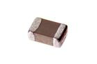
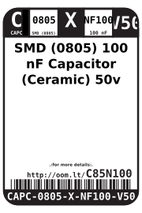
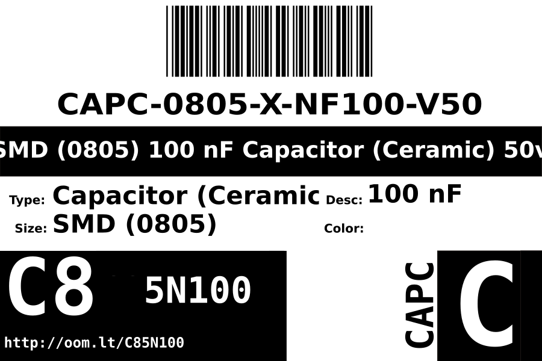

Contents
========

* [CAPC-0805-X-NF100-V50>SMD (0805) 100 nF Capacitor (Ceramic) 50v](#capc-0805-x-nf100-v50smd-0805-100-nf-capacitor-ceramic-50v)
	* [Images](#images)
	* [Datasheets](#datasheets)
	* [Labels](#labels)
	* [EDA](#eda)
		* [Symbols](#symbols)
	* [Tags](#tags)
  
![][im]
# CAPC-0805-X-NF100-V50>SMD (0805) 100 nF Capacitor (Ceramic) 50v

- ID: CAPC-0805-X-NF100-V50
- Name: CAPC-0805-X-NF100-V50

## Images
  
  

|image|
| :---: |
||

## Datasheets

- Datasheet: [datasheet.pdf](datasheet.pdf)

## Labels
  
  

|label-front|label-inventory|label-spec|
| :---: | :---: | :---: |
||||

## EDA

### Symbols

## Tags

- oompID: CAPC-0805-X-NF100-V50
- name: SMD (0805) 100 nF Capacitor (Ceramic) 50v
- hexID: C85N100
- oompType: CAPC
- oompSize: 0805
- oompColor: X
- oompDesc: NF100
- oompIndex: V50
- oompVersion: 999
- ooWidth: 1.25mm
- ooHeight: 0.85mm
- ooLength: 2mm
- oompBbls: template;XXXX-0805-X-XXXX-XX-bbls
- oompDiag: template;XXXX-0805-X-XXXX-XX-diag
- oompIden: template;XXXX-0805-X-XXXX-XX-iden
- oompSchem: template;CAPC-XXXX-X-XXXX-XX-schem
- oompSimp: template;XXXX-0805-X-XXXX-XX-simp
- ooDesignator: C1

[im]: image_600.jpg
