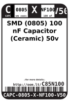
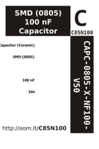

Contents
========

* [C8N100 > SMD (0805) 100 nF Capacitor (Ceramic) 50v](#c8n100--smd-0805-100-nf-capacitor-ceramic-50v)
	* [Datasheets](#datasheets)
	* [Labels](#labels)
	* [EDA](#eda)
	* [Images](#images)
	* [Tags](#tags)
  
![][im]
# C8N100 > SMD (0805) 100 nF Capacitor (Ceramic) 50v

- ID: CAPC-0805-X-NF100-V50
- Hex ID: C8N100
- Name: SMD (0805) 100 nF Capacitor (Ceramic) 50v
- Description: SMD (0805) 100 nF Capacitor (Ceramic) 50v
- Long Link: [http://oom.lt/CAPC-0805-X-NF100-V50](http://oom.lt/CAPC-0805-X-NF100-V50)
- Short Link: [http://oom.lt/C8N100](http://oom.lt/C8N100)

## Datasheets

- Datasheet: [datasheet.pdf](datasheet.pdf)

## Labels
  
  

|label-front|label-inventory|label-spec|
| :---: | :---: | :---: |
||||

## EDA

### Footprints
  

|[  FOOTPRINT-eagle-Adafruit-Eagle-Library-adafruit-085CS_1W](https://github.com/oomlout/oomlout_OOMP_eda/tree/main/FOOTPRINT/eagle/Adafruit-Eagle-Library/adafruit/085CS_1W/)|[  FOOTPRINT-eagle-Adafruit-Eagle-Library-adafruit-085CS_1R](https://github.com/oomlout/oomlout_OOMP_eda/tree/main/FOOTPRINT/eagle/Adafruit-Eagle-Library/adafruit/085CS_1R/)|[  FOOTPRINT-eagle-Adafruit-Eagle-Library-adafruit-085CS_1AW](https://github.com/oomlout/oomlout_OOMP_eda/tree/main/FOOTPRINT/eagle/Adafruit-Eagle-Library/adafruit/085CS_1AW/)|[  FOOTPRINT-eagle-Adafruit-Eagle-Library-adafruit-085CS_1AR](https://github.com/oomlout/oomlout_OOMP_eda/tree/main/FOOTPRINT/eagle/Adafruit-Eagle-Library/adafruit/085CS_1AR/)|
| :---: | :---: | :---: | :---: |
|[  FOOTPRINT-eagle-SparkFun-Eagle-Libraries-SparkFun-Capacitors-0805](https://github.com/oomlout/oomlout_OOMP_eda/tree/main/FOOTPRINT/eagle/SparkFun-Eagle-Libraries/SparkFun-Capacitors/0805/)|[  FOOTPRINT-eagle-Pimoroni-Eagle-Library-pimoroni-rc-0805_SENSE](https://github.com/oomlout/oomlout_OOMP_eda/tree/main/FOOTPRINT/eagle/Pimoroni-Eagle-Library/pimoroni-rc/0805_SENSE/)|[  FOOTPRINT-eagle-Pimoroni-Eagle-Library-pimoroni-rc-0805](https://github.com/oomlout/oomlout_OOMP_eda/tree/main/FOOTPRINT/eagle/Pimoroni-Eagle-Library/pimoroni-rc/0805/)|[  FOOTPRINT-kicad-kicad-footprints-Capacitor_SMD-C_0805_2012Metric](https://github.com/oomlout/oomlout_OOMP_eda/tree/main/FOOTPRINT/kicad/kicad-footprints/Capacitor_SMD/C_0805_2012Metric/)|
|[  FOOTPRINT-kicad-kicad-footprints-Capacitor_SMD-C_0805_2012Metric_Pad1.18x1.45mm_HandSolder](https://github.com/oomlout/oomlout_OOMP_eda/tree/main/FOOTPRINT/kicad/kicad-footprints/Capacitor_SMD/C_0805_2012Metric_Pad1.18x1.45mm_HandSolder/)||||

### Symbols
  

|[  SYMBOL-kicad-kicad-symbols-Device-C](https://github.com/oomlout/oomlout_OOMP_eda/tree/main/SYMBOL/kicad/kicad-symbols/Device/C/)||||
| :---: | :---: | :---: | :---: |
  

### Instances
  
Used 369 times.  
Prevalance: (369\10986) 3.3588%  

|Project|Occur- rences|Identifiers|
| :---: | :---: | :---: |
|[PROJ-ADAF-1032-STAN-01 Adafruit L3GD20 Breakout PCB](https://github.com/oomlout/oomlout_OOMP_projects/tree/main/PROJ-ADAF-1032-STAN-01/)|[2](https://github.com/oomlout/oomlout_OOMP_projects/tree/main/PROJ-ADAF-1032-STAN-01/)|[C1, C4](https://github.com/oomlout/oomlout_OOMP_projects/tree/main/PROJ-ADAF-1032-STAN-01/)|
|[PROJ-ADAF-1063-STAN-01 Adafruit MAX4466 Electret Mic Amplifier PCBs](https://github.com/oomlout/oomlout_OOMP_projects/tree/main/PROJ-ADAF-1063-STAN-01/)|[1](https://github.com/oomlout/oomlout_OOMP_projects/tree/main/PROJ-ADAF-1063-STAN-01/)|[C1](https://github.com/oomlout/oomlout_OOMP_projects/tree/main/PROJ-ADAF-1063-STAN-01/)|
|[PROJ-ADAF-1120-STAN-01 Adafruit LSM303 PCB](https://github.com/oomlout/oomlout_OOMP_projects/tree/main/PROJ-ADAF-1120-STAN-01/)|[1](https://github.com/oomlout/oomlout_OOMP_projects/tree/main/PROJ-ADAF-1120-STAN-01/)|[C2](https://github.com/oomlout/oomlout_OOMP_projects/tree/main/PROJ-ADAF-1120-STAN-01/)|
|[PROJ-ADAF-1164-STAN-01 Adafruit INA169 Breakout PCB](https://github.com/oomlout/oomlout_OOMP_projects/tree/main/PROJ-ADAF-1164-STAN-01/)|[1](https://github.com/oomlout/oomlout_OOMP_projects/tree/main/PROJ-ADAF-1164-STAN-01/)|[C1](https://github.com/oomlout/oomlout_OOMP_projects/tree/main/PROJ-ADAF-1164-STAN-01/)|
|[PROJ-ADAF-1246-STAN-01 Adafruit Flora TSL2561 Lux Sensor PCB](https://github.com/oomlout/oomlout_OOMP_projects/tree/main/PROJ-ADAF-1246-STAN-01/)|[1](https://github.com/oomlout/oomlout_OOMP_projects/tree/main/PROJ-ADAF-1246-STAN-01/)|[C1](https://github.com/oomlout/oomlout_OOMP_projects/tree/main/PROJ-ADAF-1246-STAN-01/)|
|[PROJ-ADAF-1247-STAN-01 Adafruit Flora LSM303 PCB](https://github.com/oomlout/oomlout_OOMP_projects/tree/main/PROJ-ADAF-1247-STAN-01/)|[1](https://github.com/oomlout/oomlout_OOMP_projects/tree/main/PROJ-ADAF-1247-STAN-01/)|[C3](https://github.com/oomlout/oomlout_OOMP_projects/tree/main/PROJ-ADAF-1247-STAN-01/)|
|[PROJ-ADAF-1334-STAN-01 Adafruit TCS34725 Color Sensor Breakout PCB](https://github.com/oomlout/oomlout_OOMP_projects/tree/main/PROJ-ADAF-1334-STAN-01/)|[1](https://github.com/oomlout/oomlout_OOMP_projects/tree/main/PROJ-ADAF-1334-STAN-01/)|[C1](https://github.com/oomlout/oomlout_OOMP_projects/tree/main/PROJ-ADAF-1334-STAN-01/)|
|[PROJ-ADAF-1356-STAN-01 Adafruit Flora TCS34725 Color Sensor PCB](https://github.com/oomlout/oomlout_OOMP_projects/tree/main/PROJ-ADAF-1356-STAN-01/)|[1](https://github.com/oomlout/oomlout_OOMP_projects/tree/main/PROJ-ADAF-1356-STAN-01/)|[C1](https://github.com/oomlout/oomlout_OOMP_projects/tree/main/PROJ-ADAF-1356-STAN-01/)|
|[PROJ-ADAF-1362-STAN-01 Adafruit Standalone Capacitive Sensor PCB](https://github.com/oomlout/oomlout_OOMP_projects/tree/main/PROJ-ADAF-1362-STAN-01/)|[1](https://github.com/oomlout/oomlout_OOMP_projects/tree/main/PROJ-ADAF-1362-STAN-01/)|[C1](https://github.com/oomlout/oomlout_OOMP_projects/tree/main/PROJ-ADAF-1362-STAN-01/)|
|[PROJ-ADAF-1381-STAN-01 Adafruit VS1053 Breakout PCB](https://github.com/oomlout/oomlout_OOMP_projects/tree/main/PROJ-ADAF-1381-STAN-01/)|[2](https://github.com/oomlout/oomlout_OOMP_projects/tree/main/PROJ-ADAF-1381-STAN-01/)|[C8, C26](https://github.com/oomlout/oomlout_OOMP_projects/tree/main/PROJ-ADAF-1381-STAN-01/)|
|[PROJ-ADAF-1384-STAN-01 Adafruit GA1A1S202WP Breakout PCB](https://github.com/oomlout/oomlout_OOMP_projects/tree/main/PROJ-ADAF-1384-STAN-01/)|[1](https://github.com/oomlout/oomlout_OOMP_projects/tree/main/PROJ-ADAF-1384-STAN-01/)|[C1](https://github.com/oomlout/oomlout_OOMP_projects/tree/main/PROJ-ADAF-1384-STAN-01/)|
|[PROJ-ADAF-1393-STAN-01 Adafruit Sharp Memory Display PCBs](https://github.com/oomlout/oomlout_OOMP_projects/tree/main/PROJ-ADAF-1393-STAN-01/)|[1](https://github.com/oomlout/oomlout_OOMP_projects/tree/main/PROJ-ADAF-1393-STAN-01/)|[C1](https://github.com/oomlout/oomlout_OOMP_projects/tree/main/PROJ-ADAF-1393-STAN-01/)|
|[PROJ-ADAF-1400-STAN-01 Adafruit Push Button Power Switch PCB](https://github.com/oomlout/oomlout_OOMP_projects/tree/main/PROJ-ADAF-1400-STAN-01/)|[1](https://github.com/oomlout/oomlout_OOMP_projects/tree/main/PROJ-ADAF-1400-STAN-01/)|[C1](https://github.com/oomlout/oomlout_OOMP_projects/tree/main/PROJ-ADAF-1400-STAN-01/)|
|[PROJ-ADAF-1426-STAN-01 NeoPixel Sticks](https://github.com/oomlout/oomlout_OOMP_projects/tree/main/PROJ-ADAF-1426-STAN-01/)|[8](https://github.com/oomlout/oomlout_OOMP_projects/tree/main/PROJ-ADAF-1426-STAN-01/)|[C1, C2, C3, C4, C5, C6, C7, C8](https://github.com/oomlout/oomlout_OOMP_projects/tree/main/PROJ-ADAF-1426-STAN-01/)|
|[PROJ-ADAF-1430-STAN-01 Adafruit NeoPixel Shield PCB](https://github.com/oomlout/oomlout_OOMP_projects/tree/main/PROJ-ADAF-1430-STAN-01/)|[35](https://github.com/oomlout/oomlout_OOMP_projects/tree/main/PROJ-ADAF-1430-STAN-01/)|[C1, C2, C3, C4, C5, C6, C7, C8, C9, C10, C11, C12, C13, C14, C15, C16, C17, C18, C19, C20, C21, C22, C23, C24, C25, C26, C27, C28, C29, C30, C31, C32, C33, C34, C35](https://github.com/oomlout/oomlout_OOMP_projects/tree/main/PROJ-ADAF-1430-STAN-01/)|
|[PROJ-ADAF-1438-STAN-01 Adafruit Motor Shield V2 PCB](https://github.com/oomlout/oomlout_OOMP_projects/tree/main/PROJ-ADAF-1438-STAN-01/)|[3](https://github.com/oomlout/oomlout_OOMP_projects/tree/main/PROJ-ADAF-1438-STAN-01/)|[C1, C2, C3](https://github.com/oomlout/oomlout_OOMP_projects/tree/main/PROJ-ADAF-1438-STAN-01/)|
|[PROJ-ADAF-1487-STAN-01 Adafruit NeoPixel 8x8 Matrix](https://github.com/oomlout/oomlout_OOMP_projects/tree/main/PROJ-ADAF-1487-STAN-01/)|[56](https://github.com/oomlout/oomlout_OOMP_projects/tree/main/PROJ-ADAF-1487-STAN-01/)|[C1, C2, C3, C4, C5, C6, C7, C9, C10, C11, C12, C13, C14, C15, C17, C18, C19, C20, C21, C22, C23, C25, C26, C27, C28, C29, C30, C31, C33, C34, C35, C36, C37, C38, C39, C41, C42, C43, C44, C45, C46, C47, C49, C50, C51, C52, C53, C54, C55, C57, C58, C59, C60, C61, C62, C63](https://github.com/oomlout/oomlout_OOMP_projects/tree/main/PROJ-ADAF-1487-STAN-01/)|
|[PROJ-ADAF-1552-STAN-01 Adafruit TPA2012 or TS2012 Breakout PCB](https://github.com/oomlout/oomlout_OOMP_projects/tree/main/PROJ-ADAF-1552-STAN-01/)|[3](https://github.com/oomlout/oomlout_OOMP_projects/tree/main/PROJ-ADAF-1552-STAN-01/)|[C2, C3, C4](https://github.com/oomlout/oomlout_OOMP_projects/tree/main/PROJ-ADAF-1552-STAN-01/)|
|[PROJ-ADAF-1571-STAN-01 Adafruit STMPE610 Breakout PCB](https://github.com/oomlout/oomlout_OOMP_projects/tree/main/PROJ-ADAF-1571-STAN-01/)|[1](https://github.com/oomlout/oomlout_OOMP_projects/tree/main/PROJ-ADAF-1571-STAN-01/)|[C1](https://github.com/oomlout/oomlout_OOMP_projects/tree/main/PROJ-ADAF-1571-STAN-01/)|
|[PROJ-ADAF-1580-STAN-01 Adafruit AR1100 Resistive Touch Controller PCB](https://github.com/oomlout/oomlout_OOMP_projects/tree/main/PROJ-ADAF-1580-STAN-01/)|[1](https://github.com/oomlout/oomlout_OOMP_projects/tree/main/PROJ-ADAF-1580-STAN-01/)|[C1](https://github.com/oomlout/oomlout_OOMP_projects/tree/main/PROJ-ADAF-1580-STAN-01/)|
|[PROJ-ADAF-1590-STAN-01 Adafruit RA8875 Breakout Board PCB](https://github.com/oomlout/oomlout_OOMP_projects/tree/main/PROJ-ADAF-1590-STAN-01/)|[11](https://github.com/oomlout/oomlout_OOMP_projects/tree/main/PROJ-ADAF-1590-STAN-01/)|[C1, C4, C5, C6, C7, C8, C9, C10, C11, C12, C18](https://github.com/oomlout/oomlout_OOMP_projects/tree/main/PROJ-ADAF-1590-STAN-01/)|
|[PROJ-ADAF-1601-STAN-01 Adafruit PiTFT 2.8 inch Display PCB](https://github.com/oomlout/oomlout_OOMP_projects/tree/main/PROJ-ADAF-1601-STAN-01/)|[3](https://github.com/oomlout/oomlout_OOMP_projects/tree/main/PROJ-ADAF-1601-STAN-01/)|[C2, C3, C4](https://github.com/oomlout/oomlout_OOMP_projects/tree/main/PROJ-ADAF-1601-STAN-01/)|
|[PROJ-ADAF-1611-STAN-01 Adafruit_Trellis](https://github.com/oomlout/oomlout_OOMP_projects/tree/main/PROJ-ADAF-1611-STAN-01/)|[4](https://github.com/oomlout/oomlout_OOMP_projects/tree/main/PROJ-ADAF-1611-STAN-01/)|[C1, C2, C3, C4](https://github.com/oomlout/oomlout_OOMP_projects/tree/main/PROJ-ADAF-1611-STAN-01/)|
|[PROJ-ADAF-1651-STAN-01 Adafruit 2.8 TFT Shield v2 PCB](https://github.com/oomlout/oomlout_OOMP_projects/tree/main/PROJ-ADAF-1651-STAN-01/)|[2](https://github.com/oomlout/oomlout_OOMP_projects/tree/main/PROJ-ADAF-1651-STAN-01/)|[C2, C3](https://github.com/oomlout/oomlout_OOMP_projects/tree/main/PROJ-ADAF-1651-STAN-01/)|
|[PROJ-ADAF-1673-STAN-01 Adafruit 1.27inch Color OLED Breakout PCB](https://github.com/oomlout/oomlout_OOMP_projects/tree/main/PROJ-ADAF-1673-STAN-01/)|[1](https://github.com/oomlout/oomlout_OOMP_projects/tree/main/PROJ-ADAF-1673-STAN-01/)|[C8](https://github.com/oomlout/oomlout_OOMP_projects/tree/main/PROJ-ADAF-1673-STAN-01/)|
|[PROJ-ADAF-1697-STAN-01 Adafruit Bluefruit LE nRF8001 PCB](https://github.com/oomlout/oomlout_OOMP_projects/tree/main/PROJ-ADAF-1697-STAN-01/)|[3](https://github.com/oomlout/oomlout_OOMP_projects/tree/main/PROJ-ADAF-1697-STAN-01/)|[C4, C10, C12](https://github.com/oomlout/oomlout_OOMP_projects/tree/main/PROJ-ADAF-1697-STAN-01/)|
|[PROJ-ADAF-1712-STAN-01 Adafruit TPA2016 PCB](https://github.com/oomlout/oomlout_OOMP_projects/tree/main/PROJ-ADAF-1712-STAN-01/)|[3](https://github.com/oomlout/oomlout_OOMP_projects/tree/main/PROJ-ADAF-1712-STAN-01/)|[C2, C3, C4](https://github.com/oomlout/oomlout_OOMP_projects/tree/main/PROJ-ADAF-1712-STAN-01/)|
|[PROJ-ADAF-1713-STAN-01 Adafruit MAX9814 AGC Microphone PCB](https://github.com/oomlout/oomlout_OOMP_projects/tree/main/PROJ-ADAF-1713-STAN-01/)|[2](https://github.com/oomlout/oomlout_OOMP_projects/tree/main/PROJ-ADAF-1713-STAN-01/)|[C2, C9](https://github.com/oomlout/oomlout_OOMP_projects/tree/main/PROJ-ADAF-1713-STAN-01/)|
|[PROJ-ADAF-1716-STAN-01 Adafruit Qualia Driver PCB](https://github.com/oomlout/oomlout_OOMP_projects/tree/main/PROJ-ADAF-1716-STAN-01/)|[2](https://github.com/oomlout/oomlout_OOMP_projects/tree/main/PROJ-ADAF-1716-STAN-01/)|[C14, C15](https://github.com/oomlout/oomlout_OOMP_projects/tree/main/PROJ-ADAF-1716-STAN-01/)|
|[PROJ-ADAF-1727-STAN-01 Adafruit MAX31850 thermocouple breakout board](https://github.com/oomlout/oomlout_OOMP_projects/tree/main/PROJ-ADAF-1727-STAN-01/)|[1](https://github.com/oomlout/oomlout_OOMP_projects/tree/main/PROJ-ADAF-1727-STAN-01/)|[C3](https://github.com/oomlout/oomlout_OOMP_projects/tree/main/PROJ-ADAF-1727-STAN-01/)|
|[PROJ-ADAF-1743-STAN-01 Adafruit 3.2 TFT Breakout PCB](https://github.com/oomlout/oomlout_OOMP_projects/tree/main/PROJ-ADAF-1743-STAN-01/)|[2](https://github.com/oomlout/oomlout_OOMP_projects/tree/main/PROJ-ADAF-1743-STAN-01/)|[C1, C4](https://github.com/oomlout/oomlout_OOMP_projects/tree/main/PROJ-ADAF-1743-STAN-01/)|
|[PROJ-ADAF-1752-STAN-01 Adafruit MAX9744 Amplifier PCB](https://github.com/oomlout/oomlout_OOMP_projects/tree/main/PROJ-ADAF-1752-STAN-01/)|[6](https://github.com/oomlout/oomlout_OOMP_projects/tree/main/PROJ-ADAF-1752-STAN-01/)|[C6, C8, C10, C11, C13, C15](https://github.com/oomlout/oomlout_OOMP_projects/tree/main/PROJ-ADAF-1752-STAN-01/)|
|[PROJ-ADAF-1770-STAN-01 2.8 TFT Breakout PCB](https://github.com/oomlout/oomlout_OOMP_projects/tree/main/PROJ-ADAF-1770-STAN-01/)|[3](https://github.com/oomlout/oomlout_OOMP_projects/tree/main/PROJ-ADAF-1770-STAN-01/)|[C2, C3, C4](https://github.com/oomlout/oomlout_OOMP_projects/tree/main/PROJ-ADAF-1770-STAN-01/)|
|[PROJ-ADAF-1778-STAN-01 Adafruit AD8495 Breakout PCB](https://github.com/oomlout/oomlout_OOMP_projects/tree/main/PROJ-ADAF-1778-STAN-01/)|[2](https://github.com/oomlout/oomlout_OOMP_projects/tree/main/PROJ-ADAF-1778-STAN-01/)|[C1, C3](https://github.com/oomlout/oomlout_OOMP_projects/tree/main/PROJ-ADAF-1778-STAN-01/)|
|[PROJ-ADAF-1788-STAN-01 Adafruit Music Maker MP3 Shield PCB](https://github.com/oomlout/oomlout_OOMP_projects/tree/main/PROJ-ADAF-1788-STAN-01/)|[7](https://github.com/oomlout/oomlout_OOMP_projects/tree/main/PROJ-ADAF-1788-STAN-01/)|[C8, C9, C10, C11, C23, C25, C26](https://github.com/oomlout/oomlout_OOMP_projects/tree/main/PROJ-ADAF-1788-STAN-01/)|
|[PROJ-ADAF-1875-STAN-01 Adafruit TXB0104 Level Shifter Breakout PCB](https://github.com/oomlout/oomlout_OOMP_projects/tree/main/PROJ-ADAF-1875-STAN-01/)|[2](https://github.com/oomlout/oomlout_OOMP_projects/tree/main/PROJ-ADAF-1875-STAN-01/)|[C1, C2](https://github.com/oomlout/oomlout_OOMP_projects/tree/main/PROJ-ADAF-1875-STAN-01/)|
|[PROJ-ADAF-1893-STAN-01 Adafruit MPL3115A2 PCB](https://github.com/oomlout/oomlout_OOMP_projects/tree/main/PROJ-ADAF-1893-STAN-01/)|[2](https://github.com/oomlout/oomlout_OOMP_projects/tree/main/PROJ-ADAF-1893-STAN-01/)|[C1, C2](https://github.com/oomlout/oomlout_OOMP_projects/tree/main/PROJ-ADAF-1893-STAN-01/)|
|[PROJ-ADAF-1899-STAN-01 Adafruit HTU21D Breakout PCB](https://github.com/oomlout/oomlout_OOMP_projects/tree/main/PROJ-ADAF-1899-STAN-01/)|[1](https://github.com/oomlout/oomlout_OOMP_projects/tree/main/PROJ-ADAF-1899-STAN-01/)|[C1](https://github.com/oomlout/oomlout_OOMP_projects/tree/main/PROJ-ADAF-1899-STAN-01/)|
|[PROJ-ADAF-1903-STAN-01 Adafruit PowerBoost 500 Basic PCB](https://github.com/oomlout/oomlout_OOMP_projects/tree/main/PROJ-ADAF-1903-STAN-01/)|[1](https://github.com/oomlout/oomlout_OOMP_projects/tree/main/PROJ-ADAF-1903-STAN-01/)|[C4](https://github.com/oomlout/oomlout_OOMP_projects/tree/main/PROJ-ADAF-1903-STAN-01/)|
|[PROJ-ADAF-1916-STAN-01 Adafruit Cupcade Adapter PCB](https://github.com/oomlout/oomlout_OOMP_projects/tree/main/PROJ-ADAF-1916-STAN-01/)|[1](https://github.com/oomlout/oomlout_OOMP_projects/tree/main/PROJ-ADAF-1916-STAN-01/)|[C3](https://github.com/oomlout/oomlout_OOMP_projects/tree/main/PROJ-ADAF-1916-STAN-01/)|
|[PROJ-ADAF-1918-STAN-01 Adafruit GUVA Analog UV Sensor Breakout PCB](https://github.com/oomlout/oomlout_OOMP_projects/tree/main/PROJ-ADAF-1918-STAN-01/)|[2](https://github.com/oomlout/oomlout_OOMP_projects/tree/main/PROJ-ADAF-1918-STAN-01/)|[C1, C2](https://github.com/oomlout/oomlout_OOMP_projects/tree/main/PROJ-ADAF-1918-STAN-01/)|
|[PROJ-ADAF-1944-STAN-01 Adafruit PowerBoost 500 Charger PCB](https://github.com/oomlout/oomlout_OOMP_projects/tree/main/PROJ-ADAF-1944-STAN-01/)|[1](https://github.com/oomlout/oomlout_OOMP_projects/tree/main/PROJ-ADAF-1944-STAN-01/)|[C4](https://github.com/oomlout/oomlout_OOMP_projects/tree/main/PROJ-ADAF-1944-STAN-01/)|
|[PROJ-ADAF-1980-STAN-01 TSL2561 breakout board PCB](https://github.com/oomlout/oomlout_OOMP_projects/tree/main/PROJ-ADAF-1980-STAN-01/)|[1](https://github.com/oomlout/oomlout_OOMP_projects/tree/main/PROJ-ADAF-1980-STAN-01/)|[C1](https://github.com/oomlout/oomlout_OOMP_projects/tree/main/PROJ-ADAF-1980-STAN-01/)|
|[PROJ-ADAF-2000-STAN-01 Adafruit Pro Trinket PCBs](https://github.com/oomlout/oomlout_OOMP_projects/tree/main/PROJ-ADAF-2000-STAN-01/)|[2](https://github.com/oomlout/oomlout_OOMP_projects/tree/main/PROJ-ADAF-2000-STAN-01/)|[C2, C3](https://github.com/oomlout/oomlout_OOMP_projects/tree/main/PROJ-ADAF-2000-STAN-01/)|
|[PROJ-ADAF-2019-STAN-01 Adafruit MMA8451 Breakout PCB](https://github.com/oomlout/oomlout_OOMP_projects/tree/main/PROJ-ADAF-2019-STAN-01/)|[1](https://github.com/oomlout/oomlout_OOMP_projects/tree/main/PROJ-ADAF-2019-STAN-01/)|[C1](https://github.com/oomlout/oomlout_OOMP_projects/tree/main/PROJ-ADAF-2019-STAN-01/)|
|[PROJ-ADAF-2024-STAN-01 Adafruit MPR121 Capacitive Touch Shield PCB](https://github.com/oomlout/oomlout_OOMP_projects/tree/main/PROJ-ADAF-2024-STAN-01/)|[2](https://github.com/oomlout/oomlout_OOMP_projects/tree/main/PROJ-ADAF-2024-STAN-01/)|[C3, C4](https://github.com/oomlout/oomlout_OOMP_projects/tree/main/PROJ-ADAF-2024-STAN-01/)|
|[PROJ-ADAF-2030-STAN-01 Adafruit PowerBoost 1000 PCB](https://github.com/oomlout/oomlout_OOMP_projects/tree/main/PROJ-ADAF-2030-STAN-01/)|[1](https://github.com/oomlout/oomlout_OOMP_projects/tree/main/PROJ-ADAF-2030-STAN-01/)|[C4](https://github.com/oomlout/oomlout_OOMP_projects/tree/main/PROJ-ADAF-2030-STAN-01/)|
|[PROJ-ADAF-2050-STAN-01 3.5inch TFT Breakout PCB](https://github.com/oomlout/oomlout_OOMP_projects/tree/main/PROJ-ADAF-2050-STAN-01/)|[3](https://github.com/oomlout/oomlout_OOMP_projects/tree/main/PROJ-ADAF-2050-STAN-01/)|[C1, C4, C18](https://github.com/oomlout/oomlout_OOMP_projects/tree/main/PROJ-ADAF-2050-STAN-01/)|
|[PROJ-ADAF-2078-STAN-01 Adafruit PowerBoost 500 Shield PCB](https://github.com/oomlout/oomlout_OOMP_projects/tree/main/PROJ-ADAF-2078-STAN-01/)|[1](https://github.com/oomlout/oomlout_OOMP_projects/tree/main/PROJ-ADAF-2078-STAN-01/)|[C8](https://github.com/oomlout/oomlout_OOMP_projects/tree/main/PROJ-ADAF-2078-STAN-01/)|
|[PROJ-ADAF-2088-STAN-01 Adafruit 1.44 TFT Breakout PCB](https://github.com/oomlout/oomlout_OOMP_projects/tree/main/PROJ-ADAF-2088-STAN-01/)|[1](https://github.com/oomlout/oomlout_OOMP_projects/tree/main/PROJ-ADAF-2088-STAN-01/)|[C4](https://github.com/oomlout/oomlout_OOMP_projects/tree/main/PROJ-ADAF-2088-STAN-01/)|
|[PROJ-ADAF-2107-STAN-01 Adafruit USB Isolator PCB](https://github.com/oomlout/oomlout_OOMP_projects/tree/main/PROJ-ADAF-2107-STAN-01/)|[8](https://github.com/oomlout/oomlout_OOMP_projects/tree/main/PROJ-ADAF-2107-STAN-01/)|[C1, C2, C3, C4, C5, C7, C8, C10](https://github.com/oomlout/oomlout_OOMP_projects/tree/main/PROJ-ADAF-2107-STAN-01/)|
|[PROJ-ADAF-2190-STAN-01 Adafruit Verter PCB](https://github.com/oomlout/oomlout_OOMP_projects/tree/main/PROJ-ADAF-2190-STAN-01/)|[1](https://github.com/oomlout/oomlout_OOMP_projects/tree/main/PROJ-ADAF-2190-STAN-01/)|[C3](https://github.com/oomlout/oomlout_OOMP_projects/tree/main/PROJ-ADAF-2190-STAN-01/)|
|[PROJ-ADAF-2200-STAN-01 Adafruit LM4040 Voltage Reference PCB](https://github.com/oomlout/oomlout_OOMP_projects/tree/main/PROJ-ADAF-2200-STAN-01/)|[1](https://github.com/oomlout/oomlout_OOMP_projects/tree/main/PROJ-ADAF-2200-STAN-01/)|[C3](https://github.com/oomlout/oomlout_OOMP_projects/tree/main/PROJ-ADAF-2200-STAN-01/)|
|[PROJ-ADAF-2218-STAN-01 Adafruit TFP401 HDMI To 40Pin TFT PCB](https://github.com/oomlout/oomlout_OOMP_projects/tree/main/PROJ-ADAF-2218-STAN-01/)|[14](https://github.com/oomlout/oomlout_OOMP_projects/tree/main/PROJ-ADAF-2218-STAN-01/)|[C1, C2, C3, C4, C5, C6, C7, C8, C9, C10, C11, C19, C20, C23](https://github.com/oomlout/oomlout_OOMP_projects/tree/main/PROJ-ADAF-2218-STAN-01/)|
|[PROJ-ADAF-2260-STAN-01 Adafruit 5 HDMI Backpack PCB](https://github.com/oomlout/oomlout_OOMP_projects/tree/main/PROJ-ADAF-2260-STAN-01/)|[14](https://github.com/oomlout/oomlout_OOMP_projects/tree/main/PROJ-ADAF-2260-STAN-01/)|[C1, C2, C3, C4, C5, C6, C7, C8, C9, C10, C11, C19, C20, C23](https://github.com/oomlout/oomlout_OOMP_projects/tree/main/PROJ-ADAF-2260-STAN-01/)|
|[PROJ-ADAF-2298-STAN-01 Adafruit PiTFT Plus 2.8 PCB](https://github.com/oomlout/oomlout_OOMP_projects/tree/main/PROJ-ADAF-2298-STAN-01/)|[3](https://github.com/oomlout/oomlout_OOMP_projects/tree/main/PROJ-ADAF-2298-STAN-01/)|[C2, C3, C4](https://github.com/oomlout/oomlout_OOMP_projects/tree/main/PROJ-ADAF-2298-STAN-01/)|
|[PROJ-ADAF-2324-STAN-01 Adafruit Ultimate GPS HAT PCB](https://github.com/oomlout/oomlout_OOMP_projects/tree/main/PROJ-ADAF-2324-STAN-01/)|[1](https://github.com/oomlout/oomlout_OOMP_projects/tree/main/PROJ-ADAF-2324-STAN-01/)|[C1](https://github.com/oomlout/oomlout_OOMP_projects/tree/main/PROJ-ADAF-2324-STAN-01/)|
|[PROJ-ADAF-2340-STAN-01 Adafruit Capacitive Touch HAT PCB](https://github.com/oomlout/oomlout_OOMP_projects/tree/main/PROJ-ADAF-2340-STAN-01/)|[2](https://github.com/oomlout/oomlout_OOMP_projects/tree/main/PROJ-ADAF-2340-STAN-01/)|[C3, C4](https://github.com/oomlout/oomlout_OOMP_projects/tree/main/PROJ-ADAF-2340-STAN-01/)|
|[PROJ-ADAF-2348-STAN-01 Adafruit DC Stepper Motor HAT PCB](https://github.com/oomlout/oomlout_OOMP_projects/tree/main/PROJ-ADAF-2348-STAN-01/)|[2](https://github.com/oomlout/oomlout_OOMP_projects/tree/main/PROJ-ADAF-2348-STAN-01/)|[C1, C3](https://github.com/oomlout/oomlout_OOMP_projects/tree/main/PROJ-ADAF-2348-STAN-01/)|
|[PROJ-ADAF-2406-STAN-01 Adafruit 7 HDMI Backpack PCB](https://github.com/oomlout/oomlout_OOMP_projects/tree/main/PROJ-ADAF-2406-STAN-01/)|[14](https://github.com/oomlout/oomlout_OOMP_projects/tree/main/PROJ-ADAF-2406-STAN-01/)|[C1, C2, C3, C4, C5, C6, C7, C8, C9, C10, C11, C19, C20, C23](https://github.com/oomlout/oomlout_OOMP_projects/tree/main/PROJ-ADAF-2406-STAN-01/)|
|[PROJ-ADAF-2441-STAN-01 Adafruit PiTFT 3.5 Plus PCB](https://github.com/oomlout/oomlout_OOMP_projects/tree/main/PROJ-ADAF-2441-STAN-01/)|[2](https://github.com/oomlout/oomlout_OOMP_projects/tree/main/PROJ-ADAF-2441-STAN-01/)|[C4, C18](https://github.com/oomlout/oomlout_OOMP_projects/tree/main/PROJ-ADAF-2441-STAN-01/)|
|[PROJ-ADAF-2453-STAN-01 Adafruit DPI Kippah PCB](https://github.com/oomlout/oomlout_OOMP_projects/tree/main/PROJ-ADAF-2453-STAN-01/)|[2](https://github.com/oomlout/oomlout_OOMP_projects/tree/main/PROJ-ADAF-2453-STAN-01/)|[C1, C3](https://github.com/oomlout/oomlout_OOMP_projects/tree/main/PROJ-ADAF-2453-STAN-01/)|
|[PROJ-ADAF-2455-STAN-01 Adafruit PiTFT 2.4 Inch HAT PCB](https://github.com/oomlout/oomlout_OOMP_projects/tree/main/PROJ-ADAF-2455-STAN-01/)|[2](https://github.com/oomlout/oomlout_OOMP_projects/tree/main/PROJ-ADAF-2455-STAN-01/)|[C2, C3](https://github.com/oomlout/oomlout_OOMP_projects/tree/main/PROJ-ADAF-2455-STAN-01/)|
|[PROJ-ADAF-2466-STAN-01 Adafruit METRO 328 PCB](https://github.com/oomlout/oomlout_OOMP_projects/tree/main/PROJ-ADAF-2466-STAN-01/)|[8](https://github.com/oomlout/oomlout_OOMP_projects/tree/main/PROJ-ADAF-2466-STAN-01/)|[C2, C4, C5, C6, C9, C12, C13, C15](https://github.com/oomlout/oomlout_OOMP_projects/tree/main/PROJ-ADAF-2466-STAN-01/)|
|[PROJ-ADAF-2472-STAN-01 Adafruit BNO055 Breakout PCB](https://github.com/oomlout/oomlout_OOMP_projects/tree/main/PROJ-ADAF-2472-STAN-01/)|[1](https://github.com/oomlout/oomlout_OOMP_projects/tree/main/PROJ-ADAF-2472-STAN-01/)|[C3](https://github.com/oomlout/oomlout_OOMP_projects/tree/main/PROJ-ADAF-2472-STAN-01/)|
|[PROJ-ADAF-2478-STAN-01 Adafruit 2.4 TFT Breakout PCB](https://github.com/oomlout/oomlout_OOMP_projects/tree/main/PROJ-ADAF-2478-STAN-01/)|[2](https://github.com/oomlout/oomlout_OOMP_projects/tree/main/PROJ-ADAF-2478-STAN-01/)|[C1, C4](https://github.com/oomlout/oomlout_OOMP_projects/tree/main/PROJ-ADAF-2478-STAN-01/)|
|[PROJ-ADAF-254-STAN-01 MicroSD breakout board](https://github.com/oomlout/oomlout_OOMP_projects/tree/main/PROJ-ADAF-254-STAN-01/)|[1](https://github.com/oomlout/oomlout_OOMP_projects/tree/main/PROJ-ADAF-254-STAN-01/)|[C2](https://github.com/oomlout/oomlout_OOMP_projects/tree/main/PROJ-ADAF-254-STAN-01/)|
|[PROJ-ADAF-2616-STAN-01 Adafruit PiTFT Plus 3.2 PCB](https://github.com/oomlout/oomlout_OOMP_projects/tree/main/PROJ-ADAF-2616-STAN-01/)|[1](https://github.com/oomlout/oomlout_OOMP_projects/tree/main/PROJ-ADAF-2616-STAN-01/)|[C4](https://github.com/oomlout/oomlout_OOMP_projects/tree/main/PROJ-ADAF-2616-STAN-01/)|
|[PROJ-ADAF-2661-STAN-01 Adafruit Bluefruit LE Micro PCB](https://github.com/oomlout/oomlout_OOMP_projects/tree/main/PROJ-ADAF-2661-STAN-01/)|[2](https://github.com/oomlout/oomlout_OOMP_projects/tree/main/PROJ-ADAF-2661-STAN-01/)|[C14, C15](https://github.com/oomlout/oomlout_OOMP_projects/tree/main/PROJ-ADAF-2661-STAN-01/)|
|[PROJ-ADAF-2716-STAN-01 Adafruit SPW2430 PCB](https://github.com/oomlout/oomlout_OOMP_projects/tree/main/PROJ-ADAF-2716-STAN-01/)|[1](https://github.com/oomlout/oomlout_OOMP_projects/tree/main/PROJ-ADAF-2716-STAN-01/)|[C2](https://github.com/oomlout/oomlout_OOMP_projects/tree/main/PROJ-ADAF-2716-STAN-01/)|
|[PROJ-ADAF-284-STAN-01 Adafruit_FTDI Friend PCB](https://github.com/oomlout/oomlout_OOMP_projects/tree/main/PROJ-ADAF-284-STAN-01/)|[2](https://github.com/oomlout/oomlout_OOMP_projects/tree/main/PROJ-ADAF-284-STAN-01/)|[C2, C3](https://github.com/oomlout/oomlout_OOMP_projects/tree/main/PROJ-ADAF-284-STAN-01/)|
|[PROJ-ADAF-292-STAN-01 Adafruit I2C SPI LCD Backpack PCB](https://github.com/oomlout/oomlout_OOMP_projects/tree/main/PROJ-ADAF-292-STAN-01/)|[1](https://github.com/oomlout/oomlout_OOMP_projects/tree/main/PROJ-ADAF-292-STAN-01/)|[C2](https://github.com/oomlout/oomlout_OOMP_projects/tree/main/PROJ-ADAF-292-STAN-01/)|
|[PROJ-ADAF-2927-STAN-01 Adafruit DC Stepper Motor FeatherWing PCB](https://github.com/oomlout/oomlout_OOMP_projects/tree/main/PROJ-ADAF-2927-STAN-01/)|[1](https://github.com/oomlout/oomlout_OOMP_projects/tree/main/PROJ-ADAF-2927-STAN-01/)|[C2](https://github.com/oomlout/oomlout_OOMP_projects/tree/main/PROJ-ADAF-2927-STAN-01/)|
|[PROJ-ADAF-2999-STAN-01 Adafruit ATWINC1500 WiFi Breakout PCB](https://github.com/oomlout/oomlout_OOMP_projects/tree/main/PROJ-ADAF-2999-STAN-01/)|[1](https://github.com/oomlout/oomlout_OOMP_projects/tree/main/PROJ-ADAF-2999-STAN-01/)|[C4](https://github.com/oomlout/oomlout_OOMP_projects/tree/main/PROJ-ADAF-2999-STAN-01/)|
|[PROJ-ADAF-3006-STAN-01 Adafruit MAX98357 I2S Amp Breakout](https://github.com/oomlout/oomlout_OOMP_projects/tree/main/PROJ-ADAF-3006-STAN-01/)|[1](https://github.com/oomlout/oomlout_OOMP_projects/tree/main/PROJ-ADAF-3006-STAN-01/)|[C1](https://github.com/oomlout/oomlout_OOMP_projects/tree/main/PROJ-ADAF-3006-STAN-01/)|
|[PROJ-ADAF-3070-STAN-01 Adafruit RFM LoRa Radio Breakout PCB](https://github.com/oomlout/oomlout_OOMP_projects/tree/main/PROJ-ADAF-3070-STAN-01/)|[1](https://github.com/oomlout/oomlout_OOMP_projects/tree/main/PROJ-ADAF-3070-STAN-01/)|[C2](https://github.com/oomlout/oomlout_OOMP_projects/tree/main/PROJ-ADAF-3070-STAN-01/)|
|[PROJ-ADAF-3133-STAN-01 Adafruit Ultimate GPS FeatherWing PCB](https://github.com/oomlout/oomlout_OOMP_projects/tree/main/PROJ-ADAF-3133-STAN-01/)|[1](https://github.com/oomlout/oomlout_OOMP_projects/tree/main/PROJ-ADAF-3133-STAN-01/)|[C1](https://github.com/oomlout/oomlout_OOMP_projects/tree/main/PROJ-ADAF-3133-STAN-01/)|
|[PROJ-ADAF-3134-STAN-01 Adafruit 7x15 CharliePlex LED FeatherWing](https://github.com/oomlout/oomlout_OOMP_projects/tree/main/PROJ-ADAF-3134-STAN-01/)|[1](https://github.com/oomlout/oomlout_OOMP_projects/tree/main/PROJ-ADAF-3134-STAN-01/)|[C5](https://github.com/oomlout/oomlout_OOMP_projects/tree/main/PROJ-ADAF-3134-STAN-01/)|
|[PROJ-ADAF-3190-STAN-01 Adafruit DRV8871 Breakout PCB](https://github.com/oomlout/oomlout_OOMP_projects/tree/main/PROJ-ADAF-3190-STAN-01/)|[1](https://github.com/oomlout/oomlout_OOMP_projects/tree/main/PROJ-ADAF-3190-STAN-01/)|[C1](https://github.com/oomlout/oomlout_OOMP_projects/tree/main/PROJ-ADAF-3190-STAN-01/)|
|[PROJ-ADAF-326-STAN-01 Adafruit 128x64 Monochrome OLED PCB](https://github.com/oomlout/oomlout_OOMP_projects/tree/main/PROJ-ADAF-326-STAN-01/)|[2](https://github.com/oomlout/oomlout_OOMP_projects/tree/main/PROJ-ADAF-326-STAN-01/)|[C5, C7](https://github.com/oomlout/oomlout_OOMP_projects/tree/main/PROJ-ADAF-326-STAN-01/)|
|[PROJ-ADAF-3263-STAN-01 Adafruit MAX31856 PCB](https://github.com/oomlout/oomlout_OOMP_projects/tree/main/PROJ-ADAF-3263-STAN-01/)|[3](https://github.com/oomlout/oomlout_OOMP_projects/tree/main/PROJ-ADAF-3263-STAN-01/)|[C2, C4, C5](https://github.com/oomlout/oomlout_OOMP_projects/tree/main/PROJ-ADAF-3263-STAN-01/)|
|[PROJ-ADAF-3297-STAN-01 Adafruit DRV8833 Motor Driver Breakout PCB](https://github.com/oomlout/oomlout_OOMP_projects/tree/main/PROJ-ADAF-3297-STAN-01/)|[1](https://github.com/oomlout/oomlout_OOMP_projects/tree/main/PROJ-ADAF-3297-STAN-01/)|[C3](https://github.com/oomlout/oomlout_OOMP_projects/tree/main/PROJ-ADAF-3297-STAN-01/)|
|[PROJ-ADAF-3305-STAN-01 Adafruit 50pin to 40pin TFT with AR1100 Adapter PCB](https://github.com/oomlout/oomlout_OOMP_projects/tree/main/PROJ-ADAF-3305-STAN-01/)|[3](https://github.com/oomlout/oomlout_OOMP_projects/tree/main/PROJ-ADAF-3305-STAN-01/)|[C2, C5, C7](https://github.com/oomlout/oomlout_OOMP_projects/tree/main/PROJ-ADAF-3305-STAN-01/)|
|[PROJ-ADAF-3309-STAN-01 Adafruit CP2104 Friend PCB](https://github.com/oomlout/oomlout_OOMP_projects/tree/main/PROJ-ADAF-3309-STAN-01/)|[1](https://github.com/oomlout/oomlout_OOMP_projects/tree/main/PROJ-ADAF-3309-STAN-01/)|[C4](https://github.com/oomlout/oomlout_OOMP_projects/tree/main/PROJ-ADAF-3309-STAN-01/)|
|[PROJ-ADAF-3315-STAN-01 Adafruit 2.4 TFT FeatherWing PCB](https://github.com/oomlout/oomlout_OOMP_projects/tree/main/PROJ-ADAF-3315-STAN-01/)|[2](https://github.com/oomlout/oomlout_OOMP_projects/tree/main/PROJ-ADAF-3315-STAN-01/)|[C1, C4](https://github.com/oomlout/oomlout_OOMP_projects/tree/main/PROJ-ADAF-3315-STAN-01/)|
|[PROJ-ADAF-3316-STAN-01 Adafruit VL6180X ToF Distance Sensor PCB](https://github.com/oomlout/oomlout_OOMP_projects/tree/main/PROJ-ADAF-3316-STAN-01/)|[1](https://github.com/oomlout/oomlout_OOMP_projects/tree/main/PROJ-ADAF-3316-STAN-01/)|[C1](https://github.com/oomlout/oomlout_OOMP_projects/tree/main/PROJ-ADAF-3316-STAN-01/)|
|[PROJ-ADAF-3317-STAN-01 Adafruit VL53L0X ToF Distance Sensor PCB](https://github.com/oomlout/oomlout_OOMP_projects/tree/main/PROJ-ADAF-3317-STAN-01/)|[1](https://github.com/oomlout/oomlout_OOMP_projects/tree/main/PROJ-ADAF-3317-STAN-01/)|[C3](https://github.com/oomlout/oomlout_OOMP_projects/tree/main/PROJ-ADAF-3317-STAN-01/)|
|[PROJ-ADAF-3328-STAN-01 Adafruit MAX31865 PCB](https://github.com/oomlout/oomlout_OOMP_projects/tree/main/PROJ-ADAF-3328-STAN-01/)|[3](https://github.com/oomlout/oomlout_OOMP_projects/tree/main/PROJ-ADAF-3328-STAN-01/)|[C1, C2, C3](https://github.com/oomlout/oomlout_OOMP_projects/tree/main/PROJ-ADAF-3328-STAN-01/)|
|[PROJ-ADAF-3346-STAN-01 Adafruit Stereo Speaker Bonnet PCB](https://github.com/oomlout/oomlout_OOMP_projects/tree/main/PROJ-ADAF-3346-STAN-01/)|[2](https://github.com/oomlout/oomlout_OOMP_projects/tree/main/PROJ-ADAF-3346-STAN-01/)|[C2, C3](https://github.com/oomlout/oomlout_OOMP_projects/tree/main/PROJ-ADAF-3346-STAN-01/)|
|[PROJ-ADAF-3382-STAN-01 Adafruit Metro M4 Express PCB](https://github.com/oomlout/oomlout_OOMP_projects/tree/main/PROJ-ADAF-3382-STAN-01/)|[1](https://github.com/oomlout/oomlout_OOMP_projects/tree/main/PROJ-ADAF-3382-STAN-01/)|[C2](https://github.com/oomlout/oomlout_OOMP_projects/tree/main/PROJ-ADAF-3382-STAN-01/)|
|[PROJ-ADAF-3463-STAN-01 Adafruit FXOS8700 FXAS21002 9 DoF Breakout PCB](https://github.com/oomlout/oomlout_OOMP_projects/tree/main/PROJ-ADAF-3463-STAN-01/)|[4](https://github.com/oomlout/oomlout_OOMP_projects/tree/main/PROJ-ADAF-3463-STAN-01/)|[C2, C3, C5, C7](https://github.com/oomlout/oomlout_OOMP_projects/tree/main/PROJ-ADAF-3463-STAN-01/)|
|[PROJ-ADAF-3505-STAN-01 Adafruit Metro M0 Express PCB](https://github.com/oomlout/oomlout_OOMP_projects/tree/main/PROJ-ADAF-3505-STAN-01/)|[9](https://github.com/oomlout/oomlout_OOMP_projects/tree/main/PROJ-ADAF-3505-STAN-01/)|[C2, C4, C6, C9, C10, C11, C12, C13, C14](https://github.com/oomlout/oomlout_OOMP_projects/tree/main/PROJ-ADAF-3505-STAN-01/)|
|[PROJ-ADAF-3533-STAN-01 Adafruit 0.96 160x80 TFT Display Breakout PCB](https://github.com/oomlout/oomlout_OOMP_projects/tree/main/PROJ-ADAF-3533-STAN-01/)|[1](https://github.com/oomlout/oomlout_OOMP_projects/tree/main/PROJ-ADAF-3533-STAN-01/)|[C3](https://github.com/oomlout/oomlout_OOMP_projects/tree/main/PROJ-ADAF-3533-STAN-01/)|
|[PROJ-ADAF-3538-STAN-01 Adafruit AMG8833 Breakout PCB](https://github.com/oomlout/oomlout_OOMP_projects/tree/main/PROJ-ADAF-3538-STAN-01/)|[1](https://github.com/oomlout/oomlout_OOMP_projects/tree/main/PROJ-ADAF-3538-STAN-01/)|[C6](https://github.com/oomlout/oomlout_OOMP_projects/tree/main/PROJ-ADAF-3538-STAN-01/)|
|[PROJ-ADAF-358-STAN-01 Adafruit_1.8_Inch_TFT_Breakout_PCB](https://github.com/oomlout/oomlout_OOMP_projects/tree/main/PROJ-ADAF-358-STAN-01/)|[2](https://github.com/oomlout/oomlout_OOMP_projects/tree/main/PROJ-ADAF-358-STAN-01/)|[C3, C4](https://github.com/oomlout/oomlout_OOMP_projects/tree/main/PROJ-ADAF-358-STAN-01/)|
|[PROJ-ADAF-3595-STAN-01 Adafruit APDS9960 Breakout PCB](https://github.com/oomlout/oomlout_OOMP_projects/tree/main/PROJ-ADAF-3595-STAN-01/)|[1](https://github.com/oomlout/oomlout_OOMP_projects/tree/main/PROJ-ADAF-3595-STAN-01/)|[C1](https://github.com/oomlout/oomlout_OOMP_projects/tree/main/PROJ-ADAF-3595-STAN-01/)|
|[PROJ-ADAF-364-STAN-01 Adafruit PN532 RFID NFC Breakout](https://github.com/oomlout/oomlout_OOMP_projects/tree/main/PROJ-ADAF-364-STAN-01/)|[11](https://github.com/oomlout/oomlout_OOMP_projects/tree/main/PROJ-ADAF-364-STAN-01/)|[C5, C6, C9, C10, C11, C14, C16, C17, C20, C23, C24](https://github.com/oomlout/oomlout_OOMP_projects/tree/main/PROJ-ADAF-364-STAN-01/)|
|[PROJ-ADAF-3651-STAN-01 Adafruit 3.5in TFT Featherwing PCB](https://github.com/oomlout/oomlout_OOMP_projects/tree/main/PROJ-ADAF-3651-STAN-01/)|[1](https://github.com/oomlout/oomlout_OOMP_projects/tree/main/PROJ-ADAF-3651-STAN-01/)|[C18](https://github.com/oomlout/oomlout_OOMP_projects/tree/main/PROJ-ADAF-3651-STAN-01/)|
|[PROJ-ADAF-3678-STAN-01 Adafruit UDA1334A I2S Stereo DAC PCB](https://github.com/oomlout/oomlout_OOMP_projects/tree/main/PROJ-ADAF-3678-STAN-01/)|[3](https://github.com/oomlout/oomlout_OOMP_projects/tree/main/PROJ-ADAF-3678-STAN-01/)|[C1, C3, C9](https://github.com/oomlout/oomlout_OOMP_projects/tree/main/PROJ-ADAF-3678-STAN-01/)|
|[PROJ-ADAF-376-STAN-01 Adafruit_2.8_Inch_TFT_Shield_PCB](https://github.com/oomlout/oomlout_OOMP_projects/tree/main/PROJ-ADAF-376-STAN-01/)|[3](https://github.com/oomlout/oomlout_OOMP_projects/tree/main/PROJ-ADAF-376-STAN-01/)|[C2, C3, C4](https://github.com/oomlout/oomlout_OOMP_projects/tree/main/PROJ-ADAF-376-STAN-01/)|
|[PROJ-ADAF-395-STAN-01 Adafruit TXB0108 PCB](https://github.com/oomlout/oomlout_OOMP_projects/tree/main/PROJ-ADAF-395-STAN-01/)|[2](https://github.com/oomlout/oomlout_OOMP_projects/tree/main/PROJ-ADAF-395-STAN-01/)|[C1, C2](https://github.com/oomlout/oomlout_OOMP_projects/tree/main/PROJ-ADAF-395-STAN-01/)|
|[PROJ-ADAF-4000-STAN-01 Adafruit Metro M4 Express AirLift PCB](https://github.com/oomlout/oomlout_OOMP_projects/tree/main/PROJ-ADAF-4000-STAN-01/)|[1](https://github.com/oomlout/oomlout_OOMP_projects/tree/main/PROJ-ADAF-4000-STAN-01/)|[C2](https://github.com/oomlout/oomlout_OOMP_projects/tree/main/PROJ-ADAF-4000-STAN-01/)|
|[PROJ-ADAF-4279-STAN-01 Adafruit Ultimate GPS](https://github.com/oomlout/oomlout_OOMP_projects/tree/main/PROJ-ADAF-4279-STAN-01/)|[1](https://github.com/oomlout/oomlout_OOMP_projects/tree/main/PROJ-ADAF-4279-STAN-01/)|[C1](https://github.com/oomlout/oomlout_OOMP_projects/tree/main/PROJ-ADAF-4279-STAN-01/)|
|[PROJ-ADAF-4383-STAN-01 Adafruit 1.14 inch 240x135 TFT PCB](https://github.com/oomlout/oomlout_OOMP_projects/tree/main/PROJ-ADAF-4383-STAN-01/)|[1](https://github.com/oomlout/oomlout_OOMP_projects/tree/main/PROJ-ADAF-4383-STAN-01/)|[C3](https://github.com/oomlout/oomlout_OOMP_projects/tree/main/PROJ-ADAF-4383-STAN-01/)|
|[PROJ-ADAF-466-STAN-01 Adafruit VCNL40X0 PCB](https://github.com/oomlout/oomlout_OOMP_projects/tree/main/PROJ-ADAF-466-STAN-01/)|[1](https://github.com/oomlout/oomlout_OOMP_projects/tree/main/PROJ-ADAF-466-STAN-01/)|[C3](https://github.com/oomlout/oomlout_OOMP_projects/tree/main/PROJ-ADAF-466-STAN-01/)|
|[PROJ-ADAF-512-STAN-01 Adafruit 9 DOF and 10 DOF PCBs](https://github.com/oomlout/oomlout_OOMP_projects/tree/main/PROJ-ADAF-512-STAN-01/)|[1](https://github.com/oomlout/oomlout_OOMP_projects/tree/main/PROJ-ADAF-512-STAN-01/)|[C3](https://github.com/oomlout/oomlout_OOMP_projects/tree/main/PROJ-ADAF-512-STAN-01/)|
|[PROJ-ADAF-661-STAN-01 Adafruit 128x32 SPI OLED breakout board PCB](https://github.com/oomlout/oomlout_OOMP_projects/tree/main/PROJ-ADAF-661-STAN-01/)|[1](https://github.com/oomlout/oomlout_OOMP_projects/tree/main/PROJ-ADAF-661-STAN-01/)|[C8](https://github.com/oomlout/oomlout_OOMP_projects/tree/main/PROJ-ADAF-661-STAN-01/)|
|[PROJ-ADAF-782-STAN-01 Adafruit USB Serial RGB Character Backpack PCB](https://github.com/oomlout/oomlout_OOMP_projects/tree/main/PROJ-ADAF-782-STAN-01/)|[1](https://github.com/oomlout/oomlout_OOMP_projects/tree/main/PROJ-ADAF-782-STAN-01/)|[C4](https://github.com/oomlout/oomlout_OOMP_projects/tree/main/PROJ-ADAF-782-STAN-01/)|
|[PROJ-ADAF-789-STAN-01 Adafruit PN532 RFID NFC Shield](https://github.com/oomlout/oomlout_OOMP_projects/tree/main/PROJ-ADAF-789-STAN-01/)|[10](https://github.com/oomlout/oomlout_OOMP_projects/tree/main/PROJ-ADAF-789-STAN-01/)|[C5, C6, C9, C10, C11, C14, C16, C17, C20, C24](https://github.com/oomlout/oomlout_OOMP_projects/tree/main/PROJ-ADAF-789-STAN-01/)|
|[PROJ-ADAF-802-STAN-01 Adafruit 1.8 TFT Shield PCB](https://github.com/oomlout/oomlout_OOMP_projects/tree/main/PROJ-ADAF-802-STAN-01/)|[2](https://github.com/oomlout/oomlout_OOMP_projects/tree/main/PROJ-ADAF-802-STAN-01/)|[C3, C4](https://github.com/oomlout/oomlout_OOMP_projects/tree/main/PROJ-ADAF-802-STAN-01/)|
|[PROJ-ADAF-91-STAN-01 Adafruit_USB_Boarduino_PCB](https://github.com/oomlout/oomlout_OOMP_projects/tree/main/PROJ-ADAF-91-STAN-01/)|[3](https://github.com/oomlout/oomlout_OOMP_projects/tree/main/PROJ-ADAF-91-STAN-01/)|[C1, C3, C4](https://github.com/oomlout/oomlout_OOMP_projects/tree/main/PROJ-ADAF-91-STAN-01/)|
|[PROJ-ADAF-987-STAN-01 Adafruit MAX98306 Class D Amp PCB](https://github.com/oomlout/oomlout_OOMP_projects/tree/main/PROJ-ADAF-987-STAN-01/)|[1](https://github.com/oomlout/oomlout_OOMP_projects/tree/main/PROJ-ADAF-987-STAN-01/)|[C1](https://github.com/oomlout/oomlout_OOMP_projects/tree/main/PROJ-ADAF-987-STAN-01/)|

## Images
  
  

|image|label-front|label-inventory|label-spec|
| :---: | :---: | :---: | :---: |
|||||

## Tags

- oompType: CAPC
- oompSize: 0805
- oompColor: X
- oompDesc: NF100
- oompIndex: V50
- oplPartNumber: {'code': 'C-JLCC', 'name': 'JLC Parts Library', 'partID': 'C49678', 'desc': '50V 100nF X7R ??10% 0805  Multilayer Ceramic Capacitors MLCC - SMD/SMT ROHS'}
- distributorPartNumber: {'code': 'C-LCSC', 'name': 'LCSC', 'partID': 'C49678'}
- manufacturerPartNumber: {'code': 'C-XXXX', 'name': 'YAGEO', 'partID': 'CC0805KRX7R9BB104'}
- hexID: C8N100
- oompID: CAPC-0805-X-NF100-V50
- oompInstances: {'PROJECT': 'PROJ-ADAF-1032-STAN-01', 'ID': 'C1'}
- oompInstances: {'PROJECT': 'PROJ-ADAF-1032-STAN-01', 'ID': 'C4'}
- oompInstances: {'PROJECT': 'PROJ-ADAF-1063-STAN-01', 'ID': 'C1'}
- oompInstances: {'PROJECT': 'PROJ-ADAF-1120-STAN-01', 'ID': 'C2'}
- oompInstances: {'PROJECT': 'PROJ-ADAF-1164-STAN-01', 'ID': 'C1'}
- oompInstances: {'PROJECT': 'PROJ-ADAF-1246-STAN-01', 'ID': 'C1'}
- oompInstances: {'PROJECT': 'PROJ-ADAF-1247-STAN-01', 'ID': 'C3'}
- oompInstances: {'PROJECT': 'PROJ-ADAF-1334-STAN-01', 'ID': 'C1'}
- oompInstances: {'PROJECT': 'PROJ-ADAF-1356-STAN-01', 'ID': 'C1'}
- oompInstances: {'PROJECT': 'PROJ-ADAF-1362-STAN-01', 'ID': 'C1'}
- oompInstances: {'PROJECT': 'PROJ-ADAF-1381-STAN-01', 'ID': 'C8'}
- oompInstances: {'PROJECT': 'PROJ-ADAF-1381-STAN-01', 'ID': 'C26'}
- oompInstances: {'PROJECT': 'PROJ-ADAF-1384-STAN-01', 'ID': 'C1'}
- oompInstances: {'PROJECT': 'PROJ-ADAF-1393-STAN-01', 'ID': 'C1'}
- oompInstances: {'PROJECT': 'PROJ-ADAF-1400-STAN-01', 'ID': 'C1'}
- oompInstances: {'PROJECT': 'PROJ-ADAF-1426-STAN-01', 'ID': 'C1'}
- oompInstances: {'PROJECT': 'PROJ-ADAF-1426-STAN-01', 'ID': 'C2'}
- oompInstances: {'PROJECT': 'PROJ-ADAF-1426-STAN-01', 'ID': 'C3'}
- oompInstances: {'PROJECT': 'PROJ-ADAF-1426-STAN-01', 'ID': 'C4'}
- oompInstances: {'PROJECT': 'PROJ-ADAF-1426-STAN-01', 'ID': 'C5'}
- oompInstances: {'PROJECT': 'PROJ-ADAF-1426-STAN-01', 'ID': 'C6'}
- oompInstances: {'PROJECT': 'PROJ-ADAF-1426-STAN-01', 'ID': 'C7'}
- oompInstances: {'PROJECT': 'PROJ-ADAF-1426-STAN-01', 'ID': 'C8'}
- oompInstances: {'PROJECT': 'PROJ-ADAF-1430-STAN-01', 'ID': 'C1'}
- oompInstances: {'PROJECT': 'PROJ-ADAF-1430-STAN-01', 'ID': 'C2'}
- oompInstances: {'PROJECT': 'PROJ-ADAF-1430-STAN-01', 'ID': 'C3'}
- oompInstances: {'PROJECT': 'PROJ-ADAF-1430-STAN-01', 'ID': 'C4'}
- oompInstances: {'PROJECT': 'PROJ-ADAF-1430-STAN-01', 'ID': 'C5'}
- oompInstances: {'PROJECT': 'PROJ-ADAF-1430-STAN-01', 'ID': 'C6'}
- oompInstances: {'PROJECT': 'PROJ-ADAF-1430-STAN-01', 'ID': 'C7'}
- oompInstances: {'PROJECT': 'PROJ-ADAF-1430-STAN-01', 'ID': 'C8'}
- oompInstances: {'PROJECT': 'PROJ-ADAF-1430-STAN-01', 'ID': 'C9'}
- oompInstances: {'PROJECT': 'PROJ-ADAF-1430-STAN-01', 'ID': 'C10'}
- oompInstances: {'PROJECT': 'PROJ-ADAF-1430-STAN-01', 'ID': 'C11'}
- oompInstances: {'PROJECT': 'PROJ-ADAF-1430-STAN-01', 'ID': 'C12'}
- oompInstances: {'PROJECT': 'PROJ-ADAF-1430-STAN-01', 'ID': 'C13'}
- oompInstances: {'PROJECT': 'PROJ-ADAF-1430-STAN-01', 'ID': 'C14'}
- oompInstances: {'PROJECT': 'PROJ-ADAF-1430-STAN-01', 'ID': 'C15'}
- oompInstances: {'PROJECT': 'PROJ-ADAF-1430-STAN-01', 'ID': 'C16'}
- oompInstances: {'PROJECT': 'PROJ-ADAF-1430-STAN-01', 'ID': 'C17'}
- oompInstances: {'PROJECT': 'PROJ-ADAF-1430-STAN-01', 'ID': 'C18'}
- oompInstances: {'PROJECT': 'PROJ-ADAF-1430-STAN-01', 'ID': 'C19'}
- oompInstances: {'PROJECT': 'PROJ-ADAF-1430-STAN-01', 'ID': 'C20'}
- oompInstances: {'PROJECT': 'PROJ-ADAF-1430-STAN-01', 'ID': 'C21'}
- oompInstances: {'PROJECT': 'PROJ-ADAF-1430-STAN-01', 'ID': 'C22'}
- oompInstances: {'PROJECT': 'PROJ-ADAF-1430-STAN-01', 'ID': 'C23'}
- oompInstances: {'PROJECT': 'PROJ-ADAF-1430-STAN-01', 'ID': 'C24'}
- oompInstances: {'PROJECT': 'PROJ-ADAF-1430-STAN-01', 'ID': 'C25'}
- oompInstances: {'PROJECT': 'PROJ-ADAF-1430-STAN-01', 'ID': 'C26'}
- oompInstances: {'PROJECT': 'PROJ-ADAF-1430-STAN-01', 'ID': 'C27'}
- oompInstances: {'PROJECT': 'PROJ-ADAF-1430-STAN-01', 'ID': 'C28'}
- oompInstances: {'PROJECT': 'PROJ-ADAF-1430-STAN-01', 'ID': 'C29'}
- oompInstances: {'PROJECT': 'PROJ-ADAF-1430-STAN-01', 'ID': 'C30'}
- oompInstances: {'PROJECT': 'PROJ-ADAF-1430-STAN-01', 'ID': 'C31'}
- oompInstances: {'PROJECT': 'PROJ-ADAF-1430-STAN-01', 'ID': 'C32'}
- oompInstances: {'PROJECT': 'PROJ-ADAF-1430-STAN-01', 'ID': 'C33'}
- oompInstances: {'PROJECT': 'PROJ-ADAF-1430-STAN-01', 'ID': 'C34'}
- oompInstances: {'PROJECT': 'PROJ-ADAF-1430-STAN-01', 'ID': 'C35'}
- oompInstances: {'PROJECT': 'PROJ-ADAF-1438-STAN-01', 'ID': 'C1'}
- oompInstances: {'PROJECT': 'PROJ-ADAF-1438-STAN-01', 'ID': 'C2'}
- oompInstances: {'PROJECT': 'PROJ-ADAF-1438-STAN-01', 'ID': 'C3'}
- oompInstances: {'PROJECT': 'PROJ-ADAF-1487-STAN-01', 'ID': 'C1'}
- oompInstances: {'PROJECT': 'PROJ-ADAF-1487-STAN-01', 'ID': 'C2'}
- oompInstances: {'PROJECT': 'PROJ-ADAF-1487-STAN-01', 'ID': 'C3'}
- oompInstances: {'PROJECT': 'PROJ-ADAF-1487-STAN-01', 'ID': 'C4'}
- oompInstances: {'PROJECT': 'PROJ-ADAF-1487-STAN-01', 'ID': 'C5'}
- oompInstances: {'PROJECT': 'PROJ-ADAF-1487-STAN-01', 'ID': 'C6'}
- oompInstances: {'PROJECT': 'PROJ-ADAF-1487-STAN-01', 'ID': 'C7'}
- oompInstances: {'PROJECT': 'PROJ-ADAF-1487-STAN-01', 'ID': 'C9'}
- oompInstances: {'PROJECT': 'PROJ-ADAF-1487-STAN-01', 'ID': 'C10'}
- oompInstances: {'PROJECT': 'PROJ-ADAF-1487-STAN-01', 'ID': 'C11'}
- oompInstances: {'PROJECT': 'PROJ-ADAF-1487-STAN-01', 'ID': 'C12'}
- oompInstances: {'PROJECT': 'PROJ-ADAF-1487-STAN-01', 'ID': 'C13'}
- oompInstances: {'PROJECT': 'PROJ-ADAF-1487-STAN-01', 'ID': 'C14'}
- oompInstances: {'PROJECT': 'PROJ-ADAF-1487-STAN-01', 'ID': 'C15'}
- oompInstances: {'PROJECT': 'PROJ-ADAF-1487-STAN-01', 'ID': 'C17'}
- oompInstances: {'PROJECT': 'PROJ-ADAF-1487-STAN-01', 'ID': 'C18'}
- oompInstances: {'PROJECT': 'PROJ-ADAF-1487-STAN-01', 'ID': 'C19'}
- oompInstances: {'PROJECT': 'PROJ-ADAF-1487-STAN-01', 'ID': 'C20'}
- oompInstances: {'PROJECT': 'PROJ-ADAF-1487-STAN-01', 'ID': 'C21'}
- oompInstances: {'PROJECT': 'PROJ-ADAF-1487-STAN-01', 'ID': 'C22'}
- oompInstances: {'PROJECT': 'PROJ-ADAF-1487-STAN-01', 'ID': 'C23'}
- oompInstances: {'PROJECT': 'PROJ-ADAF-1487-STAN-01', 'ID': 'C25'}
- oompInstances: {'PROJECT': 'PROJ-ADAF-1487-STAN-01', 'ID': 'C26'}
- oompInstances: {'PROJECT': 'PROJ-ADAF-1487-STAN-01', 'ID': 'C27'}
- oompInstances: {'PROJECT': 'PROJ-ADAF-1487-STAN-01', 'ID': 'C28'}
- oompInstances: {'PROJECT': 'PROJ-ADAF-1487-STAN-01', 'ID': 'C29'}
- oompInstances: {'PROJECT': 'PROJ-ADAF-1487-STAN-01', 'ID': 'C30'}
- oompInstances: {'PROJECT': 'PROJ-ADAF-1487-STAN-01', 'ID': 'C31'}
- oompInstances: {'PROJECT': 'PROJ-ADAF-1487-STAN-01', 'ID': 'C33'}
- oompInstances: {'PROJECT': 'PROJ-ADAF-1487-STAN-01', 'ID': 'C34'}
- oompInstances: {'PROJECT': 'PROJ-ADAF-1487-STAN-01', 'ID': 'C35'}
- oompInstances: {'PROJECT': 'PROJ-ADAF-1487-STAN-01', 'ID': 'C36'}
- oompInstances: {'PROJECT': 'PROJ-ADAF-1487-STAN-01', 'ID': 'C37'}
- oompInstances: {'PROJECT': 'PROJ-ADAF-1487-STAN-01', 'ID': 'C38'}
- oompInstances: {'PROJECT': 'PROJ-ADAF-1487-STAN-01', 'ID': 'C39'}
- oompInstances: {'PROJECT': 'PROJ-ADAF-1487-STAN-01', 'ID': 'C41'}
- oompInstances: {'PROJECT': 'PROJ-ADAF-1487-STAN-01', 'ID': 'C42'}
- oompInstances: {'PROJECT': 'PROJ-ADAF-1487-STAN-01', 'ID': 'C43'}
- oompInstances: {'PROJECT': 'PROJ-ADAF-1487-STAN-01', 'ID': 'C44'}
- oompInstances: {'PROJECT': 'PROJ-ADAF-1487-STAN-01', 'ID': 'C45'}
- oompInstances: {'PROJECT': 'PROJ-ADAF-1487-STAN-01', 'ID': 'C46'}
- oompInstances: {'PROJECT': 'PROJ-ADAF-1487-STAN-01', 'ID': 'C47'}
- oompInstances: {'PROJECT': 'PROJ-ADAF-1487-STAN-01', 'ID': 'C49'}
- oompInstances: {'PROJECT': 'PROJ-ADAF-1487-STAN-01', 'ID': 'C50'}
- oompInstances: {'PROJECT': 'PROJ-ADAF-1487-STAN-01', 'ID': 'C51'}
- oompInstances: {'PROJECT': 'PROJ-ADAF-1487-STAN-01', 'ID': 'C52'}
- oompInstances: {'PROJECT': 'PROJ-ADAF-1487-STAN-01', 'ID': 'C53'}
- oompInstances: {'PROJECT': 'PROJ-ADAF-1487-STAN-01', 'ID': 'C54'}
- oompInstances: {'PROJECT': 'PROJ-ADAF-1487-STAN-01', 'ID': 'C55'}
- oompInstances: {'PROJECT': 'PROJ-ADAF-1487-STAN-01', 'ID': 'C57'}
- oompInstances: {'PROJECT': 'PROJ-ADAF-1487-STAN-01', 'ID': 'C58'}
- oompInstances: {'PROJECT': 'PROJ-ADAF-1487-STAN-01', 'ID': 'C59'}
- oompInstances: {'PROJECT': 'PROJ-ADAF-1487-STAN-01', 'ID': 'C60'}
- oompInstances: {'PROJECT': 'PROJ-ADAF-1487-STAN-01', 'ID': 'C61'}
- oompInstances: {'PROJECT': 'PROJ-ADAF-1487-STAN-01', 'ID': 'C62'}
- oompInstances: {'PROJECT': 'PROJ-ADAF-1487-STAN-01', 'ID': 'C63'}
- oompInstances: {'PROJECT': 'PROJ-ADAF-1552-STAN-01', 'ID': 'C2'}
- oompInstances: {'PROJECT': 'PROJ-ADAF-1552-STAN-01', 'ID': 'C3'}
- oompInstances: {'PROJECT': 'PROJ-ADAF-1552-STAN-01', 'ID': 'C4'}
- oompInstances: {'PROJECT': 'PROJ-ADAF-1571-STAN-01', 'ID': 'C1'}
- oompInstances: {'PROJECT': 'PROJ-ADAF-1580-STAN-01', 'ID': 'C1'}
- oompInstances: {'PROJECT': 'PROJ-ADAF-1590-STAN-01', 'ID': 'C1'}
- oompInstances: {'PROJECT': 'PROJ-ADAF-1590-STAN-01', 'ID': 'C4'}
- oompInstances: {'PROJECT': 'PROJ-ADAF-1590-STAN-01', 'ID': 'C5'}
- oompInstances: {'PROJECT': 'PROJ-ADAF-1590-STAN-01', 'ID': 'C6'}
- oompInstances: {'PROJECT': 'PROJ-ADAF-1590-STAN-01', 'ID': 'C7'}
- oompInstances: {'PROJECT': 'PROJ-ADAF-1590-STAN-01', 'ID': 'C8'}
- oompInstances: {'PROJECT': 'PROJ-ADAF-1590-STAN-01', 'ID': 'C9'}
- oompInstances: {'PROJECT': 'PROJ-ADAF-1590-STAN-01', 'ID': 'C10'}
- oompInstances: {'PROJECT': 'PROJ-ADAF-1590-STAN-01', 'ID': 'C11'}
- oompInstances: {'PROJECT': 'PROJ-ADAF-1590-STAN-01', 'ID': 'C12'}
- oompInstances: {'PROJECT': 'PROJ-ADAF-1590-STAN-01', 'ID': 'C18'}
- oompInstances: {'PROJECT': 'PROJ-ADAF-1601-STAN-01', 'ID': 'C2'}
- oompInstances: {'PROJECT': 'PROJ-ADAF-1601-STAN-01', 'ID': 'C3'}
- oompInstances: {'PROJECT': 'PROJ-ADAF-1601-STAN-01', 'ID': 'C4'}
- oompInstances: {'PROJECT': 'PROJ-ADAF-1611-STAN-01', 'ID': 'C1'}
- oompInstances: {'PROJECT': 'PROJ-ADAF-1611-STAN-01', 'ID': 'C2'}
- oompInstances: {'PROJECT': 'PROJ-ADAF-1611-STAN-01', 'ID': 'C3'}
- oompInstances: {'PROJECT': 'PROJ-ADAF-1611-STAN-01', 'ID': 'C4'}
- oompInstances: {'PROJECT': 'PROJ-ADAF-1651-STAN-01', 'ID': 'C2'}
- oompInstances: {'PROJECT': 'PROJ-ADAF-1651-STAN-01', 'ID': 'C3'}
- oompInstances: {'PROJECT': 'PROJ-ADAF-1673-STAN-01', 'ID': 'C8'}
- oompInstances: {'PROJECT': 'PROJ-ADAF-1697-STAN-01', 'ID': 'C4'}
- oompInstances: {'PROJECT': 'PROJ-ADAF-1697-STAN-01', 'ID': 'C10'}
- oompInstances: {'PROJECT': 'PROJ-ADAF-1697-STAN-01', 'ID': 'C12'}
- oompInstances: {'PROJECT': 'PROJ-ADAF-1712-STAN-01', 'ID': 'C2'}
- oompInstances: {'PROJECT': 'PROJ-ADAF-1712-STAN-01', 'ID': 'C3'}
- oompInstances: {'PROJECT': 'PROJ-ADAF-1712-STAN-01', 'ID': 'C4'}
- oompInstances: {'PROJECT': 'PROJ-ADAF-1713-STAN-01', 'ID': 'C2'}
- oompInstances: {'PROJECT': 'PROJ-ADAF-1713-STAN-01', 'ID': 'C9'}
- oompInstances: {'PROJECT': 'PROJ-ADAF-1716-STAN-01', 'ID': 'C14'}
- oompInstances: {'PROJECT': 'PROJ-ADAF-1716-STAN-01', 'ID': 'C15'}
- oompInstances: {'PROJECT': 'PROJ-ADAF-1727-STAN-01', 'ID': 'C3'}
- oompInstances: {'PROJECT': 'PROJ-ADAF-1743-STAN-01', 'ID': 'C1'}
- oompInstances: {'PROJECT': 'PROJ-ADAF-1743-STAN-01', 'ID': 'C4'}
- oompInstances: {'PROJECT': 'PROJ-ADAF-1752-STAN-01', 'ID': 'C6'}
- oompInstances: {'PROJECT': 'PROJ-ADAF-1752-STAN-01', 'ID': 'C8'}
- oompInstances: {'PROJECT': 'PROJ-ADAF-1752-STAN-01', 'ID': 'C10'}
- oompInstances: {'PROJECT': 'PROJ-ADAF-1752-STAN-01', 'ID': 'C11'}
- oompInstances: {'PROJECT': 'PROJ-ADAF-1752-STAN-01', 'ID': 'C13'}
- oompInstances: {'PROJECT': 'PROJ-ADAF-1752-STAN-01', 'ID': 'C15'}
- oompInstances: {'PROJECT': 'PROJ-ADAF-1770-STAN-01', 'ID': 'C2'}
- oompInstances: {'PROJECT': 'PROJ-ADAF-1770-STAN-01', 'ID': 'C3'}
- oompInstances: {'PROJECT': 'PROJ-ADAF-1770-STAN-01', 'ID': 'C4'}
- oompInstances: {'PROJECT': 'PROJ-ADAF-1778-STAN-01', 'ID': 'C1'}
- oompInstances: {'PROJECT': 'PROJ-ADAF-1778-STAN-01', 'ID': 'C3'}
- oompInstances: {'PROJECT': 'PROJ-ADAF-1788-STAN-01', 'ID': 'C8'}
- oompInstances: {'PROJECT': 'PROJ-ADAF-1788-STAN-01', 'ID': 'C9'}
- oompInstances: {'PROJECT': 'PROJ-ADAF-1788-STAN-01', 'ID': 'C10'}
- oompInstances: {'PROJECT': 'PROJ-ADAF-1788-STAN-01', 'ID': 'C11'}
- oompInstances: {'PROJECT': 'PROJ-ADAF-1788-STAN-01', 'ID': 'C23'}
- oompInstances: {'PROJECT': 'PROJ-ADAF-1788-STAN-01', 'ID': 'C25'}
- oompInstances: {'PROJECT': 'PROJ-ADAF-1788-STAN-01', 'ID': 'C26'}
- oompInstances: {'PROJECT': 'PROJ-ADAF-1875-STAN-01', 'ID': 'C1'}
- oompInstances: {'PROJECT': 'PROJ-ADAF-1875-STAN-01', 'ID': 'C2'}
- oompInstances: {'PROJECT': 'PROJ-ADAF-1893-STAN-01', 'ID': 'C1'}
- oompInstances: {'PROJECT': 'PROJ-ADAF-1893-STAN-01', 'ID': 'C2'}
- oompInstances: {'PROJECT': 'PROJ-ADAF-1899-STAN-01', 'ID': 'C1'}
- oompInstances: {'PROJECT': 'PROJ-ADAF-1903-STAN-01', 'ID': 'C4'}
- oompInstances: {'PROJECT': 'PROJ-ADAF-1916-STAN-01', 'ID': 'C3'}
- oompInstances: {'PROJECT': 'PROJ-ADAF-1918-STAN-01', 'ID': 'C1'}
- oompInstances: {'PROJECT': 'PROJ-ADAF-1918-STAN-01', 'ID': 'C2'}
- oompInstances: {'PROJECT': 'PROJ-ADAF-1944-STAN-01', 'ID': 'C4'}
- oompInstances: {'PROJECT': 'PROJ-ADAF-1980-STAN-01', 'ID': 'C1'}
- oompInstances: {'PROJECT': 'PROJ-ADAF-2000-STAN-01', 'ID': 'C2'}
- oompInstances: {'PROJECT': 'PROJ-ADAF-2000-STAN-01', 'ID': 'C3'}
- oompInstances: {'PROJECT': 'PROJ-ADAF-2019-STAN-01', 'ID': 'C1'}
- oompInstances: {'PROJECT': 'PROJ-ADAF-2024-STAN-01', 'ID': 'C3'}
- oompInstances: {'PROJECT': 'PROJ-ADAF-2024-STAN-01', 'ID': 'C4'}
- oompInstances: {'PROJECT': 'PROJ-ADAF-2030-STAN-01', 'ID': 'C4'}
- oompInstances: {'PROJECT': 'PROJ-ADAF-2050-STAN-01', 'ID': 'C1'}
- oompInstances: {'PROJECT': 'PROJ-ADAF-2050-STAN-01', 'ID': 'C4'}
- oompInstances: {'PROJECT': 'PROJ-ADAF-2050-STAN-01', 'ID': 'C18'}
- oompInstances: {'PROJECT': 'PROJ-ADAF-2078-STAN-01', 'ID': 'C8'}
- oompInstances: {'PROJECT': 'PROJ-ADAF-2088-STAN-01', 'ID': 'C4'}
- oompInstances: {'PROJECT': 'PROJ-ADAF-2107-STAN-01', 'ID': 'C1'}
- oompInstances: {'PROJECT': 'PROJ-ADAF-2107-STAN-01', 'ID': 'C2'}
- oompInstances: {'PROJECT': 'PROJ-ADAF-2107-STAN-01', 'ID': 'C3'}
- oompInstances: {'PROJECT': 'PROJ-ADAF-2107-STAN-01', 'ID': 'C4'}
- oompInstances: {'PROJECT': 'PROJ-ADAF-2107-STAN-01', 'ID': 'C5'}
- oompInstances: {'PROJECT': 'PROJ-ADAF-2107-STAN-01', 'ID': 'C7'}
- oompInstances: {'PROJECT': 'PROJ-ADAF-2107-STAN-01', 'ID': 'C8'}
- oompInstances: {'PROJECT': 'PROJ-ADAF-2107-STAN-01', 'ID': 'C10'}
- oompInstances: {'PROJECT': 'PROJ-ADAF-2190-STAN-01', 'ID': 'C3'}
- oompInstances: {'PROJECT': 'PROJ-ADAF-2200-STAN-01', 'ID': 'C3'}
- oompInstances: {'PROJECT': 'PROJ-ADAF-2218-STAN-01', 'ID': 'C1'}
- oompInstances: {'PROJECT': 'PROJ-ADAF-2218-STAN-01', 'ID': 'C2'}
- oompInstances: {'PROJECT': 'PROJ-ADAF-2218-STAN-01', 'ID': 'C3'}
- oompInstances: {'PROJECT': 'PROJ-ADAF-2218-STAN-01', 'ID': 'C4'}
- oompInstances: {'PROJECT': 'PROJ-ADAF-2218-STAN-01', 'ID': 'C5'}
- oompInstances: {'PROJECT': 'PROJ-ADAF-2218-STAN-01', 'ID': 'C6'}
- oompInstances: {'PROJECT': 'PROJ-ADAF-2218-STAN-01', 'ID': 'C7'}
- oompInstances: {'PROJECT': 'PROJ-ADAF-2218-STAN-01', 'ID': 'C8'}
- oompInstances: {'PROJECT': 'PROJ-ADAF-2218-STAN-01', 'ID': 'C9'}
- oompInstances: {'PROJECT': 'PROJ-ADAF-2218-STAN-01', 'ID': 'C10'}
- oompInstances: {'PROJECT': 'PROJ-ADAF-2218-STAN-01', 'ID': 'C11'}
- oompInstances: {'PROJECT': 'PROJ-ADAF-2218-STAN-01', 'ID': 'C19'}
- oompInstances: {'PROJECT': 'PROJ-ADAF-2218-STAN-01', 'ID': 'C20'}
- oompInstances: {'PROJECT': 'PROJ-ADAF-2218-STAN-01', 'ID': 'C23'}
- oompInstances: {'PROJECT': 'PROJ-ADAF-2260-STAN-01', 'ID': 'C1'}
- oompInstances: {'PROJECT': 'PROJ-ADAF-2260-STAN-01', 'ID': 'C2'}
- oompInstances: {'PROJECT': 'PROJ-ADAF-2260-STAN-01', 'ID': 'C3'}
- oompInstances: {'PROJECT': 'PROJ-ADAF-2260-STAN-01', 'ID': 'C4'}
- oompInstances: {'PROJECT': 'PROJ-ADAF-2260-STAN-01', 'ID': 'C5'}
- oompInstances: {'PROJECT': 'PROJ-ADAF-2260-STAN-01', 'ID': 'C6'}
- oompInstances: {'PROJECT': 'PROJ-ADAF-2260-STAN-01', 'ID': 'C7'}
- oompInstances: {'PROJECT': 'PROJ-ADAF-2260-STAN-01', 'ID': 'C8'}
- oompInstances: {'PROJECT': 'PROJ-ADAF-2260-STAN-01', 'ID': 'C9'}
- oompInstances: {'PROJECT': 'PROJ-ADAF-2260-STAN-01', 'ID': 'C10'}
- oompInstances: {'PROJECT': 'PROJ-ADAF-2260-STAN-01', 'ID': 'C11'}
- oompInstances: {'PROJECT': 'PROJ-ADAF-2260-STAN-01', 'ID': 'C19'}
- oompInstances: {'PROJECT': 'PROJ-ADAF-2260-STAN-01', 'ID': 'C20'}
- oompInstances: {'PROJECT': 'PROJ-ADAF-2260-STAN-01', 'ID': 'C23'}
- oompInstances: {'PROJECT': 'PROJ-ADAF-2298-STAN-01', 'ID': 'C2'}
- oompInstances: {'PROJECT': 'PROJ-ADAF-2298-STAN-01', 'ID': 'C3'}
- oompInstances: {'PROJECT': 'PROJ-ADAF-2298-STAN-01', 'ID': 'C4'}
- oompInstances: {'PROJECT': 'PROJ-ADAF-2324-STAN-01', 'ID': 'C1'}
- oompInstances: {'PROJECT': 'PROJ-ADAF-2340-STAN-01', 'ID': 'C3'}
- oompInstances: {'PROJECT': 'PROJ-ADAF-2340-STAN-01', 'ID': 'C4'}
- oompInstances: {'PROJECT': 'PROJ-ADAF-2348-STAN-01', 'ID': 'C1'}
- oompInstances: {'PROJECT': 'PROJ-ADAF-2348-STAN-01', 'ID': 'C3'}
- oompInstances: {'PROJECT': 'PROJ-ADAF-2406-STAN-01', 'ID': 'C1'}
- oompInstances: {'PROJECT': 'PROJ-ADAF-2406-STAN-01', 'ID': 'C2'}
- oompInstances: {'PROJECT': 'PROJ-ADAF-2406-STAN-01', 'ID': 'C3'}
- oompInstances: {'PROJECT': 'PROJ-ADAF-2406-STAN-01', 'ID': 'C4'}
- oompInstances: {'PROJECT': 'PROJ-ADAF-2406-STAN-01', 'ID': 'C5'}
- oompInstances: {'PROJECT': 'PROJ-ADAF-2406-STAN-01', 'ID': 'C6'}
- oompInstances: {'PROJECT': 'PROJ-ADAF-2406-STAN-01', 'ID': 'C7'}
- oompInstances: {'PROJECT': 'PROJ-ADAF-2406-STAN-01', 'ID': 'C8'}
- oompInstances: {'PROJECT': 'PROJ-ADAF-2406-STAN-01', 'ID': 'C9'}
- oompInstances: {'PROJECT': 'PROJ-ADAF-2406-STAN-01', 'ID': 'C10'}
- oompInstances: {'PROJECT': 'PROJ-ADAF-2406-STAN-01', 'ID': 'C11'}
- oompInstances: {'PROJECT': 'PROJ-ADAF-2406-STAN-01', 'ID': 'C19'}
- oompInstances: {'PROJECT': 'PROJ-ADAF-2406-STAN-01', 'ID': 'C20'}
- oompInstances: {'PROJECT': 'PROJ-ADAF-2406-STAN-01', 'ID': 'C23'}
- oompInstances: {'PROJECT': 'PROJ-ADAF-2441-STAN-01', 'ID': 'C4'}
- oompInstances: {'PROJECT': 'PROJ-ADAF-2441-STAN-01', 'ID': 'C18'}
- oompInstances: {'PROJECT': 'PROJ-ADAF-2453-STAN-01', 'ID': 'C1'}
- oompInstances: {'PROJECT': 'PROJ-ADAF-2453-STAN-01', 'ID': 'C3'}
- oompInstances: {'PROJECT': 'PROJ-ADAF-2455-STAN-01', 'ID': 'C2'}
- oompInstances: {'PROJECT': 'PROJ-ADAF-2455-STAN-01', 'ID': 'C3'}
- oompInstances: {'PROJECT': 'PROJ-ADAF-2466-STAN-01', 'ID': 'C2'}
- oompInstances: {'PROJECT': 'PROJ-ADAF-2466-STAN-01', 'ID': 'C4'}
- oompInstances: {'PROJECT': 'PROJ-ADAF-2466-STAN-01', 'ID': 'C5'}
- oompInstances: {'PROJECT': 'PROJ-ADAF-2466-STAN-01', 'ID': 'C6'}
- oompInstances: {'PROJECT': 'PROJ-ADAF-2466-STAN-01', 'ID': 'C9'}
- oompInstances: {'PROJECT': 'PROJ-ADAF-2466-STAN-01', 'ID': 'C12'}
- oompInstances: {'PROJECT': 'PROJ-ADAF-2466-STAN-01', 'ID': 'C13'}
- oompInstances: {'PROJECT': 'PROJ-ADAF-2466-STAN-01', 'ID': 'C15'}
- oompInstances: {'PROJECT': 'PROJ-ADAF-2472-STAN-01', 'ID': 'C3'}
- oompInstances: {'PROJECT': 'PROJ-ADAF-2478-STAN-01', 'ID': 'C1'}
- oompInstances: {'PROJECT': 'PROJ-ADAF-2478-STAN-01', 'ID': 'C4'}
- oompInstances: {'PROJECT': 'PROJ-ADAF-254-STAN-01', 'ID': 'C2'}
- oompInstances: {'PROJECT': 'PROJ-ADAF-2616-STAN-01', 'ID': 'C4'}
- oompInstances: {'PROJECT': 'PROJ-ADAF-2661-STAN-01', 'ID': 'C14'}
- oompInstances: {'PROJECT': 'PROJ-ADAF-2661-STAN-01', 'ID': 'C15'}
- oompInstances: {'PROJECT': 'PROJ-ADAF-2716-STAN-01', 'ID': 'C2'}
- oompInstances: {'PROJECT': 'PROJ-ADAF-284-STAN-01', 'ID': 'C2'}
- oompInstances: {'PROJECT': 'PROJ-ADAF-284-STAN-01', 'ID': 'C3'}
- oompInstances: {'PROJECT': 'PROJ-ADAF-292-STAN-01', 'ID': 'C2'}
- oompInstances: {'PROJECT': 'PROJ-ADAF-2927-STAN-01', 'ID': 'C2'}
- oompInstances: {'PROJECT': 'PROJ-ADAF-2999-STAN-01', 'ID': 'C4'}
- oompInstances: {'PROJECT': 'PROJ-ADAF-3006-STAN-01', 'ID': 'C1'}
- oompInstances: {'PROJECT': 'PROJ-ADAF-3070-STAN-01', 'ID': 'C2'}
- oompInstances: {'PROJECT': 'PROJ-ADAF-3133-STAN-01', 'ID': 'C1'}
- oompInstances: {'PROJECT': 'PROJ-ADAF-3134-STAN-01', 'ID': 'C5'}
- oompInstances: {'PROJECT': 'PROJ-ADAF-3190-STAN-01', 'ID': 'C1'}
- oompInstances: {'PROJECT': 'PROJ-ADAF-326-STAN-01', 'ID': 'C5'}
- oompInstances: {'PROJECT': 'PROJ-ADAF-326-STAN-01', 'ID': 'C7'}
- oompInstances: {'PROJECT': 'PROJ-ADAF-3263-STAN-01', 'ID': 'C2'}
- oompInstances: {'PROJECT': 'PROJ-ADAF-3263-STAN-01', 'ID': 'C4'}
- oompInstances: {'PROJECT': 'PROJ-ADAF-3263-STAN-01', 'ID': 'C5'}
- oompInstances: {'PROJECT': 'PROJ-ADAF-3297-STAN-01', 'ID': 'C3'}
- oompInstances: {'PROJECT': 'PROJ-ADAF-3305-STAN-01', 'ID': 'C2'}
- oompInstances: {'PROJECT': 'PROJ-ADAF-3305-STAN-01', 'ID': 'C5'}
- oompInstances: {'PROJECT': 'PROJ-ADAF-3305-STAN-01', 'ID': 'C7'}
- oompInstances: {'PROJECT': 'PROJ-ADAF-3309-STAN-01', 'ID': 'C4'}
- oompInstances: {'PROJECT': 'PROJ-ADAF-3315-STAN-01', 'ID': 'C1'}
- oompInstances: {'PROJECT': 'PROJ-ADAF-3315-STAN-01', 'ID': 'C4'}
- oompInstances: {'PROJECT': 'PROJ-ADAF-3316-STAN-01', 'ID': 'C1'}
- oompInstances: {'PROJECT': 'PROJ-ADAF-3317-STAN-01', 'ID': 'C3'}
- oompInstances: {'PROJECT': 'PROJ-ADAF-3328-STAN-01', 'ID': 'C1'}
- oompInstances: {'PROJECT': 'PROJ-ADAF-3328-STAN-01', 'ID': 'C2'}
- oompInstances: {'PROJECT': 'PROJ-ADAF-3328-STAN-01', 'ID': 'C3'}
- oompInstances: {'PROJECT': 'PROJ-ADAF-3346-STAN-01', 'ID': 'C2'}
- oompInstances: {'PROJECT': 'PROJ-ADAF-3346-STAN-01', 'ID': 'C3'}
- oompInstances: {'PROJECT': 'PROJ-ADAF-3382-STAN-01', 'ID': 'C2'}
- oompInstances: {'PROJECT': 'PROJ-ADAF-3463-STAN-01', 'ID': 'C2'}
- oompInstances: {'PROJECT': 'PROJ-ADAF-3463-STAN-01', 'ID': 'C3'}
- oompInstances: {'PROJECT': 'PROJ-ADAF-3463-STAN-01', 'ID': 'C5'}
- oompInstances: {'PROJECT': 'PROJ-ADAF-3463-STAN-01', 'ID': 'C7'}
- oompInstances: {'PROJECT': 'PROJ-ADAF-3505-STAN-01', 'ID': 'C2'}
- oompInstances: {'PROJECT': 'PROJ-ADAF-3505-STAN-01', 'ID': 'C4'}
- oompInstances: {'PROJECT': 'PROJ-ADAF-3505-STAN-01', 'ID': 'C6'}
- oompInstances: {'PROJECT': 'PROJ-ADAF-3505-STAN-01', 'ID': 'C9'}
- oompInstances: {'PROJECT': 'PROJ-ADAF-3505-STAN-01', 'ID': 'C10'}
- oompInstances: {'PROJECT': 'PROJ-ADAF-3505-STAN-01', 'ID': 'C11'}
- oompInstances: {'PROJECT': 'PROJ-ADAF-3505-STAN-01', 'ID': 'C12'}
- oompInstances: {'PROJECT': 'PROJ-ADAF-3505-STAN-01', 'ID': 'C13'}
- oompInstances: {'PROJECT': 'PROJ-ADAF-3505-STAN-01', 'ID': 'C14'}
- oompInstances: {'PROJECT': 'PROJ-ADAF-3533-STAN-01', 'ID': 'C3'}
- oompInstances: {'PROJECT': 'PROJ-ADAF-3538-STAN-01', 'ID': 'C6'}
- oompInstances: {'PROJECT': 'PROJ-ADAF-358-STAN-01', 'ID': 'C3'}
- oompInstances: {'PROJECT': 'PROJ-ADAF-358-STAN-01', 'ID': 'C4'}
- oompInstances: {'PROJECT': 'PROJ-ADAF-3595-STAN-01', 'ID': 'C1'}
- oompInstances: {'PROJECT': 'PROJ-ADAF-364-STAN-01', 'ID': 'C5'}
- oompInstances: {'PROJECT': 'PROJ-ADAF-364-STAN-01', 'ID': 'C6'}
- oompInstances: {'PROJECT': 'PROJ-ADAF-364-STAN-01', 'ID': 'C9'}
- oompInstances: {'PROJECT': 'PROJ-ADAF-364-STAN-01', 'ID': 'C10'}
- oompInstances: {'PROJECT': 'PROJ-ADAF-364-STAN-01', 'ID': 'C11'}
- oompInstances: {'PROJECT': 'PROJ-ADAF-364-STAN-01', 'ID': 'C14'}
- oompInstances: {'PROJECT': 'PROJ-ADAF-364-STAN-01', 'ID': 'C16'}
- oompInstances: {'PROJECT': 'PROJ-ADAF-364-STAN-01', 'ID': 'C17'}
- oompInstances: {'PROJECT': 'PROJ-ADAF-364-STAN-01', 'ID': 'C20'}
- oompInstances: {'PROJECT': 'PROJ-ADAF-364-STAN-01', 'ID': 'C23'}
- oompInstances: {'PROJECT': 'PROJ-ADAF-364-STAN-01', 'ID': 'C24'}
- oompInstances: {'PROJECT': 'PROJ-ADAF-3651-STAN-01', 'ID': 'C18'}
- oompInstances: {'PROJECT': 'PROJ-ADAF-3678-STAN-01', 'ID': 'C1'}
- oompInstances: {'PROJECT': 'PROJ-ADAF-3678-STAN-01', 'ID': 'C3'}
- oompInstances: {'PROJECT': 'PROJ-ADAF-3678-STAN-01', 'ID': 'C9'}
- oompInstances: {'PROJECT': 'PROJ-ADAF-376-STAN-01', 'ID': 'C2'}
- oompInstances: {'PROJECT': 'PROJ-ADAF-376-STAN-01', 'ID': 'C3'}
- oompInstances: {'PROJECT': 'PROJ-ADAF-376-STAN-01', 'ID': 'C4'}
- oompInstances: {'PROJECT': 'PROJ-ADAF-395-STAN-01', 'ID': 'C1'}
- oompInstances: {'PROJECT': 'PROJ-ADAF-395-STAN-01', 'ID': 'C2'}
- oompInstances: {'PROJECT': 'PROJ-ADAF-4000-STAN-01', 'ID': 'C2'}
- oompInstances: {'PROJECT': 'PROJ-ADAF-4279-STAN-01', 'ID': 'C1'}
- oompInstances: {'PROJECT': 'PROJ-ADAF-4383-STAN-01', 'ID': 'C3'}
- oompInstances: {'PROJECT': 'PROJ-ADAF-466-STAN-01', 'ID': 'C3'}
- oompInstances: {'PROJECT': 'PROJ-ADAF-512-STAN-01', 'ID': 'C3'}
- oompInstances: {'PROJECT': 'PROJ-ADAF-661-STAN-01', 'ID': 'C8'}
- oompInstances: {'PROJECT': 'PROJ-ADAF-782-STAN-01', 'ID': 'C4'}
- oompInstances: {'PROJECT': 'PROJ-ADAF-789-STAN-01', 'ID': 'C5'}
- oompInstances: {'PROJECT': 'PROJ-ADAF-789-STAN-01', 'ID': 'C6'}
- oompInstances: {'PROJECT': 'PROJ-ADAF-789-STAN-01', 'ID': 'C9'}
- oompInstances: {'PROJECT': 'PROJ-ADAF-789-STAN-01', 'ID': 'C10'}
- oompInstances: {'PROJECT': 'PROJ-ADAF-789-STAN-01', 'ID': 'C11'}
- oompInstances: {'PROJECT': 'PROJ-ADAF-789-STAN-01', 'ID': 'C14'}
- oompInstances: {'PROJECT': 'PROJ-ADAF-789-STAN-01', 'ID': 'C16'}
- oompInstances: {'PROJECT': 'PROJ-ADAF-789-STAN-01', 'ID': 'C17'}
- oompInstances: {'PROJECT': 'PROJ-ADAF-789-STAN-01', 'ID': 'C20'}
- oompInstances: {'PROJECT': 'PROJ-ADAF-789-STAN-01', 'ID': 'C24'}
- oompInstances: {'PROJECT': 'PROJ-ADAF-802-STAN-01', 'ID': 'C3'}
- oompInstances: {'PROJECT': 'PROJ-ADAF-802-STAN-01', 'ID': 'C4'}
- oompInstances: {'PROJECT': 'PROJ-ADAF-91-STAN-01', 'ID': 'C1'}
- oompInstances: {'PROJECT': 'PROJ-ADAF-91-STAN-01', 'ID': 'C3'}
- oompInstances: {'PROJECT': 'PROJ-ADAF-91-STAN-01', 'ID': 'C4'}
- oompInstances: {'PROJECT': 'PROJ-ADAF-987-STAN-01', 'ID': 'C1'}
- footprintEagle: FOOTPRINT-eagle-Adafruit-Eagle-Library-adafruit-085CS_1W
- footprintEagle: FOOTPRINT-eagle-Adafruit-Eagle-Library-adafruit-085CS_1R
- footprintEagle: FOOTPRINT-eagle-Adafruit-Eagle-Library-adafruit-085CS_1AW
- footprintEagle: FOOTPRINT-eagle-Adafruit-Eagle-Library-adafruit-085CS_1AR
- footprintEagle: FOOTPRINT-eagle-SparkFun-Eagle-Libraries-SparkFun-Capacitors-0805
- footprintEagle: FOOTPRINT-eagle-Pimoroni-Eagle-Library-pimoroni-rc-0805_SENSE
- footprintEagle: FOOTPRINT-eagle-Pimoroni-Eagle-Library-pimoroni-rc-0805
- footprintKicad: FOOTPRINT-kicad-kicad-footprints-Capacitor_SMD-C_0805_2012Metric
- footprintKicad: FOOTPRINT-kicad-kicad-footprints-Capacitor_SMD-C_0805_2012Metric_Pad1.18x1.45mm_HandSolder
- symbolKicad: SYMBOL-kicad-kicad-symbols-Device-C

[im]: image_450.jpg
