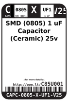
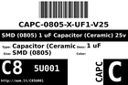
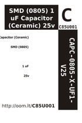

Contents
========

* [C85U001 > SMD (0805) 1 uF Capacitor (Ceramic) 25v](#c85u001--smd-0805-1-uf-capacitor-ceramic-25v)
	* [Datasheets](#datasheets)
	* [Labels](#labels)
	* [EDA](#eda)
	* [Images](#images)
	* [Tags](#tags)
  
![][im]
# C85U001 > SMD (0805) 1 uF Capacitor (Ceramic) 25v

- ID: CAPC-0805-X-UF1-V25
- Hex ID: C85U001
- Name: SMD (0805) 1 uF Capacitor (Ceramic) 25v
- Description: SMD (0805) 1 uF Capacitor (Ceramic) 25v
- Long Link: [http://oom.lt/CAPC-0805-X-UF1-V25](http://oom.lt/CAPC-0805-X-UF1-V25)
- Short Link: [http://oom.lt/C85U001](http://oom.lt/C85U001)

## Datasheets

- Datasheet: [datasheet.pdf](datasheet.pdf)

## Labels
  
  

|label-front|label-inventory|label-spec|
| :---: | :---: | :---: |
||||

## EDA

### Instances
  
  
Used 127 times.  
Prevalance: (127\9905) 1.2822%  

|OOMP Instances|
| :---: |
|[PROJ-ADAF-1060-STAN-01  Adafruit Flora Smart NeoPixel  Used 1 times. C1](https://github.com/oomlout/oomlout_OOMP_projects/tree/main/PROJ-ADAF-1060-STAN-01/)|
|[PROJ-ADAF-1083-STAN-01  ADS1X15 Breakout Board PCBs  Used 2 times. C1, C2](https://github.com/oomlout/oomlout_OOMP_projects/tree/main/PROJ-ADAF-1083-STAN-01/)|
|[PROJ-ADAF-1393-STAN-01  Adafruit Sharp Memory Display PCBs  Used 2 times. C2, C3](https://github.com/oomlout/oomlout_OOMP_projects/tree/main/PROJ-ADAF-1393-STAN-01/)|
|[PROJ-ADAF-1510-STAN-01  Adafruit CC3000 Breakout PCB  Used 2 times. C4, C5](https://github.com/oomlout/oomlout_OOMP_projects/tree/main/PROJ-ADAF-1510-STAN-01/)|
|[PROJ-ADAF-1552-STAN-01  Adafruit TPA2012 or TS2012 Breakout PCB  Used 4 times. C5, C6, C7, C8](https://github.com/oomlout/oomlout_OOMP_projects/tree/main/PROJ-ADAF-1552-STAN-01/)|
|[PROJ-ADAF-1590-STAN-01  Adafruit RA8875 Breakout Board PCB  Used 2 times. C17, C20](https://github.com/oomlout/oomlout_OOMP_projects/tree/main/PROJ-ADAF-1590-STAN-01/)|
|[PROJ-ADAF-1673-STAN-01  Adafruit 1.27inch Color OLED Breakout PCB  Used 2 times. C3, C4](https://github.com/oomlout/oomlout_OOMP_projects/tree/main/PROJ-ADAF-1673-STAN-01/)|
|[PROJ-ADAF-1697-STAN-01  Adafruit Bluefruit LE nRF8001 PCB  Used 1 times. C7](https://github.com/oomlout/oomlout_OOMP_projects/tree/main/PROJ-ADAF-1697-STAN-01/)|
|[PROJ-ADAF-1712-STAN-01  Adafruit TPA2016 PCB  Used 4 times. C5, C6, C7, C8](https://github.com/oomlout/oomlout_OOMP_projects/tree/main/PROJ-ADAF-1712-STAN-01/)|
|[PROJ-ADAF-1788-STAN-01  Adafruit Music Maker MP3 Shield PCB  Used 5 times. C12, C13, C14, C15, C17](https://github.com/oomlout/oomlout_OOMP_projects/tree/main/PROJ-ADAF-1788-STAN-01/)|
|[PROJ-ADAF-2050-STAN-01  3.5inch TFT Breakout PCB  Used 1 times. C20](https://github.com/oomlout/oomlout_OOMP_projects/tree/main/PROJ-ADAF-2050-STAN-01/)|
|[PROJ-ADAF-2130-STAN-01  Adafruit PAM8302 Mono Amplifier PCB  Used 2 times. C1, C2](https://github.com/oomlout/oomlout_OOMP_projects/tree/main/PROJ-ADAF-2130-STAN-01/)|
|[PROJ-ADAF-2133-STAN-01  Adafruit Audio FX Sound Board PCBs  Used 2 times. C3, C10](https://github.com/oomlout/oomlout_OOMP_projects/tree/main/PROJ-ADAF-2133-STAN-01/)|
|[PROJ-ADAF-2218-STAN-01  Adafruit TFP401 HDMI To 40Pin TFT PCB  Used 2 times. C17, C18](https://github.com/oomlout/oomlout_OOMP_projects/tree/main/PROJ-ADAF-2218-STAN-01/)|
|[PROJ-ADAF-2260-STAN-01  Adafruit 5 HDMI Backpack PCB  Used 3 times. C17, C18, C25](https://github.com/oomlout/oomlout_OOMP_projects/tree/main/PROJ-ADAF-2260-STAN-01/)|
|[PROJ-ADAF-2267-STAN-01  Adafruit Bluefruit LE USB Friend and Sniffer PCB  Used 2 times. C1, C2](https://github.com/oomlout/oomlout_OOMP_projects/tree/main/PROJ-ADAF-2267-STAN-01/)|
|[PROJ-ADAF-2305-STAN-01  Adafruit DRV2605 PCB  Used 2 times. C1, C2](https://github.com/oomlout/oomlout_OOMP_projects/tree/main/PROJ-ADAF-2305-STAN-01/)|
|[PROJ-ADAF-2406-STAN-01  Adafruit 7 HDMI Backpack PCB  Used 3 times. C17, C18, C25](https://github.com/oomlout/oomlout_OOMP_projects/tree/main/PROJ-ADAF-2406-STAN-01/)|
|[PROJ-ADAF-2441-STAN-01  Adafruit PiTFT 3.5 Plus PCB  Used 1 times. C20](https://github.com/oomlout/oomlout_OOMP_projects/tree/main/PROJ-ADAF-2441-STAN-01/)|
|[PROJ-ADAF-2453-STAN-01  Adafruit DPI Kippah PCB  Used 2 times. C2, C8](https://github.com/oomlout/oomlout_OOMP_projects/tree/main/PROJ-ADAF-2453-STAN-01/)|
|[PROJ-ADAF-2479-STAN-01  Adafruit Bluefruit LE UART Friend PCB  Used 2 times. C1, C2](https://github.com/oomlout/oomlout_OOMP_projects/tree/main/PROJ-ADAF-2479-STAN-01/)|
|[PROJ-ADAF-2487-STAN-01  Adafruit Flora Bluefruit LE PCB  Used 2 times. C1, C2](https://github.com/oomlout/oomlout_OOMP_projects/tree/main/PROJ-ADAF-2487-STAN-01/)|
|[PROJ-ADAF-2661-STAN-01  Adafruit Bluefruit LE Micro PCB  Used 2 times. C2, C9](https://github.com/oomlout/oomlout_OOMP_projects/tree/main/PROJ-ADAF-2661-STAN-01/)|
|[PROJ-ADAF-2746-STAN-01  Adafruit Bluefruit LE Shield PCB  Used 1 times. C2](https://github.com/oomlout/oomlout_OOMP_projects/tree/main/PROJ-ADAF-2746-STAN-01/)|
|[PROJ-ADAF-2900-STAN-01  Adafruit OLED FeatherWing PCB  Used 2 times. C1, C2](https://github.com/oomlout/oomlout_OOMP_projects/tree/main/PROJ-ADAF-2900-STAN-01/)|
|[PROJ-ADAF-3028-STAN-01  Adafruit DS3231 Precision RTC FeatherWing PCB  Used 1 times. C1](https://github.com/oomlout/oomlout_OOMP_projects/tree/main/PROJ-ADAF-3028-STAN-01/)|
|[PROJ-ADAF-326-STAN-01  Adafruit 128x64 Monochrome OLED PCB  Used 3 times. C1, C2, C4](https://github.com/oomlout/oomlout_OOMP_projects/tree/main/PROJ-ADAF-326-STAN-01/)|
|[PROJ-ADAF-3421-STAN-01  Adafruit I2S Microphone Breakout PCB  Used 1 times. C4](https://github.com/oomlout/oomlout_OOMP_projects/tree/main/PROJ-ADAF-3421-STAN-01/)|
|[PROJ-ADAF-3435-STAN-01  Adafruit TPL5110 Power Timer Breakout PCB  Used 1 times. C1](https://github.com/oomlout/oomlout_OOMP_projects/tree/main/PROJ-ADAF-3435-STAN-01/)|
|[PROJ-ADAF-3505-STAN-01  Adafruit Metro M0 Express PCB  Used 1 times. C1](https://github.com/oomlout/oomlout_OOMP_projects/tree/main/PROJ-ADAF-3505-STAN-01/)|
|[PROJ-ADAF-3527-STAN-01  Adafruit PiOLED 128x32 PCB  Used 2 times. C2, C3](https://github.com/oomlout/oomlout_OOMP_projects/tree/main/PROJ-ADAF-3527-STAN-01/)|
|[PROJ-ADAF-3538-STAN-01  Adafruit AMG8833 Breakout PCB  Used 1 times. C2](https://github.com/oomlout/oomlout_OOMP_projects/tree/main/PROJ-ADAF-3538-STAN-01/)|
|[PROJ-ADAF-3651-STAN-01  Adafruit 3.5in TFT Featherwing PCB  Used 3 times. C1, C16, C20](https://github.com/oomlout/oomlout_OOMP_projects/tree/main/PROJ-ADAF-3651-STAN-01/)|
|[PROJ-ADAF-3661-STAN-01  Adafruit AP3602A PCB  Used 1 times. C3](https://github.com/oomlout/oomlout_OOMP_projects/tree/main/PROJ-ADAF-3661-STAN-01/)|
|[PROJ-ADAF-391-STAN-01  Adafruit BMP085 PCB  Used 2 times. C1, C2](https://github.com/oomlout/oomlout_OOMP_projects/tree/main/PROJ-ADAF-391-STAN-01/)|
|[PROJ-ADAF-4172-STAN-01  Adafruit ESP32 HUZZAH Breakout PCB  Used 1 times. C5](https://github.com/oomlout/oomlout_OOMP_projects/tree/main/PROJ-ADAF-4172-STAN-01/)|
|[PROJ-ADAF-4428-STAN-01  Adafruit Circuit Playground Tri Color E Ink Gizmo PCB  Used 4 times. C9, C13, C16, C24](https://github.com/oomlout/oomlout_OOMP_projects/tree/main/PROJ-ADAF-4428-STAN-01/)|
|[PROJ-ADAF-4632-STAN-01  Adafruit PMSA003I PCB  Used 1 times. C6](https://github.com/oomlout/oomlout_OOMP_projects/tree/main/PROJ-ADAF-4632-STAN-01/)|
|[PROJ-ADAF-4686-STAN-01  Adafruit TMP235 PCB  Used 1 times. C1](https://github.com/oomlout/oomlout_OOMP_projects/tree/main/PROJ-ADAF-4686-STAN-01/)|
|[PROJ-ADAF-4687-STAN-01  Adafruit 2 13in eInk Bonnet PCB  Used 2 times. C16, C24](https://github.com/oomlout/oomlout_OOMP_projects/tree/main/PROJ-ADAF-4687-STAN-01/)|
|[PROJ-ADAF-4800-STAN-01  Adafruit_MagTag_PCBs  Used 9 times. C19, C23, C24, C25, C26, C27, C28, C30, C31](https://github.com/oomlout/oomlout_OOMP_projects/tree/main/PROJ-ADAF-4800-STAN-01/)|
|[PROJ-ADAF-5296-STAN-01  Adafruit LED Arcade Button 1x4 PCB  Used 1 times. C10](https://github.com/oomlout/oomlout_OOMP_projects/tree/main/PROJ-ADAF-5296-STAN-01/)|
|[PROJ-ADAF-661-STAN-01  Adafruit 128x32 SPI OLED breakout board PCB  Used 4 times. C1, C2, C3, C4](https://github.com/oomlout/oomlout_OOMP_projects/tree/main/PROJ-ADAF-661-STAN-01/)|
|[PROJ-ADAF-931-STAN-01  Adafruit 128x32 I2C OLED Breakout PCB  Used 4 times. C1, C2, C3, C4](https://github.com/oomlout/oomlout_OOMP_projects/tree/main/PROJ-ADAF-931-STAN-01/)|
|[PROJ-ADAF-987-STAN-01  Adafruit MAX98306 Class D Amp PCB  Used 4 times. C2, C3, C4, C5](https://github.com/oomlout/oomlout_OOMP_projects/tree/main/PROJ-ADAF-987-STAN-01/)|
|[PROJ-ADAF-992-STAN-01  Adafruit MPL115A2 Breakout PCB  Used 2 times. C1, C2](https://github.com/oomlout/oomlout_OOMP_projects/tree/main/PROJ-ADAF-992-STAN-01/)|
|[PROJ-SPAR-10507-STAN-01  Quadstepper Motor Driver  Used 1 times. C4](https://github.com/oomlout/oomlout_OOMP_projects/tree/main/PROJ-SPAR-10507-STAN-01/)|
|[PROJ-SPAR-11850-STAN-01  PicoBuck  Used 3 times. C1, C3, C5](https://github.com/oomlout/oomlout_OOMP_projects/tree/main/PROJ-SPAR-11850-STAN-01/)|
|[PROJ-SPAR-11924-STAN-01  Purpletooth Jamboree  Used 1 times. C2](https://github.com/oomlout/oomlout_OOMP_projects/tree/main/PROJ-SPAR-11924-STAN-01/)|
|[PROJ-SPAR-11927-STAN-01  BC127 Breakout Board  Used 1 times. C2](https://github.com/oomlout/oomlout_OOMP_projects/tree/main/PROJ-SPAR-11927-STAN-01/)|
|[PROJ-SPAR-12071-STAN-01  CC3000 WiFi Shield  Used 2 times. C4, C5](https://github.com/oomlout/oomlout_OOMP_projects/tree/main/PROJ-SPAR-12071-STAN-01/)|
|[PROJ-SPAR-13287-STAN-01  ESP8266 WiFi Shield  Used 1 times. C2](https://github.com/oomlout/oomlout_OOMP_projects/tree/main/PROJ-SPAR-13287-STAN-01/)|
|[PROJ-SPAR-13628-STAN-01  Photon OLED Shield  Used 2 times. C2, C3](https://github.com/oomlout/oomlout_OOMP_projects/tree/main/PROJ-SPAR-13628-STAN-01/)|
|[PROJ-SPAR-13664-STAN-01  SAMD21 Mini Breakout  Used 1 times. C7](https://github.com/oomlout/oomlout_OOMP_projects/tree/main/PROJ-SPAR-13664-STAN-01/)|
|[PROJ-SPAR-13672-STAN-01  SAMD21 Dev Breakout  Used 1 times. C3](https://github.com/oomlout/oomlout_OOMP_projects/tree/main/PROJ-SPAR-13672-STAN-01/)|
|[PROJ-SPAR-13711-STAN-01  ESP8266 Thing Dev 4H  Used 1 times. C5](https://github.com/oomlout/oomlout_OOMP_projects/tree/main/PROJ-SPAR-13711-STAN-01/)|
|[PROJ-SPAR-13794-STAN-01  Blynk Board ESP8266  Used 1 times. C7](https://github.com/oomlout/oomlout_OOMP_projects/tree/main/PROJ-SPAR-13794-STAN-01/)|
|[PROJ-SPAR-14030-STAN-01  Mini GPS Shield  Used 1 times. C5](https://github.com/oomlout/oomlout_OOMP_projects/tree/main/PROJ-SPAR-14030-STAN-01/)|
|[PROJ-SPAR-14051-STAN-01  Wireless Joystick  Used 1 times. C1](https://github.com/oomlout/oomlout_OOMP_projects/tree/main/PROJ-SPAR-14051-STAN-01/)|
|[PROJ-SPAR-14130-STAN-01  Roshamglo  Used 1 times. C5](https://github.com/oomlout/oomlout_OOMP_projects/tree/main/PROJ-SPAR-14130-STAN-01/)|
|[PROJ-SPAR-14532-STAN-01  Qwiic Micro OLED  Used 2 times. C2, C3](https://github.com/oomlout/oomlout_OOMP_projects/tree/main/PROJ-SPAR-14532-STAN-01/)|
|[PROJ-SPAR-14606-STAN-01  Flexible Grayscale OLED  Used 1 times. C2](https://github.com/oomlout/oomlout_OOMP_projects/tree/main/PROJ-SPAR-14606-STAN-01/)|
|[PROJ-SPAR-14691-STAN-01  Qwiic Transparent OLED HUD  Used 1 times. C7](https://github.com/oomlout/oomlout_OOMP_projects/tree/main/PROJ-SPAR-14691-STAN-01/)|
|[PROJ-SPAR-14779-STAN-01  LumiDrive  Used 1 times. C8](https://github.com/oomlout/oomlout_OOMP_projects/tree/main/PROJ-SPAR-14779-STAN-01/)|
|[PROJ-SPAR-14812-STAN-01  RedBoard Turbo  Used 1 times. C3](https://github.com/oomlout/oomlout_OOMP_projects/tree/main/PROJ-SPAR-14812-STAN-01/)|

### Symbols

## Images
  
  

|image|image_RE|label-front|label-inventory|label-spec|
| :---: | :---: | :---: | :---: | :---: |
||||||

## Tags

- oompID: CAPC-0805-X-UF1-V25
- name: SMD (0805) 1 uF Capacitor (Ceramic) 25v
- hexID: C85U001
- oompType: CAPC
- oompSize: 0805
- oompColor: X
- oompDesc: UF1
- oompIndex: V25
- oompVersion: 999
- ooWidth: 1.25mm
- ooHeight: 1.25mm
- ooLength: 2mm
- oompBbls: template;XXXX-0805-X-XXXX-XX-bbls
- oompDiag: template;XXXX-0805-X-XXXX-XX-diag
- oompIden: template;XXXX-0805-X-XXXX-XX-iden
- oompSchem: template;CAPC-XXXX-X-XXXX-XX-schem
- oompSimp: template;XXXX-0805-X-XXXX-XX-simp
- ooDesignator: C1
- oompInstances: {'PROJECT': 'PROJ-ADAF-1060-STAN-01', 'ID': 'C1'}
- oompInstances: {'PROJECT': 'PROJ-ADAF-1083-STAN-01', 'ID': 'C1'}
- oompInstances: {'PROJECT': 'PROJ-ADAF-1083-STAN-01', 'ID': 'C2'}
- oompInstances: {'PROJECT': 'PROJ-ADAF-1393-STAN-01', 'ID': 'C2'}
- oompInstances: {'PROJECT': 'PROJ-ADAF-1393-STAN-01', 'ID': 'C3'}
- oompInstances: {'PROJECT': 'PROJ-ADAF-1510-STAN-01', 'ID': 'C4'}
- oompInstances: {'PROJECT': 'PROJ-ADAF-1510-STAN-01', 'ID': 'C5'}
- oompInstances: {'PROJECT': 'PROJ-ADAF-1552-STAN-01', 'ID': 'C5'}
- oompInstances: {'PROJECT': 'PROJ-ADAF-1552-STAN-01', 'ID': 'C6'}
- oompInstances: {'PROJECT': 'PROJ-ADAF-1552-STAN-01', 'ID': 'C7'}
- oompInstances: {'PROJECT': 'PROJ-ADAF-1552-STAN-01', 'ID': 'C8'}
- oompInstances: {'PROJECT': 'PROJ-ADAF-1590-STAN-01', 'ID': 'C17'}
- oompInstances: {'PROJECT': 'PROJ-ADAF-1590-STAN-01', 'ID': 'C20'}
- oompInstances: {'PROJECT': 'PROJ-ADAF-1673-STAN-01', 'ID': 'C3'}
- oompInstances: {'PROJECT': 'PROJ-ADAF-1673-STAN-01', 'ID': 'C4'}
- oompInstances: {'PROJECT': 'PROJ-ADAF-1697-STAN-01', 'ID': 'C7'}
- oompInstances: {'PROJECT': 'PROJ-ADAF-1712-STAN-01', 'ID': 'C5'}
- oompInstances: {'PROJECT': 'PROJ-ADAF-1712-STAN-01', 'ID': 'C6'}
- oompInstances: {'PROJECT': 'PROJ-ADAF-1712-STAN-01', 'ID': 'C7'}
- oompInstances: {'PROJECT': 'PROJ-ADAF-1712-STAN-01', 'ID': 'C8'}
- oompInstances: {'PROJECT': 'PROJ-ADAF-1788-STAN-01', 'ID': 'C12'}
- oompInstances: {'PROJECT': 'PROJ-ADAF-1788-STAN-01', 'ID': 'C13'}
- oompInstances: {'PROJECT': 'PROJ-ADAF-1788-STAN-01', 'ID': 'C14'}
- oompInstances: {'PROJECT': 'PROJ-ADAF-1788-STAN-01', 'ID': 'C15'}
- oompInstances: {'PROJECT': 'PROJ-ADAF-1788-STAN-01', 'ID': 'C17'}
- oompInstances: {'PROJECT': 'PROJ-ADAF-2050-STAN-01', 'ID': 'C20'}
- oompInstances: {'PROJECT': 'PROJ-ADAF-2130-STAN-01', 'ID': 'C1'}
- oompInstances: {'PROJECT': 'PROJ-ADAF-2130-STAN-01', 'ID': 'C2'}
- oompInstances: {'PROJECT': 'PROJ-ADAF-2133-STAN-01', 'ID': 'C3'}
- oompInstances: {'PROJECT': 'PROJ-ADAF-2133-STAN-01', 'ID': 'C10'}
- oompInstances: {'PROJECT': 'PROJ-ADAF-2218-STAN-01', 'ID': 'C17'}
- oompInstances: {'PROJECT': 'PROJ-ADAF-2218-STAN-01', 'ID': 'C18'}
- oompInstances: {'PROJECT': 'PROJ-ADAF-2260-STAN-01', 'ID': 'C17'}
- oompInstances: {'PROJECT': 'PROJ-ADAF-2260-STAN-01', 'ID': 'C18'}
- oompInstances: {'PROJECT': 'PROJ-ADAF-2260-STAN-01', 'ID': 'C25'}
- oompInstances: {'PROJECT': 'PROJ-ADAF-2267-STAN-01', 'ID': 'C1'}
- oompInstances: {'PROJECT': 'PROJ-ADAF-2267-STAN-01', 'ID': 'C2'}
- oompInstances: {'PROJECT': 'PROJ-ADAF-2305-STAN-01', 'ID': 'C1'}
- oompInstances: {'PROJECT': 'PROJ-ADAF-2305-STAN-01', 'ID': 'C2'}
- oompInstances: {'PROJECT': 'PROJ-ADAF-2406-STAN-01', 'ID': 'C17'}
- oompInstances: {'PROJECT': 'PROJ-ADAF-2406-STAN-01', 'ID': 'C18'}
- oompInstances: {'PROJECT': 'PROJ-ADAF-2406-STAN-01', 'ID': 'C25'}
- oompInstances: {'PROJECT': 'PROJ-ADAF-2441-STAN-01', 'ID': 'C20'}
- oompInstances: {'PROJECT': 'PROJ-ADAF-2453-STAN-01', 'ID': 'C2'}
- oompInstances: {'PROJECT': 'PROJ-ADAF-2453-STAN-01', 'ID': 'C8'}
- oompInstances: {'PROJECT': 'PROJ-ADAF-2479-STAN-01', 'ID': 'C1'}
- oompInstances: {'PROJECT': 'PROJ-ADAF-2479-STAN-01', 'ID': 'C2'}
- oompInstances: {'PROJECT': 'PROJ-ADAF-2487-STAN-01', 'ID': 'C1'}
- oompInstances: {'PROJECT': 'PROJ-ADAF-2487-STAN-01', 'ID': 'C2'}
- oompInstances: {'PROJECT': 'PROJ-ADAF-2661-STAN-01', 'ID': 'C2'}
- oompInstances: {'PROJECT': 'PROJ-ADAF-2661-STAN-01', 'ID': 'C9'}
- oompInstances: {'PROJECT': 'PROJ-ADAF-2746-STAN-01', 'ID': 'C2'}
- oompInstances: {'PROJECT': 'PROJ-ADAF-2900-STAN-01', 'ID': 'C1'}
- oompInstances: {'PROJECT': 'PROJ-ADAF-2900-STAN-01', 'ID': 'C2'}
- oompInstances: {'PROJECT': 'PROJ-ADAF-3028-STAN-01', 'ID': 'C1'}
- oompInstances: {'PROJECT': 'PROJ-ADAF-326-STAN-01', 'ID': 'C1'}
- oompInstances: {'PROJECT': 'PROJ-ADAF-326-STAN-01', 'ID': 'C2'}
- oompInstances: {'PROJECT': 'PROJ-ADAF-326-STAN-01', 'ID': 'C4'}
- oompInstances: {'PROJECT': 'PROJ-ADAF-3421-STAN-01', 'ID': 'C4'}
- oompInstances: {'PROJECT': 'PROJ-ADAF-3435-STAN-01', 'ID': 'C1'}
- oompInstances: {'PROJECT': 'PROJ-ADAF-3505-STAN-01', 'ID': 'C1'}
- oompInstances: {'PROJECT': 'PROJ-ADAF-3527-STAN-01', 'ID': 'C2'}
- oompInstances: {'PROJECT': 'PROJ-ADAF-3527-STAN-01', 'ID': 'C3'}
- oompInstances: {'PROJECT': 'PROJ-ADAF-3538-STAN-01', 'ID': 'C2'}
- oompInstances: {'PROJECT': 'PROJ-ADAF-3651-STAN-01', 'ID': 'C1'}
- oompInstances: {'PROJECT': 'PROJ-ADAF-3651-STAN-01', 'ID': 'C16'}
- oompInstances: {'PROJECT': 'PROJ-ADAF-3651-STAN-01', 'ID': 'C20'}
- oompInstances: {'PROJECT': 'PROJ-ADAF-3661-STAN-01', 'ID': 'C3'}
- oompInstances: {'PROJECT': 'PROJ-ADAF-391-STAN-01', 'ID': 'C1'}
- oompInstances: {'PROJECT': 'PROJ-ADAF-391-STAN-01', 'ID': 'C2'}
- oompInstances: {'PROJECT': 'PROJ-ADAF-4172-STAN-01', 'ID': 'C5'}
- oompInstances: {'PROJECT': 'PROJ-ADAF-4428-STAN-01', 'ID': 'C9'}
- oompInstances: {'PROJECT': 'PROJ-ADAF-4428-STAN-01', 'ID': 'C13'}
- oompInstances: {'PROJECT': 'PROJ-ADAF-4428-STAN-01', 'ID': 'C16'}
- oompInstances: {'PROJECT': 'PROJ-ADAF-4428-STAN-01', 'ID': 'C24'}
- oompInstances: {'PROJECT': 'PROJ-ADAF-4632-STAN-01', 'ID': 'C6'}
- oompInstances: {'PROJECT': 'PROJ-ADAF-4686-STAN-01', 'ID': 'C1'}
- oompInstances: {'PROJECT': 'PROJ-ADAF-4687-STAN-01', 'ID': 'C16'}
- oompInstances: {'PROJECT': 'PROJ-ADAF-4687-STAN-01', 'ID': 'C24'}
- oompInstances: {'PROJECT': 'PROJ-ADAF-4800-STAN-01', 'ID': 'C19'}
- oompInstances: {'PROJECT': 'PROJ-ADAF-4800-STAN-01', 'ID': 'C23'}
- oompInstances: {'PROJECT': 'PROJ-ADAF-4800-STAN-01', 'ID': 'C24'}
- oompInstances: {'PROJECT': 'PROJ-ADAF-4800-STAN-01', 'ID': 'C25'}
- oompInstances: {'PROJECT': 'PROJ-ADAF-4800-STAN-01', 'ID': 'C26'}
- oompInstances: {'PROJECT': 'PROJ-ADAF-4800-STAN-01', 'ID': 'C27'}
- oompInstances: {'PROJECT': 'PROJ-ADAF-4800-STAN-01', 'ID': 'C28'}
- oompInstances: {'PROJECT': 'PROJ-ADAF-4800-STAN-01', 'ID': 'C30'}
- oompInstances: {'PROJECT': 'PROJ-ADAF-4800-STAN-01', 'ID': 'C31'}
- oompInstances: {'PROJECT': 'PROJ-ADAF-5296-STAN-01', 'ID': 'C10'}
- oompInstances: {'PROJECT': 'PROJ-ADAF-661-STAN-01', 'ID': 'C1'}
- oompInstances: {'PROJECT': 'PROJ-ADAF-661-STAN-01', 'ID': 'C2'}
- oompInstances: {'PROJECT': 'PROJ-ADAF-661-STAN-01', 'ID': 'C3'}
- oompInstances: {'PROJECT': 'PROJ-ADAF-661-STAN-01', 'ID': 'C4'}
- oompInstances: {'PROJECT': 'PROJ-ADAF-931-STAN-01', 'ID': 'C1'}
- oompInstances: {'PROJECT': 'PROJ-ADAF-931-STAN-01', 'ID': 'C2'}
- oompInstances: {'PROJECT': 'PROJ-ADAF-931-STAN-01', 'ID': 'C3'}
- oompInstances: {'PROJECT': 'PROJ-ADAF-931-STAN-01', 'ID': 'C4'}
- oompInstances: {'PROJECT': 'PROJ-ADAF-987-STAN-01', 'ID': 'C2'}
- oompInstances: {'PROJECT': 'PROJ-ADAF-987-STAN-01', 'ID': 'C3'}
- oompInstances: {'PROJECT': 'PROJ-ADAF-987-STAN-01', 'ID': 'C4'}
- oompInstances: {'PROJECT': 'PROJ-ADAF-987-STAN-01', 'ID': 'C5'}
- oompInstances: {'PROJECT': 'PROJ-ADAF-992-STAN-01', 'ID': 'C1'}
- oompInstances: {'PROJECT': 'PROJ-ADAF-992-STAN-01', 'ID': 'C2'}
- oompInstances: {'PROJECT': 'PROJ-SPAR-10507-STAN-01', 'ID': 'C4'}
- oompInstances: {'PROJECT': 'PROJ-SPAR-11850-STAN-01', 'ID': 'C1'}
- oompInstances: {'PROJECT': 'PROJ-SPAR-11850-STAN-01', 'ID': 'C3'}
- oompInstances: {'PROJECT': 'PROJ-SPAR-11850-STAN-01', 'ID': 'C5'}
- oompInstances: {'PROJECT': 'PROJ-SPAR-11924-STAN-01', 'ID': 'C2'}
- oompInstances: {'PROJECT': 'PROJ-SPAR-11927-STAN-01', 'ID': 'C2'}
- oompInstances: {'PROJECT': 'PROJ-SPAR-12071-STAN-01', 'ID': 'C4'}
- oompInstances: {'PROJECT': 'PROJ-SPAR-12071-STAN-01', 'ID': 'C5'}
- oompInstances: {'PROJECT': 'PROJ-SPAR-13287-STAN-01', 'ID': 'C2'}
- oompInstances: {'PROJECT': 'PROJ-SPAR-13628-STAN-01', 'ID': 'C2'}
- oompInstances: {'PROJECT': 'PROJ-SPAR-13628-STAN-01', 'ID': 'C3'}
- oompInstances: {'PROJECT': 'PROJ-SPAR-13664-STAN-01', 'ID': 'C7'}
- oompInstances: {'PROJECT': 'PROJ-SPAR-13672-STAN-01', 'ID': 'C3'}
- oompInstances: {'PROJECT': 'PROJ-SPAR-13711-STAN-01', 'ID': 'C5'}
- oompInstances: {'PROJECT': 'PROJ-SPAR-13794-STAN-01', 'ID': 'C7'}
- oompInstances: {'PROJECT': 'PROJ-SPAR-14030-STAN-01', 'ID': 'C5'}
- oompInstances: {'PROJECT': 'PROJ-SPAR-14051-STAN-01', 'ID': 'C1'}
- oompInstances: {'PROJECT': 'PROJ-SPAR-14130-STAN-01', 'ID': 'C5'}
- oompInstances: {'PROJECT': 'PROJ-SPAR-14532-STAN-01', 'ID': 'C2'}
- oompInstances: {'PROJECT': 'PROJ-SPAR-14532-STAN-01', 'ID': 'C3'}
- oompInstances: {'PROJECT': 'PROJ-SPAR-14606-STAN-01', 'ID': 'C2'}
- oompInstances: {'PROJECT': 'PROJ-SPAR-14691-STAN-01', 'ID': 'C7'}
- oompInstances: {'PROJECT': 'PROJ-SPAR-14779-STAN-01', 'ID': 'C8'}
- oompInstances: {'PROJECT': 'PROJ-SPAR-14812-STAN-01', 'ID': 'C3'}

[im]: image_450.jpg
