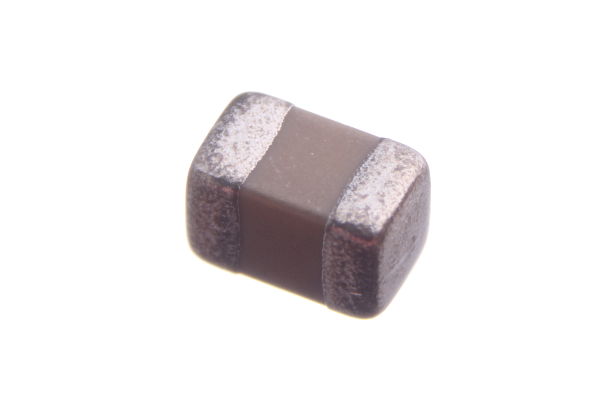
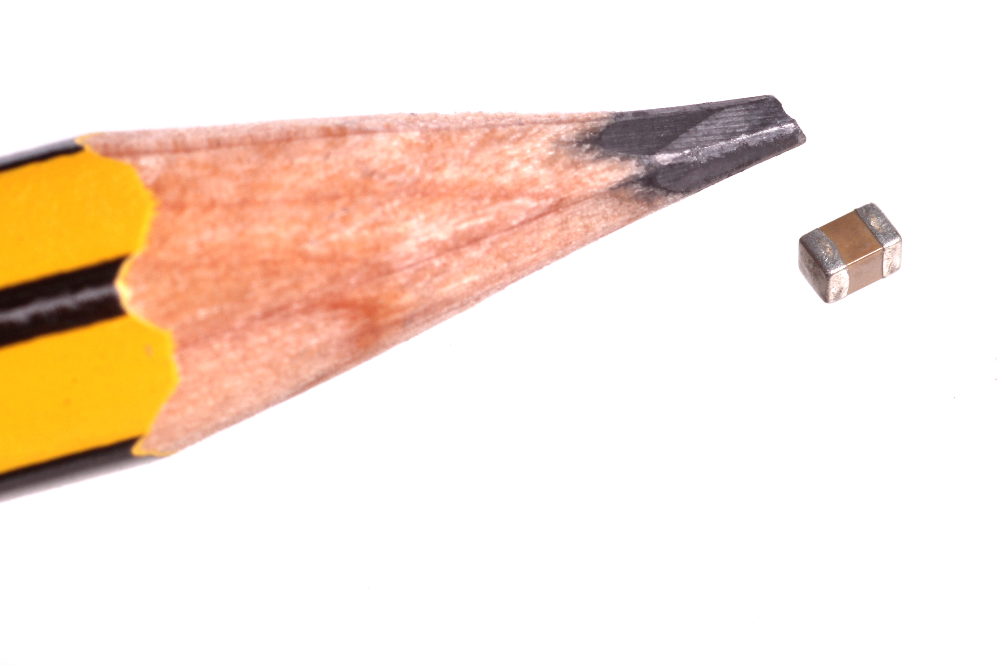
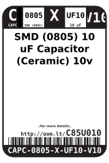
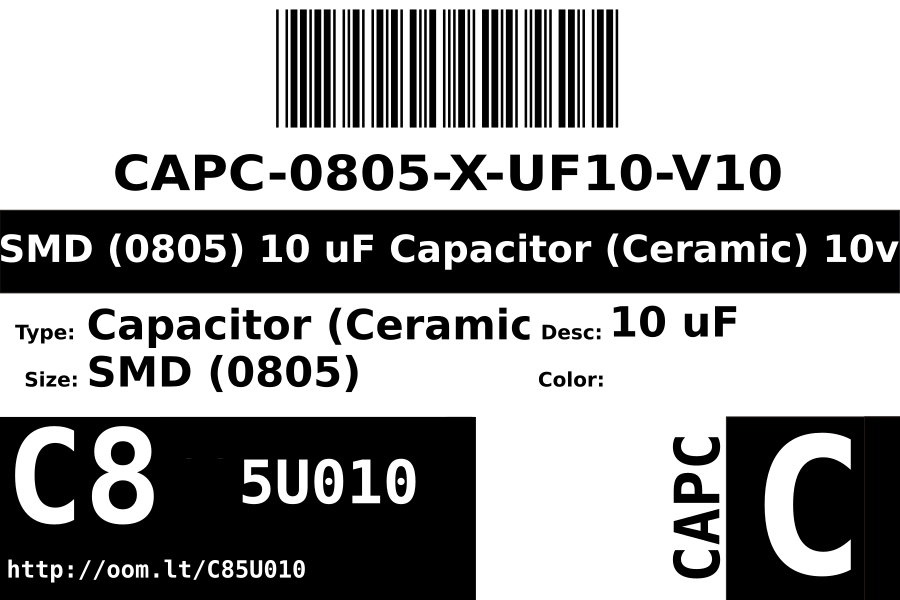
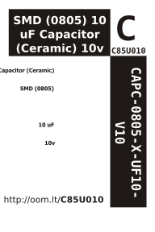

Contents
========

* [CAPC-0805-X-UF10-V10>SMD (0805) 10 uF Capacitor (Ceramic) 10v](#capc-0805-x-uf10-v10smd-0805-10-uf-capacitor-ceramic-10v)
	* [Images](#images)
	* [Datasheets](#datasheets)
	* [Labels](#labels)
	* [EDA](#eda)
		* [Symbols](#symbols)
	* [Tags](#tags)
  
![][im]
# CAPC-0805-X-UF10-V10>SMD (0805) 10 uF Capacitor (Ceramic) 10v

- ID: CAPC-0805-X-UF10-V10
- Name: CAPC-0805-X-UF10-V10

## Images
  
  

|Main|Reference|
| :---: | :---: |
|||

## Datasheets

- Datasheet: [datasheet.pdf](datasheet.pdf)

## Labels
  
  

|Front|Inventory|Specifications|
| :---: | :---: | :---: |
||||

## EDA

### Symbols

## Tags

- index: 12380
- oompID: CAPC-0805-X-UF10-V10
- name: SMD (0805) 10 uF Capacitor (Ceramic) 10v
- hexID: C85U010
- oompSort: CAPC0805UF10
- oompType: CAPC
- oompSize: 0805
- oompColor: X
- oompDesc: UF10
- oompIndex: V10
- oompVersion: 98
- oompBbls: template;XXXX-0805-X-XXXX-XX-bbls
- oompDiag: template;XXXX-0805-X-XXXX-XX-diag
- oompIden: template;XXXX-0805-X-XXXX-XX-iden
- oompSchem: template;CAPC-XXXX-X-XXXX-XX-schem
- oompSimp: template;XXXX-0805-X-XXXX-XX-simp
- ooDesignator: C1

[im]: image_600.jpg
