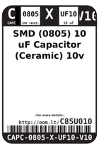
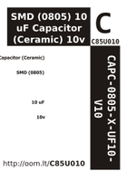

Contents
========

* [C85U010 > SMD (0805) 10 uF Capacitor (Ceramic) 10v](#c85u010--smd-0805-10-uf-capacitor-ceramic-10v)
	* [Datasheets](#datasheets)
	* [Labels](#labels)
	* [EDA](#eda)
	* [Images](#images)
	* [Tags](#tags)
  
![][im]
# C85U010 > SMD (0805) 10 uF Capacitor (Ceramic) 10v

- ID: CAPC-0805-X-UF10-V10
- Hex ID: C85U010
- Name: SMD (0805) 10 uF Capacitor (Ceramic) 10v
- Description: SMD (0805) 10 uF Capacitor (Ceramic) 10v
- Long Link: [http://oom.lt/CAPC-0805-X-UF10-V10](http://oom.lt/CAPC-0805-X-UF10-V10)
- Short Link: [http://oom.lt/C85U010](http://oom.lt/C85U010)

## Datasheets

- Datasheet: [datasheet.pdf](datasheet.pdf)

## Labels
  
  

|label-front|label-inventory|label-spec|
| :---: | :---: | :---: |
||||

## EDA

### Footprints
  

|  [kicad/FOOTPRINT-kicad-kicad-footprints-Capacitor_SMD-C_0805_2012Metric](https://github.com/oomlout/oomlout_OOMP_eda/tree/main/footprints/kicad/FOOTPRINT-kicad-kicad-footprints-Capacitor_SMD-C_0805_2012Metric/)|  [kicad/FOOTPRINT-kicad-kicad-footprints-Capacitor_SMD-C_0805_2012Metric_Pad1.18x1.45mm_HandSolder](https://github.com/oomlout/oomlout_OOMP_eda/tree/main/footprints/kicad/FOOTPRINT-kicad-kicad-footprints-Capacitor_SMD-C_0805_2012Metric_Pad1.18x1.45mm_HandSolder/)|  [eagle/FOOTPRINT-eagle-Adafruit-Eagle-Library-adafruit-085CS_1W](https://github.com/oomlout/oomlout_OOMP_eda/tree/main/footprints/eagle/FOOTPRINT-eagle-Adafruit-Eagle-Library-adafruit-085CS_1W/)|  [eagle/FOOTPRINT-eagle-Adafruit-Eagle-Library-adafruit-085CS_1R](https://github.com/oomlout/oomlout_OOMP_eda/tree/main/footprints/eagle/FOOTPRINT-eagle-Adafruit-Eagle-Library-adafruit-085CS_1R/)|
| :---: | :---: | :---: | :---: |
|  [eagle/FOOTPRINT-eagle-Adafruit-Eagle-Library-adafruit-085CS_1AW](https://github.com/oomlout/oomlout_OOMP_eda/tree/main/footprints/eagle/FOOTPRINT-eagle-Adafruit-Eagle-Library-adafruit-085CS_1AW/)|  [eagle/FOOTPRINT-eagle-Adafruit-Eagle-Library-adafruit-085CS_1AR](https://github.com/oomlout/oomlout_OOMP_eda/tree/main/footprints/eagle/FOOTPRINT-eagle-Adafruit-Eagle-Library-adafruit-085CS_1AR/)|  [eagle/FOOTPRINT-eagle-SparkFun-Eagle-Libraries-SparkFun-Capacitors-0805](https://github.com/oomlout/oomlout_OOMP_eda/tree/main/footprints/eagle/FOOTPRINT-eagle-SparkFun-Eagle-Libraries-SparkFun-Capacitors-0805/)|  [eagle/FOOTPRINT-eagle-Pimoroni-Eagle-Library-pimoroni-rc-0805_SENSE](https://github.com/oomlout/oomlout_OOMP_eda/tree/main/footprints/eagle/FOOTPRINT-eagle-Pimoroni-Eagle-Library-pimoroni-rc-0805_SENSE/)|
|  [eagle/FOOTPRINT-eagle-Pimoroni-Eagle-Library-pimoroni-rc-0805](https://github.com/oomlout/oomlout_OOMP_eda/tree/main/footprints/eagle/FOOTPRINT-eagle-Pimoroni-Eagle-Library-pimoroni-rc-0805/)||||

### Instances
  
  
Used 872 times.  
Prevalance: (872\10986) 7.9374%  

|OOMP Instances|
| :---: |
|[PROJ-ADAF-1032-STAN-01  Adafruit L3GD20 Breakout PCB  Used 2 times. C3, C5](https://github.com/oomlout/oomlout_OOMP_projects/tree/main/PROJ-ADAF-1032-STAN-01/)|
|[PROJ-ADAF-1059-STAN-01  Adafruit Flora Ultimate GPS  Used 1 times. C2](https://github.com/oomlout/oomlout_OOMP_projects/tree/main/PROJ-ADAF-1059-STAN-01/)|
|[PROJ-ADAF-1063-STAN-01  Adafruit MAX4466 Electret Mic Amplifier PCBs  Used 1 times. C4](https://github.com/oomlout/oomlout_OOMP_projects/tree/main/PROJ-ADAF-1063-STAN-01/)|
|[PROJ-ADAF-1120-STAN-01  Adafruit LSM303 PCB  Used 2 times. C1, C5](https://github.com/oomlout/oomlout_OOMP_projects/tree/main/PROJ-ADAF-1120-STAN-01/)|
|[PROJ-ADAF-1222-STAN-01  Adafruit Gemma PCB  Used 2 times. C1, C8](https://github.com/oomlout/oomlout_OOMP_projects/tree/main/PROJ-ADAF-1222-STAN-01/)|
|[PROJ-ADAF-1231-STAN-01  Adafruit_ADXL345_PCB  Used 2 times. C2, C3](https://github.com/oomlout/oomlout_OOMP_projects/tree/main/PROJ-ADAF-1231-STAN-01/)|
|[PROJ-ADAF-1247-STAN-01  Adafruit Flora LSM303 PCB  Used 2 times. C2, C4](https://github.com/oomlout/oomlout_OOMP_projects/tree/main/PROJ-ADAF-1247-STAN-01/)|
|[PROJ-ADAF-1296-STAN-01  Adafruit TMP006 and TMP007 PCB  Used 1 times. C1](https://github.com/oomlout/oomlout_OOMP_projects/tree/main/PROJ-ADAF-1296-STAN-01/)|
|[PROJ-ADAF-1334-STAN-01  Adafruit TCS34725 Color Sensor Breakout PCB  Used 2 times. C2, C3](https://github.com/oomlout/oomlout_OOMP_projects/tree/main/PROJ-ADAF-1334-STAN-01/)|
|[PROJ-ADAF-1381-STAN-01  Adafruit VS1053 Breakout PCB  Used 4 times. C6, C7, C19, C20](https://github.com/oomlout/oomlout_OOMP_projects/tree/main/PROJ-ADAF-1381-STAN-01/)|
|[PROJ-ADAF-1393-STAN-01  Adafruit Sharp Memory Display PCBs  Used 2 times. C4, C5](https://github.com/oomlout/oomlout_OOMP_projects/tree/main/PROJ-ADAF-1393-STAN-01/)|
|[PROJ-ADAF-1411-STAN-01  Adafruit 16 channel PWM Servo Shield  Used 1 times. C1](https://github.com/oomlout/oomlout_OOMP_projects/tree/main/PROJ-ADAF-1411-STAN-01/)|
|[PROJ-ADAF-1438-STAN-01  Adafruit Motor Shield V2 PCB  Used 2 times. C6, C10](https://github.com/oomlout/oomlout_OOMP_projects/tree/main/PROJ-ADAF-1438-STAN-01/)|
|[PROJ-ADAF-1480-STAN-01  Adafruit 2.2 SPI TFT  Used 3 times. C1, C2, C3](https://github.com/oomlout/oomlout_OOMP_projects/tree/main/PROJ-ADAF-1480-STAN-01/)|
|[PROJ-ADAF-1500-STAN-01  Adafruit Trinket PCB  Used 2 times. C1, C8](https://github.com/oomlout/oomlout_OOMP_projects/tree/main/PROJ-ADAF-1500-STAN-01/)|
|[PROJ-ADAF-1510-STAN-01  Adafruit CC3000 Breakout PCB  Used 3 times. C6, C7, C8](https://github.com/oomlout/oomlout_OOMP_projects/tree/main/PROJ-ADAF-1510-STAN-01/)|
|[PROJ-ADAF-1535-STAN-01  Adafruit Bluefruit EZ Key PCB  Used 2 times. C1, C4](https://github.com/oomlout/oomlout_OOMP_projects/tree/main/PROJ-ADAF-1535-STAN-01/)|
|[PROJ-ADAF-1552-STAN-01  Adafruit TPA2012 or TS2012 Breakout PCB  Used 1 times. C1](https://github.com/oomlout/oomlout_OOMP_projects/tree/main/PROJ-ADAF-1552-STAN-01/)|
|[PROJ-ADAF-1571-STAN-01  Adafruit STMPE610 Breakout PCB  Used 1 times. C2](https://github.com/oomlout/oomlout_OOMP_projects/tree/main/PROJ-ADAF-1571-STAN-01/)|
|[PROJ-ADAF-1580-STAN-01  Adafruit AR1100 Resistive Touch Controller PCB  Used 2 times. C2, C3](https://github.com/oomlout/oomlout_OOMP_projects/tree/main/PROJ-ADAF-1580-STAN-01/)|
|[PROJ-ADAF-1588-STAN-01  Adafruit Bluefruit Classic PCBs  Used 2 times. C1, C4](https://github.com/oomlout/oomlout_OOMP_projects/tree/main/PROJ-ADAF-1588-STAN-01/)|
|[PROJ-ADAF-1590-STAN-01  Adafruit RA8875 Breakout Board PCB  Used 4 times. C16, C19, C21, C22](https://github.com/oomlout/oomlout_OOMP_projects/tree/main/PROJ-ADAF-1590-STAN-01/)|
|[PROJ-ADAF-1601-STAN-01  Adafruit PiTFT 2.8 inch Display PCB  Used 2 times. C1, C5](https://github.com/oomlout/oomlout_OOMP_projects/tree/main/PROJ-ADAF-1601-STAN-01/)|
|[PROJ-ADAF-1602-STAN-01  Adafruit CAP1188 PCB  Used 2 times. C2, C3](https://github.com/oomlout/oomlout_OOMP_projects/tree/main/PROJ-ADAF-1602-STAN-01/)|
|[PROJ-ADAF-1603-STAN-01  Adafruit BMP180 PCB  Used 2 times. C1, C2](https://github.com/oomlout/oomlout_OOMP_projects/tree/main/PROJ-ADAF-1603-STAN-01/)|
|[PROJ-ADAF-1611-STAN-01  Adafruit_Trellis  Used 1 times. C5](https://github.com/oomlout/oomlout_OOMP_projects/tree/main/PROJ-ADAF-1611-STAN-01/)|
|[PROJ-ADAF-1628-STAN-01  Adafruit Bluefruit EZ Link Shield PCB  Used 2 times. C1, C4](https://github.com/oomlout/oomlout_OOMP_projects/tree/main/PROJ-ADAF-1628-STAN-01/)|
|[PROJ-ADAF-163-STAN-01  Adafruit Analog Accelerometers PCBs  Used 2 times. C4, C5](https://github.com/oomlout/oomlout_OOMP_projects/tree/main/PROJ-ADAF-163-STAN-01/)|
|[PROJ-ADAF-1651-STAN-01  Adafruit 2.8 TFT Shield v2 PCB  Used 3 times. C1, C4, C5](https://github.com/oomlout/oomlout_OOMP_projects/tree/main/PROJ-ADAF-1651-STAN-01/)|
|[PROJ-ADAF-1673-STAN-01  Adafruit 1.27inch Color OLED Breakout PCB  Used 4 times. C5, C6, C7, C9](https://github.com/oomlout/oomlout_OOMP_projects/tree/main/PROJ-ADAF-1673-STAN-01/)|
|[PROJ-ADAF-1697-STAN-01  Adafruit Bluefruit LE nRF8001 PCB  Used 3 times. C9, C16, C17](https://github.com/oomlout/oomlout_OOMP_projects/tree/main/PROJ-ADAF-1697-STAN-01/)|
|[PROJ-ADAF-1712-STAN-01  Adafruit TPA2016 PCB  Used 2 times. C1, C9](https://github.com/oomlout/oomlout_OOMP_projects/tree/main/PROJ-ADAF-1712-STAN-01/)|
|[PROJ-ADAF-1716-STAN-01  Adafruit Qualia Driver PCB  Used 3 times. C1, C12, C13](https://github.com/oomlout/oomlout_OOMP_projects/tree/main/PROJ-ADAF-1716-STAN-01/)|
|[PROJ-ADAF-1727-STAN-01  Adafruit MAX31850 thermocouple breakout board  Used 2 times. C1, C2](https://github.com/oomlout/oomlout_OOMP_projects/tree/main/PROJ-ADAF-1727-STAN-01/)|
|[PROJ-ADAF-1743-STAN-01  Adafruit 3.2 TFT Breakout PCB  Used 3 times. C2, C3, C5](https://github.com/oomlout/oomlout_OOMP_projects/tree/main/PROJ-ADAF-1743-STAN-01/)|
|[PROJ-ADAF-1746-STAN-01  Adafruit HMC5883 Mag Compass Sensor PCB  Used 2 times. C3, C5](https://github.com/oomlout/oomlout_OOMP_projects/tree/main/PROJ-ADAF-1746-STAN-01/)|
|[PROJ-ADAF-1752-STAN-01  Adafruit MAX9744 Amplifier PCB  Used 3 times. C2, C3, C4](https://github.com/oomlout/oomlout_OOMP_projects/tree/main/PROJ-ADAF-1752-STAN-01/)|
|[PROJ-ADAF-1777-STAN-01  Adafruit Si1145 Light Sensor PCB  Used 2 times. C1, C2](https://github.com/oomlout/oomlout_OOMP_projects/tree/main/PROJ-ADAF-1777-STAN-01/)|
|[PROJ-ADAF-1788-STAN-01  Adafruit Music Maker MP3 Shield PCB  Used 6 times. C3, C6, C7, C16, C19, C20](https://github.com/oomlout/oomlout_OOMP_projects/tree/main/PROJ-ADAF-1788-STAN-01/)|
|[PROJ-ADAF-1893-STAN-01  Adafruit MPL3115A2 PCB  Used 2 times. C3, C4](https://github.com/oomlout/oomlout_OOMP_projects/tree/main/PROJ-ADAF-1893-STAN-01/)|
|[PROJ-ADAF-1899-STAN-01  Adafruit HTU21D Breakout PCB  Used 2 times. C2, C3](https://github.com/oomlout/oomlout_OOMP_projects/tree/main/PROJ-ADAF-1899-STAN-01/)|
|[PROJ-ADAF-1900-STAN-01  Adafruit BMP183 Breakout PCB  Used 2 times. C1, C2](https://github.com/oomlout/oomlout_OOMP_projects/tree/main/PROJ-ADAF-1900-STAN-01/)|
|[PROJ-ADAF-1903-STAN-01  Adafruit PowerBoost 500 Basic PCB  Used 1 times. C1](https://github.com/oomlout/oomlout_OOMP_projects/tree/main/PROJ-ADAF-1903-STAN-01/)|
|[PROJ-ADAF-1916-STAN-01  Adafruit Cupcade Adapter PCB  Used 1 times. C2](https://github.com/oomlout/oomlout_OOMP_projects/tree/main/PROJ-ADAF-1916-STAN-01/)|
|[PROJ-ADAF-1944-STAN-01  Adafruit PowerBoost 500 Charger PCB  Used 2 times. C1, C6](https://github.com/oomlout/oomlout_OOMP_projects/tree/main/PROJ-ADAF-1944-STAN-01/)|
|[PROJ-ADAF-1958-STAN-01  Adafruit Si4713 PCB  Used 2 times. C4, C5](https://github.com/oomlout/oomlout_OOMP_projects/tree/main/PROJ-ADAF-1958-STAN-01/)|
|[PROJ-ADAF-1963-STAN-01  Adafruit FONA 800 GSM Breakout PCB  Used 3 times. C1, C9, C11](https://github.com/oomlout/oomlout_OOMP_projects/tree/main/PROJ-ADAF-1963-STAN-01/)|
|[PROJ-ADAF-1981-STAN-01  Adafruit Flora Si1145 Light Sensor PCB  Used 1 times. C2](https://github.com/oomlout/oomlout_OOMP_projects/tree/main/PROJ-ADAF-1981-STAN-01/)|
|[PROJ-ADAF-1982-STAN-01  Adafruit MPR121 PCB  Used 2 times. C5, C6](https://github.com/oomlout/oomlout_OOMP_projects/tree/main/PROJ-ADAF-1982-STAN-01/)|
|[PROJ-ADAF-2000-STAN-01  Adafruit Pro Trinket PCBs  Used 2 times. C1, C8](https://github.com/oomlout/oomlout_OOMP_projects/tree/main/PROJ-ADAF-2000-STAN-01/)|
|[PROJ-ADAF-2019-STAN-01  Adafruit MMA8451 Breakout PCB  Used 2 times. C2, C3](https://github.com/oomlout/oomlout_OOMP_projects/tree/main/PROJ-ADAF-2019-STAN-01/)|
|[PROJ-ADAF-2020-STAN-01  Adafruit Flora LSM9DS0 9DOF PCB  Used 1 times. C7](https://github.com/oomlout/oomlout_OOMP_projects/tree/main/PROJ-ADAF-2020-STAN-01/)|
|[PROJ-ADAF-2021-STAN-01  Adafruit LSM9DS0 PCB  Used 3 times. C1, C2, C4](https://github.com/oomlout/oomlout_OOMP_projects/tree/main/PROJ-ADAF-2021-STAN-01/)|
|[PROJ-ADAF-2024-STAN-01  Adafruit MPR121 Capacitive Touch Shield PCB  Used 2 times. C2, C5](https://github.com/oomlout/oomlout_OOMP_projects/tree/main/PROJ-ADAF-2024-STAN-01/)|
|[PROJ-ADAF-2030-STAN-01  Adafruit PowerBoost 1000 PCB  Used 1 times. C1](https://github.com/oomlout/oomlout_OOMP_projects/tree/main/PROJ-ADAF-2030-STAN-01/)|
|[PROJ-ADAF-2045-STAN-01  Adafruit Si5351A Clock Generator Breakout PCB  Used 2 times. C3, C5](https://github.com/oomlout/oomlout_OOMP_projects/tree/main/PROJ-ADAF-2045-STAN-01/)|
|[PROJ-ADAF-2050-STAN-01  3.5inch TFT Breakout PCB  Used 4 times. C2, C3, C5, C16](https://github.com/oomlout/oomlout_OOMP_projects/tree/main/PROJ-ADAF-2050-STAN-01/)|
|[PROJ-ADAF-2078-STAN-01  Adafruit PowerBoost 500 Shield PCB  Used 2 times. C4, C6](https://github.com/oomlout/oomlout_OOMP_projects/tree/main/PROJ-ADAF-2078-STAN-01/)|
|[PROJ-ADAF-2088-STAN-01  Adafruit 1.44 TFT Breakout PCB  Used 2 times. C1, C2](https://github.com/oomlout/oomlout_OOMP_projects/tree/main/PROJ-ADAF-2088-STAN-01/)|
|[PROJ-ADAF-2090-STAN-01  Adafruit 2.8 TFT with Capacitive Touch PCB  Used 4 times. C1, C3, C4, C5](https://github.com/oomlout/oomlout_OOMP_projects/tree/main/PROJ-ADAF-2090-STAN-01/)|
|[PROJ-ADAF-2107-STAN-01  Adafruit USB Isolator PCB  Used 2 times. C6, C9](https://github.com/oomlout/oomlout_OOMP_projects/tree/main/PROJ-ADAF-2107-STAN-01/)|
|[PROJ-ADAF-2130-STAN-01  Adafruit PAM8302 Mono Amplifier PCB  Used 1 times. C3](https://github.com/oomlout/oomlout_OOMP_projects/tree/main/PROJ-ADAF-2130-STAN-01/)|
|[PROJ-ADAF-2133-STAN-01  Adafruit Audio FX Sound Board PCBs  Used 4 times. C1, C2, C8, C9](https://github.com/oomlout/oomlout_OOMP_projects/tree/main/PROJ-ADAF-2133-STAN-01/)|
|[PROJ-ADAF-2218-STAN-01  Adafruit TFP401 HDMI To 40Pin TFT PCB  Used 5 times. C12, C13, C14, C15, C16](https://github.com/oomlout/oomlout_OOMP_projects/tree/main/PROJ-ADAF-2218-STAN-01/)|
|[PROJ-ADAF-2260-STAN-01  Adafruit 5 HDMI Backpack PCB  Used 5 times. C12, C13, C14, C15, C16](https://github.com/oomlout/oomlout_OOMP_projects/tree/main/PROJ-ADAF-2260-STAN-01/)|
|[PROJ-ADAF-2264-STAN-01  Adafruit FT232H Breakout PCB  Used 5 times. C1, C3, C4, C5, C10](https://github.com/oomlout/oomlout_OOMP_projects/tree/main/PROJ-ADAF-2264-STAN-01/)|
|[PROJ-ADAF-2267-STAN-01  Adafruit Bluefruit LE USB Friend and Sniffer PCB  Used 2 times. C3, C4](https://github.com/oomlout/oomlout_OOMP_projects/tree/main/PROJ-ADAF-2267-STAN-01/)|
|[PROJ-ADAF-2298-STAN-01  Adafruit PiTFT Plus 2.8 PCB  Used 2 times. C1, C5](https://github.com/oomlout/oomlout_OOMP_projects/tree/main/PROJ-ADAF-2298-STAN-01/)|
|[PROJ-ADAF-2324-STAN-01  Adafruit Ultimate GPS HAT PCB  Used 1 times. C2](https://github.com/oomlout/oomlout_OOMP_projects/tree/main/PROJ-ADAF-2324-STAN-01/)|
|[PROJ-ADAF-2340-STAN-01  Adafruit Capacitive Touch HAT PCB  Used 1 times. C1](https://github.com/oomlout/oomlout_OOMP_projects/tree/main/PROJ-ADAF-2340-STAN-01/)|
|[PROJ-ADAF-2348-STAN-01  Adafruit DC Stepper Motor HAT PCB  Used 2 times. C6, C10](https://github.com/oomlout/oomlout_OOMP_projects/tree/main/PROJ-ADAF-2348-STAN-01/)|
|[PROJ-ADAF-2406-STAN-01  Adafruit 7 HDMI Backpack PCB  Used 5 times. C12, C13, C14, C15, C16](https://github.com/oomlout/oomlout_OOMP_projects/tree/main/PROJ-ADAF-2406-STAN-01/)|
|[PROJ-ADAF-2441-STAN-01  Adafruit PiTFT 3.5 Plus PCB  Used 2 times. C1, C16](https://github.com/oomlout/oomlout_OOMP_projects/tree/main/PROJ-ADAF-2441-STAN-01/)|
|[PROJ-ADAF-2448-STAN-01  Adafruit TB6612 Motor Driver Breakout PCB  Used 2 times. C2, C3](https://github.com/oomlout/oomlout_OOMP_projects/tree/main/PROJ-ADAF-2448-STAN-01/)|
|[PROJ-ADAF-2453-STAN-01  Adafruit DPI Kippah PCB  Used 3 times. C4, C5, C7](https://github.com/oomlout/oomlout_OOMP_projects/tree/main/PROJ-ADAF-2453-STAN-01/)|
|[PROJ-ADAF-2455-STAN-01  Adafruit PiTFT 2.4 Inch HAT PCB  Used 2 times. C1, C5](https://github.com/oomlout/oomlout_OOMP_projects/tree/main/PROJ-ADAF-2455-STAN-01/)|
|[PROJ-ADAF-2465-STAN-01  Adafruit PowerBoost 1000C  Used 3 times. C1, C7, C8](https://github.com/oomlout/oomlout_OOMP_projects/tree/main/PROJ-ADAF-2465-STAN-01/)|
|[PROJ-ADAF-2466-STAN-01  Adafruit METRO 328 PCB  Used 3 times. C1, C3, C7](https://github.com/oomlout/oomlout_OOMP_projects/tree/main/PROJ-ADAF-2466-STAN-01/)|
|[PROJ-ADAF-2468-STAN-01  Adafruit FONA 800 Shield PCB  Used 3 times. C1, C9, C11](https://github.com/oomlout/oomlout_OOMP_projects/tree/main/PROJ-ADAF-2468-STAN-01/)|
|[PROJ-ADAF-2471-STAN-01  Adafruit Huzzah ESP8266 Basic Breakout PCB  Used 2 times. C1, C2](https://github.com/oomlout/oomlout_OOMP_projects/tree/main/PROJ-ADAF-2471-STAN-01/)|
|[PROJ-ADAF-2472-STAN-01  Adafruit BNO055 Breakout PCB  Used 1 times. C5](https://github.com/oomlout/oomlout_OOMP_projects/tree/main/PROJ-ADAF-2472-STAN-01/)|
|[PROJ-ADAF-2478-STAN-01  Adafruit 2.4 TFT Breakout PCB  Used 4 times. C2, C3, C5, C6](https://github.com/oomlout/oomlout_OOMP_projects/tree/main/PROJ-ADAF-2478-STAN-01/)|
|[PROJ-ADAF-2479-STAN-01  Adafruit Bluefruit LE UART Friend PCB  Used 2 times. C3, C4](https://github.com/oomlout/oomlout_OOMP_projects/tree/main/PROJ-ADAF-2479-STAN-01/)|
|[PROJ-ADAF-2542-STAN-01  Adafruit FONA 808 Breakout PCB  Used 3 times. C1, C9, C11](https://github.com/oomlout/oomlout_OOMP_projects/tree/main/PROJ-ADAF-2542-STAN-01/)|
|[PROJ-ADAF-259-STAN-01  Adafruit_MCP73833_PCB  Used 2 times. C1, C2](https://github.com/oomlout/oomlout_OOMP_projects/tree/main/PROJ-ADAF-259-STAN-01/)|
|[PROJ-ADAF-2616-STAN-01  Adafruit PiTFT Plus 3.2 PCB  Used 1 times. C1](https://github.com/oomlout/oomlout_OOMP_projects/tree/main/PROJ-ADAF-2616-STAN-01/)|
|[PROJ-ADAF-2633-STAN-01  Adafruit Bluefruit LE SPI Friend PCB  Used 1 times. C3](https://github.com/oomlout/oomlout_OOMP_projects/tree/main/PROJ-ADAF-2633-STAN-01/)|
|[PROJ-ADAF-2635-STAN-01  Adafruit HDC1008 Breakout PCB  Used 1 times. C1](https://github.com/oomlout/oomlout_OOMP_projects/tree/main/PROJ-ADAF-2635-STAN-01/)|
|[PROJ-ADAF-2636-STAN-01  Adafruit FONA808 Shield PCB  Used 3 times. C1, C9, C11](https://github.com/oomlout/oomlout_OOMP_projects/tree/main/PROJ-ADAF-2636-STAN-01/)|
|[PROJ-ADAF-2651-STAN-01  Adafruit BMP280 Breakout PCB  Used 2 times. C1, C3](https://github.com/oomlout/oomlout_OOMP_projects/tree/main/PROJ-ADAF-2651-STAN-01/)|
|[PROJ-ADAF-2652-STAN-01  Adafruit BME280 Breakout PCB  Used 2 times. C1, C3](https://github.com/oomlout/oomlout_OOMP_projects/tree/main/PROJ-ADAF-2652-STAN-01/)|
|[PROJ-ADAF-2661-STAN-01  Adafruit Bluefruit LE Micro PCB  Used 3 times. C6, C7, C8](https://github.com/oomlout/oomlout_OOMP_projects/tree/main/PROJ-ADAF-2661-STAN-01/)|
|[PROJ-ADAF-269-STAN-01  Adafruit MAX31855 breakout board  Used 2 times. C1, C2](https://github.com/oomlout/oomlout_OOMP_projects/tree/main/PROJ-ADAF-269-STAN-01/)|
|[PROJ-ADAF-2716-STAN-01  Adafruit SPW2430 PCB  Used 3 times. C1, C3, C4](https://github.com/oomlout/oomlout_OOMP_projects/tree/main/PROJ-ADAF-2716-STAN-01/)|
|[PROJ-ADAF-2717-STAN-01  Adafruit TCA9548A I2C Multiplexer PCB  Used 1 times. C1](https://github.com/oomlout/oomlout_OOMP_projects/tree/main/PROJ-ADAF-2717-STAN-01/)|
|[PROJ-ADAF-2745-STAN-01  Adafruit LM3671 Buck Converter PCB  Used 1 times. C2](https://github.com/oomlout/oomlout_OOMP_projects/tree/main/PROJ-ADAF-2745-STAN-01/)|
|[PROJ-ADAF-2746-STAN-01  Adafruit Bluefruit LE Shield PCB  Used 2 times. C1, C3](https://github.com/oomlout/oomlout_OOMP_projects/tree/main/PROJ-ADAF-2746-STAN-01/)|
|[PROJ-ADAF-2771-STAN-01  Adafruit Feather 32u4 Basic Proto PCB  Used 4 times. C3, C6, C8, C9](https://github.com/oomlout/oomlout_OOMP_projects/tree/main/PROJ-ADAF-2771-STAN-01/)|
|[PROJ-ADAF-2772-STAN-01  Adafruit Feather M0 Basic Proto PCB  Used 4 times. C3, C5, C6, C8](https://github.com/oomlout/oomlout_OOMP_projects/tree/main/PROJ-ADAF-2772-STAN-01/)|
|[PROJ-ADAF-2795-STAN-01  Adafruit Feather 32u4 Adalogger PCB  Used 4 times. C3, C6, C8, C9](https://github.com/oomlout/oomlout_OOMP_projects/tree/main/PROJ-ADAF-2795-STAN-01/)|
|[PROJ-ADAF-2796-STAN-01  Adafruit Feather M0 Adalogger PCB  Used 4 times. C3, C5, C6, C8](https://github.com/oomlout/oomlout_OOMP_projects/tree/main/PROJ-ADAF-2796-STAN-01/)|
|[PROJ-ADAF-2809-STAN-01  Adafruit LIS3DH Breakout PCB  Used 2 times. C2, C3](https://github.com/oomlout/oomlout_OOMP_projects/tree/main/PROJ-ADAF-2809-STAN-01/)|
|[PROJ-ADAF-2821-STAN-01  Adafruit Feather ESP8266 HUZZAH PCB  Used 4 times. C2, C3, C6, C8](https://github.com/oomlout/oomlout_OOMP_projects/tree/main/PROJ-ADAF-2821-STAN-01/)|
|[PROJ-ADAF-2829-STAN-01  Adafruit Feather 32u4 Bluefruit LE PCB  Used 4 times. C3, C6, C8, C9](https://github.com/oomlout/oomlout_OOMP_projects/tree/main/PROJ-ADAF-2829-STAN-01/)|
|[PROJ-ADAF-2857-STAN-01  Adafruit SHT31 Sensor Breakout PCB  Used 1 times. C5](https://github.com/oomlout/oomlout_OOMP_projects/tree/main/PROJ-ADAF-2857-STAN-01/)|
|[PROJ-ADAF-2899-STAN-01  Adafruit VEML6070 PCB  Used 1 times. C1](https://github.com/oomlout/oomlout_OOMP_projects/tree/main/PROJ-ADAF-2899-STAN-01/)|
|[PROJ-ADAF-2900-STAN-01  Adafruit OLED FeatherWing PCB  Used 3 times. C4, C5, C6](https://github.com/oomlout/oomlout_OOMP_projects/tree/main/PROJ-ADAF-2900-STAN-01/)|
|[PROJ-ADAF-2922-STAN-01  Adafruit Adalogger FeatherWing PCB  Used 2 times. C1, C2](https://github.com/oomlout/oomlout_OOMP_projects/tree/main/PROJ-ADAF-2922-STAN-01/)|
|[PROJ-ADAF-2923-STAN-01  Adafruit Relay FeatherWing PCBs  Used 1 times. C1](https://github.com/oomlout/oomlout_OOMP_projects/tree/main/PROJ-ADAF-2923-STAN-01/)|
|[PROJ-ADAF-2927-STAN-01  Adafruit DC Stepper Motor FeatherWing PCB  Used 2 times. C6, C10](https://github.com/oomlout/oomlout_OOMP_projects/tree/main/PROJ-ADAF-2927-STAN-01/)|
|[PROJ-ADAF-2928-STAN-01  Adafruit PWM Servo FeatherWing PCB  Used 1 times. C1](https://github.com/oomlout/oomlout_OOMP_projects/tree/main/PROJ-ADAF-2928-STAN-01/)|
|[PROJ-ADAF-2945-STAN-01  Adafruit NeoPixel FeatherWing PCB  Used 5 times. C1, C2, C3, C4, C5](https://github.com/oomlout/oomlout_OOMP_projects/tree/main/PROJ-ADAF-2945-STAN-01/)|
|[PROJ-ADAF-2995-STAN-01  Adafruit Feather M0 Bluefruit LE PCB  Used 5 times. C3, C5, C6, C8, C9](https://github.com/oomlout/oomlout_OOMP_projects/tree/main/PROJ-ADAF-2995-STAN-01/)|
|[PROJ-ADAF-2999-STAN-01  Adafruit ATWINC1500 WiFi Breakout PCB  Used 2 times. C1, C3](https://github.com/oomlout/oomlout_OOMP_projects/tree/main/PROJ-ADAF-2999-STAN-01/)|
|[PROJ-ADAF-3000-STAN-01  Adafruit Circuit Playground PCB  Used 2 times. C4, C8](https://github.com/oomlout/oomlout_OOMP_projects/tree/main/PROJ-ADAF-3000-STAN-01/)|
|[PROJ-ADAF-3006-STAN-01  Adafruit MAX98357 I2S Amp Breakout  Used 1 times. C2](https://github.com/oomlout/oomlout_OOMP_projects/tree/main/PROJ-ADAF-3006-STAN-01/)|
|[PROJ-ADAF-3027-STAN-01  Adafruit Feather 32u4 FONA PCB  Used 5 times. C1, C3, C6, C8, C9](https://github.com/oomlout/oomlout_OOMP_projects/tree/main/PROJ-ADAF-3027-STAN-01/)|
|[PROJ-ADAF-3056-STAN-01  Adafruit WICED WiFi Feather PCB  Used 5 times. C1, C2, C3, C6, C8](https://github.com/oomlout/oomlout_OOMP_projects/tree/main/PROJ-ADAF-3056-STAN-01/)|
|[PROJ-ADAF-3070-STAN-01  Adafruit RFM LoRa Radio Breakout PCB  Used 2 times. C1, C3](https://github.com/oomlout/oomlout_OOMP_projects/tree/main/PROJ-ADAF-3070-STAN-01/)|
|[PROJ-ADAF-3088-STAN-01  Adafruit LED Backpack FeatherWing PCB  Used 3 times. C1, C2, C3](https://github.com/oomlout/oomlout_OOMP_projects/tree/main/PROJ-ADAF-3088-STAN-01/)|
|[PROJ-ADAF-3133-STAN-01  Adafruit Ultimate GPS FeatherWing PCB  Used 1 times. C2](https://github.com/oomlout/oomlout_OOMP_projects/tree/main/PROJ-ADAF-3133-STAN-01/)|
|[PROJ-ADAF-3134-STAN-01  Adafruit 7x15 CharliePlex LED FeatherWing  Used 2 times. C1, C4](https://github.com/oomlout/oomlout_OOMP_projects/tree/main/PROJ-ADAF-3134-STAN-01/)|
|[PROJ-ADAF-3178-STAN-01  Adafruit Feather M0 RFM LoRa PCB  Used 5 times. C3, C5, C6, C8, C9](https://github.com/oomlout/oomlout_OOMP_projects/tree/main/PROJ-ADAF-3178-STAN-01/)|
|[PROJ-ADAF-3200-STAN-01  Adafruit Teensy 3.x Feather Adapter PCB  Used 3 times. C3, C6, C8](https://github.com/oomlout/oomlout_OOMP_projects/tree/main/PROJ-ADAF-3200-STAN-01/)|
|[PROJ-ADAF-3201-STAN-01  Adafruit Ethernet FeatherWing PCB  Used 3 times. C11, C12, C14](https://github.com/oomlout/oomlout_OOMP_projects/tree/main/PROJ-ADAF-3201-STAN-01/)|
|[PROJ-ADAF-3229-STAN-01  Adafruit Radio FeatherWing PCB  Used 1 times. C1](https://github.com/oomlout/oomlout_OOMP_projects/tree/main/PROJ-ADAF-3229-STAN-01/)|
|[PROJ-ADAF-3251-STAN-01  Adafruit Si7021 PCB  Used 2 times. C4, C5](https://github.com/oomlout/oomlout_OOMP_projects/tree/main/PROJ-ADAF-3251-STAN-01/)|
|[PROJ-ADAF-3263-STAN-01  Adafruit MAX31856 PCB  Used 2 times. C6, C7](https://github.com/oomlout/oomlout_OOMP_projects/tree/main/PROJ-ADAF-3263-STAN-01/)|
|[PROJ-ADAF-3297-STAN-01  Adafruit DRV8833 Motor Driver Breakout PCB  Used 1 times. C2](https://github.com/oomlout/oomlout_OOMP_projects/tree/main/PROJ-ADAF-3297-STAN-01/)|
|[PROJ-ADAF-3305-STAN-01  Adafruit 50pin to 40pin TFT with AR1100 Adapter PCB  Used 2 times. C1, C3](https://github.com/oomlout/oomlout_OOMP_projects/tree/main/PROJ-ADAF-3305-STAN-01/)|
|[PROJ-ADAF-3309-STAN-01  Adafruit CP2104 Friend PCB  Used 3 times. C1, C2, C3](https://github.com/oomlout/oomlout_OOMP_projects/tree/main/PROJ-ADAF-3309-STAN-01/)|
|[PROJ-ADAF-3315-STAN-01  Adafruit 2.4 TFT FeatherWing PCB  Used 2 times. C3, C6](https://github.com/oomlout/oomlout_OOMP_projects/tree/main/PROJ-ADAF-3315-STAN-01/)|
|[PROJ-ADAF-3316-STAN-01  Adafruit VL6180X ToF Distance Sensor PCB  Used 2 times. C2, C3](https://github.com/oomlout/oomlout_OOMP_projects/tree/main/PROJ-ADAF-3316-STAN-01/)|
|[PROJ-ADAF-3317-STAN-01  Adafruit VL53L0X ToF Distance Sensor PCB  Used 2 times. C1, C2](https://github.com/oomlout/oomlout_OOMP_projects/tree/main/PROJ-ADAF-3317-STAN-01/)|
|[PROJ-ADAF-3328-STAN-01  Adafruit MAX31865 PCB  Used 2 times. C4, C5](https://github.com/oomlout/oomlout_OOMP_projects/tree/main/PROJ-ADAF-3328-STAN-01/)|
|[PROJ-ADAF-3333-STAN-01  Adafruit Circuit Playground Express PCB  Used 2 times. C4, C8](https://github.com/oomlout/oomlout_OOMP_projects/tree/main/PROJ-ADAF-3333-STAN-01/)|
|[PROJ-ADAF-3346-STAN-01  Adafruit Stereo Speaker Bonnet PCB  Used 4 times. C1, C6, C9, C10](https://github.com/oomlout/oomlout_OOMP_projects/tree/main/PROJ-ADAF-3346-STAN-01/)|
|[PROJ-ADAF-3356-STAN-01  Adafruit Animated Eyes Bonnet PCB  Used 1 times. C1](https://github.com/oomlout/oomlout_OOMP_projects/tree/main/PROJ-ADAF-3356-STAN-01/)|
|[PROJ-ADAF-3357-STAN-01  Adafruit Music Maker FeatherWing PCB  Used 2 times. C6, C20](https://github.com/oomlout/oomlout_OOMP_projects/tree/main/PROJ-ADAF-3357-STAN-01/)|
|[PROJ-ADAF-3364-STAN-01  Adafruit pIRKey PCB  Used 2 times. C3, C8](https://github.com/oomlout/oomlout_OOMP_projects/tree/main/PROJ-ADAF-3364-STAN-01/)|
|[PROJ-ADAF-3382-STAN-01  Adafruit Metro M4 Express PCB  Used 2 times. C1, C3](https://github.com/oomlout/oomlout_OOMP_projects/tree/main/PROJ-ADAF-3382-STAN-01/)|
|[PROJ-ADAF-3386-STAN-01  Adafruit PiRTC RTC for Raspberry Pi PCB  Used 1 times. C1](https://github.com/oomlout/oomlout_OOMP_projects/tree/main/PROJ-ADAF-3386-STAN-01/)|
|[PROJ-ADAF-3387-STAN-01  Adafruit LSM9DS1 Breakout PCB  Used 2 times. C2, C3](https://github.com/oomlout/oomlout_OOMP_projects/tree/main/PROJ-ADAF-3387-STAN-01/)|
|[PROJ-ADAF-3403-STAN-01  Adafruit Feather M0 Express PCB  Used 4 times. C3, C5, C6, C8](https://github.com/oomlout/oomlout_OOMP_projects/tree/main/PROJ-ADAF-3403-STAN-01/)|
|[PROJ-ADAF-3405-STAN-01  Adafruit HUZZAH32 ESP32 Feather PCB  Used 5 times. C1, C2, C3, C6, C8](https://github.com/oomlout/oomlout_OOMP_projects/tree/main/PROJ-ADAF-3405-STAN-01/)|
|[PROJ-ADAF-3422-STAN-01  Adafruit Arcade Bonnet PCB  Used 1 times. C2](https://github.com/oomlout/oomlout_OOMP_projects/tree/main/PROJ-ADAF-3422-STAN-01/)|
|[PROJ-ADAF-3449-STAN-01  Adafruit DotStar FeatherWing PCB  Used 8 times. C1, C2, C3, C4, C5, C6, C7, C8](https://github.com/oomlout/oomlout_OOMP_projects/tree/main/PROJ-ADAF-3449-STAN-01/)|
|[PROJ-ADAF-3458-STAN-01  Adafruit Feather 328P PCB  Used 5 times. C1, C2, C3, C6, C7](https://github.com/oomlout/oomlout_OOMP_projects/tree/main/PROJ-ADAF-3458-STAN-01/)|
|[PROJ-ADAF-3463-STAN-01  Adafruit FXOS8700 FXAS21002 9 DoF Breakout PCB  Used 3 times. C1, C4, C6](https://github.com/oomlout/oomlout_OOMP_projects/tree/main/PROJ-ADAF-3463-STAN-01/)|
|[PROJ-ADAF-3467-STAN-01  Adafruit CharliePlex Bonnet PCBs  Used 1 times. C4](https://github.com/oomlout/oomlout_OOMP_projects/tree/main/PROJ-ADAF-3467-STAN-01/)|
|[PROJ-ADAF-3500-STAN-01  Adafruit Trinket M0 PCB  Used 2 times. C1, C8](https://github.com/oomlout/oomlout_OOMP_projects/tree/main/PROJ-ADAF-3500-STAN-01/)|
|[PROJ-ADAF-3501-STAN-01  Adafruit Gemma M0 PCB  Used 2 times. C1, C8](https://github.com/oomlout/oomlout_OOMP_projects/tree/main/PROJ-ADAF-3501-STAN-01/)|
|[PROJ-ADAF-3505-STAN-01  Adafruit Metro M0 Express PCB  Used 2 times. C3, C8](https://github.com/oomlout/oomlout_OOMP_projects/tree/main/PROJ-ADAF-3505-STAN-01/)|
|[PROJ-ADAF-3527-STAN-01  Adafruit PiOLED 128x32 PCB  Used 3 times. C4, C5, C6](https://github.com/oomlout/oomlout_OOMP_projects/tree/main/PROJ-ADAF-3527-STAN-01/)|
|[PROJ-ADAF-3531-STAN-01  Adafruit 128x64 OLED Bonnet for Raspberry Pi PCB  Used 2 times. C2, C5](https://github.com/oomlout/oomlout_OOMP_projects/tree/main/PROJ-ADAF-3531-STAN-01/)|
|[PROJ-ADAF-3533-STAN-01  Adafruit 0.96 160x80 TFT Display Breakout PCB  Used 2 times. C1, C2](https://github.com/oomlout/oomlout_OOMP_projects/tree/main/PROJ-ADAF-3533-STAN-01/)|
|[PROJ-ADAF-3538-STAN-01  Adafruit AMG8833 Breakout PCB  Used 3 times. C1, C4, C5](https://github.com/oomlout/oomlout_OOMP_projects/tree/main/PROJ-ADAF-3538-STAN-01/)|
|[PROJ-ADAF-3566-STAN-01  Adafruit CCS811 Breakout PCB  Used 2 times. C2, C3](https://github.com/oomlout/oomlout_OOMP_projects/tree/main/PROJ-ADAF-3566-STAN-01/)|
|[PROJ-ADAF-3573-STAN-01  Adafruit TPL5111 Reset Enable Timer PCB  Used 1 times. C1](https://github.com/oomlout/oomlout_OOMP_projects/tree/main/PROJ-ADAF-3573-STAN-01/)|
|[PROJ-ADAF-358-STAN-01  Adafruit_1.8_Inch_TFT_Breakout_PCB  Used 2 times. C1, C2](https://github.com/oomlout/oomlout_OOMP_projects/tree/main/PROJ-ADAF-358-STAN-01/)|
|[PROJ-ADAF-3589-STAN-01  Adafruit PiUART PCB  Used 3 times. C1, C2, C3](https://github.com/oomlout/oomlout_OOMP_projects/tree/main/PROJ-ADAF-3589-STAN-01/)|
|[PROJ-ADAF-3595-STAN-01  Adafruit APDS9960 Breakout PCB  Used 2 times. C2, C3](https://github.com/oomlout/oomlout_OOMP_projects/tree/main/PROJ-ADAF-3595-STAN-01/)|
|[PROJ-ADAF-364-STAN-01  Adafruit PN532 RFID NFC Breakout  Used 6 times. C18, C19, C21, C22, C25, C26](https://github.com/oomlout/oomlout_OOMP_projects/tree/main/PROJ-ADAF-364-STAN-01/)|
|[PROJ-ADAF-3651-STAN-01  Adafruit 3.5in TFT Featherwing PCB  Used 4 times. C2, C3, C4, C5](https://github.com/oomlout/oomlout_OOMP_projects/tree/main/PROJ-ADAF-3651-STAN-01/)|
|[PROJ-ADAF-3657-STAN-01  Adafruit SAMD09 Breakout PCB  Used 2 times. C1, C4](https://github.com/oomlout/oomlout_OOMP_projects/tree/main/PROJ-ADAF-3657-STAN-01/)|
|[PROJ-ADAF-3660-STAN-01  Adafruit BME680 PCB  Used 2 times. C2, C3](https://github.com/oomlout/oomlout_OOMP_projects/tree/main/PROJ-ADAF-3660-STAN-01/)|
|[PROJ-ADAF-3661-STAN-01  Adafruit AP3602A PCB  Used 2 times. C1, C2](https://github.com/oomlout/oomlout_OOMP_projects/tree/main/PROJ-ADAF-3661-STAN-01/)|
|[PROJ-ADAF-3677-STAN-01  Adafruit ItsyBitsy 32u4 PCB  Used 3 times. C6, C7, C8](https://github.com/oomlout/oomlout_OOMP_projects/tree/main/PROJ-ADAF-3677-STAN-01/)|
|[PROJ-ADAF-3678-STAN-01  Adafruit UDA1334A I2S Stereo DAC PCB  Used 5 times. C2, C4, C5, C11, C12](https://github.com/oomlout/oomlout_OOMP_projects/tree/main/PROJ-ADAF-3678-STAN-01/)|
|[PROJ-ADAF-3709-STAN-01  Adafruit SGP30 PCB  Used 2 times. C4, C5](https://github.com/oomlout/oomlout_OOMP_projects/tree/main/PROJ-ADAF-3709-STAN-01/)|
|[PROJ-ADAF-3727-STAN-01  Adafruit ItsyBitsy M0 PCB  Used 2 times. C6, C8](https://github.com/oomlout/oomlout_OOMP_projects/tree/main/PROJ-ADAF-3727-STAN-01/)|
|[PROJ-ADAF-376-STAN-01  Adafruit_2.8_Inch_TFT_Shield_PCB  Used 2 times. C1, C5](https://github.com/oomlout/oomlout_OOMP_projects/tree/main/PROJ-ADAF-376-STAN-01/)|
|[PROJ-ADAF-3779-STAN-01  Adafruit AS7262 Breakout PCB  Used 3 times. C1, C2, C3](https://github.com/oomlout/oomlout_OOMP_projects/tree/main/PROJ-ADAF-3779-STAN-01/)|
|[PROJ-ADAF-3787-STAN-01  Adafruit 1.54 inch 240x240 TFT PCB  Used 3 times. C1, C2, C4](https://github.com/oomlout/oomlout_OOMP_projects/tree/main/PROJ-ADAF-3787-STAN-01/)|
|[PROJ-ADAF-3800-STAN-01  Adafruit ItsyBitsy M4 Express PCB  Used 3 times. C6, C8, C9](https://github.com/oomlout/oomlout_OOMP_projects/tree/main/PROJ-ADAF-3800-STAN-01/)|
|[PROJ-ADAF-3857-STAN-01  Adafruit Feather M4 Express PCB  Used 5 times. C3, C5, C6, C8, C13](https://github.com/oomlout/oomlout_OOMP_projects/tree/main/PROJ-ADAF-3857-STAN-01/)|
|[PROJ-ADAF-3885-STAN-01  Adafruit STEMMA Speaker PCB  Used 1 times. C15](https://github.com/oomlout/oomlout_OOMP_projects/tree/main/PROJ-ADAF-3885-STAN-01/)|
|[PROJ-ADAF-3886-STAN-01  Adafruit MPU6050 PCB  Used 2 times. C5, C6](https://github.com/oomlout/oomlout_OOMP_projects/tree/main/PROJ-ADAF-3886-STAN-01/)|
|[PROJ-ADAF-390-STAN-01  USB DC Solar Lithium Ion Polymer charger  Used 2 times. C1, C2](https://github.com/oomlout/oomlout_OOMP_projects/tree/main/PROJ-ADAF-390-STAN-01/)|
|[PROJ-ADAF-3900-STAN-01  Adafruit Hallowing M0 PCB  Used 5 times. C3, C5, C6, C10, C15](https://github.com/oomlout/oomlout_OOMP_projects/tree/main/PROJ-ADAF-3900-STAN-01/)|
|[PROJ-ADAF-3954-STAN-01  Adafruit NeoTrellis 4x4 PCB  Used 5 times. C1, C2, C3, C4, C8](https://github.com/oomlout/oomlout_OOMP_projects/tree/main/PROJ-ADAF-3954-STAN-01/)|
|[PROJ-ADAF-3964-STAN-01  Adafruit VEML6075 UV Sensor PCB  Used 2 times. C2, C3](https://github.com/oomlout/oomlout_OOMP_projects/tree/main/PROJ-ADAF-3964-STAN-01/)|
|[PROJ-ADAF-3965-STAN-01  Adafruit MPRLS Pressure Sensor Breakout PCB  Used 2 times. C2, C3](https://github.com/oomlout/oomlout_OOMP_projects/tree/main/PROJ-ADAF-3965-STAN-01/)|
|[PROJ-ADAF-3966-STAN-01  Adafruit BMP3xx PCB  Used 2 times. C4, C5](https://github.com/oomlout/oomlout_OOMP_projects/tree/main/PROJ-ADAF-3966-STAN-01/)|
|[PROJ-ADAF-3967-STAN-01  Adafruit VL53L1X PCB  Used 2 times. C4, C5](https://github.com/oomlout/oomlout_OOMP_projects/tree/main/PROJ-ADAF-3967-STAN-01/)|
|[PROJ-ADAF-3988-STAN-01  Adafruit Prop Maker FeatherWing PCB  Used 4 times. C1, C2, C3, C15](https://github.com/oomlout/oomlout_OOMP_projects/tree/main/PROJ-ADAF-3988-STAN-01/)|
|[PROJ-ADAF-4000-STAN-01  Adafruit Metro M4 Express AirLift PCB  Used 5 times. C1, C3, C18, C19, C20](https://github.com/oomlout/oomlout_OOMP_projects/tree/main/PROJ-ADAF-4000-STAN-01/)|
|[PROJ-ADAF-4026-STAN-01  Adafruit STEMMA Soil Sensor PCB  Used 2 times. C3, C5](https://github.com/oomlout/oomlout_OOMP_projects/tree/main/PROJ-ADAF-4026-STAN-01/)|
|[PROJ-ADAF-4037-STAN-01  Adafruit I2S Audio Bonnet for Raspberry Pi PCB  Used 4 times. C5, C11, C13, C14](https://github.com/oomlout/oomlout_OOMP_projects/tree/main/PROJ-ADAF-4037-STAN-01/)|
|[PROJ-ADAF-4064-STAN-01  Adafruit Grand Central PCB  Used 3 times. C1, C2, C3](https://github.com/oomlout/oomlout_OOMP_projects/tree/main/PROJ-ADAF-4064-STAN-01/)|
|[PROJ-ADAF-4074-STAN-01  Adafruit Radio Bonnet PCB  Used 5 times. C1, C2, C3, C8, C9](https://github.com/oomlout/oomlout_OOMP_projects/tree/main/PROJ-ADAF-4074-STAN-01/)|
|[PROJ-ADAF-4089-STAN-01  Adafruit ADT7410 PCB  Used 1 times. C2](https://github.com/oomlout/oomlout_OOMP_projects/tree/main/PROJ-ADAF-4089-STAN-01/)|
|[PROJ-ADAF-4097-STAN-01  Adafruit_ADXL343_PCB  Used 2 times. C2, C3](https://github.com/oomlout/oomlout_OOMP_projects/tree/main/PROJ-ADAF-4097-STAN-01/)|
|[PROJ-ADAF-4132-STAN-01  Adafruit GPIO Expander Bonnet PCBs  Used 2 times. C1, C3](https://github.com/oomlout/oomlout_OOMP_projects/tree/main/PROJ-ADAF-4132-STAN-01/)|
|[PROJ-ADAF-4161-STAN-01  Adafruit VCNL4040 PCB  Used 2 times. C2, C3](https://github.com/oomlout/oomlout_OOMP_projects/tree/main/PROJ-ADAF-4161-STAN-01/)|
|[PROJ-ADAF-4172-STAN-01  Adafruit ESP32 HUZZAH Breakout PCB  Used 4 times. C1, C2, C3, C4](https://github.com/oomlout/oomlout_OOMP_projects/tree/main/PROJ-ADAF-4172-STAN-01/)|
|[PROJ-ADAF-4201-STAN-01  Adafruit AirLift Breakout PCB  Used 4 times. C1, C2, C3, C4](https://github.com/oomlout/oomlout_OOMP_projects/tree/main/PROJ-ADAF-4201-STAN-01/)|
|[PROJ-ADAF-4279-STAN-01  Adafruit Ultimate GPS  Used 2 times. C2, C3](https://github.com/oomlout/oomlout_OOMP_projects/tree/main/PROJ-ADAF-4279-STAN-01/)|
|[PROJ-ADAF-4282-STAN-01  Adafruit PiRTC DS3231 PCB  Used 1 times. C1](https://github.com/oomlout/oomlout_OOMP_projects/tree/main/PROJ-ADAF-4282-STAN-01/)|
|[PROJ-ADAF-4300-STAN-01  Adafruit Hallowing M4 PCB  Used 9 times. C16, C17, C18, C19, C21, C22, C26, C30, C33](https://github.com/oomlout/oomlout_OOMP_projects/tree/main/PROJ-ADAF-4300-STAN-01/)|
|[PROJ-ADAF-4311-STAN-01  Adafruit 2.0 inch 240x320 TFT PCB  Used 3 times. C1, C2, C3](https://github.com/oomlout/oomlout_OOMP_projects/tree/main/PROJ-ADAF-4311-STAN-01/)|
|[PROJ-ADAF-4313-STAN-01  Adafruit 1.3 inch 240x240 TFT PCB  Used 2 times. C1, C2](https://github.com/oomlout/oomlout_OOMP_projects/tree/main/PROJ-ADAF-4313-STAN-01/)|
|[PROJ-ADAF-4314-STAN-01  Adafruit ATECC608 PCB  Used 1 times. C2](https://github.com/oomlout/oomlout_OOMP_projects/tree/main/PROJ-ADAF-4314-STAN-01/)|
|[PROJ-ADAF-4319-STAN-01  Adafruit PyRuler PCB  Used 2 times. C1, C8](https://github.com/oomlout/oomlout_OOMP_projects/tree/main/PROJ-ADAF-4319-STAN-01/)|
|[PROJ-ADAF-4333-STAN-01  Adafruit Circuit Playground Bluefruit PCB  Used 4 times. C4, C8, C26, C27](https://github.com/oomlout/oomlout_OOMP_projects/tree/main/PROJ-ADAF-4333-STAN-01/)|
|[PROJ-ADAF-4344-STAN-01  Adafruit MSA301 PCB  Used 2 times. C2, C3](https://github.com/oomlout/oomlout_OOMP_projects/tree/main/PROJ-ADAF-4344-STAN-01/)|
|[PROJ-ADAF-4363-STAN-01  Adafruit Airlift Bitsy Add On PCB  Used 5 times. C1, C2, C3, C4, C5](https://github.com/oomlout/oomlout_OOMP_projects/tree/main/PROJ-ADAF-4363-STAN-01/)|
|[PROJ-ADAF-4366-STAN-01  Adafruit TLV493D PCB  Used 2 times. C2, C3](https://github.com/oomlout/oomlout_OOMP_projects/tree/main/PROJ-ADAF-4366-STAN-01/)|
|[PROJ-ADAF-4367-STAN-01  Adafruit TFT Gizmo PCB  Used 3 times. C1, C2, C15](https://github.com/oomlout/oomlout_OOMP_projects/tree/main/PROJ-ADAF-4367-STAN-01/)|
|[PROJ-ADAF-4369-STAN-01  Adafruit PCT2075 PCB  Used 1 times. C2](https://github.com/oomlout/oomlout_OOMP_projects/tree/main/PROJ-ADAF-4369-STAN-01/)|
|[PROJ-ADAF-4382-STAN-01  Adafruit Feather STM32F405 Express PCB  Used 7 times. C3, C5, C6, C8, C9, C12, C13](https://github.com/oomlout/oomlout_OOMP_projects/tree/main/PROJ-ADAF-4382-STAN-01/)|
|[PROJ-ADAF-4383-STAN-01  Adafruit 1.14 inch 240x135 TFT PCB  Used 2 times. C1, C2](https://github.com/oomlout/oomlout_OOMP_projects/tree/main/PROJ-ADAF-4383-STAN-01/)|
|[PROJ-ADAF-4393-STAN-01  Adafruit Mini PiTFT 240x135 TFT PCB  Used 2 times. C1, C10](https://github.com/oomlout/oomlout_OOMP_projects/tree/main/PROJ-ADAF-4393-STAN-01/)|
|[PROJ-ADAF-4407-STAN-01  Adafruit MLX90640 PCB  Used 2 times. C2, C3](https://github.com/oomlout/oomlout_OOMP_projects/tree/main/PROJ-ADAF-4407-STAN-01/)|
|[PROJ-ADAF-4409-STAN-01  Adafruit STEMMA Non Latching Mini Relay PCB  Used 1 times. C1](https://github.com/oomlout/oomlout_OOMP_projects/tree/main/PROJ-ADAF-4409-STAN-01/)|
|[PROJ-ADAF-4413-STAN-01  Adafruit LSM303AGR PCB  Used 1 times. C2](https://github.com/oomlout/oomlout_OOMP_projects/tree/main/PROJ-ADAF-4413-STAN-01/)|
|[PROJ-ADAF-4415-STAN-01  Adafruit PA1010D Mini GPS PCB  Used 2 times. C2, C3](https://github.com/oomlout/oomlout_OOMP_projects/tree/main/PROJ-ADAF-4415-STAN-01/)|
|[PROJ-ADAF-4428-STAN-01  Adafruit Circuit Playground Tri Color E Ink Gizmo PCB  Used 3 times. C1, C2, C15](https://github.com/oomlout/oomlout_OOMP_projects/tree/main/PROJ-ADAF-4428-STAN-01/)|
|[PROJ-ADAF-4438-STAN-01  Adafruit LSM6DSOX PCB  Used 2 times. C2, C3](https://github.com/oomlout/oomlout_OOMP_projects/tree/main/PROJ-ADAF-4438-STAN-01/)|
|[PROJ-ADAF-4464-STAN-01  Adafruit ICM20649 PCB  Used 2 times. C5, C6](https://github.com/oomlout/oomlout_OOMP_projects/tree/main/PROJ-ADAF-4464-STAN-01/)|
|[PROJ-ADAF-4470-STAN-01  Adafruit MCP4728 PCB  Used 1 times. C2](https://github.com/oomlout/oomlout_OOMP_projects/tree/main/PROJ-ADAF-4470-STAN-01/)|
|[PROJ-ADAF-4471-STAN-01  Adafruit MCP2221 PCB  Used 2 times. C1, C10](https://github.com/oomlout/oomlout_OOMP_projects/tree/main/PROJ-ADAF-4471-STAN-01/)|
|[PROJ-ADAF-4479-STAN-01  Adafruit LIS3MDL PCB  Used 2 times. C2, C3](https://github.com/oomlout/oomlout_OOMP_projects/tree/main/PROJ-ADAF-4479-STAN-01/)|
|[PROJ-ADAF-4480-STAN-01  Adafruit LSM6DS33 PCB  Used 2 times. C2, C3](https://github.com/oomlout/oomlout_OOMP_projects/tree/main/PROJ-ADAF-4480-STAN-01/)|
|[PROJ-ADAF-4481-STAN-01  Adafruit ItsyBitsy nRF52840 Express PCB  Used 3 times. C5, C7, C8](https://github.com/oomlout/oomlout_OOMP_projects/tree/main/PROJ-ADAF-4481-STAN-01/)|
|[PROJ-ADAF-4485-STAN-01  Adafruit LSM6DS33 LIS3MDL PCB  Used 2 times. C2, C3](https://github.com/oomlout/oomlout_OOMP_projects/tree/main/PROJ-ADAF-4485-STAN-01/)|
|[PROJ-ADAF-4488-STAN-01  Adafruit LIS2MDL PCB  Used 2 times. C2, C3](https://github.com/oomlout/oomlout_OOMP_projects/tree/main/PROJ-ADAF-4488-STAN-01/)|
|[PROJ-ADAF-4494-STAN-01  Adafruit DPS310 PCB  Used 2 times. C2, C3](https://github.com/oomlout/oomlout_OOMP_projects/tree/main/PROJ-ADAF-4494-STAN-01/)|
|[PROJ-ADAF-4500-STAN-01  Adafruit CLUE PCB  Used 6 times. C5, C6, C7, C8, C9, C13](https://github.com/oomlout/oomlout_OOMP_projects/tree/main/PROJ-ADAF-4500-STAN-01/)|
|[PROJ-ADAF-4506-STAN-01  Adafruit 1.3in Color TFT Bonnet PCB  Used 2 times. C1, C10](https://github.com/oomlout/oomlout_OOMP_projects/tree/main/PROJ-ADAF-4506-STAN-01/)|
|[PROJ-ADAF-4516-STAN-01  Adafruit Feather nRF52840 Sense PCB  Used 5 times. C5, C6, C7, C8, C9](https://github.com/oomlout/oomlout_OOMP_projects/tree/main/PROJ-ADAF-4516-STAN-01/)|
|[PROJ-ADAF-4517-STAN-01  Adafruit LSM6DSOX LIS3MDL PCB  Used 2 times. C2, C3](https://github.com/oomlout/oomlout_OOMP_projects/tree/main/PROJ-ADAF-4517-STAN-01/)|
|[PROJ-ADAF-4530-STAN-01  Adafruit LPS2X PCB  Used 2 times. C2, C3](https://github.com/oomlout/oomlout_OOMP_projects/tree/main/PROJ-ADAF-4530-STAN-01/)|
|[PROJ-ADAF-4535-STAN-01  Adafruit HTS221 PCB  Used 2 times. C2, C3](https://github.com/oomlout/oomlout_OOMP_projects/tree/main/PROJ-ADAF-4535-STAN-01/)|
|[PROJ-ADAF-4538-STAN-01  Adafruit NAU7802 PCB  Used 1 times. C3](https://github.com/oomlout/oomlout_OOMP_projects/tree/main/PROJ-ADAF-4538-STAN-01/)|
|[PROJ-ADAF-4566-STAN-01  Adafruit AHT20 PCB  Used 1 times. C5](https://github.com/oomlout/oomlout_OOMP_projects/tree/main/PROJ-ADAF-4566-STAN-01/)|
|[PROJ-ADAF-4569-STAN-01  Adafruit ISM330DHCX LIS3MDL FeatherWing PCB  Used 1 times. C2](https://github.com/oomlout/oomlout_OOMP_projects/tree/main/PROJ-ADAF-4569-STAN-01/)|
|[PROJ-ADAF-4570-STAN-01  Adafruit DS1841 PCB  Used 1 times. C2](https://github.com/oomlout/oomlout_OOMP_projects/tree/main/PROJ-ADAF-4570-STAN-01/)|
|[PROJ-ADAF-4600-STAN-01  Adafruit QT Py PCB  Used 2 times. C1, C8](https://github.com/oomlout/oomlout_OOMP_projects/tree/main/PROJ-ADAF-4600-STAN-01/)|
|[PROJ-ADAF-4632-STAN-01  Adafruit PMSA003I PCB  Used 3 times. C2, C3, C4](https://github.com/oomlout/oomlout_OOMP_projects/tree/main/PROJ-ADAF-4632-STAN-01/)|
|[PROJ-ADAF-4636-STAN-01  Adafruit SHTC3 PCB  Used 2 times. C2, C3](https://github.com/oomlout/oomlout_OOMP_projects/tree/main/PROJ-ADAF-4636-STAN-01/)|
|[PROJ-ADAF-466-STAN-01  Adafruit VCNL40X0 PCB  Used 4 times. C1, C2, C4, C6](https://github.com/oomlout/oomlout_OOMP_projects/tree/main/PROJ-ADAF-466-STAN-01/)|
|[PROJ-ADAF-4681-STAN-01  Adafruit BH1750 PCB  Used 2 times. C2, C3](https://github.com/oomlout/oomlout_OOMP_projects/tree/main/PROJ-ADAF-4681-STAN-01/)|
|[PROJ-ADAF-4682-STAN-01  Adafruit MicroSD SPI or SDIO card breakout PCB  Used 1 times. C1](https://github.com/oomlout/oomlout_OOMP_projects/tree/main/PROJ-ADAF-4682-STAN-01/)|
|[PROJ-ADAF-4687-STAN-01  Adafruit 2 13in eInk Bonnet PCB  Used 1 times. C21](https://github.com/oomlout/oomlout_OOMP_projects/tree/main/PROJ-ADAF-4687-STAN-01/)|
|[PROJ-ADAF-4698-STAN-01  Adafruit AS7341 PCB  Used 3 times. C2, C3, C4](https://github.com/oomlout/oomlout_OOMP_projects/tree/main/PROJ-ADAF-4698-STAN-01/)|
|[PROJ-ADAF-4701-STAN-01  Adafruit ST25DV16 PCB  Used 1 times. C3](https://github.com/oomlout/oomlout_OOMP_projects/tree/main/PROJ-ADAF-4701-STAN-01/)|
|[PROJ-ADAF-4702-STAN-01  Adafruit RGB Matrix FeatherWing PCB  Used 2 times. C6, C7](https://github.com/oomlout/oomlout_OOMP_projects/tree/main/PROJ-ADAF-4702-STAN-01/)|
|[PROJ-ADAF-4716-STAN-01  Adafruit MS8607 PCB  Used 2 times. C2, C3](https://github.com/oomlout/oomlout_OOMP_projects/tree/main/PROJ-ADAF-4716-STAN-01/)|
|[PROJ-ADAF-4741-STAN-01  Adafruit Grayscale 1.5 inch 128x128 OLED PCB  Used 6 times. C2, C3, C7, C14, C15, C16](https://github.com/oomlout/oomlout_OOMP_projects/tree/main/PROJ-ADAF-4741-STAN-01/)|
|[PROJ-ADAF-4745-STAN-01  Adafruit MatrixPortal M4 PCB  Used 8 times. C1, C2, C3, C4, C7, C18, C19, C20](https://github.com/oomlout/oomlout_OOMP_projects/tree/main/PROJ-ADAF-4745-STAN-01/)|
|[PROJ-ADAF-4754-STAN-01  Adafruit BNO08x PCB  Used 2 times. C2, C3](https://github.com/oomlout/oomlout_OOMP_projects/tree/main/PROJ-ADAF-4754-STAN-01/)|
|[PROJ-ADAF-4756-STAN-01  Adafruit LTC4311 PCB  Used 1 times. C3](https://github.com/oomlout/oomlout_OOMP_projects/tree/main/PROJ-ADAF-4756-STAN-01/)|
|[PROJ-ADAF-4757-STAN-01  Adafruit Voice Bonnet PCB  Used 11 times. C1, C2, C5, C9, C10, C11, C13, C23, C24, C32, C34](https://github.com/oomlout/oomlout_OOMP_projects/tree/main/PROJ-ADAF-4757-STAN-01/)|
|[PROJ-ADAF-4759-STAN-01  Adafruit Feather M4 CAN PCB  Used 7 times. C3, C5, C6, C8, C13, C16, C17](https://github.com/oomlout/oomlout_OOMP_projects/tree/main/PROJ-ADAF-4759-STAN-01/)|
|[PROJ-ADAF-4775-STAN-01  Adafruit Metro ESP32 S2 PCB  Used 10 times. C1, C3, C4, C7, C8, C10, C11, C13, C17, C18](https://github.com/oomlout/oomlout_OOMP_projects/tree/main/PROJ-ADAF-4775-STAN-01/)|
|[PROJ-ADAF-4800-STAN-01  Adafruit_MagTag_PCBs  Used 11 times. C1, C3, C4, C7, C8, C10, C11, C13, C17, C18, C20](https://github.com/oomlout/oomlout_OOMP_projects/tree/main/PROJ-ADAF-4800-STAN-01/)|
|[PROJ-ADAF-4808-STAN-01  Adafruit EMC2101 PCB  Used 2 times. C2, C3](https://github.com/oomlout/oomlout_OOMP_projects/tree/main/PROJ-ADAF-4808-STAN-01/)|
|[PROJ-ADAF-4821-STAN-01  Adafruit TMP117 PCB  Used 1 times. C2](https://github.com/oomlout/oomlout_OOMP_projects/tree/main/PROJ-ADAF-4821-STAN-01/)|
|[PROJ-ADAF-4829-STAN-01  Adafruit SGP40 PCB  Used 2 times. C4, C5](https://github.com/oomlout/oomlout_OOMP_projects/tree/main/PROJ-ADAF-4829-STAN-01/)|
|[PROJ-ADAF-4831-STAN-01  Adafruit LTR390 PCB  Used 2 times. C2, C3](https://github.com/oomlout/oomlout_OOMP_projects/tree/main/PROJ-ADAF-4831-STAN-01/)|
|[PROJ-ADAF-4832-STAN-01  Adafruit HTU31 PCB  Used 1 times. C5](https://github.com/oomlout/oomlout_OOMP_projects/tree/main/PROJ-ADAF-4832-STAN-01/)|
|[PROJ-ADAF-4836-STAN-01  Adafruit Wii Nunchuck Breakout Adapter PCB  Used 2 times. C2, C3](https://github.com/oomlout/oomlout_OOMP_projects/tree/main/PROJ-ADAF-4836-STAN-01/)|
|[PROJ-ADAF-4863-STAN-01  Adafruit CYBERDECK PCB  Used 2 times. C1, C34](https://github.com/oomlout/oomlout_OOMP_projects/tree/main/PROJ-ADAF-4863-STAN-01/)|
|[PROJ-ADAF-4867-STAN-01  Adafruit SCD 30 PCB  Used 2 times. C2, C3](https://github.com/oomlout/oomlout_OOMP_projects/tree/main/PROJ-ADAF-4867-STAN-01/)|
|[PROJ-ADAF-4870-STAN-01  Adafruit Neo Trinkey PCB  Used 2 times. C3, C8](https://github.com/oomlout/oomlout_OOMP_projects/tree/main/PROJ-ADAF-4870-STAN-01/)|
|[PROJ-ADAF-4885-STAN-01  Adafruit SHT40 PCB  Used 2 times. C2, C3](https://github.com/oomlout/oomlout_OOMP_projects/tree/main/PROJ-ADAF-4885-STAN-01/)|
|[PROJ-ADAF-4886-STAN-01  Adafruit AW9523 PCB  Used 1 times. C2](https://github.com/oomlout/oomlout_OOMP_projects/tree/main/PROJ-ADAF-4886-STAN-01/)|
|[PROJ-ADAF-4888-STAN-01  Adafruit ItsyBitsy RP2040 PCB  Used 2 times. C6, C8](https://github.com/oomlout/oomlout_OOMP_projects/tree/main/PROJ-ADAF-4888-STAN-01/)|
|[PROJ-ADAF-4899-STAN-01  Adafruit SPI Flash SD Card PCB  Used 2 times. C3, C4](https://github.com/oomlout/oomlout_OOMP_projects/tree/main/PROJ-ADAF-4899-STAN-01/)|
|[PROJ-ADAF-4900-STAN-01  Adafruit QT Py RP2040 PCB  Used 2 times. C1, C8](https://github.com/oomlout/oomlout_OOMP_projects/tree/main/PROJ-ADAF-4900-STAN-01/)|
|[PROJ-ADAF-4964-STAN-01  Adafruit Rotary Trinkey PCB  Used 2 times. C3, C8](https://github.com/oomlout/oomlout_OOMP_projects/tree/main/PROJ-ADAF-4964-STAN-01/)|
|[PROJ-ADAF-4979-STAN-01  Adafruit NeoKey FeatherWing PCB  Used 1 times. C2](https://github.com/oomlout/oomlout_OOMP_projects/tree/main/PROJ-ADAF-4979-STAN-01/)|
|[PROJ-ADAF-4980-STAN-01  Adafruit NeoKey 1x4 PCB  Used 2 times. C2, C3](https://github.com/oomlout/oomlout_OOMP_projects/tree/main/PROJ-ADAF-4980-STAN-01/)|
|[PROJ-ADAF-4985-STAN-01  Adafruit FunHouse PCB  Used 9 times. C1, C3, C4, C7, C10, C11, C13, C17, C20](https://github.com/oomlout/oomlout_OOMP_projects/tree/main/PROJ-ADAF-4985-STAN-01/)|
|[PROJ-ADAF-4991-STAN-01  Adafruit I2C QT Rotary Encoder PCB  Used 2 times. C2, C3](https://github.com/oomlout/oomlout_OOMP_projects/tree/main/PROJ-ADAF-4991-STAN-01/)|
|[PROJ-ADAF-5000-STAN-01  Adafruit Feather ESP32 S2 PCB  Used 7 times. C1, C2, C3, C6, C7, C8, C9](https://github.com/oomlout/oomlout_OOMP_projects/tree/main/PROJ-ADAF-5000-STAN-01/)|
|[PROJ-ADAF-5020-STAN-01  Adafruit NeoKey Trinkey PCB  Used 2 times. C3, C8](https://github.com/oomlout/oomlout_OOMP_projects/tree/main/PROJ-ADAF-5020-STAN-01/)|
|[PROJ-ADAF-5021-STAN-01  Adafruit Slider Trinkey PCB  Used 2 times. C3, C8](https://github.com/oomlout/oomlout_OOMP_projects/tree/main/PROJ-ADAF-5021-STAN-01/)|
|[PROJ-ADAF-5022-STAN-01  Adafruit Proximity Trinkey PCB  Used 2 times. C3, C8](https://github.com/oomlout/oomlout_OOMP_projects/tree/main/PROJ-ADAF-5022-STAN-01/)|
|[PROJ-ADAF-5027-STAN-01  Adafruit MCP9808 Breakout PCB  Used 1 times. C2](https://github.com/oomlout/oomlout_OOMP_projects/tree/main/PROJ-ADAF-5027-STAN-01/)|
|[PROJ-ADAF-5056-STAN-01  Adafruit Trinkey QT2040 PCB  Used 2 times. C1, C8](https://github.com/oomlout/oomlout_OOMP_projects/tree/main/PROJ-ADAF-5056-STAN-01/)|
|[PROJ-ADAF-5100-STAN-01  Adafruit MacroPad RP2040 PCB  Used 9 times. C6, C7, C8, C9, C14, C22, C23, C24, C25](https://github.com/oomlout/oomlout_OOMP_projects/tree/main/PROJ-ADAF-5100-STAN-01/)|
|[PROJ-ADAF-512-STAN-01  Adafruit 9 DOF and 10 DOF PCBs  Used 3 times. C5, C8, C9](https://github.com/oomlout/oomlout_OOMP_projects/tree/main/PROJ-ADAF-512-STAN-01/)|
|[PROJ-ADAF-5146-STAN-01  Adafruit 24LC32 PCB  Used 2 times. C2, C3](https://github.com/oomlout/oomlout_OOMP_projects/tree/main/PROJ-ADAF-5146-STAN-01/)|
|[PROJ-ADAF-5165-STAN-01  Adafruit MCP9601 PCB  Used 1 times. C2](https://github.com/oomlout/oomlout_OOMP_projects/tree/main/PROJ-ADAF-5165-STAN-01/)|
|[PROJ-ADAF-5188-STAN-01  Adafruit DS3231 Precision RTC Breakout PCB  Used 1 times. C3](https://github.com/oomlout/oomlout_OOMP_projects/tree/main/PROJ-ADAF-5188-STAN-01/)|
|[PROJ-ADAF-5189-STAN-01  Adafruit PCF8523 RTC Breakout PCB  Used 2 times. C1, C2](https://github.com/oomlout/oomlout_OOMP_projects/tree/main/PROJ-ADAF-5189-STAN-01/)|
|[PROJ-ADAF-5190-STAN-01  Adafruit SCD 4x PCB  Used 3 times. C2, C3, C4](https://github.com/oomlout/oomlout_OOMP_projects/tree/main/PROJ-ADAF-5190-STAN-01/)|
|[PROJ-ADAF-5201-STAN-01  Adafruit IS31FL3741 PCB  Used 4 times. C1, C3, C4, C5](https://github.com/oomlout/oomlout_OOMP_projects/tree/main/PROJ-ADAF-5201-STAN-01/)|
|[PROJ-ADAF-5206-STAN-01  Adafruit 1.69in 280x240 Round Rectangle TFT PCB  Used 3 times. C1, C2, C4](https://github.com/oomlout/oomlout_OOMP_projects/tree/main/PROJ-ADAF-5206-STAN-01/)|
|[PROJ-ADAF-5217-STAN-01  Adafruit EyeLights LED Glasses and Driver PCB  Used 4 times. C1, C3, C4, C5](https://github.com/oomlout/oomlout_OOMP_projects/tree/main/PROJ-ADAF-5217-STAN-01/)|
|[PROJ-ADAF-5233-STAN-01  Adafruit ATtiny8x7 Breakout PCB  Used 1 times. C3](https://github.com/oomlout/oomlout_OOMP_projects/tree/main/PROJ-ADAF-5233-STAN-01/)|
|[PROJ-ADAF-5295-STAN-01  Adafruit NeoSlider PCB  Used 2 times. C2, C3](https://github.com/oomlout/oomlout_OOMP_projects/tree/main/PROJ-ADAF-5295-STAN-01/)|
|[PROJ-ADAF-5296-STAN-01  Adafruit LED Arcade Button 1x4 PCB  Used 4 times. C2, C3, C8, C9](https://github.com/oomlout/oomlout_OOMP_projects/tree/main/PROJ-ADAF-5296-STAN-01/)|
|[PROJ-ADAF-5297-STAN-01  Adafruit 1.12in 128x128 OLED PCB  Used 6 times. C2, C3, C7, C14, C15, C16](https://github.com/oomlout/oomlout_OOMP_projects/tree/main/PROJ-ADAF-5297-STAN-01/)|
|[PROJ-ADAF-5300-STAN-01  Adafruit ESP32 S2 TFT Feather PCB  Used 8 times. C1, C2, C3, C6, C7, C8, C9, C12](https://github.com/oomlout/oomlout_OOMP_projects/tree/main/PROJ-ADAF-5300-STAN-01/)|
|[PROJ-ADAF-5302-STAN-01  Adafruit KB2040 PCB  Used 2 times. C6, C8](https://github.com/oomlout/oomlout_OOMP_projects/tree/main/PROJ-ADAF-5302-STAN-01/)|
|[PROJ-ADAF-5309-STAN-01  Adafruit_MSA311_PCB  Used 2 times. C2, C3](https://github.com/oomlout/oomlout_OOMP_projects/tree/main/PROJ-ADAF-5309-STAN-01/)|
|[PROJ-ADAF-5323-STAN-01  Adafruit Feather ESP32 S3 PCB  Used 8 times. C1, C2, C3, C6, C7, C8, C9, C11](https://github.com/oomlout/oomlout_OOMP_projects/tree/main/PROJ-ADAF-5323-STAN-01/)|
|[PROJ-ADAF-5335-STAN-01  Adafruit CP2102N Friend PCB  Used 3 times. C2, C3, C5](https://github.com/oomlout/oomlout_OOMP_projects/tree/main/PROJ-ADAF-5335-STAN-01/)|
|[PROJ-ADAF-5374-STAN-01  Adafruit_ADXL375_PCB  Used 2 times. C2, C3](https://github.com/oomlout/oomlout_OOMP_projects/tree/main/PROJ-ADAF-5374-STAN-01/)|
|[PROJ-ADAF-5378-STAN-01  Adafruit VEML7700 PCB  Used 2 times. C2, C3](https://github.com/oomlout/oomlout_OOMP_projects/tree/main/PROJ-ADAF-5378-STAN-01/)|
|[PROJ-ADAF-5393-STAN-01  Adafruit 1.47in 320x172 Round Rectangle TFT PCB  Used 3 times. C1, C2, C4](https://github.com/oomlout/oomlout_OOMP_projects/tree/main/PROJ-ADAF-5393-STAN-01/)|
|[PROJ-ADAF-5394-STAN-01  Adafruit 1.9in 320x170 Color IPS TFT PCB  Used 4 times. C1, C2, C4, C5](https://github.com/oomlout/oomlout_OOMP_projects/tree/main/PROJ-ADAF-5394-STAN-01/)|
|[PROJ-ADAF-5396-STAN-01  Adafruit VL53L4CD PCB  Used 2 times. C4, C5](https://github.com/oomlout/oomlout_OOMP_projects/tree/main/PROJ-ADAF-5396-STAN-01/)|
|[PROJ-ADAF-5397-STAN-01  Adafruit Charger BFF PCB  Used 2 times. C1, C20](https://github.com/oomlout/oomlout_OOMP_projects/tree/main/PROJ-ADAF-5397-STAN-01/)|
|[PROJ-ADAF-5400-STAN-01  Adafruit ESP32 Feather V2 PCB  Used 7 times. C1, C2, C3, C6, C7, C8, C13](https://github.com/oomlout/oomlout_OOMP_projects/tree/main/PROJ-ADAF-5400-STAN-01/)|
|[PROJ-ADAF-5423-STAN-01  Adafruit TSC2007 PCB  Used 2 times. C2, C3](https://github.com/oomlout/oomlout_OOMP_projects/tree/main/PROJ-ADAF-5423-STAN-01/)|
|[PROJ-ADAF-5425-STAN-01  Adafruit VL53L4CX PCB  Used 2 times. C4, C5](https://github.com/oomlout/oomlout_OOMP_projects/tree/main/PROJ-ADAF-5425-STAN-01/)|
|[PROJ-ADAF-659-STAN-01  Adafruit Flora Mainboard  Used 6 times. C4, C5, C6, C7, C8, C9](https://github.com/oomlout/oomlout_OOMP_projects/tree/main/PROJ-ADAF-659-STAN-01/)|
|[PROJ-ADAF-684-STAN-01  Adafruit 96x64 RGB OLED Breakout PCB  Used 2 times. C1, C8](https://github.com/oomlout/oomlout_OOMP_projects/tree/main/PROJ-ADAF-684-STAN-01/)|
|[PROJ-ADAF-782-STAN-01  Adafruit USB Serial RGB Character Backpack PCB  Used 2 times. C1, C5](https://github.com/oomlout/oomlout_OOMP_projects/tree/main/PROJ-ADAF-782-STAN-01/)|
|[PROJ-ADAF-789-STAN-01  Adafruit PN532 RFID NFC Shield  Used 6 times. C18, C19, C21, C22, C25, C26](https://github.com/oomlout/oomlout_OOMP_projects/tree/main/PROJ-ADAF-789-STAN-01/)|
|[PROJ-ADAF-802-STAN-01  Adafruit 1.8 TFT Shield PCB  Used 2 times. C1, C2](https://github.com/oomlout/oomlout_OOMP_projects/tree/main/PROJ-ADAF-802-STAN-01/)|
|[PROJ-ADAF-815-STAN-01  Adafruit 16 Channel PWM Servo Driver PCB  Used 1 times. C1](https://github.com/oomlout/oomlout_OOMP_projects/tree/main/PROJ-ADAF-815-STAN-01/)|
|[PROJ-ADAF-878-STAN-01  Adafruit LED Backpacks  Used 1 times. C1](https://github.com/oomlout/oomlout_OOMP_projects/tree/main/PROJ-ADAF-878-STAN-01/)|
|[PROJ-ADAF-931-STAN-01  Adafruit 128x32 I2C OLED Breakout PCB  Used 3 times. C5, C6, C7](https://github.com/oomlout/oomlout_OOMP_projects/tree/main/PROJ-ADAF-931-STAN-01/)|
|[PROJ-ADAF-935-STAN-01  Adafruit MCP4725 PCB  Used 1 times. C3](https://github.com/oomlout/oomlout_OOMP_projects/tree/main/PROJ-ADAF-935-STAN-01/)|
|[PROJ-ADAF-938-STAN-01  Adafruit 1.3inch 128x64 Mono OLED PCB  Used 3 times. C1, C2, C5](https://github.com/oomlout/oomlout_OOMP_projects/tree/main/PROJ-ADAF-938-STAN-01/)|
|[PROJ-ADAF-987-STAN-01  Adafruit MAX98306 Class D Amp PCB  Used 1 times. C6](https://github.com/oomlout/oomlout_OOMP_projects/tree/main/PROJ-ADAF-987-STAN-01/)|
|[PROJ-SPAR-11343-STAN-01  IOIO-OTG  Used 1 times. C6](https://github.com/oomlout/oomlout_OOMP_projects/tree/main/PROJ-SPAR-11343-STAN-01/)|
|[PROJ-SPAR-12000-STAN-01  WAV Trigger  Used 1 times. C2](https://github.com/oomlout/oomlout_OOMP_projects/tree/main/PROJ-SPAR-12000-STAN-01/)|
|[PROJ-SPAR-12071-STAN-01  CC3000 WiFi Shield  Used 2 times. C1, C2](https://github.com/oomlout/oomlout_OOMP_projects/tree/main/PROJ-SPAR-12071-STAN-01/)|
|[PROJ-SPAR-12942-STAN-01  Bus Pirate  Used 5 times. C3, C4, C7, C8, C9](https://github.com/oomlout/oomlout_OOMP_projects/tree/main/PROJ-SPAR-12942-STAN-01/)|
|[PROJ-SPAR-13033-STAN-01  Edison 9DOF Block  Used 1 times. C2](https://github.com/oomlout/oomlout_OOMP_projects/tree/main/PROJ-SPAR-13033-STAN-01/)|
|[PROJ-SPAR-13044-STAN-01  Edison Pi Block  Used 1 times. C3](https://github.com/oomlout/oomlout_OOMP_projects/tree/main/PROJ-SPAR-13044-STAN-01/)|
|[PROJ-SPAR-13714-STAN-01  FreeSoc2  Used 2 times. C26, C28](https://github.com/oomlout/oomlout_OOMP_projects/tree/main/PROJ-SPAR-13714-STAN-01/)|
|[PROJ-SPAR-13770-STAN-01  Edison ADC Block  Used 1 times. C5](https://github.com/oomlout/oomlout_OOMP_projects/tree/main/PROJ-SPAR-13770-STAN-01/)|
|[PROJ-SPAR-13777-STAN-01  Battery Babysitter  Used 2 times. C2, C3](https://github.com/oomlout/oomlout_OOMP_projects/tree/main/PROJ-SPAR-13777-STAN-01/)|
|[PROJ-SPAR-14066-STAN-01  Simultaneous RFID Tag Reader  Used 1 times. C2](https://github.com/oomlout/oomlout_OOMP_projects/tree/main/PROJ-SPAR-14066-STAN-01/)|
|[PROJ-SPAR-14531-STAN-01  Pioneer IoT Kit Shield  Used 1 times. C5](https://github.com/oomlout/oomlout_OOMP_projects/tree/main/PROJ-SPAR-14531-STAN-01/)|
|[PROJ-SPAR-14713-STAN-01  SAMD51 Thing Plus  Used 1 times. C15](https://github.com/oomlout/oomlout_OOMP_projects/tree/main/PROJ-SPAR-14713-STAN-01/)|
|[PROJ-SPAR-14809-STAN-01  I2S Audio Breakout  Used 1 times. C1](https://github.com/oomlout/oomlout_OOMP_projects/tree/main/PROJ-SPAR-14809-STAN-01/)|

### Symbols

## Images
  
  

|image|image_RE|label-front|label-inventory|label-spec|
| :---: | :---: | :---: | :---: | :---: |
||||||

## Tags

- oompID: CAPC-0805-X-UF10-V10
- name: SMD (0805) 10 uF Capacitor (Ceramic) 10v
- hexID: C85U010
- oompSort: CAPC0805UF10
- oompType: CAPC
- oompSize: 0805
- oompColor: X
- oompDesc: UF10
- oompIndex: V10
- oompVersion: 98
- oompBbls: template;XXXX-0805-X-XXXX-XX-bbls
- oompDiag: template;XXXX-0805-X-XXXX-XX-diag
- oompIden: template;XXXX-0805-X-XXXX-XX-iden
- oompSchem: template;CAPC-XXXX-X-XXXX-XX-schem
- oompSimp: template;XXXX-0805-X-XXXX-XX-simp
- ooDesignator: C1
- oompInstances: {'PROJECT': 'PROJ-ADAF-1032-STAN-01', 'ID': 'C3'}
- oompInstances: {'PROJECT': 'PROJ-ADAF-1032-STAN-01', 'ID': 'C5'}
- oompInstances: {'PROJECT': 'PROJ-ADAF-1059-STAN-01', 'ID': 'C2'}
- oompInstances: {'PROJECT': 'PROJ-ADAF-1063-STAN-01', 'ID': 'C4'}
- oompInstances: {'PROJECT': 'PROJ-ADAF-1120-STAN-01', 'ID': 'C1'}
- oompInstances: {'PROJECT': 'PROJ-ADAF-1120-STAN-01', 'ID': 'C5'}
- oompInstances: {'PROJECT': 'PROJ-ADAF-1222-STAN-01', 'ID': 'C1'}
- oompInstances: {'PROJECT': 'PROJ-ADAF-1222-STAN-01', 'ID': 'C8'}
- oompInstances: {'PROJECT': 'PROJ-ADAF-1231-STAN-01', 'ID': 'C2'}
- oompInstances: {'PROJECT': 'PROJ-ADAF-1231-STAN-01', 'ID': 'C3'}
- oompInstances: {'PROJECT': 'PROJ-ADAF-1247-STAN-01', 'ID': 'C2'}
- oompInstances: {'PROJECT': 'PROJ-ADAF-1247-STAN-01', 'ID': 'C4'}
- oompInstances: {'PROJECT': 'PROJ-ADAF-1296-STAN-01', 'ID': 'C1'}
- oompInstances: {'PROJECT': 'PROJ-ADAF-1334-STAN-01', 'ID': 'C2'}
- oompInstances: {'PROJECT': 'PROJ-ADAF-1334-STAN-01', 'ID': 'C3'}
- oompInstances: {'PROJECT': 'PROJ-ADAF-1381-STAN-01', 'ID': 'C6'}
- oompInstances: {'PROJECT': 'PROJ-ADAF-1381-STAN-01', 'ID': 'C7'}
- oompInstances: {'PROJECT': 'PROJ-ADAF-1381-STAN-01', 'ID': 'C19'}
- oompInstances: {'PROJECT': 'PROJ-ADAF-1381-STAN-01', 'ID': 'C20'}
- oompInstances: {'PROJECT': 'PROJ-ADAF-1393-STAN-01', 'ID': 'C4'}
- oompInstances: {'PROJECT': 'PROJ-ADAF-1393-STAN-01', 'ID': 'C5'}
- oompInstances: {'PROJECT': 'PROJ-ADAF-1411-STAN-01', 'ID': 'C1'}
- oompInstances: {'PROJECT': 'PROJ-ADAF-1438-STAN-01', 'ID': 'C6'}
- oompInstances: {'PROJECT': 'PROJ-ADAF-1438-STAN-01', 'ID': 'C10'}
- oompInstances: {'PROJECT': 'PROJ-ADAF-1480-STAN-01', 'ID': 'C1'}
- oompInstances: {'PROJECT': 'PROJ-ADAF-1480-STAN-01', 'ID': 'C2'}
- oompInstances: {'PROJECT': 'PROJ-ADAF-1480-STAN-01', 'ID': 'C3'}
- oompInstances: {'PROJECT': 'PROJ-ADAF-1500-STAN-01', 'ID': 'C1'}
- oompInstances: {'PROJECT': 'PROJ-ADAF-1500-STAN-01', 'ID': 'C8'}
- oompInstances: {'PROJECT': 'PROJ-ADAF-1510-STAN-01', 'ID': 'C6'}
- oompInstances: {'PROJECT': 'PROJ-ADAF-1510-STAN-01', 'ID': 'C7'}
- oompInstances: {'PROJECT': 'PROJ-ADAF-1510-STAN-01', 'ID': 'C8'}
- oompInstances: {'PROJECT': 'PROJ-ADAF-1535-STAN-01', 'ID': 'C1'}
- oompInstances: {'PROJECT': 'PROJ-ADAF-1535-STAN-01', 'ID': 'C4'}
- oompInstances: {'PROJECT': 'PROJ-ADAF-1552-STAN-01', 'ID': 'C1'}
- oompInstances: {'PROJECT': 'PROJ-ADAF-1571-STAN-01', 'ID': 'C2'}
- oompInstances: {'PROJECT': 'PROJ-ADAF-1580-STAN-01', 'ID': 'C2'}
- oompInstances: {'PROJECT': 'PROJ-ADAF-1580-STAN-01', 'ID': 'C3'}
- oompInstances: {'PROJECT': 'PROJ-ADAF-1588-STAN-01', 'ID': 'C1'}
- oompInstances: {'PROJECT': 'PROJ-ADAF-1588-STAN-01', 'ID': 'C4'}
- oompInstances: {'PROJECT': 'PROJ-ADAF-1590-STAN-01', 'ID': 'C16'}
- oompInstances: {'PROJECT': 'PROJ-ADAF-1590-STAN-01', 'ID': 'C19'}
- oompInstances: {'PROJECT': 'PROJ-ADAF-1590-STAN-01', 'ID': 'C21'}
- oompInstances: {'PROJECT': 'PROJ-ADAF-1590-STAN-01', 'ID': 'C22'}
- oompInstances: {'PROJECT': 'PROJ-ADAF-1601-STAN-01', 'ID': 'C1'}
- oompInstances: {'PROJECT': 'PROJ-ADAF-1601-STAN-01', 'ID': 'C5'}
- oompInstances: {'PROJECT': 'PROJ-ADAF-1602-STAN-01', 'ID': 'C2'}
- oompInstances: {'PROJECT': 'PROJ-ADAF-1602-STAN-01', 'ID': 'C3'}
- oompInstances: {'PROJECT': 'PROJ-ADAF-1603-STAN-01', 'ID': 'C1'}
- oompInstances: {'PROJECT': 'PROJ-ADAF-1603-STAN-01', 'ID': 'C2'}
- oompInstances: {'PROJECT': 'PROJ-ADAF-1611-STAN-01', 'ID': 'C5'}
- oompInstances: {'PROJECT': 'PROJ-ADAF-1628-STAN-01', 'ID': 'C1'}
- oompInstances: {'PROJECT': 'PROJ-ADAF-1628-STAN-01', 'ID': 'C4'}
- oompInstances: {'PROJECT': 'PROJ-ADAF-163-STAN-01', 'ID': 'C4'}
- oompInstances: {'PROJECT': 'PROJ-ADAF-163-STAN-01', 'ID': 'C5'}
- oompInstances: {'PROJECT': 'PROJ-ADAF-1651-STAN-01', 'ID': 'C1'}
- oompInstances: {'PROJECT': 'PROJ-ADAF-1651-STAN-01', 'ID': 'C4'}
- oompInstances: {'PROJECT': 'PROJ-ADAF-1651-STAN-01', 'ID': 'C5'}
- oompInstances: {'PROJECT': 'PROJ-ADAF-1673-STAN-01', 'ID': 'C5'}
- oompInstances: {'PROJECT': 'PROJ-ADAF-1673-STAN-01', 'ID': 'C6'}
- oompInstances: {'PROJECT': 'PROJ-ADAF-1673-STAN-01', 'ID': 'C7'}
- oompInstances: {'PROJECT': 'PROJ-ADAF-1673-STAN-01', 'ID': 'C9'}
- oompInstances: {'PROJECT': 'PROJ-ADAF-1697-STAN-01', 'ID': 'C9'}
- oompInstances: {'PROJECT': 'PROJ-ADAF-1697-STAN-01', 'ID': 'C16'}
- oompInstances: {'PROJECT': 'PROJ-ADAF-1697-STAN-01', 'ID': 'C17'}
- oompInstances: {'PROJECT': 'PROJ-ADAF-1712-STAN-01', 'ID': 'C1'}
- oompInstances: {'PROJECT': 'PROJ-ADAF-1712-STAN-01', 'ID': 'C9'}
- oompInstances: {'PROJECT': 'PROJ-ADAF-1716-STAN-01', 'ID': 'C1'}
- oompInstances: {'PROJECT': 'PROJ-ADAF-1716-STAN-01', 'ID': 'C12'}
- oompInstances: {'PROJECT': 'PROJ-ADAF-1716-STAN-01', 'ID': 'C13'}
- oompInstances: {'PROJECT': 'PROJ-ADAF-1727-STAN-01', 'ID': 'C1'}
- oompInstances: {'PROJECT': 'PROJ-ADAF-1727-STAN-01', 'ID': 'C2'}
- oompInstances: {'PROJECT': 'PROJ-ADAF-1743-STAN-01', 'ID': 'C2'}
- oompInstances: {'PROJECT': 'PROJ-ADAF-1743-STAN-01', 'ID': 'C3'}
- oompInstances: {'PROJECT': 'PROJ-ADAF-1743-STAN-01', 'ID': 'C5'}
- oompInstances: {'PROJECT': 'PROJ-ADAF-1746-STAN-01', 'ID': 'C3'}
- oompInstances: {'PROJECT': 'PROJ-ADAF-1746-STAN-01', 'ID': 'C5'}
- oompInstances: {'PROJECT': 'PROJ-ADAF-1752-STAN-01', 'ID': 'C2'}
- oompInstances: {'PROJECT': 'PROJ-ADAF-1752-STAN-01', 'ID': 'C3'}
- oompInstances: {'PROJECT': 'PROJ-ADAF-1752-STAN-01', 'ID': 'C4'}
- oompInstances: {'PROJECT': 'PROJ-ADAF-1777-STAN-01', 'ID': 'C1'}
- oompInstances: {'PROJECT': 'PROJ-ADAF-1777-STAN-01', 'ID': 'C2'}
- oompInstances: {'PROJECT': 'PROJ-ADAF-1788-STAN-01', 'ID': 'C3'}
- oompInstances: {'PROJECT': 'PROJ-ADAF-1788-STAN-01', 'ID': 'C6'}
- oompInstances: {'PROJECT': 'PROJ-ADAF-1788-STAN-01', 'ID': 'C7'}
- oompInstances: {'PROJECT': 'PROJ-ADAF-1788-STAN-01', 'ID': 'C16'}
- oompInstances: {'PROJECT': 'PROJ-ADAF-1788-STAN-01', 'ID': 'C19'}
- oompInstances: {'PROJECT': 'PROJ-ADAF-1788-STAN-01', 'ID': 'C20'}
- oompInstances: {'PROJECT': 'PROJ-ADAF-1893-STAN-01', 'ID': 'C3'}
- oompInstances: {'PROJECT': 'PROJ-ADAF-1893-STAN-01', 'ID': 'C4'}
- oompInstances: {'PROJECT': 'PROJ-ADAF-1899-STAN-01', 'ID': 'C2'}
- oompInstances: {'PROJECT': 'PROJ-ADAF-1899-STAN-01', 'ID': 'C3'}
- oompInstances: {'PROJECT': 'PROJ-ADAF-1900-STAN-01', 'ID': 'C1'}
- oompInstances: {'PROJECT': 'PROJ-ADAF-1900-STAN-01', 'ID': 'C2'}
- oompInstances: {'PROJECT': 'PROJ-ADAF-1903-STAN-01', 'ID': 'C1'}
- oompInstances: {'PROJECT': 'PROJ-ADAF-1916-STAN-01', 'ID': 'C2'}
- oompInstances: {'PROJECT': 'PROJ-ADAF-1944-STAN-01', 'ID': 'C1'}
- oompInstances: {'PROJECT': 'PROJ-ADAF-1944-STAN-01', 'ID': 'C6'}
- oompInstances: {'PROJECT': 'PROJ-ADAF-1958-STAN-01', 'ID': 'C4'}
- oompInstances: {'PROJECT': 'PROJ-ADAF-1958-STAN-01', 'ID': 'C5'}
- oompInstances: {'PROJECT': 'PROJ-ADAF-1963-STAN-01', 'ID': 'C1'}
- oompInstances: {'PROJECT': 'PROJ-ADAF-1963-STAN-01', 'ID': 'C9'}
- oompInstances: {'PROJECT': 'PROJ-ADAF-1963-STAN-01', 'ID': 'C11'}
- oompInstances: {'PROJECT': 'PROJ-ADAF-1981-STAN-01', 'ID': 'C2'}
- oompInstances: {'PROJECT': 'PROJ-ADAF-1982-STAN-01', 'ID': 'C5'}
- oompInstances: {'PROJECT': 'PROJ-ADAF-1982-STAN-01', 'ID': 'C6'}
- oompInstances: {'PROJECT': 'PROJ-ADAF-2000-STAN-01', 'ID': 'C1'}
- oompInstances: {'PROJECT': 'PROJ-ADAF-2000-STAN-01', 'ID': 'C8'}
- oompInstances: {'PROJECT': 'PROJ-ADAF-2019-STAN-01', 'ID': 'C2'}
- oompInstances: {'PROJECT': 'PROJ-ADAF-2019-STAN-01', 'ID': 'C3'}
- oompInstances: {'PROJECT': 'PROJ-ADAF-2020-STAN-01', 'ID': 'C7'}
- oompInstances: {'PROJECT': 'PROJ-ADAF-2021-STAN-01', 'ID': 'C1'}
- oompInstances: {'PROJECT': 'PROJ-ADAF-2021-STAN-01', 'ID': 'C2'}
- oompInstances: {'PROJECT': 'PROJ-ADAF-2021-STAN-01', 'ID': 'C4'}
- oompInstances: {'PROJECT': 'PROJ-ADAF-2024-STAN-01', 'ID': 'C2'}
- oompInstances: {'PROJECT': 'PROJ-ADAF-2024-STAN-01', 'ID': 'C5'}
- oompInstances: {'PROJECT': 'PROJ-ADAF-2030-STAN-01', 'ID': 'C1'}
- oompInstances: {'PROJECT': 'PROJ-ADAF-2045-STAN-01', 'ID': 'C3'}
- oompInstances: {'PROJECT': 'PROJ-ADAF-2045-STAN-01', 'ID': 'C5'}
- oompInstances: {'PROJECT': 'PROJ-ADAF-2050-STAN-01', 'ID': 'C2'}
- oompInstances: {'PROJECT': 'PROJ-ADAF-2050-STAN-01', 'ID': 'C3'}
- oompInstances: {'PROJECT': 'PROJ-ADAF-2050-STAN-01', 'ID': 'C5'}
- oompInstances: {'PROJECT': 'PROJ-ADAF-2050-STAN-01', 'ID': 'C16'}
- oompInstances: {'PROJECT': 'PROJ-ADAF-2078-STAN-01', 'ID': 'C4'}
- oompInstances: {'PROJECT': 'PROJ-ADAF-2078-STAN-01', 'ID': 'C6'}
- oompInstances: {'PROJECT': 'PROJ-ADAF-2088-STAN-01', 'ID': 'C1'}
- oompInstances: {'PROJECT': 'PROJ-ADAF-2088-STAN-01', 'ID': 'C2'}
- oompInstances: {'PROJECT': 'PROJ-ADAF-2090-STAN-01', 'ID': 'C1'}
- oompInstances: {'PROJECT': 'PROJ-ADAF-2090-STAN-01', 'ID': 'C3'}
- oompInstances: {'PROJECT': 'PROJ-ADAF-2090-STAN-01', 'ID': 'C4'}
- oompInstances: {'PROJECT': 'PROJ-ADAF-2090-STAN-01', 'ID': 'C5'}
- oompInstances: {'PROJECT': 'PROJ-ADAF-2107-STAN-01', 'ID': 'C6'}
- oompInstances: {'PROJECT': 'PROJ-ADAF-2107-STAN-01', 'ID': 'C9'}
- oompInstances: {'PROJECT': 'PROJ-ADAF-2130-STAN-01', 'ID': 'C3'}
- oompInstances: {'PROJECT': 'PROJ-ADAF-2133-STAN-01', 'ID': 'C1'}
- oompInstances: {'PROJECT': 'PROJ-ADAF-2133-STAN-01', 'ID': 'C2'}
- oompInstances: {'PROJECT': 'PROJ-ADAF-2133-STAN-01', 'ID': 'C8'}
- oompInstances: {'PROJECT': 'PROJ-ADAF-2133-STAN-01', 'ID': 'C9'}
- oompInstances: {'PROJECT': 'PROJ-ADAF-2218-STAN-01', 'ID': 'C12'}
- oompInstances: {'PROJECT': 'PROJ-ADAF-2218-STAN-01', 'ID': 'C13'}
- oompInstances: {'PROJECT': 'PROJ-ADAF-2218-STAN-01', 'ID': 'C14'}
- oompInstances: {'PROJECT': 'PROJ-ADAF-2218-STAN-01', 'ID': 'C15'}
- oompInstances: {'PROJECT': 'PROJ-ADAF-2218-STAN-01', 'ID': 'C16'}
- oompInstances: {'PROJECT': 'PROJ-ADAF-2260-STAN-01', 'ID': 'C12'}
- oompInstances: {'PROJECT': 'PROJ-ADAF-2260-STAN-01', 'ID': 'C13'}
- oompInstances: {'PROJECT': 'PROJ-ADAF-2260-STAN-01', 'ID': 'C14'}
- oompInstances: {'PROJECT': 'PROJ-ADAF-2260-STAN-01', 'ID': 'C15'}
- oompInstances: {'PROJECT': 'PROJ-ADAF-2260-STAN-01', 'ID': 'C16'}
- oompInstances: {'PROJECT': 'PROJ-ADAF-2264-STAN-01', 'ID': 'C1'}
- oompInstances: {'PROJECT': 'PROJ-ADAF-2264-STAN-01', 'ID': 'C3'}
- oompInstances: {'PROJECT': 'PROJ-ADAF-2264-STAN-01', 'ID': 'C4'}
- oompInstances: {'PROJECT': 'PROJ-ADAF-2264-STAN-01', 'ID': 'C5'}
- oompInstances: {'PROJECT': 'PROJ-ADAF-2264-STAN-01', 'ID': 'C10'}
- oompInstances: {'PROJECT': 'PROJ-ADAF-2267-STAN-01', 'ID': 'C3'}
- oompInstances: {'PROJECT': 'PROJ-ADAF-2267-STAN-01', 'ID': 'C4'}
- oompInstances: {'PROJECT': 'PROJ-ADAF-2298-STAN-01', 'ID': 'C1'}
- oompInstances: {'PROJECT': 'PROJ-ADAF-2298-STAN-01', 'ID': 'C5'}
- oompInstances: {'PROJECT': 'PROJ-ADAF-2324-STAN-01', 'ID': 'C2'}
- oompInstances: {'PROJECT': 'PROJ-ADAF-2340-STAN-01', 'ID': 'C1'}
- oompInstances: {'PROJECT': 'PROJ-ADAF-2348-STAN-01', 'ID': 'C6'}
- oompInstances: {'PROJECT': 'PROJ-ADAF-2348-STAN-01', 'ID': 'C10'}
- oompInstances: {'PROJECT': 'PROJ-ADAF-2406-STAN-01', 'ID': 'C12'}
- oompInstances: {'PROJECT': 'PROJ-ADAF-2406-STAN-01', 'ID': 'C13'}
- oompInstances: {'PROJECT': 'PROJ-ADAF-2406-STAN-01', 'ID': 'C14'}
- oompInstances: {'PROJECT': 'PROJ-ADAF-2406-STAN-01', 'ID': 'C15'}
- oompInstances: {'PROJECT': 'PROJ-ADAF-2406-STAN-01', 'ID': 'C16'}
- oompInstances: {'PROJECT': 'PROJ-ADAF-2441-STAN-01', 'ID': 'C1'}
- oompInstances: {'PROJECT': 'PROJ-ADAF-2441-STAN-01', 'ID': 'C16'}
- oompInstances: {'PROJECT': 'PROJ-ADAF-2448-STAN-01', 'ID': 'C2'}
- oompInstances: {'PROJECT': 'PROJ-ADAF-2448-STAN-01', 'ID': 'C3'}
- oompInstances: {'PROJECT': 'PROJ-ADAF-2453-STAN-01', 'ID': 'C4'}
- oompInstances: {'PROJECT': 'PROJ-ADAF-2453-STAN-01', 'ID': 'C5'}
- oompInstances: {'PROJECT': 'PROJ-ADAF-2453-STAN-01', 'ID': 'C7'}
- oompInstances: {'PROJECT': 'PROJ-ADAF-2455-STAN-01', 'ID': 'C1'}
- oompInstances: {'PROJECT': 'PROJ-ADAF-2455-STAN-01', 'ID': 'C5'}
- oompInstances: {'PROJECT': 'PROJ-ADAF-2465-STAN-01', 'ID': 'C1'}
- oompInstances: {'PROJECT': 'PROJ-ADAF-2465-STAN-01', 'ID': 'C7'}
- oompInstances: {'PROJECT': 'PROJ-ADAF-2465-STAN-01', 'ID': 'C8'}
- oompInstances: {'PROJECT': 'PROJ-ADAF-2466-STAN-01', 'ID': 'C1'}
- oompInstances: {'PROJECT': 'PROJ-ADAF-2466-STAN-01', 'ID': 'C3'}
- oompInstances: {'PROJECT': 'PROJ-ADAF-2466-STAN-01', 'ID': 'C7'}
- oompInstances: {'PROJECT': 'PROJ-ADAF-2468-STAN-01', 'ID': 'C1'}
- oompInstances: {'PROJECT': 'PROJ-ADAF-2468-STAN-01', 'ID': 'C9'}
- oompInstances: {'PROJECT': 'PROJ-ADAF-2468-STAN-01', 'ID': 'C11'}
- oompInstances: {'PROJECT': 'PROJ-ADAF-2471-STAN-01', 'ID': 'C1'}
- oompInstances: {'PROJECT': 'PROJ-ADAF-2471-STAN-01', 'ID': 'C2'}
- oompInstances: {'PROJECT': 'PROJ-ADAF-2472-STAN-01', 'ID': 'C5'}
- oompInstances: {'PROJECT': 'PROJ-ADAF-2478-STAN-01', 'ID': 'C2'}
- oompInstances: {'PROJECT': 'PROJ-ADAF-2478-STAN-01', 'ID': 'C3'}
- oompInstances: {'PROJECT': 'PROJ-ADAF-2478-STAN-01', 'ID': 'C5'}
- oompInstances: {'PROJECT': 'PROJ-ADAF-2478-STAN-01', 'ID': 'C6'}
- oompInstances: {'PROJECT': 'PROJ-ADAF-2479-STAN-01', 'ID': 'C3'}
- oompInstances: {'PROJECT': 'PROJ-ADAF-2479-STAN-01', 'ID': 'C4'}
- oompInstances: {'PROJECT': 'PROJ-ADAF-2542-STAN-01', 'ID': 'C1'}
- oompInstances: {'PROJECT': 'PROJ-ADAF-2542-STAN-01', 'ID': 'C9'}
- oompInstances: {'PROJECT': 'PROJ-ADAF-2542-STAN-01', 'ID': 'C11'}
- oompInstances: {'PROJECT': 'PROJ-ADAF-259-STAN-01', 'ID': 'C1'}
- oompInstances: {'PROJECT': 'PROJ-ADAF-259-STAN-01', 'ID': 'C2'}
- oompInstances: {'PROJECT': 'PROJ-ADAF-2616-STAN-01', 'ID': 'C1'}
- oompInstances: {'PROJECT': 'PROJ-ADAF-2633-STAN-01', 'ID': 'C3'}
- oompInstances: {'PROJECT': 'PROJ-ADAF-2635-STAN-01', 'ID': 'C1'}
- oompInstances: {'PROJECT': 'PROJ-ADAF-2636-STAN-01', 'ID': 'C1'}
- oompInstances: {'PROJECT': 'PROJ-ADAF-2636-STAN-01', 'ID': 'C9'}
- oompInstances: {'PROJECT': 'PROJ-ADAF-2636-STAN-01', 'ID': 'C11'}
- oompInstances: {'PROJECT': 'PROJ-ADAF-2651-STAN-01', 'ID': 'C1'}
- oompInstances: {'PROJECT': 'PROJ-ADAF-2651-STAN-01', 'ID': 'C3'}
- oompInstances: {'PROJECT': 'PROJ-ADAF-2652-STAN-01', 'ID': 'C1'}
- oompInstances: {'PROJECT': 'PROJ-ADAF-2652-STAN-01', 'ID': 'C3'}
- oompInstances: {'PROJECT': 'PROJ-ADAF-2661-STAN-01', 'ID': 'C6'}
- oompInstances: {'PROJECT': 'PROJ-ADAF-2661-STAN-01', 'ID': 'C7'}
- oompInstances: {'PROJECT': 'PROJ-ADAF-2661-STAN-01', 'ID': 'C8'}
- oompInstances: {'PROJECT': 'PROJ-ADAF-269-STAN-01', 'ID': 'C1'}
- oompInstances: {'PROJECT': 'PROJ-ADAF-269-STAN-01', 'ID': 'C2'}
- oompInstances: {'PROJECT': 'PROJ-ADAF-2716-STAN-01', 'ID': 'C1'}
- oompInstances: {'PROJECT': 'PROJ-ADAF-2716-STAN-01', 'ID': 'C3'}
- oompInstances: {'PROJECT': 'PROJ-ADAF-2716-STAN-01', 'ID': 'C4'}
- oompInstances: {'PROJECT': 'PROJ-ADAF-2717-STAN-01', 'ID': 'C1'}
- oompInstances: {'PROJECT': 'PROJ-ADAF-2745-STAN-01', 'ID': 'C2'}
- oompInstances: {'PROJECT': 'PROJ-ADAF-2746-STAN-01', 'ID': 'C1'}
- oompInstances: {'PROJECT': 'PROJ-ADAF-2746-STAN-01', 'ID': 'C3'}
- oompInstances: {'PROJECT': 'PROJ-ADAF-2771-STAN-01', 'ID': 'C3'}
- oompInstances: {'PROJECT': 'PROJ-ADAF-2771-STAN-01', 'ID': 'C6'}
- oompInstances: {'PROJECT': 'PROJ-ADAF-2771-STAN-01', 'ID': 'C8'}
- oompInstances: {'PROJECT': 'PROJ-ADAF-2771-STAN-01', 'ID': 'C9'}
- oompInstances: {'PROJECT': 'PROJ-ADAF-2772-STAN-01', 'ID': 'C3'}
- oompInstances: {'PROJECT': 'PROJ-ADAF-2772-STAN-01', 'ID': 'C5'}
- oompInstances: {'PROJECT': 'PROJ-ADAF-2772-STAN-01', 'ID': 'C6'}
- oompInstances: {'PROJECT': 'PROJ-ADAF-2772-STAN-01', 'ID': 'C8'}
- oompInstances: {'PROJECT': 'PROJ-ADAF-2795-STAN-01', 'ID': 'C3'}
- oompInstances: {'PROJECT': 'PROJ-ADAF-2795-STAN-01', 'ID': 'C6'}
- oompInstances: {'PROJECT': 'PROJ-ADAF-2795-STAN-01', 'ID': 'C8'}
- oompInstances: {'PROJECT': 'PROJ-ADAF-2795-STAN-01', 'ID': 'C9'}
- oompInstances: {'PROJECT': 'PROJ-ADAF-2796-STAN-01', 'ID': 'C3'}
- oompInstances: {'PROJECT': 'PROJ-ADAF-2796-STAN-01', 'ID': 'C5'}
- oompInstances: {'PROJECT': 'PROJ-ADAF-2796-STAN-01', 'ID': 'C6'}
- oompInstances: {'PROJECT': 'PROJ-ADAF-2796-STAN-01', 'ID': 'C8'}
- oompInstances: {'PROJECT': 'PROJ-ADAF-2809-STAN-01', 'ID': 'C2'}
- oompInstances: {'PROJECT': 'PROJ-ADAF-2809-STAN-01', 'ID': 'C3'}
- oompInstances: {'PROJECT': 'PROJ-ADAF-2821-STAN-01', 'ID': 'C2'}
- oompInstances: {'PROJECT': 'PROJ-ADAF-2821-STAN-01', 'ID': 'C3'}
- oompInstances: {'PROJECT': 'PROJ-ADAF-2821-STAN-01', 'ID': 'C6'}
- oompInstances: {'PROJECT': 'PROJ-ADAF-2821-STAN-01', 'ID': 'C8'}
- oompInstances: {'PROJECT': 'PROJ-ADAF-2829-STAN-01', 'ID': 'C3'}
- oompInstances: {'PROJECT': 'PROJ-ADAF-2829-STAN-01', 'ID': 'C6'}
- oompInstances: {'PROJECT': 'PROJ-ADAF-2829-STAN-01', 'ID': 'C8'}
- oompInstances: {'PROJECT': 'PROJ-ADAF-2829-STAN-01', 'ID': 'C9'}
- oompInstances: {'PROJECT': 'PROJ-ADAF-2857-STAN-01', 'ID': 'C5'}
- oompInstances: {'PROJECT': 'PROJ-ADAF-2899-STAN-01', 'ID': 'C1'}
- oompInstances: {'PROJECT': 'PROJ-ADAF-2900-STAN-01', 'ID': 'C4'}
- oompInstances: {'PROJECT': 'PROJ-ADAF-2900-STAN-01', 'ID': 'C5'}
- oompInstances: {'PROJECT': 'PROJ-ADAF-2900-STAN-01', 'ID': 'C6'}
- oompInstances: {'PROJECT': 'PROJ-ADAF-2922-STAN-01', 'ID': 'C1'}
- oompInstances: {'PROJECT': 'PROJ-ADAF-2922-STAN-01', 'ID': 'C2'}
- oompInstances: {'PROJECT': 'PROJ-ADAF-2923-STAN-01', 'ID': 'C1'}
- oompInstances: {'PROJECT': 'PROJ-ADAF-2927-STAN-01', 'ID': 'C6'}
- oompInstances: {'PROJECT': 'PROJ-ADAF-2927-STAN-01', 'ID': 'C10'}
- oompInstances: {'PROJECT': 'PROJ-ADAF-2928-STAN-01', 'ID': 'C1'}
- oompInstances: {'PROJECT': 'PROJ-ADAF-2945-STAN-01', 'ID': 'C1'}
- oompInstances: {'PROJECT': 'PROJ-ADAF-2945-STAN-01', 'ID': 'C2'}
- oompInstances: {'PROJECT': 'PROJ-ADAF-2945-STAN-01', 'ID': 'C3'}
- oompInstances: {'PROJECT': 'PROJ-ADAF-2945-STAN-01', 'ID': 'C4'}
- oompInstances: {'PROJECT': 'PROJ-ADAF-2945-STAN-01', 'ID': 'C5'}
- oompInstances: {'PROJECT': 'PROJ-ADAF-2995-STAN-01', 'ID': 'C3'}
- oompInstances: {'PROJECT': 'PROJ-ADAF-2995-STAN-01', 'ID': 'C5'}
- oompInstances: {'PROJECT': 'PROJ-ADAF-2995-STAN-01', 'ID': 'C6'}
- oompInstances: {'PROJECT': 'PROJ-ADAF-2995-STAN-01', 'ID': 'C8'}
- oompInstances: {'PROJECT': 'PROJ-ADAF-2995-STAN-01', 'ID': 'C9'}
- oompInstances: {'PROJECT': 'PROJ-ADAF-2999-STAN-01', 'ID': 'C1'}
- oompInstances: {'PROJECT': 'PROJ-ADAF-2999-STAN-01', 'ID': 'C3'}
- oompInstances: {'PROJECT': 'PROJ-ADAF-3000-STAN-01', 'ID': 'C4'}
- oompInstances: {'PROJECT': 'PROJ-ADAF-3000-STAN-01', 'ID': 'C8'}
- oompInstances: {'PROJECT': 'PROJ-ADAF-3006-STAN-01', 'ID': 'C2'}
- oompInstances: {'PROJECT': 'PROJ-ADAF-3027-STAN-01', 'ID': 'C1'}
- oompInstances: {'PROJECT': 'PROJ-ADAF-3027-STAN-01', 'ID': 'C3'}
- oompInstances: {'PROJECT': 'PROJ-ADAF-3027-STAN-01', 'ID': 'C6'}
- oompInstances: {'PROJECT': 'PROJ-ADAF-3027-STAN-01', 'ID': 'C8'}
- oompInstances: {'PROJECT': 'PROJ-ADAF-3027-STAN-01', 'ID': 'C9'}
- oompInstances: {'PROJECT': 'PROJ-ADAF-3056-STAN-01', 'ID': 'C1'}
- oompInstances: {'PROJECT': 'PROJ-ADAF-3056-STAN-01', 'ID': 'C2'}
- oompInstances: {'PROJECT': 'PROJ-ADAF-3056-STAN-01', 'ID': 'C3'}
- oompInstances: {'PROJECT': 'PROJ-ADAF-3056-STAN-01', 'ID': 'C6'}
- oompInstances: {'PROJECT': 'PROJ-ADAF-3056-STAN-01', 'ID': 'C8'}
- oompInstances: {'PROJECT': 'PROJ-ADAF-3070-STAN-01', 'ID': 'C1'}
- oompInstances: {'PROJECT': 'PROJ-ADAF-3070-STAN-01', 'ID': 'C3'}
- oompInstances: {'PROJECT': 'PROJ-ADAF-3088-STAN-01', 'ID': 'C1'}
- oompInstances: {'PROJECT': 'PROJ-ADAF-3088-STAN-01', 'ID': 'C2'}
- oompInstances: {'PROJECT': 'PROJ-ADAF-3088-STAN-01', 'ID': 'C3'}
- oompInstances: {'PROJECT': 'PROJ-ADAF-3133-STAN-01', 'ID': 'C2'}
- oompInstances: {'PROJECT': 'PROJ-ADAF-3134-STAN-01', 'ID': 'C1'}
- oompInstances: {'PROJECT': 'PROJ-ADAF-3134-STAN-01', 'ID': 'C4'}
- oompInstances: {'PROJECT': 'PROJ-ADAF-3178-STAN-01', 'ID': 'C3'}
- oompInstances: {'PROJECT': 'PROJ-ADAF-3178-STAN-01', 'ID': 'C5'}
- oompInstances: {'PROJECT': 'PROJ-ADAF-3178-STAN-01', 'ID': 'C6'}
- oompInstances: {'PROJECT': 'PROJ-ADAF-3178-STAN-01', 'ID': 'C8'}
- oompInstances: {'PROJECT': 'PROJ-ADAF-3178-STAN-01', 'ID': 'C9'}
- oompInstances: {'PROJECT': 'PROJ-ADAF-3200-STAN-01', 'ID': 'C3'}
- oompInstances: {'PROJECT': 'PROJ-ADAF-3200-STAN-01', 'ID': 'C6'}
- oompInstances: {'PROJECT': 'PROJ-ADAF-3200-STAN-01', 'ID': 'C8'}
- oompInstances: {'PROJECT': 'PROJ-ADAF-3201-STAN-01', 'ID': 'C11'}
- oompInstances: {'PROJECT': 'PROJ-ADAF-3201-STAN-01', 'ID': 'C12'}
- oompInstances: {'PROJECT': 'PROJ-ADAF-3201-STAN-01', 'ID': 'C14'}
- oompInstances: {'PROJECT': 'PROJ-ADAF-3229-STAN-01', 'ID': 'C1'}
- oompInstances: {'PROJECT': 'PROJ-ADAF-3251-STAN-01', 'ID': 'C4'}
- oompInstances: {'PROJECT': 'PROJ-ADAF-3251-STAN-01', 'ID': 'C5'}
- oompInstances: {'PROJECT': 'PROJ-ADAF-3263-STAN-01', 'ID': 'C6'}
- oompInstances: {'PROJECT': 'PROJ-ADAF-3263-STAN-01', 'ID': 'C7'}
- oompInstances: {'PROJECT': 'PROJ-ADAF-3297-STAN-01', 'ID': 'C2'}
- oompInstances: {'PROJECT': 'PROJ-ADAF-3305-STAN-01', 'ID': 'C1'}
- oompInstances: {'PROJECT': 'PROJ-ADAF-3305-STAN-01', 'ID': 'C3'}
- oompInstances: {'PROJECT': 'PROJ-ADAF-3309-STAN-01', 'ID': 'C1'}
- oompInstances: {'PROJECT': 'PROJ-ADAF-3309-STAN-01', 'ID': 'C2'}
- oompInstances: {'PROJECT': 'PROJ-ADAF-3309-STAN-01', 'ID': 'C3'}
- oompInstances: {'PROJECT': 'PROJ-ADAF-3315-STAN-01', 'ID': 'C3'}
- oompInstances: {'PROJECT': 'PROJ-ADAF-3315-STAN-01', 'ID': 'C6'}
- oompInstances: {'PROJECT': 'PROJ-ADAF-3316-STAN-01', 'ID': 'C2'}
- oompInstances: {'PROJECT': 'PROJ-ADAF-3316-STAN-01', 'ID': 'C3'}
- oompInstances: {'PROJECT': 'PROJ-ADAF-3317-STAN-01', 'ID': 'C1'}
- oompInstances: {'PROJECT': 'PROJ-ADAF-3317-STAN-01', 'ID': 'C2'}
- oompInstances: {'PROJECT': 'PROJ-ADAF-3328-STAN-01', 'ID': 'C4'}
- oompInstances: {'PROJECT': 'PROJ-ADAF-3328-STAN-01', 'ID': 'C5'}
- oompInstances: {'PROJECT': 'PROJ-ADAF-3333-STAN-01', 'ID': 'C4'}
- oompInstances: {'PROJECT': 'PROJ-ADAF-3333-STAN-01', 'ID': 'C8'}
- oompInstances: {'PROJECT': 'PROJ-ADAF-3346-STAN-01', 'ID': 'C1'}
- oompInstances: {'PROJECT': 'PROJ-ADAF-3346-STAN-01', 'ID': 'C6'}
- oompInstances: {'PROJECT': 'PROJ-ADAF-3346-STAN-01', 'ID': 'C9'}
- oompInstances: {'PROJECT': 'PROJ-ADAF-3346-STAN-01', 'ID': 'C10'}
- oompInstances: {'PROJECT': 'PROJ-ADAF-3356-STAN-01', 'ID': 'C1'}
- oompInstances: {'PROJECT': 'PROJ-ADAF-3357-STAN-01', 'ID': 'C6'}
- oompInstances: {'PROJECT': 'PROJ-ADAF-3357-STAN-01', 'ID': 'C20'}
- oompInstances: {'PROJECT': 'PROJ-ADAF-3364-STAN-01', 'ID': 'C3'}
- oompInstances: {'PROJECT': 'PROJ-ADAF-3364-STAN-01', 'ID': 'C8'}
- oompInstances: {'PROJECT': 'PROJ-ADAF-3382-STAN-01', 'ID': 'C1'}
- oompInstances: {'PROJECT': 'PROJ-ADAF-3382-STAN-01', 'ID': 'C3'}
- oompInstances: {'PROJECT': 'PROJ-ADAF-3386-STAN-01', 'ID': 'C1'}
- oompInstances: {'PROJECT': 'PROJ-ADAF-3387-STAN-01', 'ID': 'C2'}
- oompInstances: {'PROJECT': 'PROJ-ADAF-3387-STAN-01', 'ID': 'C3'}
- oompInstances: {'PROJECT': 'PROJ-ADAF-3403-STAN-01', 'ID': 'C3'}
- oompInstances: {'PROJECT': 'PROJ-ADAF-3403-STAN-01', 'ID': 'C5'}
- oompInstances: {'PROJECT': 'PROJ-ADAF-3403-STAN-01', 'ID': 'C6'}
- oompInstances: {'PROJECT': 'PROJ-ADAF-3403-STAN-01', 'ID': 'C8'}
- oompInstances: {'PROJECT': 'PROJ-ADAF-3405-STAN-01', 'ID': 'C1'}
- oompInstances: {'PROJECT': 'PROJ-ADAF-3405-STAN-01', 'ID': 'C2'}
- oompInstances: {'PROJECT': 'PROJ-ADAF-3405-STAN-01', 'ID': 'C3'}
- oompInstances: {'PROJECT': 'PROJ-ADAF-3405-STAN-01', 'ID': 'C6'}
- oompInstances: {'PROJECT': 'PROJ-ADAF-3405-STAN-01', 'ID': 'C8'}
- oompInstances: {'PROJECT': 'PROJ-ADAF-3422-STAN-01', 'ID': 'C2'}
- oompInstances: {'PROJECT': 'PROJ-ADAF-3449-STAN-01', 'ID': 'C1'}
- oompInstances: {'PROJECT': 'PROJ-ADAF-3449-STAN-01', 'ID': 'C2'}
- oompInstances: {'PROJECT': 'PROJ-ADAF-3449-STAN-01', 'ID': 'C3'}
- oompInstances: {'PROJECT': 'PROJ-ADAF-3449-STAN-01', 'ID': 'C4'}
- oompInstances: {'PROJECT': 'PROJ-ADAF-3449-STAN-01', 'ID': 'C5'}
- oompInstances: {'PROJECT': 'PROJ-ADAF-3449-STAN-01', 'ID': 'C6'}
- oompInstances: {'PROJECT': 'PROJ-ADAF-3449-STAN-01', 'ID': 'C7'}
- oompInstances: {'PROJECT': 'PROJ-ADAF-3449-STAN-01', 'ID': 'C8'}
- oompInstances: {'PROJECT': 'PROJ-ADAF-3458-STAN-01', 'ID': 'C1'}
- oompInstances: {'PROJECT': 'PROJ-ADAF-3458-STAN-01', 'ID': 'C2'}
- oompInstances: {'PROJECT': 'PROJ-ADAF-3458-STAN-01', 'ID': 'C3'}
- oompInstances: {'PROJECT': 'PROJ-ADAF-3458-STAN-01', 'ID': 'C6'}
- oompInstances: {'PROJECT': 'PROJ-ADAF-3458-STAN-01', 'ID': 'C7'}
- oompInstances: {'PROJECT': 'PROJ-ADAF-3463-STAN-01', 'ID': 'C1'}
- oompInstances: {'PROJECT': 'PROJ-ADAF-3463-STAN-01', 'ID': 'C4'}
- oompInstances: {'PROJECT': 'PROJ-ADAF-3463-STAN-01', 'ID': 'C6'}
- oompInstances: {'PROJECT': 'PROJ-ADAF-3467-STAN-01', 'ID': 'C4'}
- oompInstances: {'PROJECT': 'PROJ-ADAF-3500-STAN-01', 'ID': 'C1'}
- oompInstances: {'PROJECT': 'PROJ-ADAF-3500-STAN-01', 'ID': 'C8'}
- oompInstances: {'PROJECT': 'PROJ-ADAF-3501-STAN-01', 'ID': 'C1'}
- oompInstances: {'PROJECT': 'PROJ-ADAF-3501-STAN-01', 'ID': 'C8'}
- oompInstances: {'PROJECT': 'PROJ-ADAF-3505-STAN-01', 'ID': 'C3'}
- oompInstances: {'PROJECT': 'PROJ-ADAF-3505-STAN-01', 'ID': 'C8'}
- oompInstances: {'PROJECT': 'PROJ-ADAF-3527-STAN-01', 'ID': 'C4'}
- oompInstances: {'PROJECT': 'PROJ-ADAF-3527-STAN-01', 'ID': 'C5'}
- oompInstances: {'PROJECT': 'PROJ-ADAF-3527-STAN-01', 'ID': 'C6'}
- oompInstances: {'PROJECT': 'PROJ-ADAF-3531-STAN-01', 'ID': 'C2'}
- oompInstances: {'PROJECT': 'PROJ-ADAF-3531-STAN-01', 'ID': 'C5'}
- oompInstances: {'PROJECT': 'PROJ-ADAF-3533-STAN-01', 'ID': 'C1'}
- oompInstances: {'PROJECT': 'PROJ-ADAF-3533-STAN-01', 'ID': 'C2'}
- oompInstances: {'PROJECT': 'PROJ-ADAF-3538-STAN-01', 'ID': 'C1'}
- oompInstances: {'PROJECT': 'PROJ-ADAF-3538-STAN-01', 'ID': 'C4'}
- oompInstances: {'PROJECT': 'PROJ-ADAF-3538-STAN-01', 'ID': 'C5'}
- oompInstances: {'PROJECT': 'PROJ-ADAF-3566-STAN-01', 'ID': 'C2'}
- oompInstances: {'PROJECT': 'PROJ-ADAF-3566-STAN-01', 'ID': 'C3'}
- oompInstances: {'PROJECT': 'PROJ-ADAF-3573-STAN-01', 'ID': 'C1'}
- oompInstances: {'PROJECT': 'PROJ-ADAF-358-STAN-01', 'ID': 'C1'}
- oompInstances: {'PROJECT': 'PROJ-ADAF-358-STAN-01', 'ID': 'C2'}
- oompInstances: {'PROJECT': 'PROJ-ADAF-3589-STAN-01', 'ID': 'C1'}
- oompInstances: {'PROJECT': 'PROJ-ADAF-3589-STAN-01', 'ID': 'C2'}
- oompInstances: {'PROJECT': 'PROJ-ADAF-3589-STAN-01', 'ID': 'C3'}
- oompInstances: {'PROJECT': 'PROJ-ADAF-3595-STAN-01', 'ID': 'C2'}
- oompInstances: {'PROJECT': 'PROJ-ADAF-3595-STAN-01', 'ID': 'C3'}
- oompInstances: {'PROJECT': 'PROJ-ADAF-364-STAN-01', 'ID': 'C18'}
- oompInstances: {'PROJECT': 'PROJ-ADAF-364-STAN-01', 'ID': 'C19'}
- oompInstances: {'PROJECT': 'PROJ-ADAF-364-STAN-01', 'ID': 'C21'}
- oompInstances: {'PROJECT': 'PROJ-ADAF-364-STAN-01', 'ID': 'C22'}
- oompInstances: {'PROJECT': 'PROJ-ADAF-364-STAN-01', 'ID': 'C25'}
- oompInstances: {'PROJECT': 'PROJ-ADAF-364-STAN-01', 'ID': 'C26'}
- oompInstances: {'PROJECT': 'PROJ-ADAF-3651-STAN-01', 'ID': 'C2'}
- oompInstances: {'PROJECT': 'PROJ-ADAF-3651-STAN-01', 'ID': 'C3'}
- oompInstances: {'PROJECT': 'PROJ-ADAF-3651-STAN-01', 'ID': 'C4'}
- oompInstances: {'PROJECT': 'PROJ-ADAF-3651-STAN-01', 'ID': 'C5'}
- oompInstances: {'PROJECT': 'PROJ-ADAF-3657-STAN-01', 'ID': 'C1'}
- oompInstances: {'PROJECT': 'PROJ-ADAF-3657-STAN-01', 'ID': 'C4'}
- oompInstances: {'PROJECT': 'PROJ-ADAF-3660-STAN-01', 'ID': 'C2'}
- oompInstances: {'PROJECT': 'PROJ-ADAF-3660-STAN-01', 'ID': 'C3'}
- oompInstances: {'PROJECT': 'PROJ-ADAF-3661-STAN-01', 'ID': 'C1'}
- oompInstances: {'PROJECT': 'PROJ-ADAF-3661-STAN-01', 'ID': 'C2'}
- oompInstances: {'PROJECT': 'PROJ-ADAF-3677-STAN-01', 'ID': 'C6'}
- oompInstances: {'PROJECT': 'PROJ-ADAF-3677-STAN-01', 'ID': 'C7'}
- oompInstances: {'PROJECT': 'PROJ-ADAF-3677-STAN-01', 'ID': 'C8'}
- oompInstances: {'PROJECT': 'PROJ-ADAF-3678-STAN-01', 'ID': 'C2'}
- oompInstances: {'PROJECT': 'PROJ-ADAF-3678-STAN-01', 'ID': 'C4'}
- oompInstances: {'PROJECT': 'PROJ-ADAF-3678-STAN-01', 'ID': 'C5'}
- oompInstances: {'PROJECT': 'PROJ-ADAF-3678-STAN-01', 'ID': 'C11'}
- oompInstances: {'PROJECT': 'PROJ-ADAF-3678-STAN-01', 'ID': 'C12'}
- oompInstances: {'PROJECT': 'PROJ-ADAF-3709-STAN-01', 'ID': 'C4'}
- oompInstances: {'PROJECT': 'PROJ-ADAF-3709-STAN-01', 'ID': 'C5'}
- oompInstances: {'PROJECT': 'PROJ-ADAF-3727-STAN-01', 'ID': 'C6'}
- oompInstances: {'PROJECT': 'PROJ-ADAF-3727-STAN-01', 'ID': 'C8'}
- oompInstances: {'PROJECT': 'PROJ-ADAF-376-STAN-01', 'ID': 'C1'}
- oompInstances: {'PROJECT': 'PROJ-ADAF-376-STAN-01', 'ID': 'C5'}
- oompInstances: {'PROJECT': 'PROJ-ADAF-3779-STAN-01', 'ID': 'C1'}
- oompInstances: {'PROJECT': 'PROJ-ADAF-3779-STAN-01', 'ID': 'C2'}
- oompInstances: {'PROJECT': 'PROJ-ADAF-3779-STAN-01', 'ID': 'C3'}
- oompInstances: {'PROJECT': 'PROJ-ADAF-3787-STAN-01', 'ID': 'C1'}
- oompInstances: {'PROJECT': 'PROJ-ADAF-3787-STAN-01', 'ID': 'C2'}
- oompInstances: {'PROJECT': 'PROJ-ADAF-3787-STAN-01', 'ID': 'C4'}
- oompInstances: {'PROJECT': 'PROJ-ADAF-3800-STAN-01', 'ID': 'C6'}
- oompInstances: {'PROJECT': 'PROJ-ADAF-3800-STAN-01', 'ID': 'C8'}
- oompInstances: {'PROJECT': 'PROJ-ADAF-3800-STAN-01', 'ID': 'C9'}
- oompInstances: {'PROJECT': 'PROJ-ADAF-3857-STAN-01', 'ID': 'C3'}
- oompInstances: {'PROJECT': 'PROJ-ADAF-3857-STAN-01', 'ID': 'C5'}
- oompInstances: {'PROJECT': 'PROJ-ADAF-3857-STAN-01', 'ID': 'C6'}
- oompInstances: {'PROJECT': 'PROJ-ADAF-3857-STAN-01', 'ID': 'C8'}
- oompInstances: {'PROJECT': 'PROJ-ADAF-3857-STAN-01', 'ID': 'C13'}
- oompInstances: {'PROJECT': 'PROJ-ADAF-3885-STAN-01', 'ID': 'C15'}
- oompInstances: {'PROJECT': 'PROJ-ADAF-3886-STAN-01', 'ID': 'C5'}
- oompInstances: {'PROJECT': 'PROJ-ADAF-3886-STAN-01', 'ID': 'C6'}
- oompInstances: {'PROJECT': 'PROJ-ADAF-390-STAN-01', 'ID': 'C1'}
- oompInstances: {'PROJECT': 'PROJ-ADAF-390-STAN-01', 'ID': 'C2'}
- oompInstances: {'PROJECT': 'PROJ-ADAF-3900-STAN-01', 'ID': 'C3'}
- oompInstances: {'PROJECT': 'PROJ-ADAF-3900-STAN-01', 'ID': 'C5'}
- oompInstances: {'PROJECT': 'PROJ-ADAF-3900-STAN-01', 'ID': 'C6'}
- oompInstances: {'PROJECT': 'PROJ-ADAF-3900-STAN-01', 'ID': 'C10'}
- oompInstances: {'PROJECT': 'PROJ-ADAF-3900-STAN-01', 'ID': 'C15'}
- oompInstances: {'PROJECT': 'PROJ-ADAF-3954-STAN-01', 'ID': 'C1'}
- oompInstances: {'PROJECT': 'PROJ-ADAF-3954-STAN-01', 'ID': 'C2'}
- oompInstances: {'PROJECT': 'PROJ-ADAF-3954-STAN-01', 'ID': 'C3'}
- oompInstances: {'PROJECT': 'PROJ-ADAF-3954-STAN-01', 'ID': 'C4'}
- oompInstances: {'PROJECT': 'PROJ-ADAF-3954-STAN-01', 'ID': 'C8'}
- oompInstances: {'PROJECT': 'PROJ-ADAF-3964-STAN-01', 'ID': 'C2'}
- oompInstances: {'PROJECT': 'PROJ-ADAF-3964-STAN-01', 'ID': 'C3'}
- oompInstances: {'PROJECT': 'PROJ-ADAF-3965-STAN-01', 'ID': 'C2'}
- oompInstances: {'PROJECT': 'PROJ-ADAF-3965-STAN-01', 'ID': 'C3'}
- oompInstances: {'PROJECT': 'PROJ-ADAF-3966-STAN-01', 'ID': 'C4'}
- oompInstances: {'PROJECT': 'PROJ-ADAF-3966-STAN-01', 'ID': 'C5'}
- oompInstances: {'PROJECT': 'PROJ-ADAF-3967-STAN-01', 'ID': 'C4'}
- oompInstances: {'PROJECT': 'PROJ-ADAF-3967-STAN-01', 'ID': 'C5'}
- oompInstances: {'PROJECT': 'PROJ-ADAF-3988-STAN-01', 'ID': 'C1'}
- oompInstances: {'PROJECT': 'PROJ-ADAF-3988-STAN-01', 'ID': 'C2'}
- oompInstances: {'PROJECT': 'PROJ-ADAF-3988-STAN-01', 'ID': 'C3'}
- oompInstances: {'PROJECT': 'PROJ-ADAF-3988-STAN-01', 'ID': 'C15'}
- oompInstances: {'PROJECT': 'PROJ-ADAF-4000-STAN-01', 'ID': 'C1'}
- oompInstances: {'PROJECT': 'PROJ-ADAF-4000-STAN-01', 'ID': 'C3'}
- oompInstances: {'PROJECT': 'PROJ-ADAF-4000-STAN-01', 'ID': 'C18'}
- oompInstances: {'PROJECT': 'PROJ-ADAF-4000-STAN-01', 'ID': 'C19'}
- oompInstances: {'PROJECT': 'PROJ-ADAF-4000-STAN-01', 'ID': 'C20'}
- oompInstances: {'PROJECT': 'PROJ-ADAF-4026-STAN-01', 'ID': 'C3'}
- oompInstances: {'PROJECT': 'PROJ-ADAF-4026-STAN-01', 'ID': 'C5'}
- oompInstances: {'PROJECT': 'PROJ-ADAF-4037-STAN-01', 'ID': 'C5'}
- oompInstances: {'PROJECT': 'PROJ-ADAF-4037-STAN-01', 'ID': 'C11'}
- oompInstances: {'PROJECT': 'PROJ-ADAF-4037-STAN-01', 'ID': 'C13'}
- oompInstances: {'PROJECT': 'PROJ-ADAF-4037-STAN-01', 'ID': 'C14'}
- oompInstances: {'PROJECT': 'PROJ-ADAF-4064-STAN-01', 'ID': 'C1'}
- oompInstances: {'PROJECT': 'PROJ-ADAF-4064-STAN-01', 'ID': 'C2'}
- oompInstances: {'PROJECT': 'PROJ-ADAF-4064-STAN-01', 'ID': 'C3'}
- oompInstances: {'PROJECT': 'PROJ-ADAF-4074-STAN-01', 'ID': 'C1'}
- oompInstances: {'PROJECT': 'PROJ-ADAF-4074-STAN-01', 'ID': 'C2'}
- oompInstances: {'PROJECT': 'PROJ-ADAF-4074-STAN-01', 'ID': 'C3'}
- oompInstances: {'PROJECT': 'PROJ-ADAF-4074-STAN-01', 'ID': 'C8'}
- oompInstances: {'PROJECT': 'PROJ-ADAF-4074-STAN-01', 'ID': 'C9'}
- oompInstances: {'PROJECT': 'PROJ-ADAF-4089-STAN-01', 'ID': 'C2'}
- oompInstances: {'PROJECT': 'PROJ-ADAF-4097-STAN-01', 'ID': 'C2'}
- oompInstances: {'PROJECT': 'PROJ-ADAF-4097-STAN-01', 'ID': 'C3'}
- oompInstances: {'PROJECT': 'PROJ-ADAF-4132-STAN-01', 'ID': 'C1'}
- oompInstances: {'PROJECT': 'PROJ-ADAF-4132-STAN-01', 'ID': 'C3'}
- oompInstances: {'PROJECT': 'PROJ-ADAF-4161-STAN-01', 'ID': 'C2'}
- oompInstances: {'PROJECT': 'PROJ-ADAF-4161-STAN-01', 'ID': 'C3'}
- oompInstances: {'PROJECT': 'PROJ-ADAF-4172-STAN-01', 'ID': 'C1'}
- oompInstances: {'PROJECT': 'PROJ-ADAF-4172-STAN-01', 'ID': 'C2'}
- oompInstances: {'PROJECT': 'PROJ-ADAF-4172-STAN-01', 'ID': 'C3'}
- oompInstances: {'PROJECT': 'PROJ-ADAF-4172-STAN-01', 'ID': 'C4'}
- oompInstances: {'PROJECT': 'PROJ-ADAF-4201-STAN-01', 'ID': 'C1'}
- oompInstances: {'PROJECT': 'PROJ-ADAF-4201-STAN-01', 'ID': 'C2'}
- oompInstances: {'PROJECT': 'PROJ-ADAF-4201-STAN-01', 'ID': 'C3'}
- oompInstances: {'PROJECT': 'PROJ-ADAF-4201-STAN-01', 'ID': 'C4'}
- oompInstances: {'PROJECT': 'PROJ-ADAF-4279-STAN-01', 'ID': 'C2'}
- oompInstances: {'PROJECT': 'PROJ-ADAF-4279-STAN-01', 'ID': 'C3'}
- oompInstances: {'PROJECT': 'PROJ-ADAF-4282-STAN-01', 'ID': 'C1'}
- oompInstances: {'PROJECT': 'PROJ-ADAF-4300-STAN-01', 'ID': 'C16'}
- oompInstances: {'PROJECT': 'PROJ-ADAF-4300-STAN-01', 'ID': 'C17'}
- oompInstances: {'PROJECT': 'PROJ-ADAF-4300-STAN-01', 'ID': 'C18'}
- oompInstances: {'PROJECT': 'PROJ-ADAF-4300-STAN-01', 'ID': 'C19'}
- oompInstances: {'PROJECT': 'PROJ-ADAF-4300-STAN-01', 'ID': 'C21'}
- oompInstances: {'PROJECT': 'PROJ-ADAF-4300-STAN-01', 'ID': 'C22'}
- oompInstances: {'PROJECT': 'PROJ-ADAF-4300-STAN-01', 'ID': 'C26'}
- oompInstances: {'PROJECT': 'PROJ-ADAF-4300-STAN-01', 'ID': 'C30'}
- oompInstances: {'PROJECT': 'PROJ-ADAF-4300-STAN-01', 'ID': 'C33'}
- oompInstances: {'PROJECT': 'PROJ-ADAF-4311-STAN-01', 'ID': 'C1'}
- oompInstances: {'PROJECT': 'PROJ-ADAF-4311-STAN-01', 'ID': 'C2'}
- oompInstances: {'PROJECT': 'PROJ-ADAF-4311-STAN-01', 'ID': 'C3'}
- oompInstances: {'PROJECT': 'PROJ-ADAF-4313-STAN-01', 'ID': 'C1'}
- oompInstances: {'PROJECT': 'PROJ-ADAF-4313-STAN-01', 'ID': 'C2'}
- oompInstances: {'PROJECT': 'PROJ-ADAF-4314-STAN-01', 'ID': 'C2'}
- oompInstances: {'PROJECT': 'PROJ-ADAF-4319-STAN-01', 'ID': 'C1'}
- oompInstances: {'PROJECT': 'PROJ-ADAF-4319-STAN-01', 'ID': 'C8'}
- oompInstances: {'PROJECT': 'PROJ-ADAF-4333-STAN-01', 'ID': 'C4'}
- oompInstances: {'PROJECT': 'PROJ-ADAF-4333-STAN-01', 'ID': 'C8'}
- oompInstances: {'PROJECT': 'PROJ-ADAF-4333-STAN-01', 'ID': 'C26'}
- oompInstances: {'PROJECT': 'PROJ-ADAF-4333-STAN-01', 'ID': 'C27'}
- oompInstances: {'PROJECT': 'PROJ-ADAF-4344-STAN-01', 'ID': 'C2'}
- oompInstances: {'PROJECT': 'PROJ-ADAF-4344-STAN-01', 'ID': 'C3'}
- oompInstances: {'PROJECT': 'PROJ-ADAF-4363-STAN-01', 'ID': 'C1'}
- oompInstances: {'PROJECT': 'PROJ-ADAF-4363-STAN-01', 'ID': 'C2'}
- oompInstances: {'PROJECT': 'PROJ-ADAF-4363-STAN-01', 'ID': 'C3'}
- oompInstances: {'PROJECT': 'PROJ-ADAF-4363-STAN-01', 'ID': 'C4'}
- oompInstances: {'PROJECT': 'PROJ-ADAF-4363-STAN-01', 'ID': 'C5'}
- oompInstances: {'PROJECT': 'PROJ-ADAF-4366-STAN-01', 'ID': 'C2'}
- oompInstances: {'PROJECT': 'PROJ-ADAF-4366-STAN-01', 'ID': 'C3'}
- oompInstances: {'PROJECT': 'PROJ-ADAF-4367-STAN-01', 'ID': 'C1'}
- oompInstances: {'PROJECT': 'PROJ-ADAF-4367-STAN-01', 'ID': 'C2'}
- oompInstances: {'PROJECT': 'PROJ-ADAF-4367-STAN-01', 'ID': 'C15'}
- oompInstances: {'PROJECT': 'PROJ-ADAF-4369-STAN-01', 'ID': 'C2'}
- oompInstances: {'PROJECT': 'PROJ-ADAF-4382-STAN-01', 'ID': 'C3'}
- oompInstances: {'PROJECT': 'PROJ-ADAF-4382-STAN-01', 'ID': 'C5'}
- oompInstances: {'PROJECT': 'PROJ-ADAF-4382-STAN-01', 'ID': 'C6'}
- oompInstances: {'PROJECT': 'PROJ-ADAF-4382-STAN-01', 'ID': 'C8'}
- oompInstances: {'PROJECT': 'PROJ-ADAF-4382-STAN-01', 'ID': 'C9'}
- oompInstances: {'PROJECT': 'PROJ-ADAF-4382-STAN-01', 'ID': 'C12'}
- oompInstances: {'PROJECT': 'PROJ-ADAF-4382-STAN-01', 'ID': 'C13'}
- oompInstances: {'PROJECT': 'PROJ-ADAF-4383-STAN-01', 'ID': 'C1'}
- oompInstances: {'PROJECT': 'PROJ-ADAF-4383-STAN-01', 'ID': 'C2'}
- oompInstances: {'PROJECT': 'PROJ-ADAF-4393-STAN-01', 'ID': 'C1'}
- oompInstances: {'PROJECT': 'PROJ-ADAF-4393-STAN-01', 'ID': 'C10'}
- oompInstances: {'PROJECT': 'PROJ-ADAF-4407-STAN-01', 'ID': 'C2'}
- oompInstances: {'PROJECT': 'PROJ-ADAF-4407-STAN-01', 'ID': 'C3'}
- oompInstances: {'PROJECT': 'PROJ-ADAF-4409-STAN-01', 'ID': 'C1'}
- oompInstances: {'PROJECT': 'PROJ-ADAF-4413-STAN-01', 'ID': 'C2'}
- oompInstances: {'PROJECT': 'PROJ-ADAF-4415-STAN-01', 'ID': 'C2'}
- oompInstances: {'PROJECT': 'PROJ-ADAF-4415-STAN-01', 'ID': 'C3'}
- oompInstances: {'PROJECT': 'PROJ-ADAF-4428-STAN-01', 'ID': 'C1'}
- oompInstances: {'PROJECT': 'PROJ-ADAF-4428-STAN-01', 'ID': 'C2'}
- oompInstances: {'PROJECT': 'PROJ-ADAF-4428-STAN-01', 'ID': 'C15'}
- oompInstances: {'PROJECT': 'PROJ-ADAF-4438-STAN-01', 'ID': 'C2'}
- oompInstances: {'PROJECT': 'PROJ-ADAF-4438-STAN-01', 'ID': 'C3'}
- oompInstances: {'PROJECT': 'PROJ-ADAF-4464-STAN-01', 'ID': 'C5'}
- oompInstances: {'PROJECT': 'PROJ-ADAF-4464-STAN-01', 'ID': 'C6'}
- oompInstances: {'PROJECT': 'PROJ-ADAF-4470-STAN-01', 'ID': 'C2'}
- oompInstances: {'PROJECT': 'PROJ-ADAF-4471-STAN-01', 'ID': 'C1'}
- oompInstances: {'PROJECT': 'PROJ-ADAF-4471-STAN-01', 'ID': 'C10'}
- oompInstances: {'PROJECT': 'PROJ-ADAF-4479-STAN-01', 'ID': 'C2'}
- oompInstances: {'PROJECT': 'PROJ-ADAF-4479-STAN-01', 'ID': 'C3'}
- oompInstances: {'PROJECT': 'PROJ-ADAF-4480-STAN-01', 'ID': 'C2'}
- oompInstances: {'PROJECT': 'PROJ-ADAF-4480-STAN-01', 'ID': 'C3'}
- oompInstances: {'PROJECT': 'PROJ-ADAF-4481-STAN-01', 'ID': 'C5'}
- oompInstances: {'PROJECT': 'PROJ-ADAF-4481-STAN-01', 'ID': 'C7'}
- oompInstances: {'PROJECT': 'PROJ-ADAF-4481-STAN-01', 'ID': 'C8'}
- oompInstances: {'PROJECT': 'PROJ-ADAF-4485-STAN-01', 'ID': 'C2'}
- oompInstances: {'PROJECT': 'PROJ-ADAF-4485-STAN-01', 'ID': 'C3'}
- oompInstances: {'PROJECT': 'PROJ-ADAF-4488-STAN-01', 'ID': 'C2'}
- oompInstances: {'PROJECT': 'PROJ-ADAF-4488-STAN-01', 'ID': 'C3'}
- oompInstances: {'PROJECT': 'PROJ-ADAF-4494-STAN-01', 'ID': 'C2'}
- oompInstances: {'PROJECT': 'PROJ-ADAF-4494-STAN-01', 'ID': 'C3'}
- oompInstances: {'PROJECT': 'PROJ-ADAF-4500-STAN-01', 'ID': 'C5'}
- oompInstances: {'PROJECT': 'PROJ-ADAF-4500-STAN-01', 'ID': 'C6'}
- oompInstances: {'PROJECT': 'PROJ-ADAF-4500-STAN-01', 'ID': 'C7'}
- oompInstances: {'PROJECT': 'PROJ-ADAF-4500-STAN-01', 'ID': 'C8'}
- oompInstances: {'PROJECT': 'PROJ-ADAF-4500-STAN-01', 'ID': 'C9'}
- oompInstances: {'PROJECT': 'PROJ-ADAF-4500-STAN-01', 'ID': 'C13'}
- oompInstances: {'PROJECT': 'PROJ-ADAF-4506-STAN-01', 'ID': 'C1'}
- oompInstances: {'PROJECT': 'PROJ-ADAF-4506-STAN-01', 'ID': 'C10'}
- oompInstances: {'PROJECT': 'PROJ-ADAF-4516-STAN-01', 'ID': 'C5'}
- oompInstances: {'PROJECT': 'PROJ-ADAF-4516-STAN-01', 'ID': 'C6'}
- oompInstances: {'PROJECT': 'PROJ-ADAF-4516-STAN-01', 'ID': 'C7'}
- oompInstances: {'PROJECT': 'PROJ-ADAF-4516-STAN-01', 'ID': 'C8'}
- oompInstances: {'PROJECT': 'PROJ-ADAF-4516-STAN-01', 'ID': 'C9'}
- oompInstances: {'PROJECT': 'PROJ-ADAF-4517-STAN-01', 'ID': 'C2'}
- oompInstances: {'PROJECT': 'PROJ-ADAF-4517-STAN-01', 'ID': 'C3'}
- oompInstances: {'PROJECT': 'PROJ-ADAF-4530-STAN-01', 'ID': 'C2'}
- oompInstances: {'PROJECT': 'PROJ-ADAF-4530-STAN-01', 'ID': 'C3'}
- oompInstances: {'PROJECT': 'PROJ-ADAF-4535-STAN-01', 'ID': 'C2'}
- oompInstances: {'PROJECT': 'PROJ-ADAF-4535-STAN-01', 'ID': 'C3'}
- oompInstances: {'PROJECT': 'PROJ-ADAF-4538-STAN-01', 'ID': 'C3'}
- oompInstances: {'PROJECT': 'PROJ-ADAF-4566-STAN-01', 'ID': 'C5'}
- oompInstances: {'PROJECT': 'PROJ-ADAF-4569-STAN-01', 'ID': 'C2'}
- oompInstances: {'PROJECT': 'PROJ-ADAF-4570-STAN-01', 'ID': 'C2'}
- oompInstances: {'PROJECT': 'PROJ-ADAF-4600-STAN-01', 'ID': 'C1'}
- oompInstances: {'PROJECT': 'PROJ-ADAF-4600-STAN-01', 'ID': 'C8'}
- oompInstances: {'PROJECT': 'PROJ-ADAF-4632-STAN-01', 'ID': 'C2'}
- oompInstances: {'PROJECT': 'PROJ-ADAF-4632-STAN-01', 'ID': 'C3'}
- oompInstances: {'PROJECT': 'PROJ-ADAF-4632-STAN-01', 'ID': 'C4'}
- oompInstances: {'PROJECT': 'PROJ-ADAF-4636-STAN-01', 'ID': 'C2'}
- oompInstances: {'PROJECT': 'PROJ-ADAF-4636-STAN-01', 'ID': 'C3'}
- oompInstances: {'PROJECT': 'PROJ-ADAF-466-STAN-01', 'ID': 'C1'}
- oompInstances: {'PROJECT': 'PROJ-ADAF-466-STAN-01', 'ID': 'C2'}
- oompInstances: {'PROJECT': 'PROJ-ADAF-466-STAN-01', 'ID': 'C4'}
- oompInstances: {'PROJECT': 'PROJ-ADAF-466-STAN-01', 'ID': 'C6'}
- oompInstances: {'PROJECT': 'PROJ-ADAF-4681-STAN-01', 'ID': 'C2'}
- oompInstances: {'PROJECT': 'PROJ-ADAF-4681-STAN-01', 'ID': 'C3'}
- oompInstances: {'PROJECT': 'PROJ-ADAF-4682-STAN-01', 'ID': 'C1'}
- oompInstances: {'PROJECT': 'PROJ-ADAF-4687-STAN-01', 'ID': 'C21'}
- oompInstances: {'PROJECT': 'PROJ-ADAF-4698-STAN-01', 'ID': 'C2'}
- oompInstances: {'PROJECT': 'PROJ-ADAF-4698-STAN-01', 'ID': 'C3'}
- oompInstances: {'PROJECT': 'PROJ-ADAF-4698-STAN-01', 'ID': 'C4'}
- oompInstances: {'PROJECT': 'PROJ-ADAF-4701-STAN-01', 'ID': 'C3'}
- oompInstances: {'PROJECT': 'PROJ-ADAF-4702-STAN-01', 'ID': 'C6'}
- oompInstances: {'PROJECT': 'PROJ-ADAF-4702-STAN-01', 'ID': 'C7'}
- oompInstances: {'PROJECT': 'PROJ-ADAF-4716-STAN-01', 'ID': 'C2'}
- oompInstances: {'PROJECT': 'PROJ-ADAF-4716-STAN-01', 'ID': 'C3'}
- oompInstances: {'PROJECT': 'PROJ-ADAF-4741-STAN-01', 'ID': 'C2'}
- oompInstances: {'PROJECT': 'PROJ-ADAF-4741-STAN-01', 'ID': 'C3'}
- oompInstances: {'PROJECT': 'PROJ-ADAF-4741-STAN-01', 'ID': 'C7'}
- oompInstances: {'PROJECT': 'PROJ-ADAF-4741-STAN-01', 'ID': 'C14'}
- oompInstances: {'PROJECT': 'PROJ-ADAF-4741-STAN-01', 'ID': 'C15'}
- oompInstances: {'PROJECT': 'PROJ-ADAF-4741-STAN-01', 'ID': 'C16'}
- oompInstances: {'PROJECT': 'PROJ-ADAF-4745-STAN-01', 'ID': 'C1'}
- oompInstances: {'PROJECT': 'PROJ-ADAF-4745-STAN-01', 'ID': 'C2'}
- oompInstances: {'PROJECT': 'PROJ-ADAF-4745-STAN-01', 'ID': 'C3'}
- oompInstances: {'PROJECT': 'PROJ-ADAF-4745-STAN-01', 'ID': 'C4'}
- oompInstances: {'PROJECT': 'PROJ-ADAF-4745-STAN-01', 'ID': 'C7'}
- oompInstances: {'PROJECT': 'PROJ-ADAF-4745-STAN-01', 'ID': 'C18'}
- oompInstances: {'PROJECT': 'PROJ-ADAF-4745-STAN-01', 'ID': 'C19'}
- oompInstances: {'PROJECT': 'PROJ-ADAF-4745-STAN-01', 'ID': 'C20'}
- oompInstances: {'PROJECT': 'PROJ-ADAF-4754-STAN-01', 'ID': 'C2'}
- oompInstances: {'PROJECT': 'PROJ-ADAF-4754-STAN-01', 'ID': 'C3'}
- oompInstances: {'PROJECT': 'PROJ-ADAF-4756-STAN-01', 'ID': 'C3'}
- oompInstances: {'PROJECT': 'PROJ-ADAF-4757-STAN-01', 'ID': 'C1'}
- oompInstances: {'PROJECT': 'PROJ-ADAF-4757-STAN-01', 'ID': 'C2'}
- oompInstances: {'PROJECT': 'PROJ-ADAF-4757-STAN-01', 'ID': 'C5'}
- oompInstances: {'PROJECT': 'PROJ-ADAF-4757-STAN-01', 'ID': 'C9'}
- oompInstances: {'PROJECT': 'PROJ-ADAF-4757-STAN-01', 'ID': 'C10'}
- oompInstances: {'PROJECT': 'PROJ-ADAF-4757-STAN-01', 'ID': 'C11'}
- oompInstances: {'PROJECT': 'PROJ-ADAF-4757-STAN-01', 'ID': 'C13'}
- oompInstances: {'PROJECT': 'PROJ-ADAF-4757-STAN-01', 'ID': 'C23'}
- oompInstances: {'PROJECT': 'PROJ-ADAF-4757-STAN-01', 'ID': 'C24'}
- oompInstances: {'PROJECT': 'PROJ-ADAF-4757-STAN-01', 'ID': 'C32'}
- oompInstances: {'PROJECT': 'PROJ-ADAF-4757-STAN-01', 'ID': 'C34'}
- oompInstances: {'PROJECT': 'PROJ-ADAF-4759-STAN-01', 'ID': 'C3'}
- oompInstances: {'PROJECT': 'PROJ-ADAF-4759-STAN-01', 'ID': 'C5'}
- oompInstances: {'PROJECT': 'PROJ-ADAF-4759-STAN-01', 'ID': 'C6'}
- oompInstances: {'PROJECT': 'PROJ-ADAF-4759-STAN-01', 'ID': 'C8'}
- oompInstances: {'PROJECT': 'PROJ-ADAF-4759-STAN-01', 'ID': 'C13'}
- oompInstances: {'PROJECT': 'PROJ-ADAF-4759-STAN-01', 'ID': 'C16'}
- oompInstances: {'PROJECT': 'PROJ-ADAF-4759-STAN-01', 'ID': 'C17'}
- oompInstances: {'PROJECT': 'PROJ-ADAF-4775-STAN-01', 'ID': 'C1'}
- oompInstances: {'PROJECT': 'PROJ-ADAF-4775-STAN-01', 'ID': 'C3'}
- oompInstances: {'PROJECT': 'PROJ-ADAF-4775-STAN-01', 'ID': 'C4'}
- oompInstances: {'PROJECT': 'PROJ-ADAF-4775-STAN-01', 'ID': 'C7'}
- oompInstances: {'PROJECT': 'PROJ-ADAF-4775-STAN-01', 'ID': 'C8'}
- oompInstances: {'PROJECT': 'PROJ-ADAF-4775-STAN-01', 'ID': 'C10'}
- oompInstances: {'PROJECT': 'PROJ-ADAF-4775-STAN-01', 'ID': 'C11'}
- oompInstances: {'PROJECT': 'PROJ-ADAF-4775-STAN-01', 'ID': 'C13'}
- oompInstances: {'PROJECT': 'PROJ-ADAF-4775-STAN-01', 'ID': 'C17'}
- oompInstances: {'PROJECT': 'PROJ-ADAF-4775-STAN-01', 'ID': 'C18'}
- oompInstances: {'PROJECT': 'PROJ-ADAF-4800-STAN-01', 'ID': 'C1'}
- oompInstances: {'PROJECT': 'PROJ-ADAF-4800-STAN-01', 'ID': 'C3'}
- oompInstances: {'PROJECT': 'PROJ-ADAF-4800-STAN-01', 'ID': 'C4'}
- oompInstances: {'PROJECT': 'PROJ-ADAF-4800-STAN-01', 'ID': 'C7'}
- oompInstances: {'PROJECT': 'PROJ-ADAF-4800-STAN-01', 'ID': 'C8'}
- oompInstances: {'PROJECT': 'PROJ-ADAF-4800-STAN-01', 'ID': 'C10'}
- oompInstances: {'PROJECT': 'PROJ-ADAF-4800-STAN-01', 'ID': 'C11'}
- oompInstances: {'PROJECT': 'PROJ-ADAF-4800-STAN-01', 'ID': 'C13'}
- oompInstances: {'PROJECT': 'PROJ-ADAF-4800-STAN-01', 'ID': 'C17'}
- oompInstances: {'PROJECT': 'PROJ-ADAF-4800-STAN-01', 'ID': 'C18'}
- oompInstances: {'PROJECT': 'PROJ-ADAF-4800-STAN-01', 'ID': 'C20'}
- oompInstances: {'PROJECT': 'PROJ-ADAF-4808-STAN-01', 'ID': 'C2'}
- oompInstances: {'PROJECT': 'PROJ-ADAF-4808-STAN-01', 'ID': 'C3'}
- oompInstances: {'PROJECT': 'PROJ-ADAF-4821-STAN-01', 'ID': 'C2'}
- oompInstances: {'PROJECT': 'PROJ-ADAF-4829-STAN-01', 'ID': 'C4'}
- oompInstances: {'PROJECT': 'PROJ-ADAF-4829-STAN-01', 'ID': 'C5'}
- oompInstances: {'PROJECT': 'PROJ-ADAF-4831-STAN-01', 'ID': 'C2'}
- oompInstances: {'PROJECT': 'PROJ-ADAF-4831-STAN-01', 'ID': 'C3'}
- oompInstances: {'PROJECT': 'PROJ-ADAF-4832-STAN-01', 'ID': 'C5'}
- oompInstances: {'PROJECT': 'PROJ-ADAF-4836-STAN-01', 'ID': 'C2'}
- oompInstances: {'PROJECT': 'PROJ-ADAF-4836-STAN-01', 'ID': 'C3'}
- oompInstances: {'PROJECT': 'PROJ-ADAF-4863-STAN-01', 'ID': 'C1'}
- oompInstances: {'PROJECT': 'PROJ-ADAF-4863-STAN-01', 'ID': 'C34'}
- oompInstances: {'PROJECT': 'PROJ-ADAF-4867-STAN-01', 'ID': 'C2'}
- oompInstances: {'PROJECT': 'PROJ-ADAF-4867-STAN-01', 'ID': 'C3'}
- oompInstances: {'PROJECT': 'PROJ-ADAF-4870-STAN-01', 'ID': 'C3'}
- oompInstances: {'PROJECT': 'PROJ-ADAF-4870-STAN-01', 'ID': 'C8'}
- oompInstances: {'PROJECT': 'PROJ-ADAF-4885-STAN-01', 'ID': 'C2'}
- oompInstances: {'PROJECT': 'PROJ-ADAF-4885-STAN-01', 'ID': 'C3'}
- oompInstances: {'PROJECT': 'PROJ-ADAF-4886-STAN-01', 'ID': 'C2'}
- oompInstances: {'PROJECT': 'PROJ-ADAF-4888-STAN-01', 'ID': 'C6'}
- oompInstances: {'PROJECT': 'PROJ-ADAF-4888-STAN-01', 'ID': 'C8'}
- oompInstances: {'PROJECT': 'PROJ-ADAF-4899-STAN-01', 'ID': 'C3'}
- oompInstances: {'PROJECT': 'PROJ-ADAF-4899-STAN-01', 'ID': 'C4'}
- oompInstances: {'PROJECT': 'PROJ-ADAF-4900-STAN-01', 'ID': 'C1'}
- oompInstances: {'PROJECT': 'PROJ-ADAF-4900-STAN-01', 'ID': 'C8'}
- oompInstances: {'PROJECT': 'PROJ-ADAF-4964-STAN-01', 'ID': 'C3'}
- oompInstances: {'PROJECT': 'PROJ-ADAF-4964-STAN-01', 'ID': 'C8'}
- oompInstances: {'PROJECT': 'PROJ-ADAF-4979-STAN-01', 'ID': 'C2'}
- oompInstances: {'PROJECT': 'PROJ-ADAF-4980-STAN-01', 'ID': 'C2'}
- oompInstances: {'PROJECT': 'PROJ-ADAF-4980-STAN-01', 'ID': 'C3'}
- oompInstances: {'PROJECT': 'PROJ-ADAF-4985-STAN-01', 'ID': 'C1'}
- oompInstances: {'PROJECT': 'PROJ-ADAF-4985-STAN-01', 'ID': 'C3'}
- oompInstances: {'PROJECT': 'PROJ-ADAF-4985-STAN-01', 'ID': 'C4'}
- oompInstances: {'PROJECT': 'PROJ-ADAF-4985-STAN-01', 'ID': 'C7'}
- oompInstances: {'PROJECT': 'PROJ-ADAF-4985-STAN-01', 'ID': 'C10'}
- oompInstances: {'PROJECT': 'PROJ-ADAF-4985-STAN-01', 'ID': 'C11'}
- oompInstances: {'PROJECT': 'PROJ-ADAF-4985-STAN-01', 'ID': 'C13'}
- oompInstances: {'PROJECT': 'PROJ-ADAF-4985-STAN-01', 'ID': 'C17'}
- oompInstances: {'PROJECT': 'PROJ-ADAF-4985-STAN-01', 'ID': 'C20'}
- oompInstances: {'PROJECT': 'PROJ-ADAF-4991-STAN-01', 'ID': 'C2'}
- oompInstances: {'PROJECT': 'PROJ-ADAF-4991-STAN-01', 'ID': 'C3'}
- oompInstances: {'PROJECT': 'PROJ-ADAF-5000-STAN-01', 'ID': 'C1'}
- oompInstances: {'PROJECT': 'PROJ-ADAF-5000-STAN-01', 'ID': 'C2'}
- oompInstances: {'PROJECT': 'PROJ-ADAF-5000-STAN-01', 'ID': 'C3'}
- oompInstances: {'PROJECT': 'PROJ-ADAF-5000-STAN-01', 'ID': 'C6'}
- oompInstances: {'PROJECT': 'PROJ-ADAF-5000-STAN-01', 'ID': 'C7'}
- oompInstances: {'PROJECT': 'PROJ-ADAF-5000-STAN-01', 'ID': 'C8'}
- oompInstances: {'PROJECT': 'PROJ-ADAF-5000-STAN-01', 'ID': 'C9'}
- oompInstances: {'PROJECT': 'PROJ-ADAF-5020-STAN-01', 'ID': 'C3'}
- oompInstances: {'PROJECT': 'PROJ-ADAF-5020-STAN-01', 'ID': 'C8'}
- oompInstances: {'PROJECT': 'PROJ-ADAF-5021-STAN-01', 'ID': 'C3'}
- oompInstances: {'PROJECT': 'PROJ-ADAF-5021-STAN-01', 'ID': 'C8'}
- oompInstances: {'PROJECT': 'PROJ-ADAF-5022-STAN-01', 'ID': 'C3'}
- oompInstances: {'PROJECT': 'PROJ-ADAF-5022-STAN-01', 'ID': 'C8'}
- oompInstances: {'PROJECT': 'PROJ-ADAF-5027-STAN-01', 'ID': 'C2'}
- oompInstances: {'PROJECT': 'PROJ-ADAF-5056-STAN-01', 'ID': 'C1'}
- oompInstances: {'PROJECT': 'PROJ-ADAF-5056-STAN-01', 'ID': 'C8'}
- oompInstances: {'PROJECT': 'PROJ-ADAF-5100-STAN-01', 'ID': 'C6'}
- oompInstances: {'PROJECT': 'PROJ-ADAF-5100-STAN-01', 'ID': 'C7'}
- oompInstances: {'PROJECT': 'PROJ-ADAF-5100-STAN-01', 'ID': 'C8'}
- oompInstances: {'PROJECT': 'PROJ-ADAF-5100-STAN-01', 'ID': 'C9'}
- oompInstances: {'PROJECT': 'PROJ-ADAF-5100-STAN-01', 'ID': 'C14'}
- oompInstances: {'PROJECT': 'PROJ-ADAF-5100-STAN-01', 'ID': 'C22'}
- oompInstances: {'PROJECT': 'PROJ-ADAF-5100-STAN-01', 'ID': 'C23'}
- oompInstances: {'PROJECT': 'PROJ-ADAF-5100-STAN-01', 'ID': 'C24'}
- oompInstances: {'PROJECT': 'PROJ-ADAF-5100-STAN-01', 'ID': 'C25'}
- oompInstances: {'PROJECT': 'PROJ-ADAF-512-STAN-01', 'ID': 'C5'}
- oompInstances: {'PROJECT': 'PROJ-ADAF-512-STAN-01', 'ID': 'C8'}
- oompInstances: {'PROJECT': 'PROJ-ADAF-512-STAN-01', 'ID': 'C9'}
- oompInstances: {'PROJECT': 'PROJ-ADAF-5146-STAN-01', 'ID': 'C2'}
- oompInstances: {'PROJECT': 'PROJ-ADAF-5146-STAN-01', 'ID': 'C3'}
- oompInstances: {'PROJECT': 'PROJ-ADAF-5165-STAN-01', 'ID': 'C2'}
- oompInstances: {'PROJECT': 'PROJ-ADAF-5188-STAN-01', 'ID': 'C3'}
- oompInstances: {'PROJECT': 'PROJ-ADAF-5189-STAN-01', 'ID': 'C1'}
- oompInstances: {'PROJECT': 'PROJ-ADAF-5189-STAN-01', 'ID': 'C2'}
- oompInstances: {'PROJECT': 'PROJ-ADAF-5190-STAN-01', 'ID': 'C2'}
- oompInstances: {'PROJECT': 'PROJ-ADAF-5190-STAN-01', 'ID': 'C3'}
- oompInstances: {'PROJECT': 'PROJ-ADAF-5190-STAN-01', 'ID': 'C4'}
- oompInstances: {'PROJECT': 'PROJ-ADAF-5201-STAN-01', 'ID': 'C1'}
- oompInstances: {'PROJECT': 'PROJ-ADAF-5201-STAN-01', 'ID': 'C3'}
- oompInstances: {'PROJECT': 'PROJ-ADAF-5201-STAN-01', 'ID': 'C4'}
- oompInstances: {'PROJECT': 'PROJ-ADAF-5201-STAN-01', 'ID': 'C5'}
- oompInstances: {'PROJECT': 'PROJ-ADAF-5206-STAN-01', 'ID': 'C1'}
- oompInstances: {'PROJECT': 'PROJ-ADAF-5206-STAN-01', 'ID': 'C2'}
- oompInstances: {'PROJECT': 'PROJ-ADAF-5206-STAN-01', 'ID': 'C4'}
- oompInstances: {'PROJECT': 'PROJ-ADAF-5217-STAN-01', 'ID': 'C1'}
- oompInstances: {'PROJECT': 'PROJ-ADAF-5217-STAN-01', 'ID': 'C3'}
- oompInstances: {'PROJECT': 'PROJ-ADAF-5217-STAN-01', 'ID': 'C4'}
- oompInstances: {'PROJECT': 'PROJ-ADAF-5217-STAN-01', 'ID': 'C5'}
- oompInstances: {'PROJECT': 'PROJ-ADAF-5233-STAN-01', 'ID': 'C3'}
- oompInstances: {'PROJECT': 'PROJ-ADAF-5295-STAN-01', 'ID': 'C2'}
- oompInstances: {'PROJECT': 'PROJ-ADAF-5295-STAN-01', 'ID': 'C3'}
- oompInstances: {'PROJECT': 'PROJ-ADAF-5296-STAN-01', 'ID': 'C2'}
- oompInstances: {'PROJECT': 'PROJ-ADAF-5296-STAN-01', 'ID': 'C3'}
- oompInstances: {'PROJECT': 'PROJ-ADAF-5296-STAN-01', 'ID': 'C8'}
- oompInstances: {'PROJECT': 'PROJ-ADAF-5296-STAN-01', 'ID': 'C9'}
- oompInstances: {'PROJECT': 'PROJ-ADAF-5297-STAN-01', 'ID': 'C2'}
- oompInstances: {'PROJECT': 'PROJ-ADAF-5297-STAN-01', 'ID': 'C3'}
- oompInstances: {'PROJECT': 'PROJ-ADAF-5297-STAN-01', 'ID': 'C7'}
- oompInstances: {'PROJECT': 'PROJ-ADAF-5297-STAN-01', 'ID': 'C14'}
- oompInstances: {'PROJECT': 'PROJ-ADAF-5297-STAN-01', 'ID': 'C15'}
- oompInstances: {'PROJECT': 'PROJ-ADAF-5297-STAN-01', 'ID': 'C16'}
- oompInstances: {'PROJECT': 'PROJ-ADAF-5300-STAN-01', 'ID': 'C1'}
- oompInstances: {'PROJECT': 'PROJ-ADAF-5300-STAN-01', 'ID': 'C2'}
- oompInstances: {'PROJECT': 'PROJ-ADAF-5300-STAN-01', 'ID': 'C3'}
- oompInstances: {'PROJECT': 'PROJ-ADAF-5300-STAN-01', 'ID': 'C6'}
- oompInstances: {'PROJECT': 'PROJ-ADAF-5300-STAN-01', 'ID': 'C7'}
- oompInstances: {'PROJECT': 'PROJ-ADAF-5300-STAN-01', 'ID': 'C8'}
- oompInstances: {'PROJECT': 'PROJ-ADAF-5300-STAN-01', 'ID': 'C9'}
- oompInstances: {'PROJECT': 'PROJ-ADAF-5300-STAN-01', 'ID': 'C12'}
- oompInstances: {'PROJECT': 'PROJ-ADAF-5302-STAN-01', 'ID': 'C6'}
- oompInstances: {'PROJECT': 'PROJ-ADAF-5302-STAN-01', 'ID': 'C8'}
- oompInstances: {'PROJECT': 'PROJ-ADAF-5309-STAN-01', 'ID': 'C2'}
- oompInstances: {'PROJECT': 'PROJ-ADAF-5309-STAN-01', 'ID': 'C3'}
- oompInstances: {'PROJECT': 'PROJ-ADAF-5323-STAN-01', 'ID': 'C1'}
- oompInstances: {'PROJECT': 'PROJ-ADAF-5323-STAN-01', 'ID': 'C2'}
- oompInstances: {'PROJECT': 'PROJ-ADAF-5323-STAN-01', 'ID': 'C3'}
- oompInstances: {'PROJECT': 'PROJ-ADAF-5323-STAN-01', 'ID': 'C6'}
- oompInstances: {'PROJECT': 'PROJ-ADAF-5323-STAN-01', 'ID': 'C7'}
- oompInstances: {'PROJECT': 'PROJ-ADAF-5323-STAN-01', 'ID': 'C8'}
- oompInstances: {'PROJECT': 'PROJ-ADAF-5323-STAN-01', 'ID': 'C9'}
- oompInstances: {'PROJECT': 'PROJ-ADAF-5323-STAN-01', 'ID': 'C11'}
- oompInstances: {'PROJECT': 'PROJ-ADAF-5335-STAN-01', 'ID': 'C2'}
- oompInstances: {'PROJECT': 'PROJ-ADAF-5335-STAN-01', 'ID': 'C3'}
- oompInstances: {'PROJECT': 'PROJ-ADAF-5335-STAN-01', 'ID': 'C5'}
- oompInstances: {'PROJECT': 'PROJ-ADAF-5374-STAN-01', 'ID': 'C2'}
- oompInstances: {'PROJECT': 'PROJ-ADAF-5374-STAN-01', 'ID': 'C3'}
- oompInstances: {'PROJECT': 'PROJ-ADAF-5378-STAN-01', 'ID': 'C2'}
- oompInstances: {'PROJECT': 'PROJ-ADAF-5378-STAN-01', 'ID': 'C3'}
- oompInstances: {'PROJECT': 'PROJ-ADAF-5393-STAN-01', 'ID': 'C1'}
- oompInstances: {'PROJECT': 'PROJ-ADAF-5393-STAN-01', 'ID': 'C2'}
- oompInstances: {'PROJECT': 'PROJ-ADAF-5393-STAN-01', 'ID': 'C4'}
- oompInstances: {'PROJECT': 'PROJ-ADAF-5394-STAN-01', 'ID': 'C1'}
- oompInstances: {'PROJECT': 'PROJ-ADAF-5394-STAN-01', 'ID': 'C2'}
- oompInstances: {'PROJECT': 'PROJ-ADAF-5394-STAN-01', 'ID': 'C4'}
- oompInstances: {'PROJECT': 'PROJ-ADAF-5394-STAN-01', 'ID': 'C5'}
- oompInstances: {'PROJECT': 'PROJ-ADAF-5396-STAN-01', 'ID': 'C4'}
- oompInstances: {'PROJECT': 'PROJ-ADAF-5396-STAN-01', 'ID': 'C5'}
- oompInstances: {'PROJECT': 'PROJ-ADAF-5397-STAN-01', 'ID': 'C1'}
- oompInstances: {'PROJECT': 'PROJ-ADAF-5397-STAN-01', 'ID': 'C20'}
- oompInstances: {'PROJECT': 'PROJ-ADAF-5400-STAN-01', 'ID': 'C1'}
- oompInstances: {'PROJECT': 'PROJ-ADAF-5400-STAN-01', 'ID': 'C2'}
- oompInstances: {'PROJECT': 'PROJ-ADAF-5400-STAN-01', 'ID': 'C3'}
- oompInstances: {'PROJECT': 'PROJ-ADAF-5400-STAN-01', 'ID': 'C6'}
- oompInstances: {'PROJECT': 'PROJ-ADAF-5400-STAN-01', 'ID': 'C7'}
- oompInstances: {'PROJECT': 'PROJ-ADAF-5400-STAN-01', 'ID': 'C8'}
- oompInstances: {'PROJECT': 'PROJ-ADAF-5400-STAN-01', 'ID': 'C13'}
- oompInstances: {'PROJECT': 'PROJ-ADAF-5423-STAN-01', 'ID': 'C2'}
- oompInstances: {'PROJECT': 'PROJ-ADAF-5423-STAN-01', 'ID': 'C3'}
- oompInstances: {'PROJECT': 'PROJ-ADAF-5425-STAN-01', 'ID': 'C4'}
- oompInstances: {'PROJECT': 'PROJ-ADAF-5425-STAN-01', 'ID': 'C5'}
- oompInstances: {'PROJECT': 'PROJ-ADAF-659-STAN-01', 'ID': 'C4'}
- oompInstances: {'PROJECT': 'PROJ-ADAF-659-STAN-01', 'ID': 'C5'}
- oompInstances: {'PROJECT': 'PROJ-ADAF-659-STAN-01', 'ID': 'C6'}
- oompInstances: {'PROJECT': 'PROJ-ADAF-659-STAN-01', 'ID': 'C7'}
- oompInstances: {'PROJECT': 'PROJ-ADAF-659-STAN-01', 'ID': 'C8'}
- oompInstances: {'PROJECT': 'PROJ-ADAF-659-STAN-01', 'ID': 'C9'}
- oompInstances: {'PROJECT': 'PROJ-ADAF-684-STAN-01', 'ID': 'C1'}
- oompInstances: {'PROJECT': 'PROJ-ADAF-684-STAN-01', 'ID': 'C8'}
- oompInstances: {'PROJECT': 'PROJ-ADAF-782-STAN-01', 'ID': 'C1'}
- oompInstances: {'PROJECT': 'PROJ-ADAF-782-STAN-01', 'ID': 'C5'}
- oompInstances: {'PROJECT': 'PROJ-ADAF-789-STAN-01', 'ID': 'C18'}
- oompInstances: {'PROJECT': 'PROJ-ADAF-789-STAN-01', 'ID': 'C19'}
- oompInstances: {'PROJECT': 'PROJ-ADAF-789-STAN-01', 'ID': 'C21'}
- oompInstances: {'PROJECT': 'PROJ-ADAF-789-STAN-01', 'ID': 'C22'}
- oompInstances: {'PROJECT': 'PROJ-ADAF-789-STAN-01', 'ID': 'C25'}
- oompInstances: {'PROJECT': 'PROJ-ADAF-789-STAN-01', 'ID': 'C26'}
- oompInstances: {'PROJECT': 'PROJ-ADAF-802-STAN-01', 'ID': 'C1'}
- oompInstances: {'PROJECT': 'PROJ-ADAF-802-STAN-01', 'ID': 'C2'}
- oompInstances: {'PROJECT': 'PROJ-ADAF-815-STAN-01', 'ID': 'C1'}
- oompInstances: {'PROJECT': 'PROJ-ADAF-878-STAN-01', 'ID': 'C1'}
- oompInstances: {'PROJECT': 'PROJ-ADAF-931-STAN-01', 'ID': 'C5'}
- oompInstances: {'PROJECT': 'PROJ-ADAF-931-STAN-01', 'ID': 'C6'}
- oompInstances: {'PROJECT': 'PROJ-ADAF-931-STAN-01', 'ID': 'C7'}
- oompInstances: {'PROJECT': 'PROJ-ADAF-935-STAN-01', 'ID': 'C3'}
- oompInstances: {'PROJECT': 'PROJ-ADAF-938-STAN-01', 'ID': 'C1'}
- oompInstances: {'PROJECT': 'PROJ-ADAF-938-STAN-01', 'ID': 'C2'}
- oompInstances: {'PROJECT': 'PROJ-ADAF-938-STAN-01', 'ID': 'C5'}
- oompInstances: {'PROJECT': 'PROJ-ADAF-987-STAN-01', 'ID': 'C6'}
- oompInstances: {'PROJECT': 'PROJ-SPAR-11343-STAN-01', 'ID': 'C6'}
- oompInstances: {'PROJECT': 'PROJ-SPAR-12000-STAN-01', 'ID': 'C2'}
- oompInstances: {'PROJECT': 'PROJ-SPAR-12071-STAN-01', 'ID': 'C1'}
- oompInstances: {'PROJECT': 'PROJ-SPAR-12071-STAN-01', 'ID': 'C2'}
- oompInstances: {'PROJECT': 'PROJ-SPAR-12942-STAN-01', 'ID': 'C3'}
- oompInstances: {'PROJECT': 'PROJ-SPAR-12942-STAN-01', 'ID': 'C4'}
- oompInstances: {'PROJECT': 'PROJ-SPAR-12942-STAN-01', 'ID': 'C7'}
- oompInstances: {'PROJECT': 'PROJ-SPAR-12942-STAN-01', 'ID': 'C8'}
- oompInstances: {'PROJECT': 'PROJ-SPAR-12942-STAN-01', 'ID': 'C9'}
- oompInstances: {'PROJECT': 'PROJ-SPAR-13033-STAN-01', 'ID': 'C2'}
- oompInstances: {'PROJECT': 'PROJ-SPAR-13044-STAN-01', 'ID': 'C3'}
- oompInstances: {'PROJECT': 'PROJ-SPAR-13714-STAN-01', 'ID': 'C26'}
- oompInstances: {'PROJECT': 'PROJ-SPAR-13714-STAN-01', 'ID': 'C28'}
- oompInstances: {'PROJECT': 'PROJ-SPAR-13770-STAN-01', 'ID': 'C5'}
- oompInstances: {'PROJECT': 'PROJ-SPAR-13777-STAN-01', 'ID': 'C2'}
- oompInstances: {'PROJECT': 'PROJ-SPAR-13777-STAN-01', 'ID': 'C3'}
- oompInstances: {'PROJECT': 'PROJ-SPAR-14066-STAN-01', 'ID': 'C2'}
- oompInstances: {'PROJECT': 'PROJ-SPAR-14531-STAN-01', 'ID': 'C5'}
- oompInstances: {'PROJECT': 'PROJ-SPAR-14713-STAN-01', 'ID': 'C15'}
- oompInstances: {'PROJECT': 'PROJ-SPAR-14809-STAN-01', 'ID': 'C1'}
- footprintEagle: FOOTPRINT-eagle-Adafruit-Eagle-Library-adafruit-085CS_1W
- footprintEagle: FOOTPRINT-eagle-Adafruit-Eagle-Library-adafruit-085CS_1R
- footprintEagle: FOOTPRINT-eagle-Adafruit-Eagle-Library-adafruit-085CS_1AW
- footprintEagle: FOOTPRINT-eagle-Adafruit-Eagle-Library-adafruit-085CS_1AR
- footprintEagle: FOOTPRINT-eagle-SparkFun-Eagle-Libraries-SparkFun-Capacitors-0805
- footprintEagle: FOOTPRINT-eagle-Pimoroni-Eagle-Library-pimoroni-rc-0805_SENSE
- footprintEagle: FOOTPRINT-eagle-Pimoroni-Eagle-Library-pimoroni-rc-0805
- footprintKicad: FOOTPRINT-kicad-kicad-footprints-Capacitor_SMD-C_0805_2012Metric
- footprintKicad: FOOTPRINT-kicad-kicad-footprints-Capacitor_SMD-C_0805_2012Metric_Pad1.18x1.45mm_HandSolder

[im]: image_450.jpg
