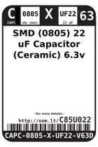
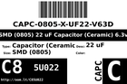

Contents
========

* [C85U022 > SMD (0805) 22 uF Capacitor (Ceramic) 6.3v](#c85u022--smd-0805-22-uf-capacitor-ceramic-63v)
	* [Datasheets](#datasheets)
	* [Labels](#labels)
	* [EDA](#eda)
	* [Images](#images)
	* [Tags](#tags)
  
![][im]
# C85U022 > SMD (0805) 22 uF Capacitor (Ceramic) 6.3v

- ID: CAPC-0805-X-UF22-V63D
- Hex ID: C85U022
- Name: SMD (0805) 22 uF Capacitor (Ceramic) 6.3v
- Description: SMD (0805) 22 uF Capacitor (Ceramic) 6.3v
- Long Link: [http://oom.lt/CAPC-0805-X-UF22-V63D](http://oom.lt/CAPC-0805-X-UF22-V63D)
- Short Link: [http://oom.lt/C85U022](http://oom.lt/C85U022)

## Datasheets

- Datasheet: [datasheet.pdf](datasheet.pdf)

## Labels
  
  

|label-front|label-inventory|label-spec|
| :---: | :---: | :---: |
||||

## EDA

### Footprints
  

|[  FOOTPRINT-eagle-Adafruit-Eagle-Library-adafruit-085CS_1W](https://github.com/oomlout/oomlout_OOMP_eda/tree/main/FOOTPRINT/eagle/Adafruit-Eagle-Library/adafruit/085CS_1W/)|[  FOOTPRINT-eagle-Adafruit-Eagle-Library-adafruit-085CS_1R](https://github.com/oomlout/oomlout_OOMP_eda/tree/main/FOOTPRINT/eagle/Adafruit-Eagle-Library/adafruit/085CS_1R/)|[  FOOTPRINT-eagle-Adafruit-Eagle-Library-adafruit-085CS_1AW](https://github.com/oomlout/oomlout_OOMP_eda/tree/main/FOOTPRINT/eagle/Adafruit-Eagle-Library/adafruit/085CS_1AW/)|[  FOOTPRINT-eagle-Adafruit-Eagle-Library-adafruit-085CS_1AR](https://github.com/oomlout/oomlout_OOMP_eda/tree/main/FOOTPRINT/eagle/Adafruit-Eagle-Library/adafruit/085CS_1AR/)|
| :---: | :---: | :---: | :---: |
|[  FOOTPRINT-eagle-SparkFun-Eagle-Libraries-SparkFun-Capacitors-0805](https://github.com/oomlout/oomlout_OOMP_eda/tree/main/FOOTPRINT/eagle/SparkFun-Eagle-Libraries/SparkFun-Capacitors/0805/)|[  FOOTPRINT-eagle-Pimoroni-Eagle-Library-pimoroni-rc-0805_SENSE](https://github.com/oomlout/oomlout_OOMP_eda/tree/main/FOOTPRINT/eagle/Pimoroni-Eagle-Library/pimoroni-rc/0805_SENSE/)|[  FOOTPRINT-eagle-Pimoroni-Eagle-Library-pimoroni-rc-0805](https://github.com/oomlout/oomlout_OOMP_eda/tree/main/FOOTPRINT/eagle/Pimoroni-Eagle-Library/pimoroni-rc/0805/)|[  FOOTPRINT-kicad-kicad-footprints-Capacitor_SMD-C_0805_2012Metric](https://github.com/oomlout/oomlout_OOMP_eda/tree/main/FOOTPRINT/kicad/kicad-footprints/Capacitor_SMD/C_0805_2012Metric/)|
|[  FOOTPRINT-kicad-kicad-footprints-Capacitor_SMD-C_0805_2012Metric_Pad1.18x1.45mm_HandSolder](https://github.com/oomlout/oomlout_OOMP_eda/tree/main/FOOTPRINT/kicad/kicad-footprints/Capacitor_SMD/C_0805_2012Metric_Pad1.18x1.45mm_HandSolder/)||||

### Symbols
  

|[  SYMBOL-kicad-kicad-symbols-Device-C](https://github.com/oomlout/oomlout_OOMP_eda/tree/main/SYMBOL/kicad/kicad-symbols/Device/C/)||||
| :---: | :---: | :---: | :---: |
  

### Instances
  
Used 40 times.  
Prevalance: (40\10986) 0.3641%  

|Project|Occur- rences|Identifiers|
| :---: | :---: | :---: |
|[PROJ-ADAF-2741-STAN-01 Pixie 3W Smart LED PCB](https://github.com/oomlout/oomlout_OOMP_projects/tree/main/PROJ-ADAF-2741-STAN-01/)|[2](https://github.com/oomlout/oomlout_OOMP_projects/tree/main/PROJ-ADAF-2741-STAN-01/)|[C1, C2](https://github.com/oomlout/oomlout_OOMP_projects/tree/main/PROJ-ADAF-2741-STAN-01/)|
|[PROJ-ADAF-2745-STAN-01 Adafruit LM3671 Buck Converter PCB](https://github.com/oomlout/oomlout_OOMP_projects/tree/main/PROJ-ADAF-2745-STAN-01/)|[1](https://github.com/oomlout/oomlout_OOMP_projects/tree/main/PROJ-ADAF-2745-STAN-01/)|[C1](https://github.com/oomlout/oomlout_OOMP_projects/tree/main/PROJ-ADAF-2745-STAN-01/)|
|[PROJ-ADAF-4654-STAN-01 Adafruit TPS61023 PCB](https://github.com/oomlout/oomlout_OOMP_projects/tree/main/PROJ-ADAF-4654-STAN-01/)|[3](https://github.com/oomlout/oomlout_OOMP_projects/tree/main/PROJ-ADAF-4654-STAN-01/)|[C1, C2, C3](https://github.com/oomlout/oomlout_OOMP_projects/tree/main/PROJ-ADAF-4654-STAN-01/)|
|[PROJ-ADAF-4683-STAN-01 Adafruit MPM3610 PCB](https://github.com/oomlout/oomlout_OOMP_projects/tree/main/PROJ-ADAF-4683-STAN-01/)|[2](https://github.com/oomlout/oomlout_OOMP_projects/tree/main/PROJ-ADAF-4683-STAN-01/)|[C1, C2](https://github.com/oomlout/oomlout_OOMP_projects/tree/main/PROJ-ADAF-4683-STAN-01/)|
|[PROJ-ADAF-4711-STAN-01 Adafruit AP3429A PCB](https://github.com/oomlout/oomlout_OOMP_projects/tree/main/PROJ-ADAF-4711-STAN-01/)|[3](https://github.com/oomlout/oomlout_OOMP_projects/tree/main/PROJ-ADAF-4711-STAN-01/)|[C1, C2, C3](https://github.com/oomlout/oomlout_OOMP_projects/tree/main/PROJ-ADAF-4711-STAN-01/)|
|[PROJ-ADAF-4920-STAN-01 Adafruit TPS62827 PCB](https://github.com/oomlout/oomlout_OOMP_projects/tree/main/PROJ-ADAF-4920-STAN-01/)|[3](https://github.com/oomlout/oomlout_OOMP_projects/tree/main/PROJ-ADAF-4920-STAN-01/)|[C1, C2, C3](https://github.com/oomlout/oomlout_OOMP_projects/tree/main/PROJ-ADAF-4920-STAN-01/)|
|[PROJ-ADAF-5325-STAN-01 Adafruit QT Py ESP32 S2 PCB](https://github.com/oomlout/oomlout_OOMP_projects/tree/main/PROJ-ADAF-5325-STAN-01/)|[3](https://github.com/oomlout/oomlout_OOMP_projects/tree/main/PROJ-ADAF-5325-STAN-01/)|[C1, C6, C8](https://github.com/oomlout/oomlout_OOMP_projects/tree/main/PROJ-ADAF-5325-STAN-01/)|
|[PROJ-ADAF-5395-STAN-01 Adafruit QT Py ESP32 Pico PCB](https://github.com/oomlout/oomlout_OOMP_projects/tree/main/PROJ-ADAF-5395-STAN-01/)|[3](https://github.com/oomlout/oomlout_OOMP_projects/tree/main/PROJ-ADAF-5395-STAN-01/)|[C1, C6, C8](https://github.com/oomlout/oomlout_OOMP_projects/tree/main/PROJ-ADAF-5395-STAN-01/)|
|[PROJ-ADAF-5405-STAN-01 Adafruit QT Py ESP32 C3 PCB](https://github.com/oomlout/oomlout_OOMP_projects/tree/main/PROJ-ADAF-5405-STAN-01/)|[3](https://github.com/oomlout/oomlout_OOMP_projects/tree/main/PROJ-ADAF-5405-STAN-01/)|[C1, C6, C8](https://github.com/oomlout/oomlout_OOMP_projects/tree/main/PROJ-ADAF-5405-STAN-01/)|
|[PROJ-ADAF-5426-STAN-01 Adafruit QT Py ESP32 S3 PCB](https://github.com/oomlout/oomlout_OOMP_projects/tree/main/PROJ-ADAF-5426-STAN-01/)|[3](https://github.com/oomlout/oomlout_OOMP_projects/tree/main/PROJ-ADAF-5426-STAN-01/)|[C1, C6, C8](https://github.com/oomlout/oomlout_OOMP_projects/tree/main/PROJ-ADAF-5426-STAN-01/)|
|[PROJ-SPAR-10255-STAN-01 LiPower Boost Converter](https://github.com/oomlout/oomlout_OOMP_projects/tree/main/PROJ-SPAR-10255-STAN-01/)|[1](https://github.com/oomlout/oomlout_OOMP_projects/tree/main/PROJ-SPAR-10255-STAN-01/)|[C3](https://github.com/oomlout/oomlout_OOMP_projects/tree/main/PROJ-SPAR-10255-STAN-01/)|
|[PROJ-SPAR-12886-STAN-01 Electric Imp Breakout](https://github.com/oomlout/oomlout_OOMP_projects/tree/main/PROJ-SPAR-12886-STAN-01/)|[1](https://github.com/oomlout/oomlout_OOMP_projects/tree/main/PROJ-SPAR-12886-STAN-01/)|[C2](https://github.com/oomlout/oomlout_OOMP_projects/tree/main/PROJ-SPAR-12886-STAN-01/)|
|[PROJ-SPAR-12958-STAN-01 Electric Imp imp002 Breakout](https://github.com/oomlout/oomlout_OOMP_projects/tree/main/PROJ-SPAR-12958-STAN-01/)|[1](https://github.com/oomlout/oomlout_OOMP_projects/tree/main/PROJ-SPAR-12958-STAN-01/)|[C2](https://github.com/oomlout/oomlout_OOMP_projects/tree/main/PROJ-SPAR-12958-STAN-01/)|
|[PROJ-SPAR-13044-STAN-01 Edison Pi Block](https://github.com/oomlout/oomlout_OOMP_projects/tree/main/PROJ-SPAR-13044-STAN-01/)|[1](https://github.com/oomlout/oomlout_OOMP_projects/tree/main/PROJ-SPAR-13044-STAN-01/)|[C8](https://github.com/oomlout/oomlout_OOMP_projects/tree/main/PROJ-SPAR-13044-STAN-01/)|
|[PROJ-SPAR-13158-STAN-01 LiPower-Shield](https://github.com/oomlout/oomlout_OOMP_projects/tree/main/PROJ-SPAR-13158-STAN-01/)|[1](https://github.com/oomlout/oomlout_OOMP_projects/tree/main/PROJ-SPAR-13158-STAN-01/)|[C3](https://github.com/oomlout/oomlout_OOMP_projects/tree/main/PROJ-SPAR-13158-STAN-01/)|
|[PROJ-SPAR-13321-STAN-01 Photon RedBoard](https://github.com/oomlout/oomlout_OOMP_projects/tree/main/PROJ-SPAR-13321-STAN-01/)|[1](https://github.com/oomlout/oomlout_OOMP_projects/tree/main/PROJ-SPAR-13321-STAN-01/)|[C3](https://github.com/oomlout/oomlout_OOMP_projects/tree/main/PROJ-SPAR-13321-STAN-01/)|
|[PROJ-SPAR-13633-STAN-01 SparkFun LilyPad Simblee](https://github.com/oomlout/oomlout_OOMP_projects/tree/main/PROJ-SPAR-13633-STAN-01/)|[2](https://github.com/oomlout/oomlout_OOMP_projects/tree/main/PROJ-SPAR-13633-STAN-01/)|[C9, C10](https://github.com/oomlout/oomlout_OOMP_projects/tree/main/PROJ-SPAR-13633-STAN-01/)|
|[PROJ-SPAR-13968-STAN-01 OpenPIR](https://github.com/oomlout/oomlout_OOMP_projects/tree/main/PROJ-SPAR-13968-STAN-01/)|[2](https://github.com/oomlout/oomlout_OOMP_projects/tree/main/PROJ-SPAR-13968-STAN-01/)|[C1, C3](https://github.com/oomlout/oomlout_OOMP_projects/tree/main/PROJ-SPAR-13968-STAN-01/)|
|[PROJ-SPAR-14411-STAN-01 LiPo Charger Booster 5V 1A](https://github.com/oomlout/oomlout_OOMP_projects/tree/main/PROJ-SPAR-14411-STAN-01/)|[3](https://github.com/oomlout/oomlout_OOMP_projects/tree/main/PROJ-SPAR-14411-STAN-01/)|[C1, C2, C3](https://github.com/oomlout/oomlout_OOMP_projects/tree/main/PROJ-SPAR-14411-STAN-01/)|
|[PROJ-SPAR-14765-STAN-01 Single Supply Logic Level Converter](https://github.com/oomlout/oomlout_OOMP_projects/tree/main/PROJ-SPAR-14765-STAN-01/)|[1](https://github.com/oomlout/oomlout_OOMP_projects/tree/main/PROJ-SPAR-14765-STAN-01/)|[C3](https://github.com/oomlout/oomlout_OOMP_projects/tree/main/PROJ-SPAR-14765-STAN-01/)|

## Images
  
  

|image|label-front|label-inventory|label-spec|
| :---: | :---: | :---: | :---: |
|||||

## Tags

- oompID: CAPC-0805-X-UF22-V63D
- name: SMD (0805) 22 uF Capacitor (Ceramic) 6.3v
- hexID: C85U022
- oompType: CAPC
- oompSize: 0805
- oompColor: X
- oompDesc: UF22
- oompIndex: V63D
- oompVersion: 999
- ooWidth: 1.2mm
- ooHeight: 1.25mm
- ooLength: 2mm
- oompBbls: template;XXXX-0805-X-XXXX-XX-bbls
- oompDiag: template;XXXX-0805-X-XXXX-XX-diag
- oompIden: template;XXXX-0805-X-XXXX-XX-iden
- oompSchem: template;CAPC-XXXX-X-XXXX-XX-schem
- oompSimp: template;XXXX-0805-X-XXXX-XX-simp
- ooDesignator: C1
- oompInstances: {'PROJECT': 'PROJ-ADAF-2741-STAN-01', 'ID': 'C1'}
- oompInstances: {'PROJECT': 'PROJ-ADAF-2741-STAN-01', 'ID': 'C2'}
- oompInstances: {'PROJECT': 'PROJ-ADAF-2745-STAN-01', 'ID': 'C1'}
- oompInstances: {'PROJECT': 'PROJ-ADAF-4654-STAN-01', 'ID': 'C1'}
- oompInstances: {'PROJECT': 'PROJ-ADAF-4654-STAN-01', 'ID': 'C2'}
- oompInstances: {'PROJECT': 'PROJ-ADAF-4654-STAN-01', 'ID': 'C3'}
- oompInstances: {'PROJECT': 'PROJ-ADAF-4683-STAN-01', 'ID': 'C1'}
- oompInstances: {'PROJECT': 'PROJ-ADAF-4683-STAN-01', 'ID': 'C2'}
- oompInstances: {'PROJECT': 'PROJ-ADAF-4711-STAN-01', 'ID': 'C1'}
- oompInstances: {'PROJECT': 'PROJ-ADAF-4711-STAN-01', 'ID': 'C2'}
- oompInstances: {'PROJECT': 'PROJ-ADAF-4711-STAN-01', 'ID': 'C3'}
- oompInstances: {'PROJECT': 'PROJ-ADAF-4920-STAN-01', 'ID': 'C1'}
- oompInstances: {'PROJECT': 'PROJ-ADAF-4920-STAN-01', 'ID': 'C2'}
- oompInstances: {'PROJECT': 'PROJ-ADAF-4920-STAN-01', 'ID': 'C3'}
- oompInstances: {'PROJECT': 'PROJ-ADAF-5325-STAN-01', 'ID': 'C1'}
- oompInstances: {'PROJECT': 'PROJ-ADAF-5325-STAN-01', 'ID': 'C6'}
- oompInstances: {'PROJECT': 'PROJ-ADAF-5325-STAN-01', 'ID': 'C8'}
- oompInstances: {'PROJECT': 'PROJ-ADAF-5395-STAN-01', 'ID': 'C1'}
- oompInstances: {'PROJECT': 'PROJ-ADAF-5395-STAN-01', 'ID': 'C6'}
- oompInstances: {'PROJECT': 'PROJ-ADAF-5395-STAN-01', 'ID': 'C8'}
- oompInstances: {'PROJECT': 'PROJ-ADAF-5405-STAN-01', 'ID': 'C1'}
- oompInstances: {'PROJECT': 'PROJ-ADAF-5405-STAN-01', 'ID': 'C6'}
- oompInstances: {'PROJECT': 'PROJ-ADAF-5405-STAN-01', 'ID': 'C8'}
- oompInstances: {'PROJECT': 'PROJ-ADAF-5426-STAN-01', 'ID': 'C1'}
- oompInstances: {'PROJECT': 'PROJ-ADAF-5426-STAN-01', 'ID': 'C6'}
- oompInstances: {'PROJECT': 'PROJ-ADAF-5426-STAN-01', 'ID': 'C8'}
- oompInstances: {'PROJECT': 'PROJ-SPAR-10255-STAN-01', 'ID': 'C3'}
- oompInstances: {'PROJECT': 'PROJ-SPAR-12886-STAN-01', 'ID': 'C2'}
- oompInstances: {'PROJECT': 'PROJ-SPAR-12958-STAN-01', 'ID': 'C2'}
- oompInstances: {'PROJECT': 'PROJ-SPAR-13044-STAN-01', 'ID': 'C8'}
- oompInstances: {'PROJECT': 'PROJ-SPAR-13158-STAN-01', 'ID': 'C3'}
- oompInstances: {'PROJECT': 'PROJ-SPAR-13321-STAN-01', 'ID': 'C3'}
- oompInstances: {'PROJECT': 'PROJ-SPAR-13633-STAN-01', 'ID': 'C9'}
- oompInstances: {'PROJECT': 'PROJ-SPAR-13633-STAN-01', 'ID': 'C10'}
- oompInstances: {'PROJECT': 'PROJ-SPAR-13968-STAN-01', 'ID': 'C1'}
- oompInstances: {'PROJECT': 'PROJ-SPAR-13968-STAN-01', 'ID': 'C3'}
- oompInstances: {'PROJECT': 'PROJ-SPAR-14411-STAN-01', 'ID': 'C1'}
- oompInstances: {'PROJECT': 'PROJ-SPAR-14411-STAN-01', 'ID': 'C2'}
- oompInstances: {'PROJECT': 'PROJ-SPAR-14411-STAN-01', 'ID': 'C3'}
- oompInstances: {'PROJECT': 'PROJ-SPAR-14765-STAN-01', 'ID': 'C3'}
- symbolKicad: SYMBOL-kicad-kicad-symbols-Device-C
- footprintEagle: FOOTPRINT-eagle-Adafruit-Eagle-Library-adafruit-085CS_1W
- footprintEagle: FOOTPRINT-eagle-Adafruit-Eagle-Library-adafruit-085CS_1R
- footprintEagle: FOOTPRINT-eagle-Adafruit-Eagle-Library-adafruit-085CS_1AW
- footprintEagle: FOOTPRINT-eagle-Adafruit-Eagle-Library-adafruit-085CS_1AR
- footprintEagle: FOOTPRINT-eagle-SparkFun-Eagle-Libraries-SparkFun-Capacitors-0805
- footprintEagle: FOOTPRINT-eagle-Pimoroni-Eagle-Library-pimoroni-rc-0805_SENSE
- footprintEagle: FOOTPRINT-eagle-Pimoroni-Eagle-Library-pimoroni-rc-0805
- footprintKicad: FOOTPRINT-kicad-kicad-footprints-Capacitor_SMD-C_0805_2012Metric
- footprintKicad: FOOTPRINT-kicad-kicad-footprints-Capacitor_SMD-C_0805_2012Metric_Pad1.18x1.45mm_HandSolder

[im]: image_450.jpg
