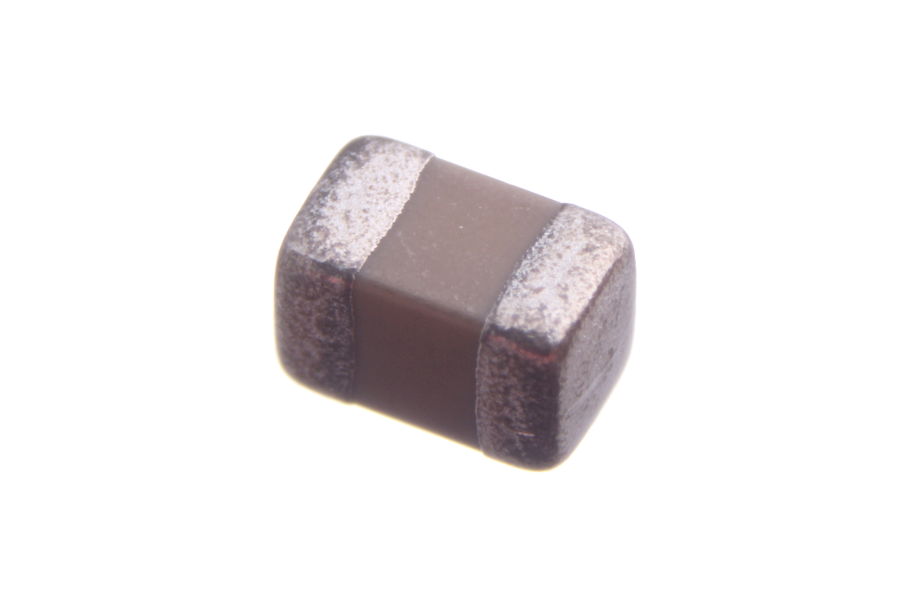
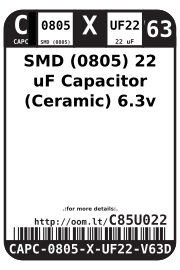
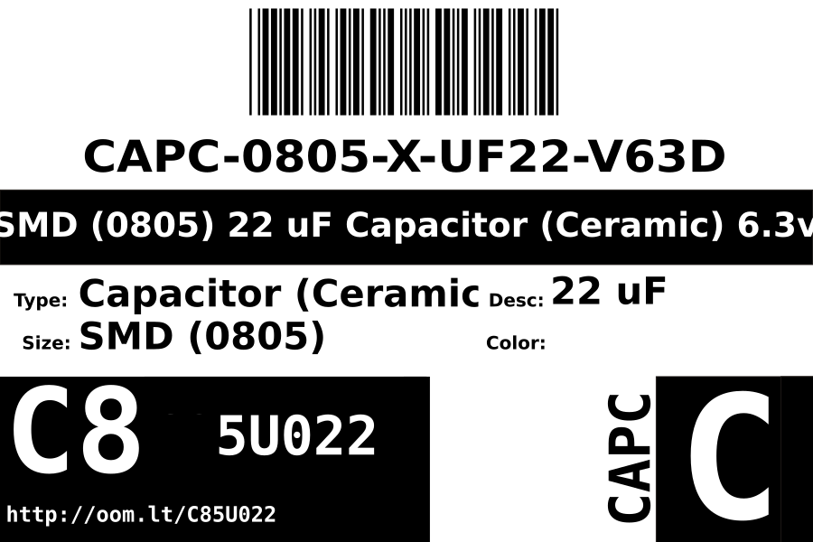
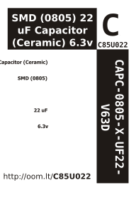

Contents
========

* [CAPC-0805-X-UF22-V63D>SMD (0805) 22 uF Capacitor (Ceramic) 6.3v](#capc-0805-x-uf22-v63dsmd-0805-22-uf-capacitor-ceramic-63v)
	* [Images](#images)
	* [Datasheets](#datasheets)
	* [Labels](#labels)
	* [EDA](#eda)
		* [Symbols](#symbols)
	* [Tags](#tags)
  
![][im]
# CAPC-0805-X-UF22-V63D>SMD (0805) 22 uF Capacitor (Ceramic) 6.3v

- ID: CAPC-0805-X-UF22-V63D
- Name: CAPC-0805-X-UF22-V63D

## Images
  
  

|Main|
| :---: |
||

## Datasheets

- Datasheet: [datasheet.pdf](datasheet.pdf)

## Labels
  
  

|Front|Inventory|Specifications|
| :---: | :---: | :---: |
||||

## EDA

### Symbols

## Tags

- index: 12382
- oompID: CAPC-0805-X-UF22-V63D
- name: SMD (0805) 22 uF Capacitor (Ceramic) 6.3v
- hexID: C85U022
- oompType: CAPC
- oompSize: 0805
- oompColor: X
- oompDesc: UF22
- oompIndex: V63D
- oompVersion: 999
- ooWidth: 1.2mm
- ooHeight: 1.25mm
- ooLength: 2mm
- oompBbls: template;XXXX-0805-X-XXXX-XX-bbls
- oompDiag: template;XXXX-0805-X-XXXX-XX-diag
- oompIden: template;XXXX-0805-X-XXXX-XX-iden
- oompSchem: template;CAPC-XXXX-X-XXXX-XX-schem
- oompSimp: template;XXXX-0805-X-XXXX-XX-simp
- ooDesignator: C1

[im]: image_600.jpg
