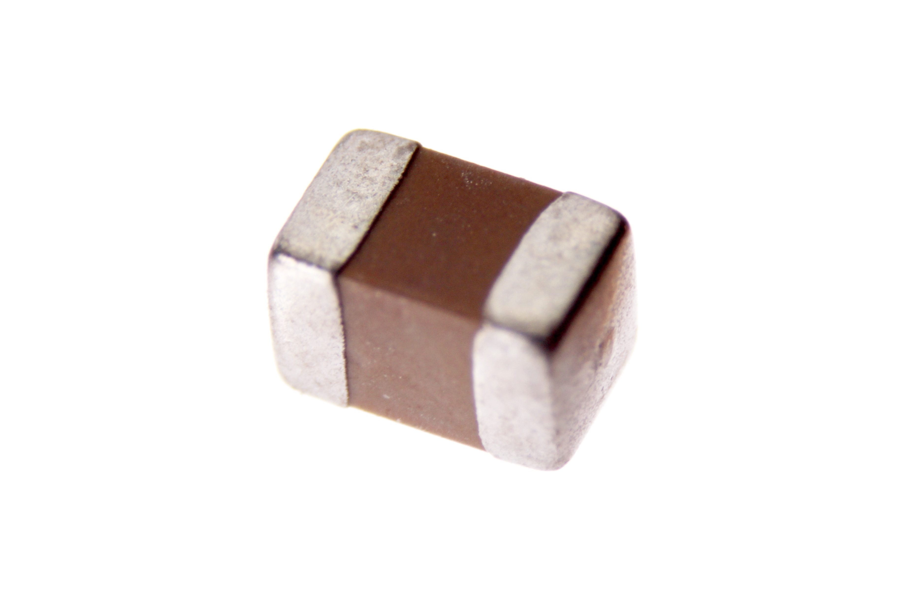

Contents
========

* [CAPC-0805-X-UF22D-V25>SMD (0805) 2.2 uF Capacitor (Ceramic) 25v](#capc-0805-x-uf22d-v25smd-0805-22-uf-capacitor-ceramic-25v)
	* [Images](#images)
	* [Datasheets](#datasheets)
	* [EDA](#eda)
		* [Footprints](#footprints)
		* [Symbols](#symbols)
	* [Tags](#tags)

# CAPC-0805-X-UF22D-V25>SMD (0805) 2.2 uF Capacitor (Ceramic) 25v

- ID: CAPC-0805-X-UF22D-V25
- Name: CAPC-0805-X-UF22D-V25

## Images
  
  

|Main|
| :---: |
||

## Datasheets

- Datasheet: [datasheet.pdf](datasheet.pdf)

## EDA

### Footprints
  

|||||
| :---: | :---: | :---: | :---: |

### Symbols

## Tags

- index: 84
- oompID: CAPC-0805-X-UF22D-V25
- name: SMD (0805) 2.2 uF Capacitor (Ceramic) 25v
- hexID: C85U002
- oompType: CAPC
- oompSize: 0805
- oompColor: X
- oompDesc: UF22D
- oompIndex: V25
- oompVersion: 999
- ooWidth: 1.25mm
- ooHeight: 1.25mm
- ooLength: 2mm
- oompBbls: template;XXXX-0805-X-XXXX-XX-bbls
- oompDiag: template;XXXX-0805-X-XXXX-XX-diag
- oompIden: template;XXXX-0805-X-XXXX-XX-iden
- oompSchem: template;CAPC-XXXX-X-XXXX-XX-schem
- oompSimp: template;XXXX-0805-X-XXXX-XX-simp
- ooDesignator: C1
