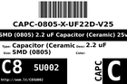

Contents
========

* [C85U002 > SMD (0805) 2.2 uF Capacitor (Ceramic) 25v](#c85u002--smd-0805-22-uf-capacitor-ceramic-25v)
	* [Datasheets](#datasheets)
	* [Labels](#labels)
	* [EDA](#eda)
	* [Images](#images)
	* [Tags](#tags)
  
![][im]
# C85U002 > SMD (0805) 2.2 uF Capacitor (Ceramic) 25v

- ID: CAPC-0805-X-UF22D-V25
- Hex ID: C85U002
- Name: SMD (0805) 2.2 uF Capacitor (Ceramic) 25v
- Description: SMD (0805) 2.2 uF Capacitor (Ceramic) 25v
- Long Link: [http://oom.lt/CAPC-0805-X-UF22D-V25](http://oom.lt/CAPC-0805-X-UF22D-V25)
- Short Link: [http://oom.lt/C85U002](http://oom.lt/C85U002)

## Datasheets

- Datasheet: [datasheet.pdf](datasheet.pdf)

## Labels
  
  

|label-front|label-inventory|label-spec|
| :---: | :---: | :---: |
||||

## EDA

### Footprints
  

|[  FOOTPRINT-eagle-Adafruit-Eagle-Library-adafruit-085CS_1W](https://github.com/oomlout/oomlout_OOMP_eda/tree/main/FOOTPRINT/eagle/Adafruit-Eagle-Library/adafruit/085CS_1W/)|[  FOOTPRINT-eagle-Adafruit-Eagle-Library-adafruit-085CS_1R](https://github.com/oomlout/oomlout_OOMP_eda/tree/main/FOOTPRINT/eagle/Adafruit-Eagle-Library/adafruit/085CS_1R/)|[  FOOTPRINT-eagle-Adafruit-Eagle-Library-adafruit-085CS_1AW](https://github.com/oomlout/oomlout_OOMP_eda/tree/main/FOOTPRINT/eagle/Adafruit-Eagle-Library/adafruit/085CS_1AW/)|[  FOOTPRINT-eagle-Adafruit-Eagle-Library-adafruit-085CS_1AR](https://github.com/oomlout/oomlout_OOMP_eda/tree/main/FOOTPRINT/eagle/Adafruit-Eagle-Library/adafruit/085CS_1AR/)|
| :---: | :---: | :---: | :---: |
|[  FOOTPRINT-eagle-SparkFun-Eagle-Libraries-SparkFun-Capacitors-0805](https://github.com/oomlout/oomlout_OOMP_eda/tree/main/FOOTPRINT/eagle/SparkFun-Eagle-Libraries/SparkFun-Capacitors/0805/)|[  FOOTPRINT-eagle-Pimoroni-Eagle-Library-pimoroni-rc-0805_SENSE](https://github.com/oomlout/oomlout_OOMP_eda/tree/main/FOOTPRINT/eagle/Pimoroni-Eagle-Library/pimoroni-rc/0805_SENSE/)|[  FOOTPRINT-eagle-Pimoroni-Eagle-Library-pimoroni-rc-0805](https://github.com/oomlout/oomlout_OOMP_eda/tree/main/FOOTPRINT/eagle/Pimoroni-Eagle-Library/pimoroni-rc/0805/)|[  FOOTPRINT-kicad-kicad-footprints-Capacitor_SMD-C_0805_2012Metric](https://github.com/oomlout/oomlout_OOMP_eda/tree/main/FOOTPRINT/kicad/kicad-footprints/Capacitor_SMD/C_0805_2012Metric/)|
|[  FOOTPRINT-kicad-kicad-footprints-Capacitor_SMD-C_0805_2012Metric_Pad1.18x1.45mm_HandSolder](https://github.com/oomlout/oomlout_OOMP_eda/tree/main/FOOTPRINT/kicad/kicad-footprints/Capacitor_SMD/C_0805_2012Metric_Pad1.18x1.45mm_HandSolder/)||||

### Symbols
  

|[  SYMBOL-kicad-kicad-symbols-Device-C](https://github.com/oomlout/oomlout_OOMP_eda/tree/main/SYMBOL/kicad/kicad-symbols/Device/C/)||||
| :---: | :---: | :---: | :---: |
  

### Instances
  
Used 34 times.  
Prevalance: (34\10986) 0.3095%  

|Project|Occur- rences|Identifiers|
| :---: | :---: | :---: |
|[PROJ-ADAF-1628-STAN-01 Adafruit Bluefruit EZ Link Shield PCB](https://github.com/oomlout/oomlout_OOMP_projects/tree/main/PROJ-ADAF-1628-STAN-01/)|[1](https://github.com/oomlout/oomlout_OOMP_projects/tree/main/PROJ-ADAF-1628-STAN-01/)|[C2](https://github.com/oomlout/oomlout_OOMP_projects/tree/main/PROJ-ADAF-1628-STAN-01/)|
|[PROJ-ADAF-1713-STAN-01 Adafruit MAX9814 AGC Microphone PCB](https://github.com/oomlout/oomlout_OOMP_projects/tree/main/PROJ-ADAF-1713-STAN-01/)|[2](https://github.com/oomlout/oomlout_OOMP_projects/tree/main/PROJ-ADAF-1713-STAN-01/)|[C1, C5](https://github.com/oomlout/oomlout_OOMP_projects/tree/main/PROJ-ADAF-1713-STAN-01/)|
|[PROJ-ADAF-1752-STAN-01 Adafruit MAX9744 Amplifier PCB](https://github.com/oomlout/oomlout_OOMP_projects/tree/main/PROJ-ADAF-1752-STAN-01/)|[1](https://github.com/oomlout/oomlout_OOMP_projects/tree/main/PROJ-ADAF-1752-STAN-01/)|[C5](https://github.com/oomlout/oomlout_OOMP_projects/tree/main/PROJ-ADAF-1752-STAN-01/)|
|[PROJ-ADAF-1903-STAN-01 Adafruit PowerBoost 500 Basic PCB](https://github.com/oomlout/oomlout_OOMP_projects/tree/main/PROJ-ADAF-1903-STAN-01/)|[1](https://github.com/oomlout/oomlout_OOMP_projects/tree/main/PROJ-ADAF-1903-STAN-01/)|[C2](https://github.com/oomlout/oomlout_OOMP_projects/tree/main/PROJ-ADAF-1903-STAN-01/)|
|[PROJ-ADAF-1944-STAN-01 Adafruit PowerBoost 500 Charger PCB](https://github.com/oomlout/oomlout_OOMP_projects/tree/main/PROJ-ADAF-1944-STAN-01/)|[1](https://github.com/oomlout/oomlout_OOMP_projects/tree/main/PROJ-ADAF-1944-STAN-01/)|[C2](https://github.com/oomlout/oomlout_OOMP_projects/tree/main/PROJ-ADAF-1944-STAN-01/)|
|[PROJ-ADAF-2030-STAN-01 Adafruit PowerBoost 1000 PCB](https://github.com/oomlout/oomlout_OOMP_projects/tree/main/PROJ-ADAF-2030-STAN-01/)|[1](https://github.com/oomlout/oomlout_OOMP_projects/tree/main/PROJ-ADAF-2030-STAN-01/)|[C2](https://github.com/oomlout/oomlout_OOMP_projects/tree/main/PROJ-ADAF-2030-STAN-01/)|
|[PROJ-ADAF-2078-STAN-01 Adafruit PowerBoost 500 Shield PCB](https://github.com/oomlout/oomlout_OOMP_projects/tree/main/PROJ-ADAF-2078-STAN-01/)|[1](https://github.com/oomlout/oomlout_OOMP_projects/tree/main/PROJ-ADAF-2078-STAN-01/)|[C7](https://github.com/oomlout/oomlout_OOMP_projects/tree/main/PROJ-ADAF-2078-STAN-01/)|
|[PROJ-ADAF-2465-STAN-01 Adafruit PowerBoost 1000C](https://github.com/oomlout/oomlout_OOMP_projects/tree/main/PROJ-ADAF-2465-STAN-01/)|[1](https://github.com/oomlout/oomlout_OOMP_projects/tree/main/PROJ-ADAF-2465-STAN-01/)|[C2](https://github.com/oomlout/oomlout_OOMP_projects/tree/main/PROJ-ADAF-2465-STAN-01/)|
|[PROJ-ADAF-326-STAN-01 Adafruit 128x64 Monochrome OLED PCB](https://github.com/oomlout/oomlout_OOMP_projects/tree/main/PROJ-ADAF-326-STAN-01/)|[2](https://github.com/oomlout/oomlout_OOMP_projects/tree/main/PROJ-ADAF-326-STAN-01/)|[C3, C6](https://github.com/oomlout/oomlout_OOMP_projects/tree/main/PROJ-ADAF-326-STAN-01/)|
|[PROJ-ADAF-3531-STAN-01 Adafruit 128x64 OLED Bonnet for Raspberry Pi PCB](https://github.com/oomlout/oomlout_OOMP_projects/tree/main/PROJ-ADAF-3531-STAN-01/)|[5](https://github.com/oomlout/oomlout_OOMP_projects/tree/main/PROJ-ADAF-3531-STAN-01/)|[C3, C4, C6, C7, C8](https://github.com/oomlout/oomlout_OOMP_projects/tree/main/PROJ-ADAF-3531-STAN-01/)|
|[PROJ-ADAF-3538-STAN-01 Adafruit AMG8833 Breakout PCB](https://github.com/oomlout/oomlout_OOMP_projects/tree/main/PROJ-ADAF-3538-STAN-01/)|[1](https://github.com/oomlout/oomlout_OOMP_projects/tree/main/PROJ-ADAF-3538-STAN-01/)|[C3](https://github.com/oomlout/oomlout_OOMP_projects/tree/main/PROJ-ADAF-3538-STAN-01/)|
|[PROJ-ADAF-661-STAN-01 Adafruit 128x32 SPI OLED breakout board PCB](https://github.com/oomlout/oomlout_OOMP_projects/tree/main/PROJ-ADAF-661-STAN-01/)|[3](https://github.com/oomlout/oomlout_OOMP_projects/tree/main/PROJ-ADAF-661-STAN-01/)|[C5, C6, C7](https://github.com/oomlout/oomlout_OOMP_projects/tree/main/PROJ-ADAF-661-STAN-01/)|
|[PROJ-ADAF-938-STAN-01 Adafruit 1.3inch 128x64 Mono OLED PCB](https://github.com/oomlout/oomlout_OOMP_projects/tree/main/PROJ-ADAF-938-STAN-01/)|[5](https://github.com/oomlout/oomlout_OOMP_projects/tree/main/PROJ-ADAF-938-STAN-01/)|[C3, C4, C6, C7, C8](https://github.com/oomlout/oomlout_OOMP_projects/tree/main/PROJ-ADAF-938-STAN-01/)|
|[PROJ-SPAR-11850-STAN-01 PicoBuck](https://github.com/oomlout/oomlout_OOMP_projects/tree/main/PROJ-SPAR-11850-STAN-01/)|[3](https://github.com/oomlout/oomlout_OOMP_projects/tree/main/PROJ-SPAR-11850-STAN-01/)|[C2, C4, C6](https://github.com/oomlout/oomlout_OOMP_projects/tree/main/PROJ-SPAR-11850-STAN-01/)|
|[PROJ-SPAR-12000-STAN-01 WAV Trigger](https://github.com/oomlout/oomlout_OOMP_projects/tree/main/PROJ-SPAR-12000-STAN-01/)|[2](https://github.com/oomlout/oomlout_OOMP_projects/tree/main/PROJ-SPAR-12000-STAN-01/)|[C3, C5](https://github.com/oomlout/oomlout_OOMP_projects/tree/main/PROJ-SPAR-12000-STAN-01/)|
|[PROJ-SPAR-13035-STAN-01 Edison OLED Block](https://github.com/oomlout/oomlout_OOMP_projects/tree/main/PROJ-SPAR-13035-STAN-01/)|[1](https://github.com/oomlout/oomlout_OOMP_projects/tree/main/PROJ-SPAR-13035-STAN-01/)|[C1](https://github.com/oomlout/oomlout_OOMP_projects/tree/main/PROJ-SPAR-13035-STAN-01/)|
|[PROJ-SPAR-13628-STAN-01 Photon OLED Shield](https://github.com/oomlout/oomlout_OOMP_projects/tree/main/PROJ-SPAR-13628-STAN-01/)|[1](https://github.com/oomlout/oomlout_OOMP_projects/tree/main/PROJ-SPAR-13628-STAN-01/)|[C1](https://github.com/oomlout/oomlout_OOMP_projects/tree/main/PROJ-SPAR-13628-STAN-01/)|
|[PROJ-SPAR-14048-STAN-01 TeensyView](https://github.com/oomlout/oomlout_OOMP_projects/tree/main/PROJ-SPAR-14048-STAN-01/)|[1](https://github.com/oomlout/oomlout_OOMP_projects/tree/main/PROJ-SPAR-14048-STAN-01/)|[C5](https://github.com/oomlout/oomlout_OOMP_projects/tree/main/PROJ-SPAR-14048-STAN-01/)|
|[PROJ-SPAR-14532-STAN-01 Qwiic Micro OLED](https://github.com/oomlout/oomlout_OOMP_projects/tree/main/PROJ-SPAR-14532-STAN-01/)|[1](https://github.com/oomlout/oomlout_OOMP_projects/tree/main/PROJ-SPAR-14532-STAN-01/)|[C1](https://github.com/oomlout/oomlout_OOMP_projects/tree/main/PROJ-SPAR-14532-STAN-01/)|

## Images
  
  

|image|label-front|label-inventory|label-spec|
| :---: | :---: | :---: | :---: |
|||||

## Tags

- oompID: CAPC-0805-X-UF22D-V25
- name: SMD (0805) 2.2 uF Capacitor (Ceramic) 25v
- hexID: C85U002
- oompType: CAPC
- oompSize: 0805
- oompColor: X
- oompDesc: UF22D
- oompIndex: V25
- oompVersion: 999
- ooWidth: 1.25mm
- ooHeight: 1.25mm
- ooLength: 2mm
- oompBbls: template;XXXX-0805-X-XXXX-XX-bbls
- oompDiag: template;XXXX-0805-X-XXXX-XX-diag
- oompIden: template;XXXX-0805-X-XXXX-XX-iden
- oompSchem: template;CAPC-XXXX-X-XXXX-XX-schem
- oompSimp: template;XXXX-0805-X-XXXX-XX-simp
- ooDesignator: C1
- oompInstances: {'PROJECT': 'PROJ-ADAF-1628-STAN-01', 'ID': 'C2'}
- oompInstances: {'PROJECT': 'PROJ-ADAF-1713-STAN-01', 'ID': 'C1'}
- oompInstances: {'PROJECT': 'PROJ-ADAF-1713-STAN-01', 'ID': 'C5'}
- oompInstances: {'PROJECT': 'PROJ-ADAF-1752-STAN-01', 'ID': 'C5'}
- oompInstances: {'PROJECT': 'PROJ-ADAF-1903-STAN-01', 'ID': 'C2'}
- oompInstances: {'PROJECT': 'PROJ-ADAF-1944-STAN-01', 'ID': 'C2'}
- oompInstances: {'PROJECT': 'PROJ-ADAF-2030-STAN-01', 'ID': 'C2'}
- oompInstances: {'PROJECT': 'PROJ-ADAF-2078-STAN-01', 'ID': 'C7'}
- oompInstances: {'PROJECT': 'PROJ-ADAF-2465-STAN-01', 'ID': 'C2'}
- oompInstances: {'PROJECT': 'PROJ-ADAF-326-STAN-01', 'ID': 'C3'}
- oompInstances: {'PROJECT': 'PROJ-ADAF-326-STAN-01', 'ID': 'C6'}
- oompInstances: {'PROJECT': 'PROJ-ADAF-3531-STAN-01', 'ID': 'C3'}
- oompInstances: {'PROJECT': 'PROJ-ADAF-3531-STAN-01', 'ID': 'C4'}
- oompInstances: {'PROJECT': 'PROJ-ADAF-3531-STAN-01', 'ID': 'C6'}
- oompInstances: {'PROJECT': 'PROJ-ADAF-3531-STAN-01', 'ID': 'C7'}
- oompInstances: {'PROJECT': 'PROJ-ADAF-3531-STAN-01', 'ID': 'C8'}
- oompInstances: {'PROJECT': 'PROJ-ADAF-3538-STAN-01', 'ID': 'C3'}
- oompInstances: {'PROJECT': 'PROJ-ADAF-661-STAN-01', 'ID': 'C5'}
- oompInstances: {'PROJECT': 'PROJ-ADAF-661-STAN-01', 'ID': 'C6'}
- oompInstances: {'PROJECT': 'PROJ-ADAF-661-STAN-01', 'ID': 'C7'}
- oompInstances: {'PROJECT': 'PROJ-ADAF-938-STAN-01', 'ID': 'C3'}
- oompInstances: {'PROJECT': 'PROJ-ADAF-938-STAN-01', 'ID': 'C4'}
- oompInstances: {'PROJECT': 'PROJ-ADAF-938-STAN-01', 'ID': 'C6'}
- oompInstances: {'PROJECT': 'PROJ-ADAF-938-STAN-01', 'ID': 'C7'}
- oompInstances: {'PROJECT': 'PROJ-ADAF-938-STAN-01', 'ID': 'C8'}
- oompInstances: {'PROJECT': 'PROJ-SPAR-11850-STAN-01', 'ID': 'C2'}
- oompInstances: {'PROJECT': 'PROJ-SPAR-11850-STAN-01', 'ID': 'C4'}
- oompInstances: {'PROJECT': 'PROJ-SPAR-11850-STAN-01', 'ID': 'C6'}
- oompInstances: {'PROJECT': 'PROJ-SPAR-12000-STAN-01', 'ID': 'C3'}
- oompInstances: {'PROJECT': 'PROJ-SPAR-12000-STAN-01', 'ID': 'C5'}
- oompInstances: {'PROJECT': 'PROJ-SPAR-13035-STAN-01', 'ID': 'C1'}
- oompInstances: {'PROJECT': 'PROJ-SPAR-13628-STAN-01', 'ID': 'C1'}
- oompInstances: {'PROJECT': 'PROJ-SPAR-14048-STAN-01', 'ID': 'C5'}
- oompInstances: {'PROJECT': 'PROJ-SPAR-14532-STAN-01', 'ID': 'C1'}
- symbolKicad: SYMBOL-kicad-kicad-symbols-Device-C
- footprintEagle: FOOTPRINT-eagle-Adafruit-Eagle-Library-adafruit-085CS_1W
- footprintEagle: FOOTPRINT-eagle-Adafruit-Eagle-Library-adafruit-085CS_1R
- footprintEagle: FOOTPRINT-eagle-Adafruit-Eagle-Library-adafruit-085CS_1AW
- footprintEagle: FOOTPRINT-eagle-Adafruit-Eagle-Library-adafruit-085CS_1AR
- footprintEagle: FOOTPRINT-eagle-SparkFun-Eagle-Libraries-SparkFun-Capacitors-0805
- footprintEagle: FOOTPRINT-eagle-Pimoroni-Eagle-Library-pimoroni-rc-0805_SENSE
- footprintEagle: FOOTPRINT-eagle-Pimoroni-Eagle-Library-pimoroni-rc-0805
- footprintKicad: FOOTPRINT-kicad-kicad-footprints-Capacitor_SMD-C_0805_2012Metric
- footprintKicad: FOOTPRINT-kicad-kicad-footprints-Capacitor_SMD-C_0805_2012Metric_Pad1.18x1.45mm_HandSolder

[im]: image_450.jpg
