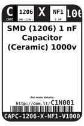
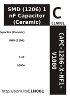

Contents
========

* [C1N001 > SMD (1206) 1 nF Capacitor (Ceramic) 1000v](#c1n001--smd-1206-1-nf-capacitor-ceramic-1000v)
	* [Datasheets](#datasheets)
	* [Labels](#labels)
	* [EDA](#eda)
	* [Images](#images)
	* [Tags](#tags)

# C1N001 > SMD (1206) 1 nF Capacitor (Ceramic) 1000v

- ID: CAPC-1206-X-NF1-V1000
- Hex ID: C1N001
- Name: SMD (1206) 1 nF Capacitor (Ceramic) 1000v
- Description: SMD (1206) 1 nF Capacitor (Ceramic) 1000v
- Long Link: [http://oom.lt/CAPC-1206-X-NF1-V1000](http://oom.lt/CAPC-1206-X-NF1-V1000)
- Short Link: [http://oom.lt/C1N001](http://oom.lt/C1N001)

## Datasheets

- Datasheet: [datasheet.pdf](datasheet.pdf)

## Labels
  
  

|label-front|label-inventory|label-spec|
| :---: | :---: | :---: |
||||

## EDA

## Images
  
  

|label-front|label-inventory|label-spec|
| :---: | :---: | :---: |
||||

## Tags

- oompID: CAPC-1206-X-NF1-V1000
- name: SMD (1206) 1 nF Capacitor (Ceramic) 1000v
- hexID: C1N001
- oompType: CAPC
- oompSize: 1206
- oompColor: X
- oompDesc: NF1
- oompIndex: V1000
- oompVersion: 999
- ooWidth: 1.6mm
- ooHeight: 1.25mm
- ooLength: 3.2mm
- oompBbls: template;XXXX-1206-X-XXXX-XX-bbls
- oompDiag: template;XXXX-1206-X-XXXX-XX-diag
- oompIden: template;XXXX-1206-X-XXXX-XX-iden
- oompSchem: template;CAPC-XXXX-X-XXXX-XX-schem
- oompSimp: template;XXXX-1206-X-XXXX-XX-simp
- ooDesignator: C1
