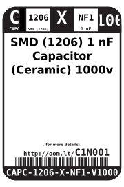
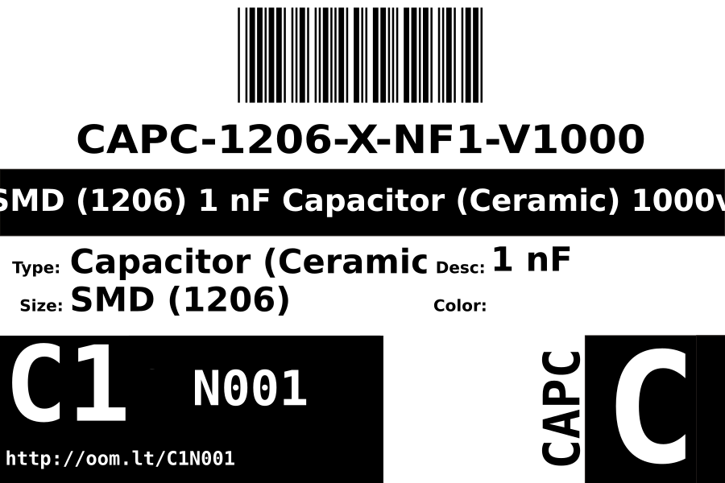
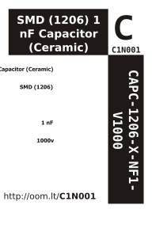

Contents
========

* [CAPC-1206-X-NF1-V1000>SMD (1206) 1 nF Capacitor (Ceramic) 1000v](#capc-1206-x-nf1-v1000smd-1206-1-nf-capacitor-ceramic-1000v)
	* [Datasheets](#datasheets)
	* [Labels](#labels)
	* [EDA](#eda)
		* [Symbols](#symbols)
	* [Tags](#tags)

# CAPC-1206-X-NF1-V1000>SMD (1206) 1 nF Capacitor (Ceramic) 1000v

- ID: CAPC-1206-X-NF1-V1000
- Name: CAPC-1206-X-NF1-V1000

## Datasheets

- Datasheet: [datasheet.pdf](datasheet.pdf)

## Labels
  
  

|Front|Inventory|Specifications|
| :---: | :---: | :---: |
||||

## EDA

### Symbols

## Tags

- hexID: C1N001
- oompType: CAPC
- oompSize: 1206
- oompColor: X
- oompDesc: NF1
- oompIndex: V1000
- oompVersion: 999
- ooWidth: 1.6mm
- ooHeight: 1.25mm
- ooLength: 3.2mm
- oompBbls: template;XXXX-1206-X-XXXX-XX-bbls
- oompDiag: template;XXXX-1206-X-XXXX-XX-diag
- oompIden: template;XXXX-1206-X-XXXX-XX-iden
- oompSchem: template;CAPC-XXXX-X-XXXX-XX-schem
- oompSimp: template;XXXX-1206-X-XXXX-XX-simp
- ooDesignator: C1
