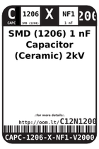
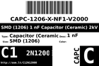
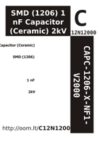

Contents
========

* [C12N12000 > SMD (1206) 1 nF Capacitor (Ceramic) 2kV](#c12n12000--smd-1206-1-nf-capacitor-ceramic-2kv)
	* [Labels](#labels)
	* [EDA](#eda)
	* [Images](#images)
	* [Tags](#tags)

# C12N12000 > SMD (1206) 1 nF Capacitor (Ceramic) 2kV

- ID: CAPC-1206-X-NF1-V2000
- Hex ID: C12N12000
- Name: SMD (1206) 1 nF Capacitor (Ceramic) 2kV
- Description: SMD (1206) 1 nF Capacitor (Ceramic) 2kV
- Long Link: [http://oom.lt/CAPC-1206-X-NF1-V2000](http://oom.lt/CAPC-1206-X-NF1-V2000)
- Short Link: [http://oom.lt/C12N12000](http://oom.lt/C12N12000)

## Labels
  
  

|label-front|label-inventory|label-spec|
| :---: | :---: | :---: |
||||

## EDA

### Footprints
  

|[  FOOTPRINT-kicad-kicad-footprints-Capacitor_SMD-C_1206_3216Metric](https://github.com/oomlout/oomlout_OOMP_eda/tree/main/FOOTPRINT/kicad/kicad-footprints/Capacitor_SMD/C_1206_3216Metric/)|[  FOOTPRINT-kicad-kicad-footprints-Capacitor_SMD-C_1206_3216Metric_Pad1.33x1.80mm_HandSolder](https://github.com/oomlout/oomlout_OOMP_eda/tree/main/FOOTPRINT/kicad/kicad-footprints/Capacitor_SMD/C_1206_3216Metric_Pad1.33x1.80mm_HandSolder/)|||
| :---: | :---: | :---: | :---: |

### Symbols
  

|[  ----](https://github.com/oomlout/oomlout_OOMP_parts/tree/main/----/)||||
| :---: | :---: | :---: | :---: |

## Images
  
  

|label-front|label-inventory|label-spec|
| :---: | :---: | :---: |
||||

## Tags

- oompType: CAPC
- oompSize: 1206
- oompColor: X
- oompDesc: NF1
- oompIndex: V2000
- oplPartNumber: {'code': 'C-JLCC', 'name': 'JLC Parts Library', 'partID': 'C9196', 'desc': '2kV 1nF X7R ??10% 1206  Multilayer Ceramic Capacitors MLCC - SMD/SMT ROHS'}
- distributorPartNumber: {'code': 'C-LCSC', 'name': 'LCSC', 'partID': 'C9196'}
- manufacturerPartNumber: {'code': 'C-XXXX', 'name': 'FH (Guangdong Fenghua Advanced Tech)', 'partID': '1206B102K202NT'}
- hexID: C12N12000
- oompID: CAPC-1206-X-NF1-V2000
- symbolKicad: SYMBOL-kicad-kicad-symbols-Switch-C
- footprintKicad: FOOTPRINT-kicad-kicad-footprints-Capacitor_SMD-C_1206_3216Metric
- footprintKicad: FOOTPRINT-kicad-kicad-footprints-Capacitor_SMD-C_1206_3216Metric_Pad1.33x1.80mm_HandSolder
