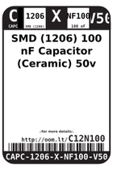
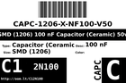
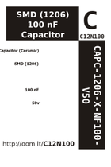

Contents
========

* [C12N100 > SMD (1206) 100 nF Capacitor (Ceramic) 50v](#c12n100--smd-1206-100-nf-capacitor-ceramic-50v)
	* [Datasheets](#datasheets)
	* [Labels](#labels)
	* [EDA](#eda)
	* [Images](#images)
	* [Tags](#tags)

# C12N100 > SMD (1206) 100 nF Capacitor (Ceramic) 50v

- ID: CAPC-1206-X-NF100-V50
- Hex ID: C12N100
- Name: SMD (1206) 100 nF Capacitor (Ceramic) 50v
- Description: SMD (1206) 100 nF Capacitor (Ceramic) 50v
- Long Link: [http://oom.lt/CAPC-1206-X-NF100-V50](http://oom.lt/CAPC-1206-X-NF100-V50)
- Short Link: [http://oom.lt/C12N100](http://oom.lt/C12N100)

## Datasheets

- Datasheet: [datasheet.pdf](datasheet.pdf)

## Labels
  
  

|label-front|label-inventory|label-spec|
| :---: | :---: | :---: |
||||

## EDA

### Footprints
  

|[  FOOTPRINT-kicad-kicad-footprints-Capacitor_SMD-C_1206_3216Metric](https://github.com/oomlout/oomlout_OOMP_eda/tree/main/FOOTPRINT/kicad/kicad-footprints/Capacitor_SMD/C_1206_3216Metric/)|[  FOOTPRINT-kicad-kicad-footprints-Capacitor_SMD-C_1206_3216Metric_Pad1.33x1.80mm_HandSolder](https://github.com/oomlout/oomlout_OOMP_eda/tree/main/FOOTPRINT/kicad/kicad-footprints/Capacitor_SMD/C_1206_3216Metric_Pad1.33x1.80mm_HandSolder/)|||
| :---: | :---: | :---: | :---: |

### Symbols
  

|[  SYMBOL-kicad-kicad-symbols-Device-C](https://github.com/oomlout/oomlout_OOMP_eda/tree/main/SYMBOL/kicad/kicad-symbols/Device/C/)||||
| :---: | :---: | :---: | :---: |

## Images
  
  

|label-front|label-inventory|label-spec|
| :---: | :---: | :---: |
||||

## Tags

- oompType: CAPC
- oompSize: 1206
- oompColor: X
- oompDesc: NF100
- oompIndex: V50
- oplPartNumber: {'code': 'C-JLCC', 'name': 'JLC Parts Library', 'partID': 'C24497', 'desc': '50V 100nF X7R ??10% 1206  Multilayer Ceramic Capacitors MLCC - SMD/SMT ROHS'}
- distributorPartNumber: {'code': 'C-LCSC', 'name': 'LCSC', 'partID': 'C24497'}
- manufacturerPartNumber: {'code': 'C-XXXX', 'name': 'Samsung Electro-Mechanics', 'partID': 'CL31B104KBCNNNC'}
- hexID: C12N100
- oompID: CAPC-1206-X-NF100-V50
- footprintKicad: FOOTPRINT-kicad-kicad-footprints-Capacitor_SMD-C_1206_3216Metric
- footprintKicad: FOOTPRINT-kicad-kicad-footprints-Capacitor_SMD-C_1206_3216Metric_Pad1.33x1.80mm_HandSolder
- symbolKicad: SYMBOL-kicad-kicad-symbols-Device-C
