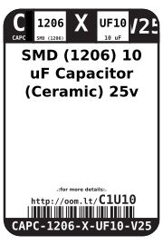

Contents
========

* [CAPC-1206-X-UF10-V25>SMD (1206) 10 uF Capacitor (Ceramic) 25v](#capc-1206-x-uf10-v25smd-1206-10-uf-capacitor-ceramic-25v)
	* [Datasheets](#datasheets)
	* [Labels](#labels)
	* [EDA](#eda)
		* [Symbols](#symbols)
	* [Tags](#tags)

# CAPC-1206-X-UF10-V25>SMD (1206) 10 uF Capacitor (Ceramic) 25v

- ID: CAPC-1206-X-UF10-V25
- Name: CAPC-1206-X-UF10-V25

## Datasheets

- Datasheet: [datasheet.pdf](datasheet.pdf)

## Labels
  
  

|Front|Inventory|Specifications|
| :---: | :---: | :---: |
||||

## EDA

### Symbols

## Tags

- index: 12386
- oompID: CAPC-1206-X-UF10-V25
- name: SMD (1206) 10 uF Capacitor (Ceramic) 25v
- hexID: C1U10
- oompType: CAPC
- oompSize: 1206
- oompColor: X
- oompDesc: UF10
- oompIndex: V25
- oompVersion: 999
- ooWidth: 1.6mm
- ooHeight: 1.6mm
- ooLength: 3.2mm
- oompBbls: template;XXXX-1206-X-XXXX-XX-bbls
- oompDiag: template;XXXX-1206-X-XXXX-XX-diag
- oompIden: template;XXXX-1206-X-XXXX-XX-iden
- oompSchem: template;CAPC-XXXX-X-XXXX-XX-schem
- oompSimp: template;XXXX-1206-X-XXXX-XX-simp
- ooDesignator: C1
