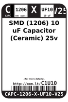
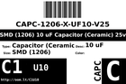
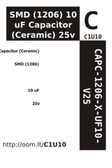

Contents
========

* [C1U10 > SMD (1206) 10 uF Capacitor (Ceramic) 25v](#c1u10--smd-1206-10-uf-capacitor-ceramic-25v)
	* [Datasheets](#datasheets)
	* [Labels](#labels)
	* [EDA](#eda)
	* [Images](#images)
	* [Tags](#tags)

# C1U10 > SMD (1206) 10 uF Capacitor (Ceramic) 25v

- ID: CAPC-1206-X-UF10-V25
- Hex ID: C1U10
- Name: SMD (1206) 10 uF Capacitor (Ceramic) 25v
- Description: SMD (1206) 10 uF Capacitor (Ceramic) 25v
- Long Link: [http://oom.lt/CAPC-1206-X-UF10-V25](http://oom.lt/CAPC-1206-X-UF10-V25)
- Short Link: [http://oom.lt/C1U10](http://oom.lt/C1U10)

## Datasheets

- Datasheet: [datasheet.pdf](datasheet.pdf)

## Labels
  
  

|label-front|label-inventory|label-spec|
| :---: | :---: | :---: |
||||

## EDA

### Footprints
  

|[  FOOTPRINT-kicad-kicad-footprints-Capacitor_SMD-C_1206_3216Metric](https://github.com/oomlout/oomlout_OOMP_eda/tree/main/FOOTPRINT/kicad/kicad-footprints/Capacitor_SMD/C_1206_3216Metric/)|[  FOOTPRINT-kicad-kicad-footprints-Capacitor_SMD-C_1206_3216Metric_Pad1.33x1.80mm_HandSolder](https://github.com/oomlout/oomlout_OOMP_eda/tree/main/FOOTPRINT/kicad/kicad-footprints/Capacitor_SMD/C_1206_3216Metric_Pad1.33x1.80mm_HandSolder/)|||
| :---: | :---: | :---: | :---: |

### Symbols
  

|[  SYMBOL-kicad-kicad-symbols-Device-C](https://github.com/oomlout/oomlout_OOMP_eda/tree/main/SYMBOL/kicad/kicad-symbols/Device/C/)||||
| :---: | :---: | :---: | :---: |
  

### Instances
  
Used 14 times.  
Prevalance: (14\10986) 0.1274%  

|Project|Occur- rences|Identifiers|
| :---: | :---: | :---: |
|[PROJ-SPAR-10255-STAN-01 LiPower Boost Converter](https://github.com/oomlout/oomlout_OOMP_projects/tree/main/PROJ-SPAR-10255-STAN-01/)|[1](https://github.com/oomlout/oomlout_OOMP_projects/tree/main/PROJ-SPAR-10255-STAN-01/)|[C1](https://github.com/oomlout/oomlout_OOMP_projects/tree/main/PROJ-SPAR-10255-STAN-01/)|
|[PROJ-SPAR-10612-STAN-01 Tri-Axis Gyro Breakout-L3G4200D](https://github.com/oomlout/oomlout_OOMP_projects/tree/main/PROJ-SPAR-10612-STAN-01/)|[1](https://github.com/oomlout/oomlout_OOMP_projects/tree/main/PROJ-SPAR-10612-STAN-01/)|[C2](https://github.com/oomlout/oomlout_OOMP_projects/tree/main/PROJ-SPAR-10612-STAN-01/)|
|[PROJ-SPAR-10864-STAN-01 PoEthernet Shield](https://github.com/oomlout/oomlout_OOMP_projects/tree/main/PROJ-SPAR-10864-STAN-01/)|[2](https://github.com/oomlout/oomlout_OOMP_projects/tree/main/PROJ-SPAR-10864-STAN-01/)|[C5, C14](https://github.com/oomlout/oomlout_OOMP_projects/tree/main/PROJ-SPAR-10864-STAN-01/)|
|[PROJ-SPAR-11044-STAN-01 Mono Audio Amp Breakout-TPA2005D1](https://github.com/oomlout/oomlout_OOMP_projects/tree/main/PROJ-SPAR-11044-STAN-01/)|[1](https://github.com/oomlout/oomlout_OOMP_projects/tree/main/PROJ-SPAR-11044-STAN-01/)|[C2](https://github.com/oomlout/oomlout_OOMP_projects/tree/main/PROJ-SPAR-11044-STAN-01/)|
|[PROJ-SPAR-11259-STAN-01 LilyPad Power Supply](https://github.com/oomlout/oomlout_OOMP_projects/tree/main/PROJ-SPAR-11259-STAN-01/)|[1](https://github.com/oomlout/oomlout_OOMP_projects/tree/main/PROJ-SPAR-11259-STAN-01/)|[C11](https://github.com/oomlout/oomlout_OOMP_projects/tree/main/PROJ-SPAR-11259-STAN-01/)|
|[PROJ-SPAR-11260-STAN-01 LilyPad LiPower](https://github.com/oomlout/oomlout_OOMP_projects/tree/main/PROJ-SPAR-11260-STAN-01/)|[1](https://github.com/oomlout/oomlout_OOMP_projects/tree/main/PROJ-SPAR-11260-STAN-01/)|[C11](https://github.com/oomlout/oomlout_OOMP_projects/tree/main/PROJ-SPAR-11260-STAN-01/)|
|[PROJ-SPAR-12642-STAN-01 Sound Detector](https://github.com/oomlout/oomlout_OOMP_projects/tree/main/PROJ-SPAR-12642-STAN-01/)|[2](https://github.com/oomlout/oomlout_OOMP_projects/tree/main/PROJ-SPAR-12642-STAN-01/)|[C1, C2](https://github.com/oomlout/oomlout_OOMP_projects/tree/main/PROJ-SPAR-12642-STAN-01/)|
|[PROJ-SPAR-12885-STAN-01 SunnyBuddy](https://github.com/oomlout/oomlout_OOMP_projects/tree/main/PROJ-SPAR-12885-STAN-01/)|[1](https://github.com/oomlout/oomlout_OOMP_projects/tree/main/PROJ-SPAR-12885-STAN-01/)|[C2](https://github.com/oomlout/oomlout_OOMP_projects/tree/main/PROJ-SPAR-12885-STAN-01/)|
|[PROJ-SPAR-13034-STAN-01 Edison I2C Breakout Block](https://github.com/oomlout/oomlout_OOMP_projects/tree/main/PROJ-SPAR-13034-STAN-01/)|[2](https://github.com/oomlout/oomlout_OOMP_projects/tree/main/PROJ-SPAR-13034-STAN-01/)|[C3, C4](https://github.com/oomlout/oomlout_OOMP_projects/tree/main/PROJ-SPAR-13034-STAN-01/)|
|[PROJ-SPAR-13040-STAN-01 Edison UART Block](https://github.com/oomlout/oomlout_OOMP_projects/tree/main/PROJ-SPAR-13040-STAN-01/)|[1](https://github.com/oomlout/oomlout_OOMP_projects/tree/main/PROJ-SPAR-13040-STAN-01/)|[C8](https://github.com/oomlout/oomlout_OOMP_projects/tree/main/PROJ-SPAR-13040-STAN-01/)|
|[PROJ-SPAR-13158-STAN-01 LiPower-Shield](https://github.com/oomlout/oomlout_OOMP_projects/tree/main/PROJ-SPAR-13158-STAN-01/)|[1](https://github.com/oomlout/oomlout_OOMP_projects/tree/main/PROJ-SPAR-13158-STAN-01/)|[C4](https://github.com/oomlout/oomlout_OOMP_projects/tree/main/PROJ-SPAR-13158-STAN-01/)|

## Images
  
  

|label-front|label-inventory|label-spec|
| :---: | :---: | :---: |
||||

## Tags

- oompID: CAPC-1206-X-UF10-V25
- name: SMD (1206) 10 uF Capacitor (Ceramic) 25v
- hexID: C1U10
- oompType: CAPC
- oompSize: 1206
- oompColor: X
- oompDesc: UF10
- oompIndex: V25
- oompVersion: 999
- ooWidth: 1.6mm
- ooHeight: 1.6mm
- ooLength: 3.2mm
- oompBbls: template;XXXX-1206-X-XXXX-XX-bbls
- oompDiag: template;XXXX-1206-X-XXXX-XX-diag
- oompIden: template;XXXX-1206-X-XXXX-XX-iden
- oompSchem: template;CAPC-XXXX-X-XXXX-XX-schem
- oompSimp: template;XXXX-1206-X-XXXX-XX-simp
- ooDesignator: C1
- oompInstances: {'PROJECT': 'PROJ-SPAR-10255-STAN-01', 'ID': 'C1'}
- oompInstances: {'PROJECT': 'PROJ-SPAR-10612-STAN-01', 'ID': 'C2'}
- oompInstances: {'PROJECT': 'PROJ-SPAR-10864-STAN-01', 'ID': 'C5'}
- oompInstances: {'PROJECT': 'PROJ-SPAR-10864-STAN-01', 'ID': 'C14'}
- oompInstances: {'PROJECT': 'PROJ-SPAR-11044-STAN-01', 'ID': 'C2'}
- oompInstances: {'PROJECT': 'PROJ-SPAR-11259-STAN-01', 'ID': 'C11'}
- oompInstances: {'PROJECT': 'PROJ-SPAR-11260-STAN-01', 'ID': 'C11'}
- oompInstances: {'PROJECT': 'PROJ-SPAR-12642-STAN-01', 'ID': 'C1'}
- oompInstances: {'PROJECT': 'PROJ-SPAR-12642-STAN-01', 'ID': 'C2'}
- oompInstances: {'PROJECT': 'PROJ-SPAR-12885-STAN-01', 'ID': 'C2'}
- oompInstances: {'PROJECT': 'PROJ-SPAR-13034-STAN-01', 'ID': 'C3'}
- oompInstances: {'PROJECT': 'PROJ-SPAR-13034-STAN-01', 'ID': 'C4'}
- oompInstances: {'PROJECT': 'PROJ-SPAR-13040-STAN-01', 'ID': 'C8'}
- oompInstances: {'PROJECT': 'PROJ-SPAR-13158-STAN-01', 'ID': 'C4'}
- symbolKicad: SYMBOL-kicad-kicad-symbols-Device-C
- footprintKicad: FOOTPRINT-kicad-kicad-footprints-Capacitor_SMD-C_1206_3216Metric
- footprintKicad: FOOTPRINT-kicad-kicad-footprints-Capacitor_SMD-C_1206_3216Metric_Pad1.33x1.80mm_HandSolder
