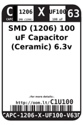
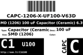
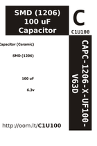

Contents
========

* [C12U10063D > SMD (1206) 100 uF Capacitor (Ceramic) 6.3v](#c12u10063d--smd-1206-100-uf-capacitor-ceramic-63v)
	* [Datasheets](#datasheets)
	* [Labels](#labels)
	* [EDA](#eda)
	* [Images](#images)
	* [Tags](#tags)

# C12U10063D > SMD (1206) 100 uF Capacitor (Ceramic) 6.3v

- ID: CAPC-1206-X-UF100-V63D
- Hex ID: C12U10063D
- Name: SMD (1206) 100 uF Capacitor (Ceramic) 6.3v
- Description: SMD (1206) 100 uF Capacitor (Ceramic) 6.3v
- Long Link: [http://oom.lt/CAPC-1206-X-UF100-V63D](http://oom.lt/CAPC-1206-X-UF100-V63D)
- Short Link: [http://oom.lt/C12U10063D](http://oom.lt/C12U10063D)

## Datasheets

- Datasheet: [datasheet.pdf](datasheet.pdf)

## Labels
  
  

|label-front|label-inventory|label-spec|
| :---: | :---: | :---: |
||||

## EDA

## Images
  
  

|label-front|label-inventory|label-spec|
| :---: | :---: | :---: |
||||

## Tags

- oompType: CAPC
- oompSize: 1206
- oompColor: X
- oompDesc: UF100
- oompIndex: V63D
- oplPartNumber: {'code': 'C-JLCC', 'name': 'JLC Parts Library', 'partID': 'C15008', 'desc': '6.3V 100uF X5R ??20% 1206  Multilayer Ceramic Capacitors MLCC - SMD/SMT ROHS'}
- distributorPartNumber: {'code': 'C-LCSC', 'name': 'LCSC', 'partID': 'C15008'}
- manufacturerPartNumber: {'code': 'C-XXXX', 'name': 'Samsung Electro-Mechanics', 'partID': 'CL31A107MQHNNNE'}
- hexID: C12U10063D
- oompID: CAPC-1206-X-UF100-V63D
- oompInstances: {'PROJECT': 'PROJ-SPAR-14997-STAN-01', 'ID': 'C12'}
