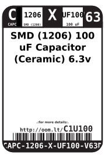

Contents
========

* [CAPC-1206-X-UF100-V63D>SMD (1206) 100 uF Capacitor (Ceramic) 6.3v](#capc-1206-x-uf100-v63dsmd-1206-100-uf-capacitor-ceramic-63v)
	* [Datasheets](#datasheets)
	* [Labels](#labels)
	* [EDA](#eda)
		* [Symbols](#symbols)
	* [Tags](#tags)

# CAPC-1206-X-UF100-V63D>SMD (1206) 100 uF Capacitor (Ceramic) 6.3v

- ID: CAPC-1206-X-UF100-V63D
- Name: CAPC-1206-X-UF100-V63D

## Datasheets

- Datasheet: [datasheet.pdf](datasheet.pdf)

## Labels
  
  

|Front|Inventory|Specifications|
| :---: | :---: | :---: |
||||

## EDA

### Symbols

## Tags

- oompID: CAPC-1206-X-UF100-V63D
- name: SMD (1206) 100 uF Capacitor (Ceramic) 6.3v
- hexID: C1U100
- oompSort: CAPC1206UF100
- oompType: CAPC
- oompSize: 1206
- oompColor: X
- oompDesc: UF100
- oompIndex: V63D
- oompVersion: 98
- oompBbls: template;XXXX-1206-X-XXXX-XX-bbls
- oompDiag: template;XXXX-1206-X-XXXX-XX-diag
- oompIden: template;XXXX-1206-X-XXXX-XX-iden
- oompSchem: template;CAPC-XXXX-X-XXXX-XX-schem
- oompSimp: template;XXXX-1206-X-XXXX-XX-simp
- ooDesignator: C1
