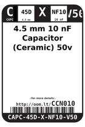
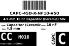
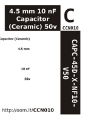

Contents
========

* [CCN010 > 4.5 mm 10 nF Capacitor (Ceramic) 50v](#ccn010--45-mm-10-nf-capacitor-ceramic-50v)
	* [Images](#images)
	* [Datasheets](#datasheets)
	* [Labels](#labels)
	* [EDA](#eda)
	* [Tags](#tags)

# CCN010 > 4.5 mm 10 nF Capacitor (Ceramic) 50v

- ID: CAPC-45D-X-NF10-V50
- Hex ID: CCN010
- Name: 4.5 mm 10 nF Capacitor (Ceramic) 50v
- Description: 4.5 mm 10 nF Capacitor (Ceramic) 50v

## Images
  
  

|label-front|label-inventory|label-spec|
| :---: | :---: | :---: |
||||

## Datasheets

- Datasheet: [datasheet.pdf](datasheet.pdf)

## Labels
  
  

|label-front|label-inventory|label-spec|
| :---: | :---: | :---: |
||||

## EDA

### Symbols

## Tags

- oompID: CAPC-45D-X-NF10-V50
- name: 4.5 mm 10 nF Capacitor (Ceramic) 50v
- hexID: CCN010
- oompSort: CAPC45DNF10
- oompType: CAPC
- oompSize: 45D
- oompColor: X
- oompDesc: NF10
- oompIndex: V50
- oompVersion: 98
- oompSchem: template;CAPC-XXXX-X-XXXX-XX-schem
- ooDesignator: C1
