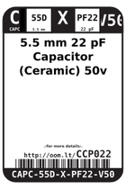
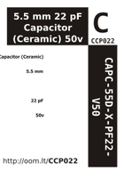

Contents
========

* [CCP022 > 5.5 mm 22 pF Capacitor (Ceramic) 50v](#ccp022--55-mm-22-pf-capacitor-ceramic-50v)
	* [Datasheets](#datasheets)
	* [Labels](#labels)
	* [EDA](#eda)
	* [Images](#images)
	* [Tags](#tags)
  
![][im]
# CCP022 > 5.5 mm 22 pF Capacitor (Ceramic) 50v

- ID: CAPC-55D-X-PF22-V50
- Hex ID: CCP022
- Name: 5.5 mm 22 pF Capacitor (Ceramic) 50v
- Description: 5.5 mm 22 pF Capacitor (Ceramic) 50v
- Long Link: [http://oom.lt/CAPC-55D-X-PF22-V50](http://oom.lt/CAPC-55D-X-PF22-V50)
- Long Link: [http://oom.lt/CCP022](http://oom.lt/CCP022)

## Datasheets

- Datasheet: [datasheet.pdf](datasheet.pdf)

## Labels
  
  

|label-front|label-inventory|label-spec|
| :---: | :---: | :---: |
||||

## EDA

### Symbols

## Images
  
  

|image|image_RE|label-front|label-inventory|label-spec|
| :---: | :---: | :---: | :---: | :---: |
||||||

## Tags

- oompID: CAPC-55D-X-PF22-V50
- name: 5.5 mm 22 pF Capacitor (Ceramic) 50v
- hexID: CCP022
- oompSort: THTH0.00000000000220
- oompType: CAPC
- oompSize: 55D
- oompColor: X
- oompDesc: PF22
- oompIndex: V50
- oompVersion: 99
- ooPitch: 2.5 mm
- ooHeight: 5.5 mm
- ooDiameter: 5.5 mm
- ooNumPins: 2
- ooMaxVoltage: 50 V
- ooTolerance: 20%
- oompClass: Through Hole Component
- oompClassCode: THTH
- oompSchem: template;CAPC-XXXX-X-XXXX-XX-schem
- ooDesignator: C1

[im]: image_450.jpg
