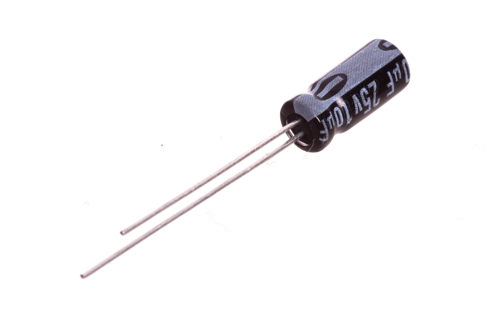

Contents
========

* [CAPE-05-X-UF10-V25>5 mm 10 uF Capacitor (Electrolytic) 25v](#cape-05-x-uf10-v255-mm-10-uf-capacitor-electrolytic-25v)
	* [Images](#images)
	* [Datasheets](#datasheets)
	* [EDA](#eda)
		* [Footprints](#footprints)
		* [Symbols](#symbols)
	* [Tags](#tags)
  
![][im]
# CAPE-05-X-UF10-V25>5 mm 10 uF Capacitor (Electrolytic) 25v

- ID: CAPE-05-X-UF10-V25
- Name: CAPE-05-X-UF10-V25

## Images
  
  

|Main|Reference|
| :---: | :---: |
|||

## Datasheets

- Datasheet: [datasheet.pdf](datasheet.pdf)

## EDA

### Footprints
  

|||||
| :---: | :---: | :---: | :---: |

### Symbols

## Tags

- index: 94
- index: 9876
- oompID: CAPE-05-X-UF10-V25
- name: 5 mm 10 uF Capacitor (Electrolytic) 25v
- hexID: CEU010
- oompSort: THTH0.00001000000000
- oompType: CAPE
- oompSize: 05
- oompColor: X
- oompDesc: UF10
- oompIndex: V25
- oompVersion: 99
- ooPitch: 2 mm
- ooHeight: 11 mm
- ooDiameter: 5 mm
- ooNumPins: 2
- ooMaxVoltage: 25 V
- ooTolerance: 20%
- oompClass: Through Hole Component
- oompClassCode: THTH
- oompSchem: template;CAPE-XXXX-X-XXXX-XX-schem
- ooDesignator: C1

[im]: image_600.jpg
