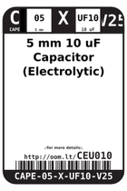
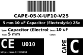
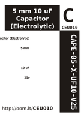
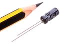

Contents
========

* [CEU010 > 5 mm 10 uF Capacitor (Electrolytic) 25v](#ceu010--5-mm-10-uf-capacitor-electrolytic-25v)
	* [Datasheets](#datasheets)
	* [Labels](#labels)
	* [EDA](#eda)
	* [Images](#images)
	* [Tags](#tags)
  
![][im]
# CEU010 > 5 mm 10 uF Capacitor (Electrolytic) 25v

- ID: CAPE-05-X-UF10-V25
- Hex ID: CEU010
- Name: 5 mm 10 uF Capacitor (Electrolytic) 25v
- Description: 5 mm 10 uF Capacitor (Electrolytic) 25v
- Long Link: [http://oom.lt/CAPE-05-X-UF10-V25](http://oom.lt/CAPE-05-X-UF10-V25)
- Short Link: [http://oom.lt/CEU010](http://oom.lt/CEU010)

## Datasheets

- Datasheet: [datasheet.pdf](datasheet.pdf)

## Labels
  
  

|label-front|label-inventory|label-spec|
| :---: | :---: | :---: |
||||

## EDA

## Images
  
  

|image|image_RE|label-front|label-inventory|label-spec|
| :---: | :---: | :---: | :---: | :---: |
||||||

## Tags

- oompID: CAPE-05-X-UF10-V25
- name: 5 mm 10 uF Capacitor (Electrolytic) 25v
- hexID: CEU010
- oompSort: THTH0.00001000000000
- oompType: CAPE
- oompSize: 05
- oompColor: X
- oompDesc: UF10
- oompIndex: V25
- oompVersion: 99
- ooPitch: 2 mm
- ooHeight: 11 mm
- ooDiameter: 5 mm
- ooNumPins: 2
- ooMaxVoltage: 25 V
- ooTolerance: 20%
- oompClass: Through Hole Component
- oompClassCode: THTH
- oompSchem: template;CAPE-XXXX-X-XXXX-XX-schem
- ooDesignator: C1

[im]: image_450.jpg
